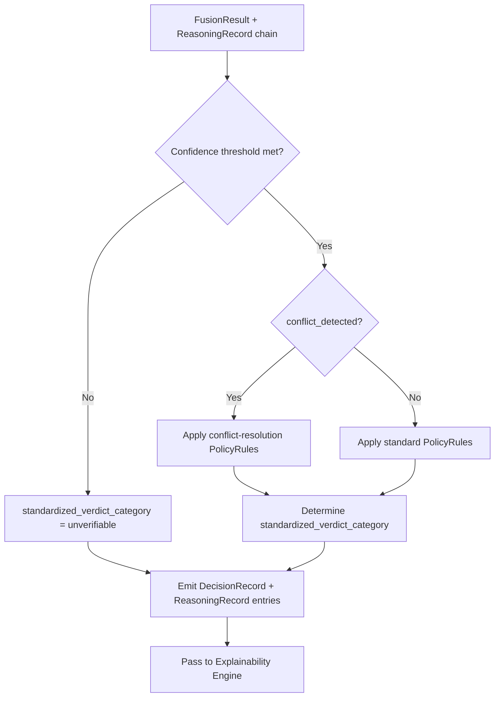

# Multimodal Neuro-Symbolic Misinformation Verification Platform
## Architecture Revision Addendum — Version 1.1

| | |
|---|---|
| **Document status** | Draft for review |
| **Amends** | `ARCHITECTURE_SPEC.md`, Version 1.0 (approved) |
| **Relationship to v1.0** | This document is **additive only**. No section of v1.0 is rewritten, restructured, or superseded except where explicitly stated in §8.6 (Decision Engine interface change). All v1.0 section references below (e.g. "v1.0 §5.8") point to the approved baseline document. |
| **Audience** | Same as v1.0, plus Platform/MLOps engineers responsible for orchestration, observability, and model lifecycle |
| **Out of scope** | Implementation code, model selection, inference rule logic, infrastructure/cloud topology |

---

## Addendum Purpose

Version 1.0 specified the **reasoning architecture**: nine subsystems
communicating through canonical objects, fused by explicit rules, and
rendered into explanations. It did not specify how that reasoning
architecture is *operated* — who invokes the subsystems, how failures and
retries are handled, how the system is observed in production, how user
feedback re-enters the system, how models are tracked as they evolve, or
how experiments are recorded for reproducibility. It also left the final
step from `FusionResult` to `Verdict` as a direct hand-off to the
Explainability Engine, without a dedicated policy/threshold layer.

Version 1.1 closes these gaps. It introduces six new components — the
**Pipeline Orchestrator**, **Event Logger**, **Feedback Service**,
**Model Registry**, **Experiment Tracker**, and **Decision Engine** — that
sit around and, in one case, inside the existing reasoning pipeline
without altering its design philosophy (§0 of v1.0: neuro-symbolic
separation of evidence-gathering from verdict construction remains
unchanged and is in fact reinforced by the Decision Engine, §6 below).

---

## Section 1 — Pipeline Orchestrator

### 1.1 Purpose

The Pipeline Orchestrator is the **execution coordinator** for the
verification workflow defined in v1.0 §1. It is solely responsible for
*when* and *how* subsystems run — sequencing, parallelism, retries,
timeouts, and execution telemetry. It contains no verification logic of
its own and makes no reasoning decisions.

### 1.2 Responsibilities

| Responsibility | Description |
|---|---|
| Invocation | Calls every subsystem module (v1.0 §5.1–§5.9, plus the new Decision Engine, §6) with the correct input objects |
| Scheduling | Determines execution order per the dependency graph already established in v1.0 §1.2 (e.g. Evidence Retrieval must complete before NLI Verification) |
| Parallel execution | Runs independent modules concurrently (Linguistic Analysis, AI-Text Detection, Evidence Retrieval, Image Forensics — as already described in v1.0 §1.1's parallel block) |
| Sequential execution | Enforces ordering where a dependency exists (Evidence Retrieval → Knowledge Representation → NLI Verification) |
| Output collection | Gathers every module's output object and makes it available to downstream modules and to Fusion Intelligence |
| Intermediate object propagation | Passes canonical objects (v1.0 §3) between modules without modification — the Orchestrator moves objects, it never edits them |
| Retry management | Re-invokes a failed or timed-out module per a configurable retry policy (§1.6) |
| Failure handling | Converts unrecoverable module failures into the `status = error` pattern already defined in v1.0 §4, so Fusion Intelligence's existing failure-handling logic (v1.0 §7, scenario 10) requires no change |
| Timing collection | Records start/end timestamps and duration for every module invocation |
| Execution metadata | Produces a `PipelineRun` record (§1.4) summarizing the full execution for observability and audit |

### 1.3 Position in the Architecture

The Orchestrator is a **new outermost layer**, not a replacement for any
existing control flow implied in v1.0. Every arrow in the v1.0 §1.1
workflow diagram and the v1.0 §8 sequence diagram remains logically
correct — it now describes what the Orchestrator *executes*, rather than
an implicit, undefined control flow.

```
                     ┌───────────────────────────────┐
                     │      Pipeline Orchestrator       │
                     │  (schedules, retries, times,     │
                     │   collects — no reasoning logic)  │
                     └───────────────┬─────────────────┘
                                     │ invokes, per v1.0 §1.2 dependency order
                                     ▼
        ┌─────────────────────────────────────────────────────────┐
        │        Existing Reasoning Pipeline (v1.0 §1–§9, unchanged) │
        │  Claim Extraction → {Linguistic Analysis, Evidence          │
        │  Retrieval → Knowledge Representation → NLI Verification,   │
        │  Image Forensics, AI-Text Detection} → Fusion Intelligence  │
        │  → Decision Engine (new, §6) → Explainability Engine        │
        └─────────────────────────────────────────────────────────┘
```

### 1.4 New Canonical Objects

#### `PipelineRun`
One record per end-to-end invocation of the system for a `RawInput`.

| Field | Type | Description |
|---|---|---|
| `id` | string | Unique run id |
| `raw_input_id` | string | FK to `RawInput` (v1.0 §3.2) |
| `status` | enum | `running` \| `completed` \| `partial_failure` \| `failed` |
| `started_at` | timestamp | |
| `completed_at` | timestamp \| null | |
| `total_duration_ms` | integer | |
| `execution_mode` | enum | `sequential` \| `parallel` \| `hybrid` (per claim/module) |
| `module_execution_ids` | string[] | FK list to `ModuleExecutionRecord` |
| `retry_count_total` | integer | Sum of retries across all modules in this run |
| `schema_version` | string | |

#### `ModuleExecutionRecord`
One record per module invocation attempt within a `PipelineRun`.

| Field | Type | Description |
|---|---|---|
| `id` | string | |
| `pipeline_run_id` | string | FK |
| `module_name` | string | e.g. `evidence_retrieval`, `image_forensics` |
| `claim_id` | string \| null | FK, null for document-level steps (e.g. Claim Extraction itself) |
| `attempt_number` | integer | 1 for first attempt, incremented on retry |
| `status` | enum | `pending` \| `running` \| `succeeded` \| `failed` \| `retried` \| `skipped` |
| `started_at` | timestamp | |
| `completed_at` | timestamp \| null | |
| `duration_ms` | integer \| null | |
| `output_object_id` | string \| null | FK to whatever canonical object (v1.0 §3) this invocation produced |
| `error_code` | string \| null | Maps to the declared error modes in v1.0 §4 |
| `error_message` | string \| null | |
| `schema_version` | string | |

These two objects follow the same lineage discipline as every object in
v1.0 §3.1 and Phase 1's `LineageTracker` pattern: immutable once written,
fully traceable by id, `schema_version`-stamped.

### 1.5 Execution Lifecycle

```
 CREATED  →  RUNNING  →  ┬─→ COMPLETED         (all modules succeeded or
                          │                       degraded gracefully per v1.0 §7)
                          ├─→ PARTIAL_FAILURE    (some modules failed after
                          │                       retries exhausted; Fusion
                          │                       Intelligence still runs on
                          │                       remaining signals, per v1.0 §7
                          │                       scenario 10)
                          └─→ FAILED             (a required module — e.g.
                                                   Claim Extraction itself —
                                                   failed after retries; no
                                                   verdict can be produced)
```

A `PipelineRun` never terminates in `FAILED` due to an *optional* module
(Image Forensics, AI-Text Detection) failing — only Claim Extraction and,
per claim, the minimum viable evidence path are treated as required,
consistent with v1.0 §4's contract that Fusion Intelligence requires at
minimum a `VerificationResult`.

### 1.6 Retry and Failure Handling

| Aspect | Policy |
|---|---|
| Retryable failures | Timeouts, transient corpus/knowledge-base unavailability (v1.0 §4 error modes: `retrieval_timeout`, `kb_unavailable`, `analysis_timeout`, `verification_timeout`) |
| Non-retryable failures | Malformed input, unsupported format/language (v1.0 §7 scenarios 1, 11) — retrying cannot change these outcomes |
| Retry limit | Configurable per module type (declared in the module's `ModalityAnalyzerSpec`, v1.0 §9.3), not hardcoded in the Orchestrator |
| Backoff | Orchestrator applies a configurable delay strategy between attempts; the strategy itself is a deployment parameter, not an architectural decision fixed here |
| Exhausted retries | Module's final `ModuleExecutionRecord.status = failed`; Orchestrator emits a `status = error` object matching the module's existing output contract (v1.0 §4) so downstream Fusion logic is unaffected |
| Required-module failure | `PipelineRun.status = failed`; no `Verdict` is produced; the failure is surfaced to the user as an explicit system error, distinct from `unverifiable` (which is a legitimate reasoning outcome, v1.0 §6.5, not a failure) |

### 1.7 Interactions With Every Module

| Module | Orchestrator interaction |
|---|---|
| Claim Extraction | Invoked once per `PipelineRun`; required |
| Linguistic Analysis | Invoked once per claim; parallel with AI-Text Detection and Evidence Retrieval; optional (degrades gracefully) |
| Evidence Retrieval | Invoked once per claim; must complete before Knowledge Representation and NLI Verification are scheduled |
| Knowledge Representation | Invoked after Evidence Retrieval per claim; feeds NLI Verification |
| NLI Verification | Invoked after Evidence Retrieval and Knowledge Representation; minimum-viable for Fusion |
| Image Forensics | Invoked once per claim with an associated image; parallel with text-side analysis; optional |
| AI-Generated Text Detection | Invoked once per claim; parallel; optional |
| Fusion Intelligence | Invoked once per claim after all applicable upstream modules report a terminal status (`succeeded`, `failed`, or `skipped`) |
| Decision Engine (§6) | Invoked once per claim after Fusion Intelligence |
| Explainability Engine | Invoked once per claim after the Decision Engine |

The Orchestrator does not wait indefinitely for optional modules — it
applies a per-module timeout (§1.6) and proceeds to Fusion Intelligence
with whatever signals are available, exactly matching v1.0 §7 scenario 10.

### 1.8 Sequence Diagram

```mermaid
sequenceDiagram
    actor User
    participant ORCH as Pipeline Orchestrator
    participant CE as Claim Extraction
    participant PAR as Parallel Analysis Modules
    participant FI as Fusion Intelligence
    participant DE as Decision Engine
    participant EE as Explainability Engine

    User->>ORCH: Submit input
    ORCH->>ORCH: Create PipelineRun (status=running)
    ORCH->>CE: Invoke (attempt 1)
    alt Claim Extraction succeeds
        CE-->>ORCH: Claim[] + ModuleExecutionRecord(succeeded)
    else Claim Extraction fails
        CE-->>ORCH: error + ModuleExecutionRecord(failed)
        ORCH->>CE: Retry (attempt 2, per §1.6)
        alt Retry succeeds
            CE-->>ORCH: Claim[]
        else Retries exhausted
            ORCH->>ORCH: PipelineRun.status = failed
            ORCH-->>User: System error (not a Verdict)
        end
    end

    loop For each Claim
        ORCH->>PAR: Invoke applicable modules in parallel (per v1.0 §1.1)
        PAR-->>ORCH: Module outputs + ModuleExecutionRecords (some may be status=error/skipped)
        ORCH->>FI: Invoke with all collected outputs for this claim
        FI-->>ORCH: FusionResult + ReasoningRecord[]
        ORCH->>DE: Invoke with FusionResult + ReasoningRecord[]
        DE-->>ORCH: DecisionRecord + extended ReasoningRecord[]
        ORCH->>EE: Invoke with DecisionRecord + ReasoningRecord[]
        EE-->>ORCH: Explanation + Verdict
    end

    ORCH->>ORCH: PipelineRun.status = completed (or partial_failure)
    ORCH-->>User: Verdict(s) + Explanation(s) + document-level summary
```

### 1.9 Why Orchestration Is Separated From Business Logic

Three architectural reasons, all consistent with v1.0's founding
principle (v1.0 §0.2) of keeping reasoning traceable and modular:

1. **Single Responsibility.** Retry counts, timeouts, and scheduling are
   operational concerns that change with deployment environment (cloud
   vs on-prem, load, SLAs). Verification logic (v1.0 §5) answers *what is
   true*; orchestration answers *how reliably do we compute it*. Mixing
   them would force every subsystem to reimplement retry/timeout handling,
   violating the module-boundary discipline v1.0 §5 establishes.
2. **Testability.** Reasoning correctness (does Fusion Intelligence apply
   its rules correctly, v1.0 §6) can be tested independently of execution
   reliability (does the system recover from a transient corpus outage).
   A monolithic design would conflate these test concerns.
3. **Non-conflation of failure and uncertainty.** v1.0 §6.5 treats
   `unverifiable` as a legitimate epistemic outcome, never a failure. If
   orchestration logic (retries, timeouts) were embedded inside Fusion
   Intelligence, a transient infrastructure failure could be
   indistinguishable from a genuine evidentiary gap. Keeping the
   Orchestrator separate guarantees `status = error` (infrastructure) and
   `status = insufficient_data` (epistemic) remain distinct all the way
   through the pipeline, preserving the honesty-under-uncertainty
   requirement in v1.0 §10.

### 1.10 Scalability Considerations

- **Horizontal scaling of module invocations.** Because the Orchestrator
  treats every module as an independently invokable unit communicating
  only through canonical objects (v1.0 §3–§4), module instances can be
  scaled independently (e.g. more Evidence Retrieval workers than Image
  Forensics workers) without architectural change.
- **New modalities.** Per v1.0 §9.3 (Module Registry), the Orchestrator
  resolves which modules apply to a given claim at runtime via the
  registry — adding Video/Audio Forensics (v1.0 §9) requires no
  Orchestrator code change, only a new registry entry.
- **Claim-level parallelism.** Multiple claims from one `RawInput`, and
  multiple concurrent `PipelineRun`s from different users, are
  independent by construction (no shared mutable state between them),
  so throughput scales by adding orchestrator/worker capacity.
- **Backpressure.** The Orchestrator is the natural place to apply
  admission control (e.g. capping concurrent `PipelineRun`s) without
  touching any reasoning module — another benefit of the separation
  argued in §1.9.

---

## Section 2 — Event Logging & Observability

### 2.1 Purpose

A centralized, structured logging subsystem that captures everything the
Pipeline Orchestrator and every reasoning module do, at a granularity
sufficient to debug a single verdict, reconstruct a full reasoning trace
after the fact, and support future production monitoring — without any
reasoning module needing to know logging exists.

### 2.2 What Is Captured

| Category | Captured events |
|---|---|
| Module lifecycle | Module start, module completion (mirrors `ModuleExecutionRecord`, §1.4, but as a stream of discrete events rather than a summary record) |
| Timing | Execution duration per module invocation |
| Reasoning signals | Confidence scores emitted by any module (v1.0 §6.2) |
| Errors | Any `status = error` object, with the declared error code (v1.0 §4) |
| Warnings | Non-fatal conditions — e.g. evidence found but entirely `tier_3_unverified` (v1.0 §5.3) |
| Evidence retrieval statistics | Query issued, corpus subdivisions searched (v1.0 evidence corpus: `wikipedia`/`factcheck_org`/`trusted_news_sources`), result count, trust-tier distribution |
| Decision explanations | Every `ReasoningRecord` emitted by Fusion Intelligence and the Decision Engine (§6) |
| Fusion summaries | The final `FusionResult` and `DecisionRecord` for each claim |
| User request metadata | `RawInput` modality, submission timestamp, `PipelineRun` id — never the raw content of third-party evidence beyond what's already stored in `EvidenceRecord` |

### 2.3 Log Levels

| Level | Used for |
|---|---|
| `DEBUG` | Per-module intermediate detail (e.g. individual evidence candidate scores before filtering) — verbose, disabled by default in production |
| `INFO` | Module start/completion, timing, standard lifecycle events |
| `WARNING` | Degraded-but-recoverable conditions (v1.0 §7 edge cases: low-trust-tier-only evidence, satire-pattern flags, stale evidence) |
| `ERROR` | Module failure after retries exhausted (§1.6), contract-validation failures (v1.0 §4.1) |
| `CRITICAL` | `PipelineRun.status = failed` — a required module could not produce output and no verdict was generated |

### 2.4 Structured Log Schema

#### `LogEvent`

| Field | Type | Description |
|---|---|---|
| `id` | string | |
| `timestamp` | timestamp | |
| `level` | enum | `DEBUG` \| `INFO` \| `WARNING` \| `ERROR` \| `CRITICAL` |
| `event_type` | enum | `module_start` \| `module_complete` \| `error` \| `warning` \| `evidence_stats` \| `decision_explanation` \| `fusion_summary` \| `request_metadata` |
| `pipeline_run_id` | string | FK to `PipelineRun` (§1.4) |
| `claim_id` | string \| null | FK, when applicable |
| `module_name` | string \| null | |
| `correlation_id` | string | Shared across every `LogEvent` for one `PipelineRun`, enabling full-trace reconstruction |
| `payload` | object | Event-specific structured data (e.g. for `evidence_stats`: query text, corpus searched, result count, trust-tier breakdown) |
| `schema_version` | string | |

Every `LogEvent.payload` references canonical object ids (v1.0 §3, §1.4,
§6.4 below) rather than duplicating their content — logging observes the
pipeline, it does not maintain a second copy of the data model.

### 2.5 Log Flow

```
 Module / Orchestrator
        │  emits LogEvent (fire-and-forget, non-blocking)
        ▼
 ┌─────────────────────┐
 │  Log Ingestion         │   validates schema, attaches correlation_id
 └──────────┬────────────┘
            ▼
 ┌─────────────────────┐
 │  Structured Log Store   │   append-only, queryable by pipeline_run_id / claim_id / level / event_type
 └──────────┬────────────┘
            ▼
 ┌─────────────────────┐
 │  Consumers               │
 │  • Debugging tools (reconstruct one PipelineRun's full trace)
 │  • Reproducibility audits (replay what happened for a given Verdict)
 │  • Future Monitoring layer (§2.7)
 └─────────────────────┘
```

Logging is **non-blocking and best-effort with respect to the reasoning
pipeline**: a logging-subsystem outage must never prevent a `Verdict`
from being produced. This mirrors the Orchestrator/business-logic
separation argued in §1.9 — observability is a cross-cutting concern, not
a dependency of correctness.

### 2.6 Storage Strategy

| Property | Approach |
|---|---|
| Write pattern | Append-only; log events are immutable once written, consistent with every other object in this architecture (v1.0 §3.1) |
| Retention | Tiered — recent logs (e.g. `DEBUG`/`INFO`) retained short-term for active debugging; `WARNING`/`ERROR`/`CRITICAL` and all `decision_explanation`/`fusion_summary` events retained long-term to support reproducibility audits and the Feedback Service (§3) |
| Queryability | Indexed by `pipeline_run_id`, `claim_id`, `correlation_id`, `level`, and `event_type` — no specific storage technology is prescribed here (implementation decision, out of scope per document header) |
| Linkage | Every `LogEvent` is joinable to the canonical objects it references, so a support engineer can go from "this Verdict looked wrong" to "here is the full sequence of module invocations, confidence scores, and reasoning steps that produced it" |

### 2.7 Future Monitoring Support

This logging schema is designed so a future monitoring layer can be added
without schema changes:

- **Latency dashboards** derive directly from `module_start`/
  `module_complete` event pairs (already captured).
- **Error-rate alerting** derives from `ERROR`/`CRITICAL` event volume
  per `module_name`, already structured for aggregation.
- **Confidence drift monitoring** (are verdicts trending toward lower
  confidence over time — a signal worth investigating) derives from the
  `decision_explanation` and `fusion_summary` event payloads.
- **Evidence corpus health** (is retrieval increasingly returning
  `insufficient_data`) derives from `evidence_stats` events.

None of these require new instrumentation in the reasoning modules
themselves — they are all queries over the log store defined here.

### 2.8 How This Improves Debugging, Explainability, and Reproducibility

| Property | How the logging design supports it |
|---|---|
| **Debugging** | `correlation_id` ties every event for one `PipelineRun` together; a failed or surprising `Verdict` can be traced module-by-module without re-running the pipeline |
| **Explainability** | `decision_explanation` events capture the same `ReasoningRecord` chain the Explainability Engine renders (v1.0 §5.9) — the explanation shown to a user is independently verifiable against the log |
| **Reproducibility** | Combined with `dataset_version`/`pipeline_version`/`schema_version` (Phase 1 lineage convention, v1.0 §0.3) already stamped on every object, and the Experiment Tracker (§5), a past `Verdict` can be fully reconstructed: which data, which pipeline version, which module outputs, which reasoning steps |

---

## Section 3 — User Feedback & Continuous Learning Pipeline

### 3.1 Purpose

A subsystem allowing users to report problems with a `Verdict` or
`Explanation`, routing those reports through human review, and — only
once validated — accumulating them into a labeled dataset that a
**future, separate research phase** may use for retraining. This
subsystem stops at dataset generation; it does not retrain anything
itself (§3.7).

### 3.2 Feedback Types

| Type | Meaning |
|---|---|
| `incorrect_verdict` | User disputes the `Verdict.label` itself |
| `missing_evidence` | User believes relevant evidence exists that Evidence Retrieval (v1.0 §5.3) did not find |
| `poor_explanation` | The `Explanation` (v1.0 §5.9) is unclear, unhelpful, or doesn't match the reasoning even if the verdict itself may be correct |
| `false_positive` | System flagged something as false/misleading that the user believes is accurate |
| `false_negative` | System passed something as true/verified that the user believes is false |

### 3.3 `FeedbackRecord`

| Field | Type | Description |
|---|---|---|
| `id` | string | |
| `verdict_id` | string | FK to `Verdict` (v1.0 §3.2) |
| `claim_id` | string | FK |
| `pipeline_run_id` | string | FK to `PipelineRun` (§1.4), enabling full reasoning-trace lookup for review |
| `feedback_type` | enum | Per §3.2 |
| `user_comment` | string \| null | Free-text elaboration |
| `submitted_at` | timestamp | |
| `review_status` | enum | `pending` \| `under_review` \| `validated` \| `rejected` |
| `reviewer_id` | string \| null | Populated once a human reviewer is assigned |
| `reviewer_notes` | string \| null | |
| `resolved_at` | timestamp \| null | |
| `included_in_dataset_export` | string \| null | FK to a future retraining-dataset export batch, populated only after validation (§3.6) |
| `schema_version` | string | |

### 3.4 Review Workflow

```
 User submits FeedbackRecord (review_status = pending)
        │
        ▼
 Human reviewer examines:
   • The disputed Verdict + Explanation
   • The full ReasoningRecord chain (v1.0 §3.2, §6)
   • The LogEvent trace for that pipeline_run_id (§2)
        │
        ├──► review_status = validated   (reviewer confirms the system's
        │                                  output was indeed wrong)
        │
        └──► review_status = rejected    (reviewer confirms the system's
                                            output was correct, or the
                                            feedback lacks sufficient basis)
```

Human validation is a **required gate** — no `FeedbackRecord` reaches the
dataset-generation step (§3.6) without an explicit `validated` status set
by a reviewer. This prevents unverified or adversarial user reports from
influencing any future training data.

### 3.5 Storage

`FeedbackRecord`s are stored append-only, identical in discipline to
every other object in this architecture (v1.0 §3.1). `review_status`
transitions are the one permitted mutation path (`pending` →
`under_review` → `validated`/`rejected`), tracked via `resolved_at` rather
than by editing history away.

### 3.6 Dataset Generation for Future Retraining

Once a batch of `FeedbackRecord`s reaches `validated` status, they may be
exported into a labeled review dataset, following the same structure
established in Phase 1 for source datasets:

- Export batches carry a `dataset_version` identifier, consistent with
  Phase 1's `config/datasets.yaml` versioning convention.
- The export format mirrors Phase 1's canonical schema discipline
  (`docs/canonical_schema.md`) — a validated feedback item becomes a
  labeled example referencing the original `Claim`, evidence used, and
  the corrected label the reviewer determined.
- This dataset is a **candidate input** to a future model-improvement
  research phase; producing it is this subsystem's full scope.

### 3.7 Explicit Boundary: No Automatic Retraining

**This subsystem does not automatically retrain, fine-tune, or update any
model.** It has no write access to the Model Registry (§4) or to any
deployed model artifact. Its output is a validated, versioned dataset
sitting alongside Phase 1's datasets, available for a future research
phase to consume manually. This boundary is deliberate:

1. **Safety.** Automatic retraining on user-submitted feedback creates a
   direct path for adversarial manipulation of the system's future
   behavior. The human-validation gate (§3.4) and the absence of any
   automated retraining trigger jointly prevent this.
2. **Scientific rigor.** Retraining decisions belong with the Experiment
   Tracking discipline (§5) — deliberate, versioned, evaluated
   experiments — not an implicit background process.
3. **Architectural stability.** Per v1.0 §10, the platform's
   non-functional requirements include auditability and non-conflation;
   silent, automatic model updates would undermine both.

### 3.8 Feedback Lifecycle Summary

```
submitted → pending → under_review → validated → (optionally) exported into
                                    ↘ rejected      a versioned dataset for
                                                     future, manually-initiated
                                                     retraining research
```

---

## Section 4 — Model Registry

### 4.1 Purpose

A centralized catalog of every ML/DL model used anywhere in the platform
(across all nine v1.0 reasoning subsystems), independent of any specific
model's implementation, so models can be versioned, evaluated, and
replaced without the surrounding architecture changing.

### 4.2 `ModelRegistryEntry`

| Field | Type | Description |
|---|---|---|
| `model_name` | string | |
| `purpose` | string | Which subsystem/task this model serves (e.g. "NLI stance classification for v1.0 §5.5") |
| `version` | string | |
| `training_dataset_ref` | string | Points to a Phase 1 `dataset_version` (v1.0 §0.3) or a Feedback-derived dataset export (§3.6) |
| `evaluation_metrics` | object | Task-appropriate metrics recorded at evaluation time (no specific metric prescribed here) |
| `checkpoint_location` | string | Reference/URI to the stored model artifact |
| `framework` | string | |
| `input_schema_ref` | string | Points to the canonical object type this model consumes (v1.0 §3.2) |
| `output_schema_ref` | string | Points to the canonical object type this model produces |
| `deployment_status` | enum | `staging` \| `production` \| `deprecated` \| `retired` |
| `training_date` | date | |
| `author` | string | |
| `dependencies` | string[] | Other registry entries or libraries this model depends on |
| `schema_version` | string | |

### 4.3 Registry-to-Module Relationship

Every reasoning module in v1.0 §5 that uses a learned component
(Linguistic Analysis, Evidence Retrieval's ranking step, NLI
Verification, Image Forensics, AI-Generated Text Detection) references
its current model via a `ModelRegistryEntry.model_name` +
`version` pair, rather than embedding model identity in module code. This
mirrors the `DatasetManager` registry pattern already established in
Phase 1 and reused for the Module Registry in v1.0 §9.3.

### 4.4 Model Replacement Without Architectural Change

Because every module's contract (v1.0 §4) is defined purely in terms of
canonical input/output objects — never in terms of a specific model — a
`ModelRegistryEntry`'s `checkpoint_location` and `version` can change
(a model swap, a retrain from the Feedback-derived dataset, an upgrade to
a newer technique) with zero change to:

- The module's declared contract (v1.0 §4).
- Fusion Intelligence's rules (v1.0 §6.3), which consume the module's
  *output object*, not its internals.
- The Explainability Engine's rendering logic (v1.0 §5.9).

The registry entry's `input_schema_ref`/`output_schema_ref` fields exist
specifically to make this guarantee auditable: a proposed model
replacement can be checked against the registry to confirm schema
compatibility before deployment, without inspecting the model itself.

### 4.5 Deployment Status Lifecycle

```
 staging  →  production  →  deprecated  →  retired
```

Only one `ModelRegistryEntry` per `purpose` may hold `production` status
at a time; this is the entry every live module invocation resolves
against. `staging` entries support evaluation (§5) before promotion.

---

## Section 5 — Experiment Tracking

### 5.1 Purpose

A record-keeping subsystem for every evaluation run performed during
model development or platform tuning — distinct from the Model Registry
(§4), which tracks *deployed artifacts*, and distinct from `PipelineRun`
(§1.4), which tracks *production inference executions*. Experiment
Tracking records the *research process* that produces or evaluates a
candidate model or configuration.

### 5.2 `ExperimentRecord`

| Field | Type | Description |
|---|---|---|
| `experiment_id` | string | |
| `date` | date | |
| `dataset_versions` | object | Map of dataset key → `dataset_version`, referencing Phase 1's lineage convention (`docs/lineage.md`) |
| `pipeline_version` | string | Matches Phase 1's `pipeline_version` convention, extended to cover the reasoning-layer pipeline defined in this and the v1.0 document |
| `model_versions` | object | Map of `purpose` → `ModelRegistryEntry.version` for every model involved |
| `hyperparameters` | object | |
| `metrics` | object | |
| `hardware_used` | string | |
| `execution_time` | duration | |
| `observations` | string | Free-text researcher notes |
| `conclusions` | string | |
| `artifacts` | string[] | References to output files, plots, or checkpoints produced |
| `schema_version` | string | |

### 5.3 Relationship to the Model Registry and Feedback Dataset

```
 Phase 1 datasets  ──┐
                       ├──►  ExperimentRecord  ──►  (if successful) new
 Feedback-derived      │      (records the attempt,      ModelRegistryEntry
 dataset (§3.6)     ──┘       regardless of outcome)      (staging status)
```

An `ExperimentRecord` is created for **every** evaluation attempt, not
only successful ones — a negative result (a candidate model that
underperforms) is still valuable provenance and is retained with the same
discipline as a positive one.

### 5.4 How This Supports Scientific Reproducibility

| Reproducibility requirement | How `ExperimentRecord` satisfies it |
|---|---|
| "What data produced this model?" | `dataset_versions`, pinned to Phase 1's versioning convention |
| "What pipeline code produced this result?" | `pipeline_version` |
| "What exact configuration was evaluated?" | `hyperparameters` |
| "Can this result be independently checked?" | `metrics` + `artifacts`, both explicitly stored rather than only reported in a paper/summary |
| "What was tried and rejected, and why?" | `observations`/`conclusions` retained even for negative results, preventing repeated re-exploration of already-ruled-out approaches |
| "Is this tied to a specific deployed model?" | `model_versions` map links directly to `ModelRegistryEntry` version identifiers |

This closes the loop the rest of the addendum opens: Feedback (§3)
produces candidate retraining data → Experiment Tracking records what was
tried against it → the Model Registry (§4) records what, if anything, was
promoted to production — each step independently versioned and auditable.

---

## Section 6 — Decision Engine

### 6.1 Purpose

The Decision Engine is inserted between Fusion Intelligence and the
Explainability Engine. It is the **policy and thresholding layer**: where
Fusion Intelligence (v1.0 §5.8) determines *what the combined evidence
indicates*, the Decision Engine determines *what the platform officially
concludes*, by applying confidence thresholds and configurable business/
editorial policy on top of Fusion's output.

```
   Fusion Intelligence  →  Decision Engine  →  Explainability Engine  →  Verdict
   (v1.0 §5.8, unchanged)   (NEW, this section)   (v1.0 §5.9, input source changes — see §8.6)
```

### 6.2 Why This Layer Was Missing

v1.0's Fusion Intelligence already resolves *what the evidence and
modules indicate* (`factual_verdict`, `content_provenance`,
`visual_integrity`, `conflict_detected` — v1.0 §3.2 `FusionResult`). What
v1.0 did not specify is a place where **deployment-configurable policy**
is applied on top of that — for example: "in this deployment, a
`factual_confidence` below 0.6 must always surface as `unverifiable`
regardless of the raw stance," or "`misleading_context` claims require a
minimum of two independent evidence sources before display." Embedding
such thresholds inside Fusion Intelligence would conflate *evidence
synthesis* (a reasoning task, stable across deployments) with *policy*
(an operational/editorial choice, expected to vary and be tuned). The
Decision Engine isolates the latter.

### 6.3 Responsibilities

| Responsibility | Description |
|---|---|
| Interpret fusion outputs | Consumes `FusionResult` + `ReasoningRecord[]` (v1.0 §3.2) as its sole reasoning input — introduces no new evidence or module signal |
| Apply confidence thresholds | Compares `FusionResult.factual_confidence` against configured minimums (§6.5) before allowing a definitive verdict category |
| Apply configurable policy rules | Evaluates named, ordered `PolicyRule`s (§6.6) — e.g. minimum source-count requirements, trust-tier floors, conflict-escalation rules |
| Resolve conflicting subsystem outputs | Where `FusionResult.conflict_detected = true`, applies deployment policy to determine the standardized category (v1.0 §6.4 already defines the *reasoning* default of `misleading_context`; the Decision Engine is where a deployment may configure stricter or different handling) |
| Generate standardized verdict categories | Maps the (policy-adjusted) result onto the fixed `Verdict.label` enum already defined in v1.0 §3.2 — no new labels are introduced, only the path to selecting them is formalized |
| Pass structured reasoning to Explainability Engine | Emits its own `ReasoningRecord` entries (appended to Fusion's chain, same schema, v1.0 §3.2), so the Explainability Engine's rendering logic (v1.0 §5.9) requires no change beyond reading a longer chain |

### 6.4 `DecisionRecord`

| Field | Type | Description |
|---|---|---|
| `id` | string | |
| `claim_id` | string | FK |
| `fusion_result_id` | string | FK to `FusionResult` (v1.0 §3.2) |
| `applied_policy_ids` | string[] | Which `PolicyRule`s (§6.6) fired |
| `confidence_threshold_applied` | float | The threshold in effect at decision time |
| `threshold_met` | boolean | |
| `conflict_resolution_applied` | boolean | True if `FusionResult.conflict_detected` required policy-level resolution |
| `standardized_verdict_category` | enum | Same enum as `Verdict.label` (v1.0 §3.2): `true` \| `false` \| `partially_true` \| `unverifiable` \| `misleading_context` \| `not_checkable` |
| `reasoning_record_ids` | string[] | The Decision Engine's own `ReasoningRecord` entries, appended to Fusion's chain |
| `schema_version` | string | |

### 6.5 Confidence Threshold Layer

| Concept | Description |
|---|---|
| Threshold source | Deployment-configurable, not hardcoded — a named configuration value, analogous to Phase 1's `config/preprocessing.yaml` pattern of externalized tunables |
| Application point | Applied strictly *after* Fusion Intelligence's own confidence computation (v1.0 §6.3) — the Decision Engine never recomputes confidence, only gates on it |
| Effect of not meeting threshold | The claim's `standardized_verdict_category` is set to `unverifiable`, consistent with v1.0 §6.5's treatment of `unverifiable` as a legitimate, non-failure outcome — the threshold layer never fabricates a more decisive verdict than the evidence supports |
| Per-claim-type thresholds | Thresholds may be configured per `claim_type` (v1.0 §2.2) — e.g. statistical claims may warrant a stricter threshold than general factual claims — without any change to Fusion Intelligence |

### 6.6 Policy Layer

| Concept | Description |
|---|---|
| `PolicyRule` | A named, ordered, independently configurable rule: `{policy_id, name, condition_description, action_description, priority, active}` — descriptive specification only; no inference logic is defined in this document, per the instruction not to implement decision rules |
| Ordering | Policies are evaluated in declared priority order; each firing is logged as a `ReasoningRecord`, identical in spirit to Fusion Intelligence's rule-firing discipline (v1.0 §6.3) |
| Independence from Fusion rules | Fusion rules (v1.0 §6.3) determine *evidentiary conclusions*; Policy rules determine *display/publication conditions* on top of those conclusions (e.g. "do not present a `false` verdict with confidence below X without an additional caveat") — the two rule sets are structurally separate and independently versioned |
| Configurability | Policy rules are data, not code — they can be added, reordered, or deactivated by a deployment operator without modifying the Decision Engine's own logic, mirroring the extensibility pattern already used for Fusion rules (v1.0 §9.4) |

### 6.7 Decision Flow



### 6.8 Inputs and Outputs (Contract)

| | |
|---|---|
| **Inputs** | `FusionResult`, `ReasoningRecord[]` (from Fusion Intelligence, v1.0 §3.2) |
| **Outputs** | `DecisionRecord`, extended `ReasoningRecord[]` |
| **Preconditions** | `FusionResult` present and contract-valid (v1.0 §4.1) |
| **Postconditions** | Every `DecisionRecord.standardized_verdict_category` is traceable to specific `ReasoningRecord` entries, preserving v1.0 §10's explainability requirement |
| **Declared error modes** | `policy_configuration_invalid` (a deployment misconfiguration, not a reasoning failure — surfaced distinctly per the failure/uncertainty non-conflation principle, §1.9) |

### 6.9 Future Extensibility

- **New verdict categories**: if a future phase requires a category
  beyond v1.0 §3.2's enum, the Decision Engine's mapping step is the
  single point of change — Fusion Intelligence's rules and object schema
  remain untouched.
- **A/B policy evaluation**: because policies are data, multiple policy
  sets could be evaluated against the same `FusionResult` for offline
  comparison (feeding the Experiment Tracker, §5) without touching
  production inference.
- **Per-domain policy**: different policy sets could be configured per
  claim domain (e.g. health claims vs political claims) by extending
  `PolicyRule` with a domain-scope field — additive to the schema in §6.4,
  not a redesign.

### 6.10 No Inference Rules Implemented Here

Per the task instructions, this section defines the Decision Engine's
responsibilities, contracts, and structural rule/threshold *mechanism*
only. It does not specify actual threshold values, actual policy
conditions, or actual conflict-resolution logic — those are deployment
configuration and future implementation work, not architecture.

---

## Section 7 — Updated High-Level Architecture

### 7.1 Layered View

The v1.1 architecture organizes into four layers. The **Reasoning Layer**
is v1.0 §5 plus the new Decision Engine (§6); everything else in this
addendum is a new layer wrapped around it.

```
┌──────────────────────────────────────────────────────────────────────┐
│  ORCHESTRATION LAYER                                                     │
│  ┌────────────────────────────────────────────────────────────────┐   │
│  │  Pipeline Orchestrator (§1)                                        │   │
│  │  scheduling · retries · timing · execution metadata                 │   │
│  └────────────────────────────────────────────────────────────────┘   │
└──────────────────────────────────────────────────────────────────────┘
                                   │ invokes
                                   ▼
┌──────────────────────────────────────────────────────────────────────┐
│  REASONING LAYER  (v1.0 design philosophy unchanged)                    │
│                                                                            │
│  Claim Extraction → {Linguistic Analysis, Evidence Retrieval →           │
│  Knowledge Representation → NLI Verification, Image Forensics,           │
│  AI-Generated Text Detection} → Fusion Intelligence                       │
│         → Decision Engine (§6, NEW)                                       │
│         → Explainability Engine → Verdict + Explanation                   │
└──────────────────────────────────────────────────────────────────────┘
                                   │ observed by / emits into
                                   ▼
┌──────────────────────────────────────────────────────────────────────┐
│  CROSS-CUTTING / OBSERVABILITY LAYER                                     │
│  ┌───────────────────┐  ┌───────────────────┐                          │
│  │ Event Logger (§2)   │  │ Feedback Service (§3)│                          │
│  └───────────────────┘  └───────────────────┘                          │
└──────────────────────────────────────────────────────────────────────┘
                                   │ informs
                                   ▼
┌──────────────────────────────────────────────────────────────────────┐
│  ML LIFECYCLE / GOVERNANCE LAYER                                         │
│  ┌───────────────────┐  ┌───────────────────┐                          │
│  │ Model Registry (§4) │  │ Experiment Tracker (§5)│                        │
│  └───────────────────┘  └───────────────────┘                          │
└──────────────────────────────────────────────────────────────────────┘
```

### 7.2 Layer Responsibilities Summary

| Layer | Responsibility | Talks to reasoning modules how |
|---|---|---|
| Orchestration | Executes the reasoning pipeline reliably | Directly invokes every module; only layer with execution control |
| Reasoning (v1.0 + Decision Engine) | Produces the actual verification logic and verdict | Unchanged from v1.0, except the new Fusion → Decision → Explainability chain (§6, §8.6) |
| Cross-Cutting/Observability | Watches and records; enables debugging and user-driven quality reporting | Read-only with respect to reasoning modules (Event Logger); Feedback Service writes only to its own `FeedbackRecord` store, never back into the reasoning pipeline directly (§3.7) |
| ML Lifecycle/Governance | Tracks what models exist and what experiments produced them | Referenced by modules via id/version lookup only (§4.3); never invoked mid-pipeline |

### 7.3 Data Flow Between Layers

```
 User Input
     │
     ▼
 Orchestration Layer ───────invokes─────────► Reasoning Layer
     │                                              │
     │◄──────────ModuleExecutionRecords, timing──────┤
     │                                              │
     │                                     emits LogEvents
     │                                              ▼
     │                              Cross-Cutting/Observability Layer
     │                                              │
     │                                     (async, non-blocking)
     ▼
 Verdict + Explanation ──────► User
     │
     │ (separately, on user action)
     ▼
 Feedback Service (§3) ──validated feedback──► future dataset export
                                                       │
                                                       ▼
                                    ML Lifecycle/Governance Layer (§4, §5)
                                    (manual, research-initiated — §3.7)
```

### 7.4 What Remains Unchanged

- The Reasoning Layer's nine v1.0 subsystems retain their exact
  responsibilities, contracts (v1.0 §4), and canonical objects (v1.0
  §3.2), with one addition (Decision Engine, §6) and one consequently
  adjusted hand-off (§8.6).
- The canonical data object design principles (v1.0 §3.1: immutability,
  explicit absence, mandatory lineage) are extended, not altered, by
  every new object introduced in this addendum.
- The confidence propagation philosophy (v1.0 §6: local-then-global,
  rule-based not averaged, honest uncertainty) is preserved — the
  Decision Engine adds a policy/threshold gate *after* this philosophy is
  applied, it does not change how confidence itself is computed.

---

## Section 8 — Architectural Impact Analysis

For each new component: why it was introduced, what problem it solves,
how it interacts with existing modules, whether it affects existing
interfaces, migration strategy, and expected long-term benefit.

### 8.1 Pipeline Orchestrator

| | |
|---|---|
| **Why introduced** | v1.0 specified module contracts and a logical sequence diagram but no owner for actually executing that sequence reliably in production |
| **Problem solved** | Absence of a single place responsible for scheduling, retries, timeouts, and execution telemetry — without it, every module would need to reimplement these concerns, or they would go unimplemented |
| **Interaction with existing modules** | Invokes all nine v1.0 modules plus the Decision Engine; strictly a caller, never modifies their outputs |
| **Affects existing interfaces?** | No. Module contracts (v1.0 §4) are unchanged; the Orchestrator consumes and produces exactly the objects those contracts already define |
| **Migration from v1.0** | Additive: deploy the Orchestrator as the new entry point in front of the existing pipeline; no v1.0 module requires modification |
| **Long-term benefit** | Enables horizontal scaling, reliable failure recovery, and a single point for future operational tooling (admission control, circuit breaking) without touching reasoning logic |

### 8.2 Event Logger

| | |
|---|---|
| **Why introduced** | v1.0 defined what objects exist but not how their production is observed over time in a running system |
| **Problem solved** | Lack of a debugging/audit trail independent of re-running the pipeline; lack of a foundation for future production monitoring |
| **Interaction with existing modules** | Passive observer — modules and the Orchestrator emit events; no module reads from the Event Logger |
| **Affects existing interfaces?** | No. Logging is additive instrumentation around existing invocations, not a change to any module's input/output contract |
| **Migration from v1.0** | Additive: instrument the Orchestrator and each module boundary to emit `LogEvent`s; v1.0 module internals are untouched |
| **Long-term benefit** | Full reasoning-trace reconstruction for any past `Verdict`; foundation for the monitoring capabilities in §2.7 |

### 8.3 Feedback Service

| | |
|---|---|
| **Why introduced** | v1.0 had no mechanism for the system's output to be checked against real-world correctness signals from users |
| **Problem solved** | No structured path from "a user disagrees with a verdict" to "a reviewed, versioned dataset a future research phase can use" |
| **Interaction with existing modules** | Reads `Verdict`, `Explanation`, and (via §2) the `LogEvent`/`ReasoningRecord` trace for review; writes only to its own `FeedbackRecord` store |
| **Affects existing interfaces?** | No. It is a downstream consumer of already-existing v1.0 output objects; no v1.0 object gains new required fields because of it |
| **Migration from v1.0** | Additive: a new service reading existing outputs; no retrofitting of v1.0 modules needed |
| **Long-term benefit** | A governed, human-validated channel for continuous quality improvement — without the safety risk of automatic retraining (§3.7) |

### 8.4 Model Registry

| | |
|---|---|
| **Why introduced** | v1.0 referenced "modules" generically without specifying how the specific learned models inside them are tracked, versioned, or replaced |
| **Problem solved** | No auditable record of which model version produced a given output; no safe path to swap a model without guessing at downstream impact |
| **Interaction with existing modules** | Every learned-component module (v1.0 §5.2, §5.3, §5.5, §5.6, §5.7) references a `ModelRegistryEntry` by name/version; the registry itself does not invoke any module |
| **Affects existing interfaces?** | No. Module contracts (v1.0 §4) are defined at the canonical-object level, not the model level — the registry sits behind that contract, invisible to Fusion Intelligence and everything downstream |
| **Migration from v1.0** | Additive: existing (implicit) models are catalogued retroactively as the first `ModelRegistryEntry` per purpose, at `production` status; no interface change required to do so |
| **Long-term benefit** | Model replacement becomes a versioned, auditable, schema-checked operation (§4.4) rather than an untracked code change |

### 8.5 Experiment Tracker

| | |
|---|---|
| **Why introduced** | v1.0 and Phase 1 both establish strong data/pipeline versioning discipline but stop short of recording the *evaluation process* that produces a candidate model |
| **Problem solved** | Risk of unreproducible research — results that can't be tied back to the exact data, code, and configuration that produced them |
| **Interaction with existing modules** | None directly; it records the process around producing `ModelRegistryEntry` candidates, referencing Phase 1 dataset versions and this addendum's `pipeline_version` |
| **Affects existing interfaces?** | No |
| **Migration from v1.0** | Purely additive research-process bookkeeping; no existing component changes |
| **Long-term benefit** | Every deployed model is traceable to the exact experiment (data, config, metrics) that justified its promotion, satisfying v1.0 §10's auditability requirement at the model-development level, not just the inference level |

### 8.6 Decision Engine — Existing Interface Change (Flagged Explicitly)

| | |
|---|---|
| **Why introduced** | v1.0's Fusion Intelligence combined evidentiary signals into a `FusionResult`, but had no dedicated layer for deployment-configurable confidence thresholds or editorial/policy rules — these were implicitly left unaddressed |
| **Problem solved** | Conflation risk: without this layer, policy tuning (e.g. "raise the confidence bar for `false` verdicts") would have to be implemented either inside Fusion Intelligence's reasoning rules (contaminating evidentiary logic with deployment policy) or inside the Explainability Engine (which v1.0 §5.9 explicitly scopes to *rendering*, not *deciding*) |
| **Interaction with existing modules** | Consumes `FusionResult` + `ReasoningRecord[]` from Fusion Intelligence (v1.0 §5.8) exactly as previously produced — **no change to Fusion Intelligence itself** |
| **Affects existing interfaces?** | **Yes — the one genuine interface change in this addendum.** In v1.0, the Explainability Engine's input was `FusionResult` + `ReasoningRecord[]` directly from Fusion Intelligence (v1.0 §5.9, §4). In v1.1, the Explainability Engine's input becomes `DecisionRecord` + the (now longer) `ReasoningRecord[]` chain from the Decision Engine. This is a **strict superset**: every field the Explainability Engine previously read is still reachable (via `DecisionRecord.fusion_result_id` and the preserved `ReasoningRecord` chain), and `DecisionRecord.standardized_verdict_category` uses the identical enum as v1.0's `Verdict.label` — so no rendering logic inside the Explainability Engine needs to change, only its input source |
| **Migration from v1.0** | (1) Deploy the Decision Engine with a permissive default policy (thresholds set to never override Fusion's own conclusion, all `PolicyRule`s inactive) so v1.1 initially reproduces v1.0 behavior exactly; (2) point the Explainability Engine's input at `DecisionRecord` instead of `FusionResult` directly; (3) incrementally activate policy rules and thresholds once validated — a zero-behavior-change cutover followed by opt-in policy tightening |
| **Long-term benefit** | Confidence thresholds and editorial policy become versioned, auditable, and independently tunable per deployment/domain (§6.9) without ever touching Fusion Intelligence's evidentiary reasoning — preserving v1.0's neuro-symbolic separation principle (v1.0 §0.2) by adding a second, distinct symbolic layer rather than blurring it into the first |

### 8.7 Summary Table

| Component | New interfaces created | Existing interfaces changed |
|---|---|---|
| Pipeline Orchestrator | Yes (invokes all modules) | No |
| Event Logger | Yes (passive event stream) | No |
| Feedback Service | Yes (reads Verdict/Explanation) | No |
| Model Registry | Yes (referenced by modules) | No |
| Experiment Tracker | Yes (standalone) | No |
| Decision Engine | Yes | **Yes — Fusion→Explainability hand-off, see §8.6** |

---

*End of Architecture Revision Addendum, Version 1.1.*
*This document supplements and does not replace `ARCHITECTURE_SPEC.md` (Version 1.0).*
