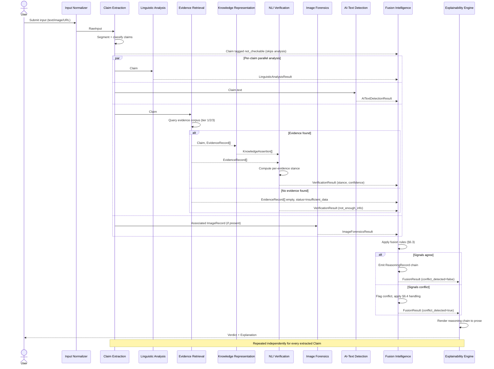

# Multimodal Neuro-Symbolic Misinformation Verification Platform
## System Architecture Specification

| | |
|---|---|
| **Document status** | Draft for review |
| **Applies to** | Phase 2 onward (Reasoning, Verification, Fusion, Explainability) |
| **Builds on** | Phase 1 — Data Engineering (canonical schema, dataset registry, lineage tracking, evidence corpus placeholder) |
| **Audience** | Engineers implementing Claim Extraction, Linguistic Analysis, Evidence Retrieval, Knowledge Representation, NLI Verification, Image Forensics, AI-Text Detection, Fusion Intelligence, and Explainability modules |
| **Out of scope for this document** | Model selection, algorithm choice, code, infrastructure/deployment topology |

---

## 0. Document Purpose and Design Philosophy

### 0.1 Why not binary classification

A system that ingests a claim and emits `real` / `fake` treats misinformation
detection as a single opaque function. That approach has three structural
weaknesses this architecture is designed to avoid:

1. **No explanation.** A binary label carries no reasoning trace — nothing a
   human reviewer, journalist, or downstream system can audit or contest.
2. **No partial verification.** Real claims are rarely wholly true or wholly
   false; they mix a verifiable factual core with framing, opinion, and
   sometimes fabricated detail. A single label cannot represent "the
   quote is accurate but attributed to the wrong person."
3. **No modality accountability.** A claim can be textually accurate but
   illustrated with a manipulated image, or textually fabricated but
   AI-generated in a way that's independent of factual truth. Collapsing
   these into one score destroys the information about *which* dimension
   failed.

### 0.2 Neuro-symbolic principle

This system separates **evidence gathering** (neural: retrieval, matching,
forensics, detection — pattern-recognition tasks where learned models are
appropriate) from **verdict construction** (symbolic: rule-based fusion,
conflict resolution, confidence propagation, explanation generation —
tasks that require traceable, auditable logic rather than an opaque score).

Every module downstream of extraction produces a **structured, typed
record** rather than a single scalar. The Fusion Intelligence subsystem
combines these records via explicit, inspectable rules, and every rule
firing is itself logged as a `ReasoningRecord` — so the final verdict is
reconstructable step by step, not just predicted.

### 0.3 Relationship to Phase 1

Phase 1 established:
- A canonical schema for **articles, claims, and images** (`ArticleRecord`,
  `ClaimRecord`, `ImageRecord`) with a shared physical shape.
- A `DatasetManager` registry pattern for pluggable data sources.
- Lineage/version stamping (`schema_version`, `dataset_version`,
  `pipeline_version`, `ingested_at`) on every processed row.
- A placeholder **evidence corpus** (`data/evidence_corpus/`) reserved for
  retrieval-augmented verification.

This specification extends those same design principles — typed records,
a central registry, and mandatory provenance — from the *data layer* into
the *reasoning layer*. Modules described below consume Phase 1's processed
datasets and evidence corpus, and produce new canonical objects (§4) that
follow the same lineage discipline.

---

## 1. End-to-End Workflow

### 1.1 Stage Overview

```
 USER INPUT
    │
    ▼
 ┌─────────────────────┐
 │ 1. Input Normalizer  │   routes text / image / mixed input to the right pipeline
 └─────────┬────────────┘
           ▼
 ┌─────────────────────┐
 │ 2. Claim Extraction  │   segments input into atomic, checkable Claim objects
 └─────────┬────────────┘
           ▼
 ┌───────────────────────────────────────────────────────────┐
 │ 3. Per-Claim Parallel Analysis                              │
 │                                                               │
 │  ┌────────────────┐ ┌────────────────┐ ┌──────────────────┐ │
 │  │ Linguistic      │ │ Evidence        │ │ Image Forensics   │ │
 │  │ Analysis        │ │ Retrieval       │ │ (if image present)│ │
 │  └───────┬────────┘ └───────┬────────┘ └─────────┬─────────┘ │
 │          │                    │                     │          │
 │          │          ┌────────▼─────────┐            │          │
 │          │          │ Knowledge         │            │          │
 │          │          │ Representation    │            │          │
 │          │          │ (symbolic lookup) │            │          │
 │          │          └────────┬─────────┘            │          │
 │          │                    │                     │          │
 │          │          ┌────────▼─────────┐            │          │
 │          │          │ NLI Verification  │            │          │
 │          │          │ (claim × evidence)│            │          │
 │          │          └────────┬─────────┘            │          │
 │          │                    │                     │          │
 │  ┌───────▼────────┐          │                     │          │
 │  │ AI-Generated     │          │                     │          │
 │  │ Text Detection    │          │                     │          │
 │  └───────┬────────┘          │                     │          │
 └──────────┼────────────────────┼─────────────────────┼──────────┘
            └────────────┬───────┴──────────┬──────────┘
                          ▼                  ▼
                  ┌───────────────────────────────┐
                  │ 4. Fusion Intelligence          │
                  │    combines all module outputs   │
                  │    into one FusionResult per claim│
                  └────────────────┬─────────────────┘
                                   ▼
                  ┌───────────────────────────────┐
                  │ 5. Explainability Engine         │
                  │    builds human-readable          │
                  │    Explanation from ReasoningRecord│
                  └────────────────┬─────────────────┘
                                   ▼
                            EXPLAINABLE VERDICT
                     (Verdict + Explanation, per claim,
                      plus an aggregate document-level summary)
```

### 1.2 Stage-by-Stage Summary Table

| # | Stage | Input | Output | Subsystem |
|---|---|---|---|---|
| 1 | Input Normalization | Raw user submission (text, image, URL, or mixed) | `RawInput` | Input Normalizer |
| 2 | Claim Extraction | `RawInput` | `Claim[]` | Claim Extraction |
| 3a | Linguistic Analysis | `Claim` | `LinguisticAnalysisResult` | Linguistic Analysis |
| 3b | AI-Text Detection | `Claim` (+ source text) | `AITextDetectionResult` | AI-Generated Text Detection |
| 3c | Evidence Retrieval | `Claim` | `EvidenceRecord[]` | Evidence Retrieval |
| 3d | Knowledge Representation | `Claim`, `EvidenceRecord[]` | `KnowledgeAssertion[]` | Knowledge Representation |
| 3e | NLI Verification | `Claim`, `EvidenceRecord[]`, `KnowledgeAssertion[]` | `VerificationResult` | NLI Verification |
| 3f | Image Forensics | `ImageRecord` (if present) | `ImageForensicsResult` | Image Forensics |
| 4 | Fusion | All of the above, per claim | `FusionResult` + `ReasoningRecord[]` | Fusion Intelligence |
| 5 | Explanation | `FusionResult`, `ReasoningRecord[]` | `Explanation`, `Verdict` | Explainability Engine |

Stages 3a–3f run **in parallel per claim** wherever their inputs don't
depend on each other's outputs (Linguistic Analysis, AI-Text Detection,
and Evidence Retrieval have no interdependency; Knowledge Representation
and NLI Verification depend on Evidence Retrieval's output). Multiple
claims extracted from one input are themselves processed independently
and in parallel.

### 1.3 Document-Level vs Claim-Level Output

A single user submission may yield multiple claims. The system produces:
- One `Verdict` + `Explanation` **per claim**.
- One aggregate **document-level summary** that reports overall
  reliability without collapsing individual claim verdicts (e.g. "3 of 4
  claims verified true; 1 claim could not be verified due to insufficient
  evidence — see claim #2").

---

## 2. What Constitutes a Claim

### 2.1 Formal Definition

> A **claim**, in this system, is an atomic, checkable proposition — a
> statement asserting a state of the world that is, in principle,
> verifiable or falsifiable against evidence external to the statement
> itself.

A claim must satisfy all three criteria:

| Criterion | Description |
|---|---|
| **Atomicity** | Contains one verifiable proposition. Compound sentences are split into multiple claims. |
| **Checkability** | Refers to a fact, event, statistic, quote, or state of affairs that evidence could confirm or refute — not a value judgment, prediction, or pure opinion. |
| **Groundedness** | Contains enough specificity (who/what/when/where) to be matched against evidence. An ungrounded statement ("things are getting worse") is not a claim under this definition until context resolves its referents. |

### 2.2 Claim Taxonomy

| Type | Example | Primary verification path |
|---|---|---|
| **Factual/event claim** | "The bridge collapsed on March 3rd." | Evidence Retrieval → NLI Verification |
| **Statistical claim** | "Unemployment rose by 2% last quarter." | Evidence Retrieval → NLI Verification, with numeric-consistency check |
| **Quote/attribution claim** | "Senator X said the policy was a failure." | Evidence Retrieval (source-matching) → NLI Verification |
| **Entity-relation claim** | "Company A acquired Company B in 2024." | Knowledge Representation (symbolic lookup) → NLI Verification |
| **Visual claim** | An image asserted to depict a specific real event | Image Forensics + Evidence Retrieval (reverse-context matching) |
| **Composite claim** | Text claim accompanied by a supporting image | All of the above, fused per §6 |

### 2.3 Explicit Non-Claims

The system distinguishes claims from adjacent categories it does **not**
attempt to verify as true/false, but still surfaces to the user with an
appropriate label rather than silently dropping them:

| Category | Handling |
|---|---|
| Opinion / value judgment ("this policy is bad") | Tagged `not_checkable: opinion`, excluded from verification, shown to user as such |
| Prediction about the future | Tagged `not_checkable: prediction` |
| Question | Tagged `not_checkable: question` |
| Ungrounded/ambiguous statement | Tagged `not_checkable: insufficient_context`, with the ambiguous referent identified |
| Satire/humor (where detectable from context) | Tagged `not_checkable: satire`, low-confidence — see §7 |

---

## 3. Canonical Data Objects

### 3.1 Design Principles

1. **Every object is modality-tagged and traceable.** Each record carries
   an `id`, a `source_claim_id` (or `source_document_id`), and a
   `produced_by` field naming the subsystem that created it — extending
   Phase 1's lineage-stamping discipline into the reasoning layer.
2. **Confidence is a first-class field, never implicit.** Every module
   output carries a `confidence` score **and** a `confidence_basis`
   string explaining *why* that confidence was assigned (§6).
3. **Absence is explicit.** A module that cannot produce a result (no
   evidence found, image absent, ambiguous claim) returns a record with a
   populated `status` field (`ok` / `insufficient_data` / `error`) rather
   than a null or an empty object — so downstream fusion logic never has
   to guess whether "no data" means "checked and found nothing" or "never
   ran."
4. **Objects are immutable once produced.** A module never edits another
   module's output; Fusion Intelligence reads all upstream objects and
   produces new objects referencing them by id.
5. **Schema versioning follows the Phase 1 convention.** Every object
   below carries `schema_version` and is registered in a central
   `ReasoningSchemaRegistry` (§9), mirroring the Phase 1
   `CANONICAL_SCHEMA_VERSION` approach.

### 3.2 Object Catalog

#### `RawInput`
The normalized representation of whatever the user submitted.

| Field | Type | Description |
|---|---|---|
| `id` | string | Unique input id |
| `modality` | enum | `text` \| `image` \| `mixed` \| `url` |
| `text_content` | string \| null | Raw submitted text, if any |
| `image_refs` | string[] | References to submitted image assets, if any |
| `source_url` | string \| null | If submitted as a URL |
| `submitted_at` | timestamp | |
| `schema_version` | string | |

#### `Claim`
The atomic unit of verification (§2).

| Field | Type | Description |
|---|---|---|
| `id` | string | Unique claim id |
| `source_input_id` | string | FK to `RawInput` |
| `claim_type` | enum | See §2.2 taxonomy |
| `text` | string | The claim as extracted/normalized |
| `entities` | Entity[] | Named entities referenced (who/what) |
| `temporal_context` | string \| null | When the claim asserts something occurred |
| `associated_image_id` | string \| null | If the claim is paired with an image |
| `checkable` | boolean | False if it falls under §2.3 |
| `not_checkable_reason` | enum \| null | Populated when `checkable = false` |
| `extraction_confidence` | float [0,1] | Confidence the extractor has correctly isolated a claim boundary |
| `schema_version` | string | |

#### `LinguisticAnalysisResult`
Stylistic/rhetorical signal, independent of factual truth.

| Field | Type | Description |
|---|---|---|
| `id` | string | |
| `claim_id` | string | FK |
| `sentiment` | enum | `neutral` \| `charged_positive` \| `charged_negative` |
| `rhetorical_flags` | string[] | e.g. `loaded_language`, `false_dichotomy`, `appeal_to_emotion` (descriptive tags, not a verdict) |
| `readability_signals` | object | e.g. sensationalism indicators, clickbait-pattern flags |
| `confidence` | float [0,1] | |
| `status` | enum | `ok` \| `insufficient_data` \| `error` |
| `schema_version` | string | |

> Linguistic Analysis never asserts truth or falsity — it characterizes
> *how* something is said, which Fusion Intelligence may use as a
> corroborating (never decisive) signal.

#### `EvidenceRecord`
A retrieved passage or document relevant to a claim.

| Field | Type | Description |
|---|---|---|
| `id` | string | |
| `claim_id` | string | FK |
| `source_corpus` | enum | `wikipedia` \| `factcheck_org` \| `trusted_news_sources` \| `web` (extends Phase 1's evidence corpus subfolders) |
| `source_url_or_ref` | string | |
| `passage_text` | string | |
| `retrieval_score` | float | Relevance score from the retrieval step |
| `publication_date` | date \| null | |
| `source_trust_tier` | enum | `tier_1_authoritative` \| `tier_2_reputable` \| `tier_3_unverified` (see §5.3) |
| `status` | enum | `ok` \| `insufficient_data` \| `error` |
| `schema_version` | string | |

#### `KnowledgeAssertion`
A structured fact drawn from symbolic knowledge representation (entity-relation lookups), distinct from free-text evidence.

| Field | Type | Description |
|---|---|---|
| `id` | string | |
| `claim_id` | string | FK |
| `subject` | string | Entity |
| `predicate` | string | Relation |
| `object` | string | Entity or literal value |
| `assertion_source` | string | Which knowledge base/graph provided this |
| `as_of_date` | date \| null | Temporal validity of the assertion |
| `confidence` | float [0,1] | |
| `status` | enum | `ok` \| `insufficient_data` \| `error` |
| `schema_version` | string | |

#### `VerificationResult`
The outcome of matching a claim against evidence via NLI (Natural Language Inference).

| Field | Type | Description |
|---|---|---|
| `id` | string | |
| `claim_id` | string | FK |
| `evidence_ids` | string[] | Which `EvidenceRecord`/`KnowledgeAssertion` objects were used |
| `stance` | enum | `supports` \| `refutes` \| `not_enough_info` \| `conflicting` |
| `stance_confidence` | float [0,1] | |
| `per_evidence_stance` | object[] | Stance broken out per individual evidence item (needed when evidence conflicts) |
| `status` | enum | `ok` \| `insufficient_data` \| `error` |
| `schema_version` | string | |

#### `ImageForensicsResult`
Forensic analysis of an image associated with a claim.

| Field | Type | Description |
|---|---|---|
| `id` | string | |
| `image_id` | string | FK to `ImageRecord` (Phase 1 canonical schema) |
| `claim_id` | string \| null | FK, if the image is claim-associated |
| `authenticity_assessment` | enum | `likely_authentic` \| `likely_manipulated` \| `likely_ai_generated` \| `indeterminate` |
| `manipulation_indicators` | string[] | Descriptive flags (e.g. `splice_boundary_detected`, `metadata_inconsistency`) — no raw model internals exposed |
| `context_match` | enum \| null | `matches_claimed_context` \| `mismatched_context` \| `unknown` (from reverse-image/context checking) |
| `confidence` | float [0,1] | |
| `status` | enum | `ok` \| `insufficient_data` \| `error` |
| `schema_version` | string | |

#### `AITextDetectionResult`
Assessment of whether claim text (or its source document) is machine-generated.

| Field | Type | Description |
|---|---|---|
| `id` | string | |
| `claim_id` | string | FK |
| `origin_assessment` | enum | `likely_human` \| `likely_ai_generated` \| `likely_hybrid` \| `indeterminate` |
| `confidence` | float [0,1] | |
| `status` | enum | `ok` \| `insufficient_data` \| `error` |
| `schema_version` | string | |

> AI-generation is a **provenance signal, not a truth signal.**
> AI-generated text can be factually accurate; human-written text can be
> false. Fusion Intelligence treats this as an independent axis (§6),
> never as direct evidence of falsity.

#### `FusionResult`
The unified, per-claim synthesis of every module output.

| Field | Type | Description |
|---|---|---|
| `id` | string | |
| `claim_id` | string | FK |
| `factual_verdict` | enum | `true` \| `false` \| `partially_true` \| `unverifiable` \| `misleading_context` |
| `factual_confidence` | float [0,1] | |
| `content_provenance` | enum | `human_authored` \| `ai_generated` \| `hybrid` \| `unknown` |
| `visual_integrity` | enum \| null | Mirrors `ImageForensicsResult.authenticity_assessment`, null if no image |
| `contributing_result_ids` | string[] | Every upstream object id used |
| `conflict_detected` | boolean | True if modules disagreed (§6.4) |
| `schema_version` | string | |

#### `ReasoningRecord`
One entry per fusion rule firing — the audit trail behind a `FusionResult`.

| Field | Type | Description |
|---|---|---|
| `id` | string | |
| `fusion_result_id` | string | FK |
| `rule_name` | string | Which symbolic fusion rule fired |
| `inputs_considered` | string[] | Object ids read by this rule |
| `rule_output` | string | What this rule concluded |
| `rationale` | string | Human-readable justification |
| `sequence_order` | integer | Position in the reasoning chain |
| `schema_version` | string | |

#### `Explanation`
The human-facing rendering of a `ReasoningRecord` chain.

| Field | Type | Description |
|---|---|---|
| `id` | string | |
| `claim_id` | string | FK |
| `summary` | string | One-paragraph plain-language explanation |
| `evidence_cited` | object[] | User-facing citations (source, snippet, link) |
| `reasoning_steps` | string[] | Ordered, human-readable version of `ReasoningRecord` chain |
| `caveats` | string[] | e.g. "Evidence is limited to sources published before the event date" |
| `schema_version` | string | |

#### `Verdict`
The final, top-level answer surfaced to the user for a claim.

| Field | Type | Description |
|---|---|---|
| `id` | string | |
| `claim_id` | string | FK |
| `label` | enum | `true` \| `false` \| `partially_true` \| `unverifiable` \| `misleading_context` \| `not_checkable` |
| `confidence` | float [0,1] | |
| `explanation_id` | string | FK to `Explanation` |
| `generated_at` | timestamp | |
| `schema_version` | string | |

### 3.3 Object Relationship Overview

```
RawInput ──< Claim ──< LinguisticAnalysisResult
                   ├──< EvidenceRecord ──< KnowledgeAssertion
                   ├──< VerificationResult (refs EvidenceRecord + KnowledgeAssertion)
                   ├──< ImageForensicsResult (refs associated ImageRecord)
                   ├──< AITextDetectionResult
                   └──< FusionResult ──< ReasoningRecord (chain)
                              └──── Explanation ──── Verdict
```

Every arrow is a foreign-key reference by `id`, never an embedded copy —
consistent with Phase 1's principle that a row (or here, a record) should
be self-describing but not duplicate upstream data.

---

## 4. Module Input/Output Contracts

Every module in this architecture is a pure transformation: given a
well-defined input, it produces a well-defined output plus a `status`.
No module mutates shared state or another module's output. This table is
the binding contract every implementation must satisfy regardless of
internal approach.

| Module | Input(s) | Output(s) | Preconditions | Postconditions | Declared Error Modes |
|---|---|---|---|---|---|
| **Input Normalizer** | User submission (text/image/URL) | `RawInput` | Submission is non-empty | `RawInput.modality` correctly set | `unsupported_format`, `submission_too_large` |
| **Claim Extraction** | `RawInput` | `Claim[]` | `RawInput` well-formed | Every extracted claim satisfies §2.1 or is tagged non-checkable | `no_extractable_claims`, `input_too_ambiguous` |
| **Linguistic Analysis** | `Claim` | `LinguisticAnalysisResult` | `Claim.text` non-empty | Result never asserts truth/falsity | `analysis_timeout` |
| **Evidence Retrieval** | `Claim` | `EvidenceRecord[]` (may be empty) | `Claim.checkable = true` | Empty result set is valid and returns `status = insufficient_data`, not an error | `corpus_unavailable`, `retrieval_timeout` |
| **Knowledge Representation** | `Claim`, `EvidenceRecord[]` | `KnowledgeAssertion[]` (may be empty) | — | Assertions are structured triples, never free text | `kb_unavailable`, `entity_not_resolved` |
| **NLI Verification** | `Claim`, `EvidenceRecord[]`, `KnowledgeAssertion[]` | `VerificationResult` | At least one evidence input, OR explicit `insufficient_data` status | `stance` reflects majority/conflict across evidence, never silently drops disagreeing evidence | `verification_timeout`, `no_evidence_available` |
| **Image Forensics** | `ImageRecord` | `ImageForensicsResult` | Image is a valid, decodable file (per Phase 1 `validate_image_files`) | Never asserts factual truth of the associated claim, only visual authenticity | `image_corrupt`, `unsupported_image_format` |
| **AI-Generated Text Detection** | `Claim.text` (+ source document text if available) | `AITextDetectionResult` | Text length above minimum analyzable threshold | Never used as a factual-truth signal (§3.2) | `text_too_short` |
| **Fusion Intelligence** | All applicable module outputs for one `Claim` | `FusionResult`, `ReasoningRecord[]` | At least `VerificationResult` present (others optional per modality) | Every field in `FusionResult` traceable to a `ReasoningRecord` | `conflicting_signals_unresolved` (routes to §7 handling, not a hard failure) |
| **Explainability Engine** | `FusionResult`, `ReasoningRecord[]` | `Explanation`, `Verdict` | `FusionResult` complete | `Explanation.reasoning_steps` count matches `ReasoningRecord` chain length | `explanation_generation_failed` (falls back to templated minimal explanation, never silent) |

### 4.1 Contract Enforcement

Each module's output object is validated against its schema (§3) before
being handed to the next stage — mirroring Phase 1's `validators.py`
pattern (`validate_schema`, `run_all_validations`). A module that cannot
produce a valid object **must** return a `status = error` or
`status = insufficient_data` record rather than a malformed one. No
downstream module may proceed on an object that failed contract
validation; it is instead routed to the failure-handling paths in §7.

---

## 5. Subsystem Responsibilities

Each subsystem below is specified by purpose, in-scope responsibilities,
explicit out-of-scope boundaries, and its position in the data flow. No
specific algorithms or models are named — implementers choose the
technique; the architecture only fixes the contract.

### 5.1 Claim Extraction

**Purpose:** Convert unstructured input into a set of atomic, typed `Claim`
objects.

**In scope:**
- Sentence/proposition segmentation.
- Compound-claim splitting (e.g. "X happened and Y caused it" → two claims).
- Entity and temporal-context tagging on each claim.
- Classifying claims per the taxonomy in §2.2.
- Flagging non-checkable content per §2.3 rather than discarding it.

**Out of scope:**
- Verifying the claim (that's Evidence Retrieval + NLI Verification).
- Judging the claim's plausibility or style (that's Linguistic Analysis).

**Failure boundary:** If no checkable claims can be extracted, the module
returns an empty `Claim[]` with a document-level `no_extractable_claims`
status rather than fabricating a claim from ambiguous input.

### 5.2 Linguistic Analysis

**Purpose:** Characterize *how* a claim is written — tone, rhetorical
technique, sensationalism — as a corroborating signal, never a verdict
input on its own.

**In scope:**
- Sentiment and emotional-charge tagging.
- Rhetorical pattern flags (loaded language, false dichotomy, appeal to
  emotion, etc.) as descriptive tags.
- Clickbait/sensationalism pattern detection.

**Out of scope:**
- Any truth/falsity assertion. A `LinguisticAnalysisResult` must never
  contain a `stance` or `verdict` field — this is enforced structurally by
  the schema in §3.2.

**Why it's isolated:** Rhetorical style correlates with, but does not
determine, factual accuracy. Keeping this module structurally incapable
of asserting truth prevents "sounds fake" from silently becoming "is
fake" inside Fusion Intelligence — that judgment call is made explicitly
and visibly in fusion rules (§6), not smuggled in through a linguistic
score.

### 5.3 Evidence Retrieval

**Purpose:** Find passages relevant to a claim from the trusted evidence
corpus (Phase 1's `data/evidence_corpus/`) and, where permitted, the open
web.

**In scope:**
- Querying `wikipedia/`, `factcheck_org/`, and `trusted_news_sources/`
  subcorpora (per the Phase 1 evidence-corpus design).
- Ranking and filtering retrieved passages by relevance.
- Assigning a `source_trust_tier`:

| Tier | Definition |
|---|---|
| `tier_1_authoritative` | Primary sources, official records, established fact-checking organizations |
| `tier_2_reputable` | Established wire services and news organizations with editorial standards |
| `tier_3_unverified` | Web sources without established editorial vetting — used only to corroborate, never as sole evidence |

**Out of scope:**
- Interpreting whether the evidence supports or refutes the claim (that's
  NLI Verification).
- Maintaining the corpus itself (that's a Phase 1 / data-engineering
  concern; this module only queries it).

**Failure boundary:** Zero results is a valid, common outcome
(`status = insufficient_data`), not an error — many true and false claims
alike will have no directly matching passage in a finite corpus.

### 5.4 Knowledge Representation

**Purpose:** Provide structured, symbolic fact lookups (entity-relation
triples) that complement free-text evidence — the system's symbolic
reasoning substrate.

**In scope:**
- Resolving entities named in a claim to knowledge-base identifiers.
- Retrieving structured assertions (subject–predicate–object) relevant to
  the claim.
- Tracking temporal validity of assertions (`as_of_date`) so a fact true
  in 2019 isn't misapplied to a 2024 claim.

**Out of scope:**
- Free-text passage retrieval (Evidence Retrieval's job).
- Building or maintaining the knowledge base's ingestion pipeline — that
  is a separate future-phase concern; this module is a query interface
  against it.

**Why it exists as a separate subsystem from Evidence Retrieval:**
Structured assertions support forms of reasoning free text can't easily
support cleanly — e.g. transitive relations ("A owns B; B owns C" → "A
indirectly owns C") — and give the Fusion layer a symbolic, rule-checkable
input distinct from probabilistic text matching.

### 5.5 NLI Verification

**Purpose:** Determine the logical relationship (Natural Language
Inference) between a claim and each piece of retrieved evidence.

**In scope:**
- Per-evidence stance classification: `supports` / `refutes` /
  `not_enough_info`.
- Aggregating per-evidence stances into one `VerificationResult`,
  preserving disagreement (`conflicting`) rather than averaging it away.
- Incorporating `KnowledgeAssertion` objects as an additional evidence
  type alongside free-text passages.

**Out of scope:**
- Retrieving evidence (upstream).
- Making the final verdict (downstream, in Fusion — NLI Verification
  reports stance per claim–evidence pair; Fusion decides what that means
  for the claim as a whole, combined with other modalities).

**Failure boundary:** If no evidence is available for a claim, this
module returns `status = insufficient_data` with `stance =
not_enough_info` — it does not default to `refutes`. Absence of evidence
is never treated as evidence of absence.

### 5.6 Image Forensics

**Purpose:** Assess the authenticity and contextual accuracy of an image
associated with a claim.

**In scope:**
- Authenticity assessment (`likely_authentic` / `likely_manipulated` /
  `likely_ai_generated` / `indeterminate`).
- Descriptive manipulation indicators (structural, e.g.
  `splice_boundary_detected`), not raw model internals.
- Context matching: does this image, even if authentic, actually depict
  the event/claim it's presented alongside (via reverse-context
  evidence lookup, coordinating with Evidence Retrieval)?

**Out of scope:**
- Verifying the *textual* claim the image accompanies (that remains NLI
  Verification's job — an authentic image of an unrelated event is a
  `context_match = mismatched_context` finding, not a text-verification
  finding).

**Failure boundary:** Corrupt, unsupported, or missing images return
`status = error` / `insufficient_data` explicitly (reusing the Phase 1
`validate_image_files` integrity-check pattern) rather than a low-confidence
guess presented as a real assessment.

### 5.7 AI-Generated Text Detection

**Purpose:** Assess whether claim text (or its source document) was
likely machine-generated — a **provenance** signal.

**In scope:**
- Origin assessment: `likely_human` / `likely_ai_generated` /
  `likely_hybrid` / `indeterminate`.

**Out of scope:**
- Any factual-truth inference. This is enforced structurally: the
  `AITextDetectionResult` schema (§3.2) has no `stance` or `verdict`
  field, and Fusion Intelligence's rules (§6) treat this signal on a
  wholly separate axis (`content_provenance`) from `factual_verdict`.

**Why this matters architecturally:** Conflating "AI-written" with
"false" would be a serious epistemic error — it would systematically
mis-flag accurate AI-assisted journalism as misinformation and miss
human-written fabrications. Keeping this axis structurally independent in
the `FusionResult` schema prevents that conflation from ever entering the
verdict logic implicitly.

### 5.8 Fusion Intelligence

**Purpose:** The symbolic reasoning core. Combines every applicable
module's output for one claim into a single `FusionResult`, with a full
`ReasoningRecord` audit trail.

**In scope:**
- Applying explicit, named fusion rules (§6) to combine `VerificationResult`,
  `ImageForensicsResult`, `AITextDetectionResult`, and
  `LinguisticAnalysisResult` into `factual_verdict`, `content_provenance`,
  and `visual_integrity`.
- Detecting and flagging conflicts between modules (§6.4) rather than
  silently resolving them via averaging.
- Emitting one `ReasoningRecord` per rule firing, in order, so the final
  result is reconstructable.

**Out of scope:**
- Generating the human-readable explanation text (Explainability Engine's
  job — Fusion produces the structured reasoning chain; Explainability
  renders it in prose).
- Running any of the upstream analyses itself.

### 5.9 Explainability Engine

**Purpose:** Translate a `FusionResult` + `ReasoningRecord[]` chain into a
human-readable `Explanation` and finalize the `Verdict`.

**In scope:**
- Rendering the reasoning chain as ordered, plain-language steps.
- Selecting and formatting evidence citations for user display.
- Surfacing caveats (e.g. limited evidence recency, single-source
  reliance, unresolved conflicts).
- Producing the final `Verdict` label and confidence.

**Out of scope:**
- Any new reasoning or evidence weighing — this module renders decisions
  already made by Fusion Intelligence; it does not make new ones. This
  boundary is what keeps the explanation *faithful* — it cannot drift
  from the actual reasoning trace because it has no other input to draw
  from.

**Failure boundary:** If reasoning-chain rendering fails, the module
falls back to a minimal templated explanation ("Verdict determined
primarily by evidence stance: <stance>. Full reasoning trace unavailable
due to <error>.") rather than failing silently or fabricating a
plausible-sounding explanation not grounded in the actual trace.

---

## 6. Confidence Propagation Strategy

### 6.1 Principles

1. **Confidence is local before it is global.** Every module computes its
   own confidence from its own evidence — a module never inherits or is
   biased by another module's confidence. This keeps errors from
   compounding silently (a low-confidence retrieval shouldn't
   artificially deflate an otherwise-solid linguistic analysis).
2. **Confidence has a stated basis.** Every `confidence` field is
   accompanied by enough structure (`status`, evidence counts, stance
   agreement) that Fusion Intelligence — and a human auditor — can see
   *why* a number is what it is, not just the number.
3. **Aggregation is rule-based, not averaged.** Fusion Intelligence does
   not compute a weighted mean of all confidences. It applies ordered
   symbolic rules that consider *which* modules had signal, *whether they
   agreed*, and *how strong the evidentiary basis* was. Averaging would
   let a strong true signal and a weak false signal cancel out to a
   misleading "medium confidence" result; explicit rules instead preserve
   and report disagreement (§6.4).

### 6.2 Per-Module Confidence Semantics

| Module | Confidence reflects |
|---|---|
| Claim Extraction | How cleanly the claim boundary and type were identified |
| Linguistic Analysis | Certainty of stylistic/rhetorical pattern match (never truth) |
| Evidence Retrieval | Relevance strength of retrieved passages (`retrieval_score`) |
| Knowledge Representation | Certainty of entity resolution and assertion currency |
| NLI Verification | Agreement level across evidence items and per-item inference certainty |
| Image Forensics | Strength/count of manipulation indicators found (or absence thereof) |
| AI-Generated Text Detection | Certainty of origin classification |

### 6.3 Fusion-Level Aggregation Strategy

Fusion Intelligence combines module-level confidences via a **tiered rule
sequence**, evaluated in order, each producing a `ReasoningRecord`:

1. **Evidentiary sufficiency gate.** If `VerificationResult.status =
   insufficient_data` (no usable evidence), `factual_verdict` is forced to
   `unverifiable` regardless of any other module's confidence — a strong
   linguistic or forensic signal cannot substitute for missing factual
   evidence.
2. **Stance-confidence combination.** Where evidence exists, the
   `factual_confidence` is derived from `VerificationResult.stance_confidence`,
   adjusted by `EvidenceRecord.source_trust_tier` distribution (more
   tier-1 sources → higher ceiling on confidence; tier-3-only evidence
   caps confidence below a fixed threshold rather than being excluded
   outright).
3. **Independent-axis assignment.** `content_provenance` is set directly
   from `AITextDetectionResult` and `visual_integrity` directly from
   `ImageForensicsResult` — neither adjusts `factual_confidence`; they are
   reported alongside it (§5.7, §5.8).
4. **Corroboration, not override.** `LinguisticAnalysisResult` rhetorical
   flags may *narrow the confidence interval* (e.g. add a caveat when
   sensationalist framing accompanies a `not_enough_info` stance) but
   never flip a `factual_verdict` on their own.
5. **Conflict flag.** If `per_evidence_stance` in `VerificationResult`
   contains both `supports` and `refutes` entries above a materiality
   threshold, `conflict_detected = true` is set and routed to §6.4 instead
   of being force-resolved.

### 6.4 Conflict Handling

When modules disagree — e.g. NLI Verification finds supporting evidence
but Image Forensics finds a manipulated accompanying image — Fusion
Intelligence does **not** silently pick a winner. It:

1. Sets `conflict_detected = true` on the `FusionResult`.
2. Emits a `ReasoningRecord` naming exactly which modules disagreed and on
   what basis.
3. Selects `factual_verdict = misleading_context` when the pattern
   matches "true claim, inauthentic/mismatched visual" (a common
   real-world misinformation pattern — accurate text, misleading image).
4. Surfaces the conflict explicitly in the `Explanation.caveats` field
   rather than hiding it behind a single confidence number.

### 6.5 Confidence Floors and the "Unverifiable" State

`unverifiable` is a first-class verdict, not a failure state. The
architecture treats "we don't know" as a legitimate, honestly-reported
outcome:

| Condition | Resulting verdict |
|---|---|
| No evidence retrieved at all | `unverifiable` |
| Evidence retrieved but all `tier_3_unverified` | `unverifiable` or `partially_true` with a low confidence ceiling (never high confidence on tier-3-only evidence) |
| Claim tagged `checkable = false` | `not_checkable` (never enters Fusion) |
| Evidence conflicts irreconcilably | `misleading_context` or explicit conflict flag, not a forced binary pick |

---

## 7. Edge Cases and Failure Handling

| # | Scenario | Detection point | System behavior | User-facing outcome |
|---|---|---|---|---|
| 1 | Input contains no checkable claims (pure opinion/question) | Claim Extraction | Claims tagged `not_checkable`, no downstream modules invoked for them | "This statement is an opinion/question and was not fact-checked" |
| 2 | Zero evidence found for an otherwise valid claim | Evidence Retrieval | `status = insufficient_data`; NLI Verification short-circuits to `not_enough_info` | Verdict = `unverifiable`, with explanation noting the evidence gap |
| 3 | Evidence sources conflict | NLI Verification / Fusion | `conflict_detected = true`; §6.4 applied | Verdict shows conflict explicitly, cites both sides |
| 4 | Image is corrupt or unreadable | Image Forensics | `status = error`, propagated as-is (no fabricated assessment) | "Image could not be analyzed" shown alongside whatever text verdict was reached |
| 5 | Claim references very recent events not yet in evidence corpus | Evidence Retrieval | Low/zero retrieval; may fall back to `tier_3_unverified` web sources if configured, else `insufficient_data` | Verdict = `unverifiable`, caveat: "Insufficient time may have passed for authoritative sources to cover this event" |
| 6 | Satirical content misread as literal claim | Claim Extraction / Linguistic Analysis | Linguistic Analysis flags satire-pattern signals; Fusion applies a confidence-narrowing rule (§6.3.4), never a hard override | Verdict includes explicit caveat flagging possible satire; confidence lowered |
| 7 | Claim is technically true but presented with misleading framing/context | NLI Verification finds `supports`, Linguistic Analysis flags rhetorical manipulation | Both signals retained on separate axes | Verdict = `true` for the factual core, with an explanation caveat about framing — never silently marked `false` |
| 8 | Multiple claims in one input contradict each other | Claim Extraction (multiple claims) → independent Fusion per claim | Each claim gets its own independent verdict | Document-level summary explicitly notes the contradiction across claims |
| 9 | AI-generated but factually accurate content | AI-Text Detection: `likely_ai_generated`; NLI Verification: `supports` | Independent-axis handling (§6.3.3) | Verdict = `true`, `content_provenance = ai_generated` shown as separate metadata, not folded into the truth verdict |
| 10 | A module times out or errors | Any module | `status = error`; Fusion treats the module as absent (not as "found nothing," which has different semantics for §6.5) | Explanation caveats which analysis could not be completed; verdict still produced from remaining modules where possible |
| 11 | Claim in a language/modality not yet supported | Input Normalizer / Claim Extraction | Explicit `unsupported_format`/`unsupported_language` error, no attempted analysis | Clear message naming the unsupported capability, not a degraded silent attempt |
| 12 | Extremely long input (e.g. full article) yielding many claims | Claim Extraction | Claims processed independently and in parallel; no artificial cap silently drops claims (a documented, configurable max is enforced explicitly with a truncation notice if exceeded) | Document-level summary; user informed if truncation occurred |
| 13 | Evidence corpus itself is stale/outdated relative to claim date | Evidence Retrieval (via `publication_date` vs claim `temporal_context`) | Evidence older than the claim's asserted event date is deprioritized/excluded from supporting a `true` verdict about that event | Caveat surfaced if only outdated evidence exists |
| 14 | Adversarial input designed to manipulate the pipeline (e.g. prompt-injection-style text embedded in a claim) | Input Normalizer / Claim Extraction | Extraction treats submitted content strictly as data to be analyzed, never as instructions to any module | No special handling needed beyond the architectural separation of data and control flow — flagged in this document as a required implementation property, not a runtime module |

---

## 8. Sequence Diagram

The diagram below shows a single claim's full path through the system,
including the two most important failure branches (insufficient evidence,
and cross-module conflict). A standalone renderable version is provided
alongside this document as `sequence_diagram.mermaid`.



---

## 9. Scalability Strategy for Future Modalities

### 9.1 The Extension Problem

The named subsystems (§5) are text- and image-specific. Future phases
must add **video**, **audio**, and **multilingual** support without
redesigning Claim Extraction, Fusion Intelligence, or the canonical
schema. This section specifies how the architecture accommodates that
growth today.

### 9.2 Modality Adapter Pattern

Every modality-specific analysis module (Image Forensics today; Video
Forensics, Audio Forensics tomorrow) implements the same abstract
contract:

```
ModalityAnalyzer:
    input:  a canonical modality record (ImageRecord today;
            VideoRecord / AudioRecord in future phases — all extending
            the same BaseRecord pattern established in Phase 1's
            canonical_schema.py)
    output: a *ModalityResult record with the shared shape:
            { id, source_record_id, claim_id, authenticity_assessment,
              indicators[], confidence, status, schema_version }
```

Because `ImageForensicsResult` already follows this shape (§3.2), adding
`VideoForensicsResult` or `AudioForensicsResult` is a **schema
extension**, not a redesign: a new dataclass following the existing
`BaseRecord` pattern, a new normalizer, and a new registry entry — the
same three-step extension process already documented for Phase 1 dataset
additions (`docs/canonical_schema.md` §"Adding a new modality or
dataset").

### 9.3 Registry-Based Module Registration

Just as Phase 1's `DatasetManager` lets a new dataset be added via one
config entry without touching downstream scripts, this architecture
specifies a **Module Registry** for the reasoning layer:

| Registry concept | Phase 1 precedent | Reasoning-layer equivalent |
|---|---|---|
| `DatasetSpec` (typed config entry) | `config/datasets.yaml` entry | `ModalityAnalyzerSpec`: declares modality, input record type, output result type, and which claim types it applies to |
| `DatasetManager` | Central registry queried by all scripts | `ModuleRegistry`: Fusion Intelligence queries it to discover which analyzers apply to a given claim's modalities, rather than hardcoding "if image, call Image Forensics" |
| Adding dataset #6 = one config entry | — | Adding Video Forensics = one `ModalityAnalyzerSpec` entry; Fusion Intelligence's orchestration loop is modality-agnostic and does not need code changes |

This means the parallel-analysis stage in §1.1 is not a fixed diagram —
it is what the Module Registry resolves at runtime for whatever
modalities a given `Claim` carries.

### 9.4 Fusion Rule Extensibility

Fusion rules (§6.3) are named, ordered, and independently addressable —
not a monolithic scoring function. Adding a new modality means adding new
rules (e.g. "if `VideoForensicsResult.authenticity_assessment =
likely_manipulated`, treat analogously to `ImageForensicsResult`") without
modifying existing rules. The `ReasoningRecord` schema already supports an
arbitrary `rule_name`, so new rules require no schema change.

### 9.5 Multilingual Support

Multilingual support is handled as a **cross-cutting property of the
Claim object**, not a separate subsystem:

- `Claim` gains a `language` field (ISO 639-1 code).
- Evidence Retrieval's corpus query becomes language-aware, and gains a
  cross-lingual retrieval mode where same-language evidence is
  unavailable — this is a capability added *within* Evidence Retrieval's
  existing contract (§4), not a new module.
- NLI Verification, Linguistic Analysis, and AI-Text Detection each
  declare their supported-language set in their `ModalityAnalyzerSpec`
  (§9.3); the Module Registry excludes a claim's language from analyzers
  that don't support it, surfacing this as the existing
  `unsupported_language` failure path (§7, scenario 11) rather than a
  silent low-quality attempt.

### 9.6 What This Buys

Because every subsystem communicates exclusively through the canonical
object contracts in §3–4, and orchestration is registry-driven rather
than hardcoded, adding video, audio, or a new language is additive:

- New `*Record` and `*Result` schema types (following `BaseRecord`).
- New registry entries.
- New Fusion rules referencing the new result types.
- **Zero changes** to Claim Extraction's core contract, the Fusion
  orchestration loop, or the Explainability Engine's rendering logic —
  all three already operate generically over whatever the registry
  resolves.

---

## 10. Non-Functional Requirements Summary

| Attribute | Requirement |
|---|---|
| **Explainability** | Every `Verdict` must be traceable to a complete `ReasoningRecord` chain; no verdict may be produced without one |
| **Auditability** | Every object carries `schema_version` and producing-module identity, consistent with Phase 1 lineage conventions |
| **Graceful degradation** | Module failure/timeout removes that module's signal from Fusion; it never blocks verdict production for the remaining, available signals |
| **Non-conflation** | Truth, provenance (AI-generated vs human), and visual integrity are structurally separate fields (§3.2) — never collapsible into a single score |
| **Extensibility** | New modalities integrate via schema extension + registry entry, per §9, without modifying existing module contracts |
| **Honesty under uncertainty** | `unverifiable` and `insufficient_data` are first-class, legitimate outcomes, never suppressed in favor of a forced binary answer |

---

## 11. Glossary

| Term | Definition |
|---|---|
| **Claim** | See §2.1 — an atomic, checkable proposition |
| **NLI (Natural Language Inference)** | The task of determining whether a piece of text entails, contradicts, or is neutral toward another |
| **Neuro-symbolic** | An architecture combining learned pattern-recognition components (neural) with explicit, rule-based reasoning components (symbolic) |
| **Fusion** | The process of combining multiple modules' outputs into one coherent result |
| **Provenance** | The origin of a piece of content (human-authored vs AI-generated), independent of its truth value |
| **Trust tier** | A three-level classification of evidence source reliability (§5.3) |
| **ReasoningRecord** | An audit-trail entry documenting one step of Fusion Intelligence's decision process |

---

*End of specification.*
