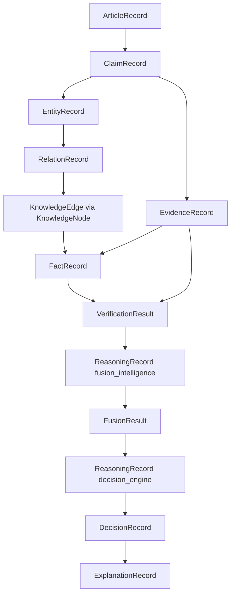

# NeuroVerify: Multimodal Neuro-Symbolic Misinformation Verification Platform
## Canonical Knowledge Representation Specification — Version 1.0

| | |
|---|---|
| **Document status** | Draft for review |
| **Location** | `docs/architecture/KNOWLEDGE_REPRESENTATION_SPEC_v1.0.md` |
| **Governs** | `ARCHITECTURE_SPEC.md` (v1.0, frozen) and `ADDENDUM_v1.1.md` (v1.1, frozen) |
| **Relationship to frozen architecture** | This document does **not** alter subsystem responsibilities, pipeline flow, module boundaries, or the Orchestrator/Decision Engine design established in v1.0/v1.1. It formalizes, at field level, the canonical objects those documents named but specified only structurally (v1.0 §3). Where a name is harmonized across documents, §0.2 states the mapping explicitly — nothing is silently renamed or redefined. |
| **Out of scope** | Implementation code, database design, graph-database (e.g. Neo4j) schemas, ML model selection, infrastructure topology |
| **Audience** | Every subsystem team (v1.0 §5, §6; v1.1 §1–§6) — this is the shared contract all of them serialize, validate, and exchange against |

---

## 0. Scope and Harmonization

### 0.1 Why This Document Exists

v1.0 §3 defined canonical objects as field tables scoped to *what a
module needs to know*. v1.1 added further objects (`PipelineRun`,
`DecisionRecord`, etc.) under the same discipline. Neither document fixed:
a formal identifier scheme, JSON serialization rules, cross-object
validation constraints, or a precise model of *how knowledge itself*
(entities, relations, facts) is represented — v1.0 §5.4 described the
Knowledge Representation subsystem's responsibilities but left
`KnowledgeAssertion` as a single flat triple, without specifying how
entities and relations are extracted, deduplicated, and accumulated into
that triple.

This specification is the single authoritative source for:
1. The exact field-level, typed, validated definition of every canonical
   object in the platform.
2. The **knowledge substrate** underneath `KnowledgeAssertion` — how raw
   entity/relation mentions become a persistent, queryable knowledge
   layer (`EntityRecord`, `RelationRecord`, `KnowledgeNode`,
   `KnowledgeEdge`, `FactRecord`).
3. Serialization, validation, and extensibility rules that apply
   uniformly to every object, across every subsystem, forever.

### 0.2 Name Harmonization Table

Three objects have appeared under different names across prior documents
because they were introduced in different contexts (Phase 1 data
engineering vs. the live reasoning pipeline). This document consolidates
each into **one** authoritative definition. No subsystem behavior changes
as a result — only the object's field contract is now singular and
precise.

| Canonical name (this document) | Prior name(s) | Where it appeared | Resolution |
|---|---|---|---|
| `ArticleRecord` | `ArticleRecord` (Phase 1 `src/schema/canonical_schema.py`); implicitly, the text case of `RawInput` (v1.0 §3.2) | Phase 1 dataset ingestion; v1.0 input normalization | One object now serves both roles, distinguished by a `role` field (§1.1) — a training-corpus article and a live user-submitted article are structurally the same kind of thing |
| `ClaimRecord` | `ClaimRecord` (Phase 1); `Claim` (v1.0 §3.2) | Phase 1 dataset ingestion; v1.0 claim extraction | One object; Phase 1's dataset-derived claims and live-pipeline claims are now the same canonical type, distinguished by `origin` (§1.2) |
| `FactRecord` (+ substrate `EntityRecord`/`RelationRecord`/`KnowledgeNode`/`KnowledgeEdge`) | `KnowledgeAssertion` (v1.0 §3.2, §5.4) | v1.0 Knowledge Representation subsystem output | `KnowledgeAssertion`'s role in the pipeline (feeding NLI Verification) is now filled by `FactRecord`; this document additionally specifies the extraction/graph substrate that produces it, which v1.0 left unspecified. The Knowledge Representation subsystem's responsibilities (v1.0 §5.4) are unchanged — this is a field-level elaboration, not a new responsibility |

`ExplanationRecord` (this document) = `Explanation` (v1.0 §3.2), renamed
only for naming-convention consistency (every object in this document
ends in `Record` or, for the two pipeline-stage outputs that already
carried that name in v1.0/v1.1, `Result`). `VerificationResult`,
`FusionResult`, `DecisionRecord`, `EvidenceRecord`, and `ReasoningRecord`
are unchanged in name and role from v1.0/v1.1; this document adds their
full field-level, validated, serialized specification.

### 0.3 Design Principles (carried forward from v1.0 §3.1, made precise)

1. Every object is identifiable, typed, and versioned (`id`,
   `schema_version`).
2. Every object is immutable once produced.
3. Every object is traceable to the subsystem that produced it
   (`produced_by`).
4. Absence is explicit (`status` fields), never a null/missing object.
5. Relationships between objects are always by reference (`*_id`,
   `*_ids`), never by embedding — this document adds the enforceable
   rule (§6) that a reference must resolve to an existing object of the
   declared type.

---

## 1. Canonical Object Definitions

Each object below is specified with: purpose, a unified field table
(required/optional/type), validation rules, relationships to other
objects, and an example JSON representation. Field names use `snake_case`
per the serialization convention fixed in §5.

Every object, without exception, carries these four fields — they are
listed once here and omitted from each object's own field table for
brevity:

| Field | Type | Required | Description |
|---|---|---|---|
| `id` | string | Yes | Globally unique identifier, prefixed per §6.2 |
| `schema_version` | string | Yes | Version of this object's schema (§5.4) |
| `produced_by` | string | Yes | Name of the subsystem/module that created this object (v1.0 §5, v1.1 §1–§6) |
| `created_at` | timestamp (ISO 8601, UTC) | Yes | Creation time of this object |

---

### 1.1 `ArticleRecord`

**Purpose.** The canonical representation of a full source document —
either a document submitted by a user for verification, or a document
cited as a source within `EvidenceRecord`. Harmonizes the Phase 1
data-engineering object of the same name with the text-modality case of
v1.0's `RawInput` (§0.2).

| Field | Type | Required | Description |
|---|---|---|---|
| `role` | enum | Yes | `submitted_for_verification` \| `evidence_source` \| `training_corpus` |
| `title` | string | No | |
| `body_text` | string | Yes | Full article text |
| `source_url` | string | No | |
| `publication_date` | date | No | |
| `publisher` | string | No | |
| `language` | string | Yes | ISO 639-1 code |
| `associated_image_ids` | string[] | No | FKs to image assets, if any |
| `extracted_claim_ids` | string[] | No | Populated once Claim Extraction (v1.0 §5.1) has run against this article |

**Validation rules.**
- `body_text` must be non-empty for `role = submitted_for_verification`
  and `role = evidence_source`.
- `language` must be a valid ISO 639-1 code.
- If `role = evidence_source`, `source_url` or `publisher` must be
  present (an evidence-source article must be attributable).

**Relationships.**
- One `ArticleRecord` → many `ClaimRecord` (via `extracted_claim_ids`
  and `ClaimRecord.source_article_id`).
- Referenced by `EvidenceRecord.source_article_id` when the evidence
  passage is drawn from a known article.

**Example JSON.**
```json
{
  "id": "article_7f3c1a2e",
  "schema_version": "1.0",
  "produced_by": "input_normalizer",
  "created_at": "2026-07-20T09:12:00Z",
  "role": "submitted_for_verification",
  "title": "City Council Approves New Transit Line",
  "body_text": "The city council voted 7-2 on Tuesday to approve...",
  "source_url": null,
  "publication_date": null,
  "publisher": null,
  "language": "en",
  "associated_image_ids": ["image_a1b2"],
  "extracted_claim_ids": ["claim_9d4e", "claim_a112"]
}
```

---

### 1.2 `ClaimRecord`

**Purpose.** The atomic, checkable proposition defined conceptually in
v1.0 §2.1. This is its complete field-level contract, harmonized with
Phase 1's `ClaimRecord` (§0.2).

| Field | Type | Required | Description |
|---|---|---|---|
| `origin` | enum | Yes | `live_pipeline` \| `training_corpus` (§0.2) |
| `source_article_id` | string | No | FK to `ArticleRecord`, if extracted from one |
| `text` | string | Yes | The claim as extracted/normalized |
| `claim_type` | enum | Yes | `factual_event` \| `statistical` \| `quote_attribution` \| `entity_relation` \| `visual` \| `composite` (v1.0 §2.2) |
| `entity_ids` | string[] | No | FKs to `EntityRecord` |
| `temporal_context` | string | No | When the claim asserts something occurred |
| `associated_image_id` | string | No | If paired with an image |
| `checkable` | boolean | Yes | Per v1.0 §2.1–§2.3 |
| `not_checkable_reason` | enum | Conditional | Required if `checkable = false`; one of `opinion` \| `prediction` \| `question` \| `insufficient_context` \| `satire` |
| `extraction_confidence` | float | Yes | Range [0,1] |
| `language` | string | Yes | ISO 639-1 code |

**Validation rules.**
- `not_checkable_reason` must be present if and only if `checkable = false`.
- `extraction_confidence` ∈ [0, 1] (§6.3).
- `text` must be non-empty and must not equal `source_article_id`'s full
  `body_text` (a claim must be an extracted proposition, not the whole
  article — enforces the atomicity principle, v1.0 §2.1).

**Relationships.**
- Many `ClaimRecord` → one `ArticleRecord` (optional).
- One `ClaimRecord` → many `EntityRecord`.
- One `ClaimRecord` → many `EvidenceRecord`, `VerificationResult`,
  `FusionResult`, `DecisionRecord`, `ExplanationRecord` (via those
  objects' `claim_id` field).

**Example JSON.**
```json
{
  "id": "claim_9d4e",
  "schema_version": "1.0",
  "produced_by": "claim_extraction",
  "created_at": "2026-07-20T09:12:03Z",
  "origin": "live_pipeline",
  "source_article_id": "article_7f3c1a2e",
  "text": "The city council voted 7-2 to approve the new transit line.",
  "claim_type": "statistical",
  "entity_ids": ["entity_council_01", "entity_transitline_02"],
  "temporal_context": "2026-07-14",
  "associated_image_id": null,
  "checkable": true,
  "not_checkable_reason": null,
  "extraction_confidence": 0.93,
  "language": "en"
}
```

---

### 1.3 `EntityRecord`

**Purpose.** A named entity **mention** as it occurs within a specific
`ClaimRecord` or `ArticleRecord` — the first stage of the knowledge
substrate underneath v1.0 §5.4's Knowledge Representation subsystem.
`EntityRecord` is document-local (per-mention); it is later deduplicated
into a persistent `KnowledgeNode` (§1.6).

| Field | Type | Required | Description |
|---|---|---|---|
| `mention_text` | string | Yes | The entity as it literally appears in the source text |
| `entity_type` | enum | Yes | `person` \| `organization` \| `location` \| `event` \| `date_time` \| `quantity` \| `other` |
| `source_claim_id` | string | No | FK, if resolved from a claim |
| `source_article_id` | string | No | FK, if resolved from an article context |
| `canonical_node_id` | string | No | FK to `KnowledgeNode` (§1.6), populated once resolution/deduplication has run — null until then |
| `resolution_confidence` | float | Yes | Range [0,1]; confidence in `mention_text` → `canonical_node_id` resolution (0 if unresolved) |

**Validation rules.**
- At least one of `source_claim_id` / `source_article_id` must be present.
- `resolution_confidence = 0` is required (not merely permitted) when
  `canonical_node_id` is null — an unresolved mention must not carry a
  nonzero resolution confidence.

**Relationships.**
- Many `EntityRecord` → one `KnowledgeNode` (deduplication/resolution).
- Referenced by `RelationRecord.subject_entity_id` /
  `object_entity_id`.
- Referenced by `ClaimRecord.entity_ids`.

**Example JSON.**
```json
{
  "id": "entity_council_01",
  "schema_version": "1.0",
  "produced_by": "knowledge_representation",
  "created_at": "2026-07-20T09:12:05Z",
  "mention_text": "city council",
  "entity_type": "organization",
  "source_claim_id": "claim_9d4e",
  "source_article_id": "article_7f3c1a2e",
  "canonical_node_id": "node_cityofsprucedale_council",
  "resolution_confidence": 0.88
}
```

---

### 1.4 `RelationRecord`

**Purpose.** A relation between two entity mentions as extracted from a
specific claim/article — the document-local counterpart to the
persistent `KnowledgeEdge` (§1.7), analogous to how `EntityRecord`
relates to `KnowledgeNode`.

| Field | Type | Required | Description |
|---|---|---|---|
| `subject_entity_id` | string | Yes | FK to `EntityRecord` |
| `predicate` | string | Yes | Relation label, e.g. `approved`, `acquired`, `located_in` |
| `object_entity_id` | string | Conditional | FK to `EntityRecord`; required unless `object_literal` is used |
| `object_literal` | string | Conditional | A literal value (number, date, free text) when the relation's object is not itself an entity; required unless `object_entity_id` is used |
| `source_claim_id` | string | Yes | FK |
| `temporal_context` | string | No | |
| `extraction_confidence` | float | Yes | Range [0,1] |
| `canonical_edge_id` | string | No | FK to `KnowledgeEdge` (§1.7), populated once this relation has been merged into the canonical graph |

**Validation rules.**
- Exactly one of `object_entity_id` / `object_literal` must be present,
  never both, never neither.
- `predicate` must be non-empty.

**Relationships.**
- Many `RelationRecord` → one `KnowledgeEdge` (aggregation).
- References two `EntityRecord` (subject, and object if entity-typed).

**Example JSON.**
```json
{
  "id": "relation_ab12",
  "schema_version": "1.0",
  "produced_by": "knowledge_representation",
  "created_at": "2026-07-20T09:12:06Z",
  "subject_entity_id": "entity_council_01",
  "predicate": "approved",
  "object_entity_id": "entity_transitline_02",
  "object_literal": null,
  "source_claim_id": "claim_9d4e",
  "temporal_context": "2026-07-14",
  "extraction_confidence": 0.85,
  "canonical_edge_id": "edge_council_approved_transitline"
}
```

---

### 1.5 `EvidenceRecord`

**Purpose.** A retrieved passage relevant to a claim (v1.0 §3.2, §5.3),
specified here at full field/validation level, with an added link to
structured facts.

| Field | Type | Required | Description |
|---|---|---|---|
| `claim_id` | string | Yes | FK to `ClaimRecord` |
| `source_corpus` | enum | Yes | `wikipedia` \| `factcheck_org` \| `trusted_news_sources` \| `web` (v1.0 evidence corpus taxonomy) |
| `source_article_id` | string | No | FK to `ArticleRecord`, if the passage is drawn from a known article |
| `source_url_or_ref` | string | Yes | |
| `passage_text` | string | Yes | |
| `retrieval_score` | float | Yes | Range [0,1] |
| `publication_date` | date | No | |
| `source_trust_tier` | enum | Yes | `tier_1_authoritative` \| `tier_2_reputable` \| `tier_3_unverified` (v1.0 §5.3) |
| `supporting_fact_ids` | string[] | No | FKs to `FactRecord` (§1.8), when structured facts were derived from this passage |
| `status` | enum | Yes | `ok` \| `insufficient_data` \| `error` |

**Validation rules.**
- `passage_text` required and non-empty when `status = ok`; must be
  absent/empty when `status = insufficient_data`.
- `retrieval_score` ∈ [0, 1].
- `source_trust_tier` must be consistent with `source_corpus`:
  `wikipedia` and `factcheck_org` may map to any tier; `web` may never
  be `tier_1_authoritative` (enforced rule, not a suggestion — a web
  source cannot self-declare top-tier trust).

**Relationships.**
- Many `EvidenceRecord` → one `ClaimRecord`.
- Many `EvidenceRecord` → one `ArticleRecord` (optional).
- Many `EvidenceRecord` → many `FactRecord` (optional).
- Referenced by `VerificationResult.evidence_ids`.

**Example JSON.**
```json
{
  "id": "evidence_44de",
  "schema_version": "1.0",
  "produced_by": "evidence_retrieval",
  "created_at": "2026-07-20T09:12:10Z",
  "claim_id": "claim_9d4e",
  "source_corpus": "trusted_news_sources",
  "source_article_id": "article_c003",
  "source_url_or_ref": "https://example-news.example/transit-vote",
  "passage_text": "Council members voted 7-2 in favor of the transit expansion...",
  "retrieval_score": 0.91,
  "publication_date": "2026-07-15",
  "source_trust_tier": "tier_2_reputable",
  "supporting_fact_ids": ["fact_council_vote_0714"],
  "status": "ok"
}
```

---

### 1.6 `KnowledgeNode`

**Purpose.** The canonical, deduplicated representation of an entity or
concept, persistent across claims and articles — the platform's abstract
graph vertex. Deliberately backend-agnostic: this is a data object, not a
graph-database schema.

| Field | Type | Required | Description |
|---|---|---|---|
| `canonical_name` | string | Yes | Preferred display name |
| `node_type` | enum | Yes | Same taxonomy as `EntityRecord.entity_type` |
| `aliases` | string[] | No | Alternate surface forms observed across `EntityRecord.mention_text` |
| `external_ids` | object | No | Map of external-knowledge-base namespace → identifier (e.g. `{"wikidata": "Q123"}`) — reference only, no assumption of a specific KB |
| `first_seen_at` | timestamp | Yes | |
| `last_updated_at` | timestamp | Yes | |
| `mention_count` | integer | Yes | Number of `EntityRecord`s resolved to this node |

**Validation rules.**
- `canonical_name` non-empty.
- `last_updated_at` ≥ `first_seen_at`.
- `mention_count` ≥ 1 (a node must have at least one resolved mention to
  exist — this document does not permit speculative/empty nodes).

**Relationships.**
- One `KnowledgeNode` ← many `EntityRecord`.
- One `KnowledgeNode` → many `KnowledgeEdge` (as subject or object).

**Example JSON.**
```json
{
  "id": "node_cityofsprucedale_council",
  "schema_version": "1.0",
  "produced_by": "knowledge_representation",
  "created_at": "2026-01-04T00:00:00Z",
  "canonical_name": "Sprucedale City Council",
  "node_type": "organization",
  "aliases": ["city council", "the council"],
  "external_ids": {},
  "first_seen_at": "2026-01-04T00:00:00Z",
  "last_updated_at": "2026-07-20T09:12:05Z",
  "mention_count": 214
}
```

---

### 1.7 `KnowledgeEdge`

**Purpose.** The canonical, deduplicated relation between two
`KnowledgeNode`s, aggregated from many `RelationRecord`s across sources
— the platform's abstract graph edge.

| Field | Type | Required | Description |
|---|---|---|---|
| `subject_node_id` | string | Yes | FK to `KnowledgeNode` |
| `predicate` | string | Yes | |
| `object_node_id` | string | Conditional | FK to `KnowledgeNode`; required unless `object_literal` is used |
| `object_literal` | string | Conditional | Required unless `object_node_id` is used |
| `supporting_relation_record_ids` | string[] | Yes | FKs to `RelationRecord`; must contain at least one entry |
| `confidence` | float | Yes | Range [0,1]; aggregate confidence across supporting relations |
| `as_of_date` | date | No | When this relation was true/observed |
| `valid_from` | date | No | Temporal validity window start |
| `valid_until` | date | No | Temporal validity window end; null means still valid |

**Validation rules.**
- Exactly one of `object_node_id` / `object_literal`.
- `supporting_relation_record_ids` must be non-empty (an edge cannot
  exist without at least one supporting extraction).
- `valid_until`, if present, must be ≥ `valid_from`.
- `confidence` ∈ [0, 1].

**Relationships.**
- Many `RelationRecord` → one `KnowledgeEdge`.
- Two `KnowledgeNode` per edge (subject, and object if node-typed).
- Referenced by `FactRecord.supporting_knowledge_edge_id`.

**Example JSON.**
```json
{
  "id": "edge_council_approved_transitline",
  "schema_version": "1.0",
  "produced_by": "knowledge_representation",
  "created_at": "2026-07-20T09:12:07Z",
  "subject_node_id": "node_cityofsprucedale_council",
  "predicate": "approved",
  "object_node_id": "node_transitline_north",
  "object_literal": null,
  "supporting_relation_record_ids": ["relation_ab12"],
  "confidence": 0.85,
  "as_of_date": "2026-07-14",
  "valid_from": "2026-07-14",
  "valid_until": null
}
```

---

### 1.8 `FactRecord`

**Purpose.** An atomic, verification-ready factual statement — the
object actually consumed by NLI Verification (v1.0 §5.5), fulfilling the
role v1.0 §3.2/§5.4 assigned to `KnowledgeAssertion` (§0.2). A
`FactRecord` is either derived from a `KnowledgeEdge` (structured,
graph-backed) or asserted directly from a high-trust `EvidenceRecord`
passage (text-derived, not yet graph-integrated) — both paths converge on
the same downstream shape.

| Field | Type | Required | Description |
|---|---|---|---|
| `statement_text` | string | Yes | Natural-language rendering, for display/explanation |
| `subject` | string | Yes | |
| `predicate` | string | Yes | |
| `object` | string | Yes | |
| `derivation` | enum | Yes | `from_knowledge_edge` \| `from_evidence_passage` |
| `supporting_knowledge_edge_id` | string | Conditional | Required if `derivation = from_knowledge_edge` |
| `supporting_evidence_ids` | string[] | Yes | Must be non-empty regardless of `derivation` — every fact must be evidence-traceable |
| `trust_tier` | enum | Yes | Same taxonomy as `EvidenceRecord.source_trust_tier`; for `from_knowledge_edge` facts, the minimum tier across supporting evidence |
| `as_of_date` | date | No | |

**Validation rules.**
- `supporting_knowledge_edge_id` required if and only if
  `derivation = from_knowledge_edge`.
- `supporting_evidence_ids` non-empty always.
- `statement_text` must be a well-formed rendering of
  `subject`/`predicate`/`object` (structural consistency check — the
  three structured fields and the rendered text must not diverge).

**Relationships.**
- Optionally one `FactRecord` → one `KnowledgeEdge`.
- Many `FactRecord` → many `EvidenceRecord`.
- Referenced by `VerificationResult.evidence_ids` (facts are treated as
  a citable evidence type alongside `EvidenceRecord` passages).

**Example JSON.**
```json
{
  "id": "fact_council_vote_0714",
  "schema_version": "1.0",
  "produced_by": "knowledge_representation",
  "created_at": "2026-07-20T09:12:11Z",
  "statement_text": "The Sprucedale City Council approved the North Transit Line on July 14, 2026.",
  "subject": "Sprucedale City Council",
  "predicate": "approved",
  "object": "North Transit Line",
  "derivation": "from_knowledge_edge",
  "supporting_knowledge_edge_id": "edge_council_approved_transitline",
  "supporting_evidence_ids": ["evidence_44de"],
  "trust_tier": "tier_2_reputable",
  "as_of_date": "2026-07-14"
}
```

---

### 1.9 `VerificationResult`

**Purpose.** The outcome of NLI Verification (v1.0 §5.5): the logical
relationship between a claim and its evidence.

| Field | Type | Required | Description |
|---|---|---|---|
| `claim_id` | string | Yes | FK |
| `evidence_ids` | string[] | Yes | FKs to `EvidenceRecord` and/or `FactRecord`; may be empty only if `status = insufficient_data` |
| `stance` | enum | Yes | `supports` \| `refutes` \| `not_enough_info` \| `conflicting` |
| `stance_confidence` | float | Yes | Range [0,1] |
| `per_evidence_stance` | object[] | Conditional | Required if `evidence_ids` has more than one entry; each item: `{evidence_id, stance, confidence}` |
| `status` | enum | Yes | `ok` \| `insufficient_data` \| `error` |

**Validation rules.**
- `stance = not_enough_info` is required when `status = insufficient_data`.
- `stance = conflicting` requires `per_evidence_stance` to contain both
  `supports` and `refutes` entries.
- Every id in `per_evidence_stance` must appear in `evidence_ids`.

**Relationships.**
- One `VerificationResult` per `ClaimRecord` (per pipeline run).
- References `EvidenceRecord` and `FactRecord`.
- Consumed by `FusionResult`.

**Example JSON.**
```json
{
  "id": "verification_5599",
  "schema_version": "1.0",
  "produced_by": "nli_verification",
  "created_at": "2026-07-20T09:12:15Z",
  "claim_id": "claim_9d4e",
  "evidence_ids": ["evidence_44de", "fact_council_vote_0714"],
  "stance": "supports",
  "stance_confidence": 0.89,
  "per_evidence_stance": [
    {"evidence_id": "evidence_44de", "stance": "supports", "confidence": 0.87},
    {"evidence_id": "fact_council_vote_0714", "stance": "supports", "confidence": 0.92}
  ],
  "status": "ok"
}
```

---

### 1.10 `ReasoningRecord`

**Purpose.** One entry per symbolic rule firing, across both Fusion
Intelligence (v1.0 §5.8) and the Decision Engine (v1.1 §6) — the audit
trail behind every verdict.

| Field | Type | Required | Description |
|---|---|---|---|
| `claim_id` | string | Yes | FK |
| `fired_by` | enum | Yes | `fusion_intelligence` \| `decision_engine` (v1.1 §6.3) |
| `rule_name` | string | Yes | |
| `inputs_considered` | string[] | Yes | Object ids read by this rule; must be non-empty |
| `rule_output` | string | Yes | |
| `rationale` | string | Yes | Human-readable justification |
| `sequence_order` | integer | Yes | Position within this claim's full reasoning chain (Fusion entries precede Decision Engine entries, per v1.1 §6.1) |

**Validation rules.**
- `sequence_order` values must be unique and contiguous within one
  claim's chain.
- Every id in `inputs_considered` must resolve to an existing object.
- `fired_by = decision_engine` entries must have `sequence_order` greater
  than every `fired_by = fusion_intelligence` entry for the same claim
  (enforces v1.1 §6.1's ordering: Fusion, then Decision).

**Relationships.**
- Many `ReasoningRecord` → one `ClaimRecord`.
- Referenced by `FusionResult` and `DecisionRecord` (via id lists) and
  rendered by `ExplanationRecord.reasoning_steps`.

**Example JSON.**
```json
{
  "id": "reasoning_0012",
  "schema_version": "1.0",
  "produced_by": "fusion_intelligence",
  "created_at": "2026-07-20T09:12:18Z",
  "claim_id": "claim_9d4e",
  "fired_by": "fusion_intelligence",
  "rule_name": "evidentiary_sufficiency_gate",
  "inputs_considered": ["verification_5599"],
  "rule_output": "sufficiency_check_passed",
  "rationale": "VerificationResult.status = ok with stance_confidence 0.89; proceeding to stance-confidence combination.",
  "sequence_order": 1
}
```

---

### 1.11 `FusionResult`

**Purpose.** The unified, per-claim synthesis of every applicable module
output (v1.0 §5.8, §3.2).

| Field | Type | Required | Description |
|---|---|---|---|
| `claim_id` | string | Yes | FK |
| `factual_verdict` | enum | Yes | `true` \| `false` \| `partially_true` \| `unverifiable` \| `misleading_context` |
| `factual_confidence` | float | Yes | Range [0,1] |
| `content_provenance` | enum | Yes | `human_authored` \| `ai_generated` \| `hybrid` \| `unknown` |
| `visual_integrity` | enum | No | Null if the claim has no associated image |
| `contributing_result_ids` | string[] | Yes | Every upstream object id used (must be non-empty) |
| `conflict_detected` | boolean | Yes | |
| `reasoning_record_ids` | string[] | Yes | FKs to `ReasoningRecord` where `fired_by = fusion_intelligence`; non-empty |

**Validation rules.**
- `conflict_detected = true` requires at least one referenced
  `VerificationResult.stance = conflicting` OR a documented
  cross-module disagreement in the reasoning chain (v1.0 §6.4).
- `visual_integrity` must be null if no `ImageForensicsResult` id appears
  in `contributing_result_ids`, and non-null otherwise.

**Relationships.**
- One `FusionResult` per `ClaimRecord` per pipeline run.
- Consumes `VerificationResult`, `ImageForensicsResult`,
  `AITextDetectionResult`, `LinguisticAnalysisResult` (v1.0 §3.2) by id.
- Consumed by `DecisionRecord`.

**Example JSON.**
```json
{
  "id": "fusion_7731",
  "schema_version": "1.0",
  "produced_by": "fusion_intelligence",
  "created_at": "2026-07-20T09:12:19Z",
  "claim_id": "claim_9d4e",
  "factual_verdict": "true",
  "factual_confidence": 0.88,
  "content_provenance": "human_authored",
  "visual_integrity": null,
  "contributing_result_ids": ["verification_5599"],
  "conflict_detected": false,
  "reasoning_record_ids": ["reasoning_0012"]
}
```

---

### 1.12 `DecisionRecord`

**Purpose.** The policy/threshold-adjusted decision (v1.1 §6.4) applied
on top of a `FusionResult`.

| Field | Type | Required | Description |
|---|---|---|---|
| `claim_id` | string | Yes | FK |
| `fusion_result_id` | string | Yes | FK |
| `applied_policy_ids` | string[] | No | May be empty if no policy rules were configured/active |
| `confidence_threshold_applied` | float | Yes | Range [0,1] |
| `threshold_met` | boolean | Yes | |
| `conflict_resolution_applied` | boolean | Yes | |
| `standardized_verdict_category` | enum | Yes | `true` \| `false` \| `partially_true` \| `unverifiable` \| `misleading_context` \| `not_checkable` |
| `reasoning_record_ids` | string[] | Yes | FKs to `ReasoningRecord` where `fired_by = decision_engine`; non-empty |

**Validation rules.**
- `threshold_met = false` requires `standardized_verdict_category =
  unverifiable` (v1.1 §6.5 — the threshold layer never fabricates a more
  decisive verdict than the evidence supports).
- `conflict_resolution_applied = true` requires
  `FusionResult.conflict_detected = true` on the referenced
  `fusion_result_id`.

**Relationships.**
- One `DecisionRecord` per `FusionResult`.
- Consumed by `ExplanationRecord`.

**Example JSON.**
```json
{
  "id": "decision_3390",
  "schema_version": "1.0",
  "produced_by": "decision_engine",
  "created_at": "2026-07-20T09:12:20Z",
  "claim_id": "claim_9d4e",
  "fusion_result_id": "fusion_7731",
  "applied_policy_ids": [],
  "confidence_threshold_applied": 0.6,
  "threshold_met": true,
  "conflict_resolution_applied": false,
  "standardized_verdict_category": "true",
  "reasoning_record_ids": ["reasoning_0013"]
}
```

---

### 1.13 `ExplanationRecord`

**Purpose.** The human-facing rendering of a claim's full reasoning
chain (`Explanation` in v1.0 §3.2, harmonized per §0.2), plus the final
`Verdict` fields.

| Field | Type | Required | Description |
|---|---|---|---|
| `claim_id` | string | Yes | FK |
| `decision_record_id` | string | Yes | FK |
| `label` | enum | Yes | Mirrors `DecisionRecord.standardized_verdict_category` |
| `confidence` | float | Yes | Range [0,1]; mirrors `FusionResult.factual_confidence` as adjusted by the Decision Engine |
| `summary` | string | Yes | One-paragraph plain-language explanation |
| `evidence_cited` | object[] | Yes | Each item: `{evidence_id, source_url_or_ref, snippet}`; non-empty unless `label = unverifiable` with zero evidence found |
| `reasoning_steps` | string[] | Yes | Ordered, human-readable rendering of the full `ReasoningRecord` chain (Fusion entries, then Decision Engine entries, per §1.10) |
| `caveats` | string[] | No | e.g. limited evidence recency, single-source reliance, unresolved conflict |

**Validation rules.**
- `len(reasoning_steps)` must equal the number of `ReasoningRecord`s
  referenced transitively via `decision_record_id` →
  `fusion_result_id`/`reasoning_record_ids` (v1.0 §4's contract:
  "`Explanation.reasoning_steps` count matches `ReasoningRecord` chain
  length").
- `label` must equal the `standardized_verdict_category` of the
  referenced `DecisionRecord` — this object never introduces a new
  decision, only renders one (v1.0 §5.9: Explainability Engine makes no
  new reasoning decisions).

**Relationships.**
- One `ExplanationRecord` per `DecisionRecord`.
- Terminal object in the per-claim pipeline (v1.0 §3.3).

**Example JSON.**
```json
{
  "id": "explanation_8820",
  "schema_version": "1.0",
  "produced_by": "explainability_engine",
  "created_at": "2026-07-20T09:12:21Z",
  "claim_id": "claim_9d4e",
  "decision_record_id": "decision_3390",
  "label": "true",
  "confidence": 0.88,
  "summary": "This claim is verified true. A reputable news source confirms the city council approved the transit line by a 7-2 vote on July 14, 2026, consistent with the council's own recorded decision.",
  "evidence_cited": [
    {
      "evidence_id": "evidence_44de",
      "source_url_or_ref": "https://example-news.example/transit-vote",
      "snippet": "Council members voted 7-2 in favor of the transit expansion..."
    }
  ],
  "reasoning_steps": [
    "Evidence was found and passed the sufficiency gate.",
    "Evidence strongly supports the claim (confidence 0.89).",
    "Confidence threshold (0.60) was met; no policy overrides applied.",
    "Verdict standardized to: true."
  ],
  "caveats": []
}
```

---

## 2. Object Hierarchy

### 2.1 Full Relationship Diagram

```
ArticleRecord ──< ClaimRecord
                       │
        ┌──────────────┼───────────────────────────────┐
        ▼               ▼                                ▼
   EntityRecord    EvidenceRecord ──< FactRecord     (image/AI-text/linguistic
        │                │                  │          results — v1.0 §3.2,
        ▼                │                  │          unchanged by this doc)
   RelationRecord         │                  │
        │                │                  │
        ▼                │                  │
   KnowledgeEdge          │                  │
   (via KnowledgeNode) ───┴──────────────────┘
                       (FactRecord may derive from
                        KnowledgeEdge or EvidenceRecord)
                                │
                                ▼
                      VerificationResult
                                │
                                ▼
                         FusionResult ──< ReasoningRecord (fired_by=fusion_intelligence)
                                │
                                ▼
                        DecisionRecord ──< ReasoningRecord (fired_by=decision_engine)
                                │
                                ▼
                        ExplanationRecord
```

### 2.2 Two Distinct Hierarchies

This model has two structurally different kinds of hierarchy, and
conflating them is the most common source of knowledge-representation
bugs — this document keeps them explicitly separate:

| Hierarchy | Nature | Objects | Lifetime |
|---|---|---|---|
| **Pipeline hierarchy** | Strictly per-claim, per-run, linear/DAG-shaped, immutable once produced | `ClaimRecord` → `EvidenceRecord`/`VerificationResult` → `FusionResult` → `DecisionRecord` → `ExplanationRecord` | One pipeline run |
| **Knowledge hierarchy** | Persistent, cumulative, many-to-many, grows across runs | `EntityRecord` → `KnowledgeNode`; `RelationRecord` → `KnowledgeEdge`; both feed `FactRecord` | Indefinite — the knowledge substrate is the platform's long-term memory, not a per-run artifact |

`FactRecord` is the deliberate bridge between them: it is produced fresh
per claim-verification need (pipeline hierarchy) but is *derived from*
the persistent knowledge hierarchy when `derivation =
from_knowledge_edge`. This mirrors — and formalizes — the split v1.0 §5.4
already implied between "structured knowledge lookups" and "the
verification task."

---

## 3. Object Lifecycle

### 3.1 Lifecycle Stages

Every object in this specification is created exactly once and never
mutated (§0.3, principle 2). "Lifecycle" therefore refers to the sequence
in which objects of different types come into existence, not to state
transitions of a single object (the one exception, `EntityRecord`/
`RelationRecord`'s `canonical_node_id`/`canonical_edge_id` fields, is
addressed in §3.3).

```
Stage 0 — Ingestion
   ArticleRecord created (role = submitted_for_verification)

Stage 1 — Claim Extraction (v1.0 §5.1)
   ClaimRecord(s) created, source_article_id set

Stage 2 — Parallel Analysis (v1.0 §1.1)
   EntityRecord(s) created from ClaimRecord.text
   EvidenceRecord(s) created from Evidence Retrieval (v1.0 §5.3)
   (ImageForensicsResult / AITextDetectionResult / LinguisticAnalysisResult
    created per v1.0 §3.2 — unchanged by this document)

Stage 3 — Knowledge Resolution (v1.0 §5.4, elaborated by this document)
   RelationRecord(s) created from EntityRecord pairs within a claim
   EntityRecord.canonical_node_id resolved against existing KnowledgeNode(s),
     OR a new KnowledgeNode created if no match exists
   RelationRecord.canonical_edge_id resolved against existing KnowledgeEdge(s),
     OR a new KnowledgeEdge created, aggregating supporting_relation_record_ids
   FactRecord(s) created — either from a KnowledgeEdge or directly from
     a high-trust EvidenceRecord passage

Stage 4 — Verification (v1.0 §5.5)
   VerificationResult created, referencing EvidenceRecord(s) and FactRecord(s)

Stage 5 — Fusion (v1.0 §5.8)
   ReasoningRecord(s) created (fired_by = fusion_intelligence)
   FusionResult created

Stage 6 — Decision (v1.1 §6)
   ReasoningRecord(s) created (fired_by = decision_engine)
   DecisionRecord created

Stage 7 — Explanation (v1.0 §5.9)
   ExplanationRecord created — terminal object for this claim
```

### 3.2 Lifecycle Diagram



### 3.3 The One Controlled Mutation Path

`EntityRecord.canonical_node_id`, `EntityRecord.resolution_confidence`,
`RelationRecord.canonical_edge_id`, and `KnowledgeNode`/`KnowledgeEdge`'s
aggregate fields (`mention_count`, `supporting_relation_record_ids`,
`confidence`, `last_updated_at`) are the **only** fields in this entire
specification permitted to change after creation — and only in one
direction:

- An `EntityRecord`/`RelationRecord` goes from *unresolved*
  (`canonical_node_id = null`) to *resolved* (populated) exactly once,
  never back.
- A `KnowledgeNode`/`KnowledgeEdge`'s aggregate fields only grow
  (`mention_count` increments, `supporting_relation_record_ids` only
  gains entries) — this is append-only aggregation, not editing, and is
  the same pattern Phase 1's `LineageTracker` already uses for row-count
  checkpoints.

Every other object and every other field is write-once. This narrow,
explicit exception is called out here specifically so implementers do not
generalize it into a broader mutability assumption.

---

## 4. Interface Contracts

This section states, for every module boundary already named in v1.0
§4/§5 and v1.1 §1–§6, exactly which canonical objects (as defined in §1
of this document) cross that boundary. It does not redefine module
responsibilities — those remain exactly as specified in the frozen
architecture.

| Module (v1.0/v1.1 reference) | Consumes | Produces |
|---|---|---|
| Input Normalizer (v1.0 §1.1) | Raw user submission | `ArticleRecord` (`role = submitted_for_verification`) |
| Claim Extraction (v1.0 §5.1) | `ArticleRecord` | `ClaimRecord[]` |
| Linguistic Analysis (v1.0 §5.2) | `ClaimRecord` | `LinguisticAnalysisResult` (v1.0 §3.2, unchanged) |
| Evidence Retrieval (v1.0 §5.3) | `ClaimRecord` | `EvidenceRecord[]` |
| Knowledge Representation (v1.0 §5.4) | `ClaimRecord`, `EvidenceRecord[]` | `EntityRecord[]`, `RelationRecord[]`, `KnowledgeNode[]` (new or updated), `KnowledgeEdge[]` (new or updated), `FactRecord[]` |
| NLI Verification (v1.0 §5.5) | `ClaimRecord`, `EvidenceRecord[]`, `FactRecord[]` | `VerificationResult` |
| Image Forensics (v1.0 §5.6) | `ImageRecord` (Phase 1 schema) | `ImageForensicsResult` (v1.0 §3.2, unchanged) |
| AI-Generated Text Detection (v1.0 §5.7) | `ClaimRecord.text` | `AITextDetectionResult` (v1.0 §3.2, unchanged) |
| Fusion Intelligence (v1.0 §5.8) | `VerificationResult`, `ImageForensicsResult`, `AITextDetectionResult`, `LinguisticAnalysisResult` | `FusionResult`, `ReasoningRecord[]` (`fired_by = fusion_intelligence`) |
| Decision Engine (v1.1 §6) | `FusionResult`, `ReasoningRecord[]` | `DecisionRecord`, `ReasoningRecord[]` (`fired_by = decision_engine`) |
| Explainability Engine (v1.0 §5.9) | `DecisionRecord`, full `ReasoningRecord[]` chain | `ExplanationRecord` |
| Pipeline Orchestrator (v1.1 §1) | Every object above, as a pass-through coordinator | `PipelineRun`, `ModuleExecutionRecord` (v1.1 §1.4, unchanged) |
| Event Logger (v1.1 §2) | Read-only observer of every object above | `LogEvent` (v1.1 §2.4, unchanged) |
| Feedback Service (v1.1 §3) | `ExplanationRecord`, `DecisionRecord` | `FeedbackRecord` (v1.1 §3.3, unchanged) |

No module in this table gains, loses, or reinterprets an input/output
beyond what v1.0 §4 and v1.1 already contracted — this table exists to
make the *object types* crossing each boundary explicit and precise,
where the source documents referred to them by role rather than by full
schema.

---

## 5. Serialization Strategy

### 5.1 General Rules

| Rule | Specification |
|---|---|
| Format | JSON, UTF-8 encoded |
| Field naming | `snake_case`, exactly as written in every field table in §1 |
| Object envelope | Every serialized object is a single flat JSON object — no wrapper envelope (e.g. no `{"data": {...}}`); the four universal fields (`id`, `schema_version`, `produced_by`, `created_at`) sit at the top level alongside type-specific fields |
| Arrays | Empty relationships serialize as `[]`, never `null` and never an omitted key — a field declared as an array type in §1 is always present |
| Optional scalars | Absent optional fields serialize as explicit `null`, never an omitted key — every field declared in an object's table in §1 is always present in the JSON, either with a value or `null` |
| Nesting | Relationships are referenced by id string(s), never by embedding the related object inline (§0.3, principle 5) — the sole structural exception is small, non-canonical inline shapes explicitly declared in a field's type, e.g. `VerificationResult.per_evidence_stance` and `ExplanationRecord.evidence_cited`, which are display/computation conveniences, not independently addressable objects |

### 5.2 Timestamps

- All timestamps use ISO 8601 with a `Z` (UTC) suffix:
  `YYYY-MM-DDTHH:MM:SSZ`.
- All dates (no time component — e.g. `publication_date`, `as_of_date`)
  use `YYYY-MM-DD`.
- No timezone other than UTC is ever serialized; display-layer
  localization is a presentation concern outside this specification.

### 5.3 Identifiers

- See §6.2 for the full identifier grammar. Identifiers are always
  strings, even when the underlying generation scheme is numeric.

### 5.4 Schema Versioning

- Every object's `schema_version` field uses semantic-version-like
  strings (`"1.0"`, `"1.1"`, ...), matching the convention already
  established for `CANONICAL_SCHEMA_VERSION` in Phase 1 and for
  `pipeline_version` in v1.1 §1.4.
- A schema version bump is required whenever a field is added, removed,
  renamed, or its allowed values/type changes for any object in §1.
- Consumers must reject (not best-effort-parse) an object whose
  `schema_version` major component they do not recognize — additive
  minor-version changes (new optional field) must remain
  backward-compatible for existing consumers; breaking changes require a
  major-version bump and explicit migration (§7.4).

### 5.5 Example: Full Envelope Consistency

Every example JSON in §1 is written in the exact form a producing module
must emit and a consuming module must accept — there is no separate
"wire format" versus "internal format." This is a deliberate
simplification: one canonical JSON shape per object, used identically in
logs (v1.1 §2), feedback exports (v1.1 §3.6), and inter-module calls
(§4).

---

## 6. Validation Strategy

### 6.1 Validation Philosophy

Every object must be structurally valid *before* it is passed to the
next module — this extends v1.0 §4.1's contract-enforcement principle
uniformly to every object defined in this document, including the new
knowledge-substrate objects (`EntityRecord`, `RelationRecord`,
`KnowledgeNode`, `KnowledgeEdge`, `FactRecord`) that v1.0 left
unspecified at this level of detail.

### 6.2 Identifier Rules

| Rule | Specification |
|---|---|
| Format | `{type_prefix}_{opaque_token}` |
| Type prefixes | `article`, `claim`, `entity`, `relation`, `evidence`, `fact`, `node`, `edge`, `reasoning`, `verification`, `fusion`, `decision`, `explanation` (one prefix per object type in §1) |
| Opaque token | Implementation-defined (out of scope, §0), but must be unique within its type prefix's namespace platform-wide |
| Immutability | An `id`, once assigned, is never reassigned or reused, even if the object is later superseded (it never is — §0.3 principle 2) |
| Cross-references | Any field ending in `_id` or `_ids` must contain only identifiers matching the expected type prefix for that field (e.g. `claim_id` must always be a `claim_...` identifier) — a reference with the wrong prefix is a validation failure, not a warning |
| Polymorphic reference exception | `VerificationResult.evidence_ids`, `VerificationResult.per_evidence_stance[].evidence_id`, and `ExplanationRecord.evidence_cited[].evidence_id` are the one documented exception: per §1.9's relationship rule (facts are citable alongside evidence passages), these fields accept **either** an `evidence_...` or a `fact_...` prefixed identifier. No other field in this specification permits more than one type prefix; any future polymorphic field must be explicitly documented here, not assumed by analogy |

### 6.3 Confidence and Score Ranges

| Rule | Specification |
|---|---|
| Range | Every field semantically representing a confidence, probability, or score (every field named `*confidence*`, `*_score`, or documented as "Range [0,1]" in §1) must satisfy `0.0 ≤ value ≤ 1.0` |
| Zero handling | `0.0` is a valid, meaningful value (complete absence of confidence — e.g. `EntityRecord.resolution_confidence = 0` for an unresolved mention, §1.3) and must not be confused with a missing/null value |
| Aggregation consistency | Where a confidence is described as "aggregate" (e.g. `KnowledgeEdge.confidence`), it must not exceed the maximum of its inputs' confidences and must not be negative — no aggregation rule may produce an out-of-range value |

### 6.4 Timestamp and Temporal Validation

| Rule | Specification |
|---|---|
| Format compliance | Every timestamp/date field must parse as valid ISO 8601 per §5.2 |
| Causal ordering | `created_at` of any object referencing another object by id must be ≥ the referenced object's `created_at` (an object cannot reference something that doesn't exist yet) |
| Temporal-validity ordering | `KnowledgeEdge.valid_until`, if present, must be ≥ `valid_from`; `KnowledgeNode.last_updated_at` must be ≥ `first_seen_at` (restated from §1.6/§1.7 as a general cross-object rule) |
| Claim-vs-evidence recency | `EvidenceRecord.publication_date`, when present, is checked against `ClaimRecord.temporal_context` by Evidence Retrieval/NLI Verification per v1.0 §7 (scenario 13) — this document does not change that behavioral rule, only confirms both fields exist and are validated as proper dates |

### 6.5 Provenance Requirements

| Rule | Specification |
|---|---|
| Mandatory attribution | Every object's `produced_by` must name a module explicitly listed in v1.0 §5, v1.1 §1–§6, or §4 of this document — an unrecognized producer name is a validation failure |
| Evidence traceability | Every `FactRecord` must have non-empty `supporting_evidence_ids` (§1.8); every `KnowledgeEdge` must have non-empty `supporting_relation_record_ids` (§1.7) — the platform never asserts a fact or a relation with zero traceable origin |
| Reasoning traceability | Every `FusionResult` and `DecisionRecord` must have non-empty `reasoning_record_ids` (§1.11, §1.12) — no verdict-affecting object may exist without an accompanying reasoning trace, extending v1.0 §10's explainability requirement into an enforced structural rule |

### 6.6 Consistency Rules (Cross-Object)

| Rule | Specification |
|---|---|
| Referential integrity | Every `*_id`/`*_ids` field must resolve to an existing object of the correct type (§6.2) — dangling references are rejected at validation time, not discovered later at read time |
| Enum consistency | `ExplanationRecord.label` must equal `DecisionRecord.standardized_verdict_category` for the referenced `decision_record_id` (§1.13) |
| Conditional-field consistency | Every "Conditional" field documented in §1 (e.g. `ClaimRecord.not_checkable_reason`, `RelationRecord.object_entity_id`/`object_literal`, `FactRecord.supporting_knowledge_edge_id`) is validated against its stated condition — these are not merely documented conventions but enforced rules |
| Status/data consistency | Any object with a `status` field (`EvidenceRecord`, `VerificationResult`) must have its data fields populated or empty exactly as §1's validation rules specify per status value — e.g. `EvidenceRecord.passage_text` empty if and only if `status ≠ ok` |
| No orphaned pipeline objects | Every `ClaimRecord` must eventually resolve to exactly one `ExplanationRecord` (or a document-level `not_checkable` disposition per v1.0 §2.3) — a claim that enters the pipeline and never receives a terminal object is a pipeline-integrity error, not a valid end state |

### 6.7 Validation Enforcement Point

Consistent with v1.0 §4.1, every module — including the new Knowledge
Representation sub-steps (§3.1, Stage 3) — validates its own outputs
against §6 before handing them to the Orchestrator (v1.1 §1) for
propagation. A module producing an invalid object must return a
`status = error` outcome (v1.0 §4) rather than emit the malformed object;
this document adds no new failure-handling behavior beyond what v1.0 §7
and v1.1 §1.6 already specify — it only makes precise *what* "invalid"
means for every object type.

---

## 7. Extensibility

### 7.1 Principle

Every future evidence modality (video, audio, social graph, scientific
literature) and every future language must be addable by **adding new
object types and enum values**, never by modifying the field contract of
an existing object defined in §1. This directly extends v1.0 §9's
Modality Adapter pattern and v1.0 §9.3's Module Registry to the knowledge
layer specifically.

### 7.2 Extension Points Already Built Into This Schema

| Extension point | How it accommodates growth |
|---|---|
| `EntityRecord.entity_type` / `KnowledgeNode.node_type` | An open enum — new categories (e.g. `scientific_finding`, `social_account`) can be added without changing any field or relationship |
| `EvidenceRecord.source_corpus` | An open enum — a future `video_corpus`, `audio_corpus`, or `social_graph_corpus` value slots in without changing `EvidenceRecord`'s structure; the object already treats "where evidence comes from" as data, not schema |
| `ArticleRecord.language` / `ClaimRecord.language` | Already present in v1.0 (every text object carries a language field) — multilingual support (v1.0 §9.5) requires no schema change here, only downstream module capability |
| `FactRecord.derivation` | An open enum — a future derivation path (e.g. `from_social_graph_signal`) is additive |
| `KnowledgeEdge.supporting_relation_record_ids` | Already modality-agnostic — a future `VideoRelationRecord` (analogous to `RelationRecord`, §1.4) could contribute to the same canonical `KnowledgeEdge` without that edge's schema changing |

### 7.3 Adding a New Evidence Modality: Worked Example (Video)

Following the exact pattern already used for Image Forensics (v1.0 §5.6,
§9.2) and this document's `EvidenceRecord`:

1. Define `VideoForensicsResult` (v1.0 §9.2 already specifies this
   follows `BaseRecord`/`*ModalityResult` shape — no new pattern needed).
2. Add `video` as a valid value wherever an evidence-modality enum is
   open (§7.2) — e.g. `EvidenceRecord.source_corpus` gains
   `video_corpus`.
3. `EvidenceRecord` itself requires **no field changes** — a video-derived
   evidence passage is still `passage_text` (a transcript or extracted
   claim from the video, per Claim Extraction's existing text pathway)
   plus a reference; the video-specific forensic assessment lives in its
   own `VideoForensicsResult`, exactly parallel to how `ImageForensicsResult`
   is separate from `EvidenceRecord` today.
4. Register the new analyzer in the Module Registry (v1.0 §9.3) and add
   corresponding Fusion rules (v1.0 §9.4) — both are additive per the
   already-approved v1.0 extensibility design.

No object in §1 of this document requires a breaking change for this
addition — confirming the schema satisfies its own extensibility
requirement.

### 7.4 Extension Governance

| Rule | Specification |
|---|---|
| Additive-only for minor versions | New optional fields, new enum values, and entirely new object types may be introduced under a minor `schema_version` bump (§5.4) |
| Breaking changes require major version | Removing a field, changing a field's type, or changing a required/optional status requires a major `schema_version` bump and a documented migration note, following the same discipline Phase 1 established for `CANONICAL_SCHEMA_VERSION` |
| No silent divergence | Any deployment-specific extension (a new enum value, a new object type for a novel evidence source) must be registered in this document (or a versioned successor) before use — this specification is the single source of truth referenced in §4, and an unregistered extension would violate the "universal contract" purpose stated in this document's header |

---

## 8. Architectural Rationale

### 8.1 Modularity

Because every module boundary (§4) exchanges only the canonical objects
defined in §1 — never internal state, never a shared mutable store —
each subsystem in v1.0 §5 and v1.1 §1–§6 can be developed, tested, and
deployed independently. The knowledge substrate (`EntityRecord` →
`KnowledgeNode`, `RelationRecord` → `KnowledgeEdge`) is itself modular
within Knowledge Representation: entity resolution and relation
aggregation are independently replaceable steps, connected only by the
`canonical_node_id`/`canonical_edge_id` reference fields (§1.3, §1.4).

### 8.2 Explainability

§6.5's enforced provenance rules (non-empty `supporting_evidence_ids`,
non-empty `reasoning_record_ids`) make explainability a **structural
guarantee**, not a best-effort feature: it is not possible, under this
schema, for a `FusionResult` or `DecisionRecord` to exist without a
traceable reasoning chain, or for a `FactRecord` to exist without
traceable evidence. This directly operationalizes v1.0 §0.2's
neuro-symbolic principle and v1.0 §10's explainability requirement at the
data-model level, closing the gap between "the architecture intends to be
explainable" and "the schema makes non-explainable states
unrepresentable."

### 8.3 Interoperability

A single, precise JSON serialization (§5) for every object means every
subsystem — including future ones added per §7 — speaks one wire format.
Combined with the Model Registry's `input_schema_ref`/`output_schema_ref`
pattern (v1.1 §4.2, §4.4), a module or model can be swapped as long as it
honors this specification's object contracts, regardless of what
language, framework, or team produced it.

### 8.4 Testing

Every validation rule in §6 is independently checkable against a single
object instance or a small object graph, without running the full
pipeline. This means:
- Unit tests can construct a minimal valid/invalid object per §1's rules
  and assert acceptance/rejection directly.
- Integration tests can verify §6.6's cross-object consistency rules
  (e.g. referential integrity, enum consistency) against fixtures rather
  than live pipeline runs.
- The append-only aggregation exception (§3.3) is narrow and explicit
  enough to test exhaustively (only four field groups, one direction of
  change each).

### 8.5 Maintainability

The name-harmonization work in §0.2 exists specifically to prevent
maintainability decay: before this document, `Claim` (v1.0) and
`ClaimRecord` (Phase 1) were two names for adjacent-but-not-identical
concepts, a pattern that — left unaddressed — tends to multiply into
inconsistent duplicate schemas across a growing codebase. Fixing this
now, under one authoritative document, is cheaper than fixing it after
more subsystems have been built against divergent definitions.

### 8.6 Long-Term Scalability

§7's extension points were derived directly from where v1.0 already
anticipated growth (§9's Modality Adapter pattern, §9.5's multilingual
approach) — this document does not introduce new scalability mechanisms
so much as it confirms, object by object, that the existing schema
satisfies the extensibility commitments v1.0 already made. The worked
video-evidence example (§7.3) demonstrates that a new modality is
addable with zero breaking changes to any object defined here, which is
the concrete, checkable form of v1.0 §9.6's promise ("adding video,
audio, or a new language is additive").

---

*End of Canonical Knowledge Representation Specification, Version 1.0.*
*This document supplements `ARCHITECTURE_SPEC.md` (v1.0) and*
*`ADDENDUM_v1.1.md` (v1.1); neither is altered by it.*
