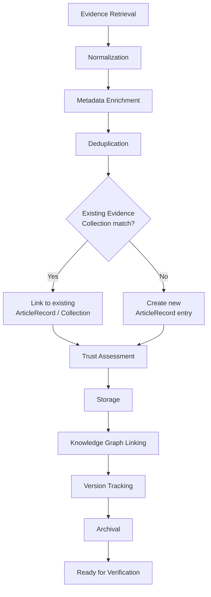

# NeuroVerify: Multimodal Neuro-Symbolic Misinformation Verification Platform
## Evidence Store Subsystem — Conceptual Architecture Specification, Version 1.0

| | |
|---|---|
| **Document status** | Draft for review |
| **Location** | `docs/architecture/EVIDENCE_STORE_SPEC_v1.0.md` |
| **Builds on (frozen, unmodified)** | Phase 1 — Data Engineering Foundation; Phase 2 — `ARCHITECTURE_SPEC.md` v1.0 and `ADDENDUM_v1.1.md`; Phase 3 — `KNOWLEDGE_REPRESENTATION_SPEC_v1.0.md`; Phase 4.1 — `KNOWLEDGE_GRAPH_SPEC_v1.0.md` |
| **Nature of this document** | Conceptual architecture only. It defines how evidence is preserved, governed, versioned, trusted, and supplied to downstream verification modules — not how it is stored, indexed, or queried by any specific technology |
| **Explicitly excluded** | Code, pseudocode, SQL, NoSQL, Neo4j, vector-database schemas, object-storage implementation, cloud providers, infrastructure, APIs, performance benchmarks, database schemas, implementation algorithms, technology choices |
| **Audience** | Engineers who will implement the Evidence Store subsystem in the next phase; every subsystem team that consumes `EvidenceRecord`, evidence references, or provenance chains |

This document does not redefine any canonical object. `ArticleRecord`,
`EvidenceRecord`, `FactRecord`, and every other object referenced below
retain exactly the field definitions, validation rules, and lifecycle
behavior fixed in `KNOWLEDGE_REPRESENTATION_SPEC_v1.0.md` §1–§8. Where
this document introduces conceptual constructs not previously named
(Evidence Collection, Evidence Repository, Evidence Bundle, Evidence
Relationships, Evidence References — §2), these are **organizing roles
played by existing canonical objects**, not new canonical object types
with their own schemas. No new `id`-bearing, `schema_version`-bearing
object is introduced by this document.

---

## 1. Purpose

### 1.1 What Is Evidence?

Evidence, in this architecture, is **attributable content retrieved from
a source external to the claim under test, offered in support of or in
opposition to that claim.** Every `EvidenceRecord` (Phase 3 §1.5) is one
such piece of evidence, scoped to the specific claim it was retrieved
for. This document specifies the subsystem responsible for what happens
to that content — and the source document behind it — once it has been
retrieved: how it is preserved, deduplicated, versioned, trusted, and
made permanently traceable, independent of any single claim's
verification.

### 1.2 Evidence vs. Knowledge

These are structurally and philosophically distinct, and the platform's
two persistent-memory subsystems exist precisely because of this
distinction:

| | Evidence (this document) | Knowledge (Phase 4.1) |
|---|---|---|
| **Nature** | Raw, attributable source material — what was actually published, said, or recorded | Resolved, structured understanding distilled *from* evidence — entities, relationships, facts |
| **Mutability of meaning** | Fixed — a piece of evidence means exactly what it said when captured, forever | Evolving — the Knowledge Graph's understanding of an entity or relationship can be refined, extended, or superseded as more evidence accumulates (Phase 4.1 §6.5) |
| **Held by** | The Evidence Store (this document) | The Knowledge Graph (Phase 4.1) |
| **Canonical objects** | `ArticleRecord`, `EvidenceRecord` | `KnowledgeNode`, `KnowledgeEdge`, `FactRecord` |
| **Can be wrong** | An evidence item can be an inaccurate source, but the *record of what it said* is never wrong — the Evidence Store never edits content to "correct" it (§9) | Knowledge derived from evidence can be revised as understanding improves — that revision process is the Knowledge Graph's entire purpose (Phase 4.1 §6, §7, §9) |

The Knowledge Graph stores **semantic knowledge**. The Evidence Store
stores **evidentiary memory**. Together they form the platform's
persistent memory layer (§1.5) — the Knowledge Graph is what the
platform has concluded; the Evidence Store is the permanent, inspectable
record of what it concluded it *from*.

### 1.3 Evidence vs. Claims

A `ClaimRecord` (Phase 3 §1.2) is a proposition under test — something
the platform does not yet know to be true or false. An `EvidenceRecord`
is content offered to help resolve that test. The distinction is
functional, not always material: the same underlying content (an
article, a statement) can be a claim in one verification and evidence in
another — for instance, a public figure's earlier on-the-record statement
may itself have been verified as a claim in a prior pipeline run, and
later cited as evidence for a different claim about that figure's
consistency over time. The platform does not collapse these roles into
one object type; a given piece of content is represented as a
`ClaimRecord` when it is the subject of verification and as an
`ArticleRecord`/`EvidenceRecord` when it is offered in support of
verifying something else — both representations can coexist for the same
underlying real-world content without conflict, because they answer
different questions about it.

### 1.4 Relationship With Evidence Retrieval

Evidence Retrieval (Phase 2 §5.3) is the **pipeline module**: invoked
once per claim, it queries available sources — including the Evidence
Store's holdings — and produces the `EvidenceRecord[]` for that specific
claim. The Evidence Store is the **persistent subsystem** Evidence
Retrieval reads from and writes into. This is exactly the same
architectural distinction Phase 4.1 §11.1 draws between the Knowledge
Graph (persistent subsystem) and Knowledge Representation (pipeline
module) — applied here to evidence instead of knowledge. Evidence
Retrieval's responsibility is finding and ranking relevant content for
one claim (a search/relevance problem); the Evidence Store's
responsibility is everything that happens to that content once found —
preservation, deduplication, trust governance, versioning — independent
of any single claim (§12 draws this boundary explicitly).

### 1.5 Relationship With the Knowledge Graph

The Evidence Store and the Knowledge Graph (Phase 4.1) are peer
subsystems forming the platform's persistent memory layer, connected by
one directional dependency: the Knowledge Graph's lifecycle (Phase 4.1
§5) consumes `EvidenceRecord` (and, transitively, the `ArticleRecord`
content behind it) as raw material for entity extraction, relation
extraction, and fact generation. The Evidence Store never queries or
depends on the Knowledge Graph — evidence is preserved on its own terms,
regardless of what knowledge has or has not yet been derived from it.
This one-directional relationship is deliberate: it keeps evidentiary
memory intact and independently auditable even if the Knowledge Graph's
resolved understanding of that evidence later changes (§1.2).

### 1.6 Relationship With Verification

NLI Verification (Phase 2 §5.5) consumes `EvidenceRecord` and
`FactRecord` (Phase 3 §1.9's `evidence_ids`, accepting both per Phase 3
§6.2's documented polymorphic exception) to determine a claim's stance.
The Evidence Store's role in this relationship is entirely upstream and
passive: it guarantees that whatever `EvidenceRecord` Verification
receives points to content that is genuinely, permanently, and
verifiably what it claims to be (§6, §9) — Verification's own reasoning
about that content is entirely outside this document's scope (§12).

### 1.7 Relationship With Explainability

`ExplanationRecord.evidence_cited` (Phase 3 §1.13) presents specific
evidence to the end user as the justification for a verdict. This
citation is only meaningful if the cited evidence remains permanently
dereferenceable, unaltered, and attributable — a citation to content that
has since vanished or silently changed would retroactively invalidate
every past explanation built on it. The Evidence Store's immutability and
governance guarantees (§9) are what make every `ExplanationRecord` ever
produced permanently defensible, not just defensible at the moment it was
generated.

### 1.8 Why Preserving Evidence Is as Important as Preserving Knowledge

Phase 4.1 §1.6 established the Knowledge Graph as persistent semantic
memory precisely because re-deriving structure from raw text on every
claim would be wasteful and would prevent cross-claim corroboration. The
identical argument applies to evidence, with an additional and more
severe consequence if neglected: if evidence is not preserved with the
same discipline as knowledge, **the platform's past verdicts become
unauditable**. A `DecisionRecord` (Phase 3 §1.12) and its
`ExplanationRecord` are permanent, immutable records of what the platform
concluded — but they are only as trustworthy, over time, as the
evidence they cite remains inspectable. A verification platform whose
evidentiary basis can silently disappear or change is not meaningfully
more accountable than one with no evidence at all; the appearance of
rigor without the permanence to back it up is a worse failure mode than
visible uncertainty. This is why the Evidence Store is not a cache or a
retrieval-performance optimization — it is a governance-grade,
first-class persistent subsystem, held to the same rigor as the
Knowledge Graph.

---

## 2. Evidence Model

### 2.1 Three Conceptual Layers, Mirroring the Knowledge Graph's Pattern

The Evidence Store is organized into three conceptual layers, deliberately
mirroring the Mention/Canonical/Fact layering Phase 4.1 §2.1 established
for the Knowledge Graph — the same architectural pattern applied to
evidence rather than knowledge, for the same reason: separating
*per-claim, ephemeral usage* from *persistent, cumulative holding*.

```
┌─────────────────────────────────────────────────────────────┐
│  RETRIEVAL LAYER  (ephemeral, per-claim)                          │
│  EvidenceRecord — a specific passage as retrieved for one claim,    │
│  carrying that claim's relevance score and verification status      │
└───────────────────────────┬─────────────────────────────────┘
                             │ every EvidenceRecord traces to
                             ▼
┌─────────────────────────────────────────────────────────────┐
│  REPOSITORY LAYER  (persistent, cumulative)                       │
│  ArticleRecord (role = evidence_source) — the durable source          │
│  document, held once regardless of how many claims cite it,         │
│  organized into Evidence Collections (§2.3) and version histories   │
│  (§8)                                                                 │
└───────────────────────────┬─────────────────────────────────┘
                             │ assembled per claim into
                             ▼
┌─────────────────────────────────────────────────────────────┐
│  BUNDLE LAYER  (ephemeral, per-verification)                      │
│  Evidence Bundle (§2.5) — the specific set of EvidenceRecords         │
│  assembled for one claim's Verification step                        │
└─────────────────────────────────────────────────────────────┘
```

### 2.2 Layer Responsibilities

| Layer | Responsibility | Does NOT do |
|---|---|---|
| Retrieval Layer | Capture one relevant passage exactly as surfaced for one claim, with that claim's specific relevance and status context | Persist independently of the source document it was drawn from — an `EvidenceRecord` is a *view onto* Repository Layer content, not separate content in its own right |
| Repository Layer | Hold every evidence-source document the platform has ever ingested, exactly once, permanently, with full version and provenance history | Decide relevance to any particular claim — relevance is a Retrieval Layer / Evidence Retrieval concern (§1.4) |
| Bundle Layer | Group the specific evidence assembled for one verification attempt, so Verification and Fusion (Phase 2 §5.5, §5.8) can reason over "the evidence considered for this claim" as a coherent set | Persist beyond the pipeline run that assembled it — a bundle is a working set, not a stored object (§2.5) |

### 2.3 `ArticleRecord` and Evidence Collections

`ArticleRecord` (Phase 3 §1.1) with `role = evidence_source` is the
Repository Layer's fundamental unit — the durable representation of one
source document. **Evidence Collection** is this document's name for the
conceptual grouping of every `EvidenceRecord` across every claim that has
ever cited the same underlying `ArticleRecord` (via
`EvidenceRecord.source_article_id`, Phase 3 §1.5). An Evidence Collection
is not a new canonical object — it is the organizing view the Evidence
Store maintains over existing `EvidenceRecord`/`ArticleRecord`
relationships, exactly analogous to how a `KnowledgeNode`'s accumulated
`mention_count` (Phase 3 §1.6) organizes every `EntityRecord` that
resolved to it, without `KnowledgeNode` "containing" those
`EntityRecord`s directly.

The practical purpose of recognizing Evidence Collections as a concept:
it is what makes cross-claim reuse of the same source possible without
re-ingesting or re-assessing that source's trust characteristics (§6)
every time a new claim happens to cite it.

### 2.4 Evidence Repository

**Evidence Repository** is this document's name for the Evidence Store's
total persistent holding — every `ArticleRecord` with `role =
evidence_source`, every Evidence Collection built over them, and their
full version (§8) and provenance (§5) history. Where "Evidence Store"
names the subsystem (the responsibilities, governance, and lifecycle
this document specifies), "Evidence Repository" names what that
subsystem holds. The distinction matters for one reason: the Repository
is what other subsystems reference (§11) — it is the noun the rest of
this specification's interface contracts point at.

### 2.5 Evidence Bundles

**Evidence Bundle** is this document's name for the specific,
claim-scoped set of `EvidenceRecord`s that Evidence Retrieval assembles
and hands to NLI Verification for one claim (Phase 3 §1.9's
`VerificationResult.evidence_ids`). A bundle is Bundle Layer, not
Repository Layer: it is a *view* — a selection of references into the
Repository — assembled fresh for each verification attempt and never
itself persisted as a standalone object. Two different claims citing
overlapping evidence produce two different bundles, each independently
referencing the same underlying Repository content; the Repository is
not duplicated or fragmented by this.

### 2.6 Evidence Relationships

**Evidence Relationships** is this document's name for typed links
between two pieces of evidence themselves — distinct from the
Knowledge Graph's entity/relation edges (Phase 4.1 §4), which link
*entities extracted from* evidence, not evidence items to each other.
Evidence Relationships exist specifically to support deduplication (§7)
and versioning (§8):

| Relationship | Meaning |
|---|---|
| `syndicated_copy_of` | Content republished, largely unchanged, by a different outlet |
| `mirrored_at` | The same content hosted at a different location |
| `archived_copy_of` | A preserved snapshot of otherwise-unstable content (§7.5) |
| `translation_of` | The same content in a different language |
| `updated_version_of` | A revised version of previously-ingested content (§8) |
| `retraction_of` | A publisher's formal withdrawal of previously-published content (§8) |

Like Evidence Collections, Evidence Relationships are an organizing
concept realized through references between existing canonical objects
(`ArticleRecord` to `ArticleRecord`), not a new canonical object type.

### 2.7 Evidence References

**Evidence References** is this document's name for the reference-by-id
discipline every other canonical object already follows when pointing at
evidence (Phase 3 §0.3, principle 5): `EvidenceRecord.source_article_id`,
`FactRecord.supporting_evidence_ids`, `VerificationResult.evidence_ids`,
`ExplanationRecord.evidence_cited` (Phase 3 §1.1, §1.8, §1.9, §1.13). This
document names the pattern explicitly because the Evidence Store's core
governance guarantee (§9) — permanence and non-alteration — is precisely
what makes it safe for every one of these references, created at
different times by different subsystems, to resolve correctly forever.

### 2.8 Summary: Responsibility, Not Redefinition

Nothing in this section introduces a field, a validation rule, or a
lifecycle behavior beyond what Phase 3 already fixed for `ArticleRecord`
and `EvidenceRecord`. Every construct above (Evidence Collection,
Repository, Bundle, Relationships, References) is a name for an
organizing pattern **already implied** by those objects' existing
relationship fields — this section makes those patterns explicit and
gives implementers shared vocabulary, without adding a single new
canonical field.

---

## 3. Evidence Lifecycle

### 3.1 Lifecycle Diagram



### 3.2 Stage-by-Stage Explanation

**Stage 1 — Evidence Retrieval.** Content enters the lifecycle when
Evidence Retrieval (Phase 2 §5.3) surfaces a candidate passage relevant
to a claim. At this point the content exists only as retrieved raw
material — it is not yet a governed `EvidenceRecord`/`ArticleRecord` pair.

**Stage 2 — Normalization.** The retrieved content is brought into the
canonical `ArticleRecord`/`EvidenceRecord` shape already fixed by Phase 3
§1.1, §1.5 — this includes resolving encoding, structure, and language
tagging, but never alters the substance of what was retrieved (§9.1's
immutability principle begins to apply from this stage forward).

**Stage 3 — Metadata Enrichment.** Attributable context is attached:
publisher identity, publication date, source URL, and — where available —
author and syndication information. This is additive; enrichment fills in
`ArticleRecord` fields (Phase 3 §1.1: `publisher`, `publication_date`,
`source_url`) that retrieval alone may not have populated, but never
overwrites content already captured in Stage 2.

**Stage 4 — Deduplication.** The enriched content is checked against the
existing Evidence Repository (§2.4) to determine whether it is new
content, an exact or near duplicate, or a variant (syndicated,
mirrored, translated, archived) of something already held — the process
detailed in §7. This stage determines whether Stage 6 creates a new
`ArticleRecord` or links into an existing Evidence Collection (§2.3).

**Stage 5 — Trust Assessment.** The content's trust characteristics are
evaluated per the governance philosophy in §6 — publisher credibility,
source reputation, and any applicable trust tier are attached or
confirmed. This stage never blocks storage (§9's append-only principle
applies even to low-trust content — a low-trust source is preserved with
its trust assessment recorded, not withheld from the Repository).

**Stage 6 — Storage.** The content is committed to the Evidence
Repository as a permanent, immutable `ArticleRecord` (new or
collection-linked), with the associated `EvidenceRecord` for the
originating claim referencing it. From this point forward, §9's
governance guarantees apply in full.

**Stage 7 — Knowledge Graph Linking.** The stored evidence becomes
available as raw material to the Knowledge Graph's own lifecycle (Phase
4.1 §5) — entity extraction, relation extraction, and fact generation
proceed from this stored, governed content. This stage is the Evidence
Store's one point of interaction with the Knowledge Graph (§1.5), and it
is the Knowledge Graph's lifecycle, not the Evidence Store's, that
performs the linking — the Evidence Store's responsibility ends at making
the content available and stable for that process to consume.

**Stage 8 — Version Tracking.** If this content is later revised at its
source (a correction, an update, a retraction), the lifecycle re-enters
at Stage 1 for the new version, and Version Tracking (§8) establishes the
relationship between the new and prior versions — both retained,
neither overwritten.

**Stage 9 — Archival.** Content that is no longer reachable at its
original source (a removed article, a decommissioned website) is marked
archived, not deleted — its permanent record in the Repository is
unaffected; archival is a status change reflecting external reality, not
an internal lifecycle exit.

**Stage 10 — Ready for Verification.** The `EvidenceRecord` (and,
transitively, its `ArticleRecord`) is now a valid, stable input to NLI
Verification (Phase 2 §5.5), exactly as fixed in Phase 3 §4's interface
contract table.

### 3.3 Lifecycle Properties Worth Naming Explicitly

- **Deduplication (Stage 4) happens before storage (Stage 6), not
  after.** This is a deliberate ordering: it prevents the Repository from
  ever holding two independent `ArticleRecord`s for what is actually the
  same underlying content, which would fragment trust assessment (Stage
  5) and provenance (§5) across duplicates.
- **Trust Assessment (Stage 5) never gates Storage (Stage 6).** A
  low-trust or unverified source is still stored, with its assessment
  honestly recorded — exactly mirroring the Knowledge Graph's non-blocking
  lifecycle property (Phase 4.1 §5.4) and Phase 2 §6.5's honesty-under-
  uncertainty principle, applied here to evidentiary trust rather than
  verdict confidence.
- **Version Tracking (Stage 8) and Archival (Stage 9) are re-entrant, not
  terminal.** Unlike the Knowledge Graph's per-claim lifecycle (Phase 4.1
  §5.4), evidence content can re-enter this lifecycle indefinitely over
  its real-world existence — a single `ArticleRecord`'s Evidence
  Collection may accumulate version and archival events for years after
  its initial storage.

---

## 4. Evidence Taxonomy

### 4.1 Taxonomy Philosophy

Evidence category is conceptually distinct from `EvidenceRecord.source_corpus`
(Phase 3 §1.5's `wikipedia`/`factcheck_org`/`trusted_news_sources`/`web`
taxonomy, which classifies *where* evidence was retrieved from) and from
`source_trust_tier` (which classifies *how much it should be trusted*).
The taxonomy below classifies **what kind of document it is** — a
property that informs, but is conceptually prior to and independent of,
both retrieval source and trust tier. This taxonomy is carried as part of
an `ArticleRecord`'s enrichment metadata (Stage 3, §3.2); it does not
require a new canonical field, since Phase 3's `ArticleRecord` already
supports open-ended metadata attachment through its existing structure.

### 4.2 Category Definitions

| Category | Purpose | Expected characteristics | Metadata expectations | Trust considerations |
|---|---|---|---|---|
| **Government Publication** | Official statements, records, or data from a government body | Formal authorship, institutional attribution, often dated and versioned | Issuing agency, jurisdiction, official document identifier if available | Generally high baseline credibility, but subject to the same publisher-independence scrutiny as any source (§6.4) — an official source is not automatically top-tier for every claim domain |
| **Scientific Paper** | Peer-reviewed or preprint research findings | Formal methodology, citations, named authors and institutions | Authors, institution, publication venue, peer-review status, date | Peer-review status is a first-order trust signal (§6); preprints are held to a distinct standard from peer-reviewed publication |
| **Journal Article** | Non-research editorial or analysis content in an academic or professional journal | Named authors, editorial venue, less formal than a research paper | Publication venue, date, author | Distinguished from Scientific Paper because it is not original research; trust depends heavily on venue reputation |
| **News Article** | Reporting on current events by a news organization | Byline, publication date, editorial-outlet attribution | Publisher, author (if available), publication date, section/desk if known | Trust depends on the outlet's editorial standards and independence (§6.4) — this is the largest and most heterogeneous category |
| **Fact-check Article** | Content whose explicit purpose is verifying or debunking a specific claim | States a specific claim and a specific verdict; methodology often disclosed | Fact-checking organization, methodology disclosure if present, claim(s) addressed | High relevance for direct claim matching, but subject to the same independence/reliability scrutiny as any publisher — a fact-check is not automatically authoritative for every domain |
| **Dataset** | Structured data cited as the basis for a claim or finding | Tabular or structured, often versioned, may have a formal release identifier | Publishing organization, collection methodology if disclosed, version/release date | Distinct from Scientific Paper (§3.2 of the Knowledge Graph spec draws the same distinction at the node level, Phase 4.1 §3.2) — a dataset's trustworthiness is evaluated independently of any paper that uses it |
| **Legal Document** | Statutes, regulations, filings, contracts | Formal legal language, jurisdiction-specific, often dated with effective dates | Jurisdiction, issuing body, effective date, document type | Generally high authority within its stated jurisdiction and effective period; temporal validity (§8) is especially important for this category |
| **Court Judgment** | A formal ruling or decision by a judicial body | Case citation, court identity, ruling date, parties involved | Court, jurisdiction, case identifier, date | Distinguished from Legal Document because a judgment interprets or applies law rather than stating it; high authority for the specific matter it addresses |
| **Press Release** | An official statement issued directly by an organization about itself | Self-published, promotional framing likely | Issuing organization, date, distribution channel if known | Represents the issuing organization's own claims about itself — inherently non-independent (§6.4); useful as evidence of *what an organization stated*, not as independent corroboration of it |
| **Website** | General web content not otherwise categorized | Variable structure and authorship | Domain, publisher/operator if identifiable | Requires the most individualized trust assessment of any category, given the category's breadth |
| **Blog** | Informal or independent commentary/publishing | Individual or small-scale authorship, often opinion-inflected | Author, platform, date | Distinguished from News Article by the absence of institutional editorial process; treated as a lower default trust starting point pending publisher-specific assessment |
| **Social Media Post** | Short-form content from a social platform account | Author account, platform, timestamp, may lack formal editorial process entirely | Originating account, platform, timestamp, account verification status if available | Requires particular care distinguishing the account's claimed identity from its verified identity (Phase 4.1 §3.2's `social_account` node category exists for exactly this reason) |
| **Image** | A still visual asset offered as evidence | Binary/visual content, may carry embedded metadata | Capture/publication date if available, originating source, associated `ArticleRecord` if embedded in one | Trust assessment for images is coupled with, but distinct from, Image Forensics' authenticity assessment (Phase 2 §5.6) — this document governs the image's provenance as evidence; forensic authenticity is a separate concern (§12) |
| **Video** | A moving visual/audio asset offered as evidence | Binary/temporal content | Capture/publication date if available, originating source, duration | Same provenance/forensics distinction as Image; specific forensic modality is a future extension per Phase 2 Addendum §1.10 and Phase 2 §9 |
| **Audio** | A sound recording offered as evidence | Binary/temporal content | Capture/publication date if available, originating source, duration | Same provenance/forensics distinction as Image and Video |
| **Podcast** | Episodic audio content, typically with an identifiable series and host | Series identity, episode identifier, host/guest attribution | Series name, episode number/date, platform | Specialization of Audio distinguished by its episodic, attributable structure, which supports more precise citation than a generic audio clip |
| **Other** | Evidence not fitting an existing category | Well-formed but uncategorized | Whatever metadata is available | Never a permanent home — same extensibility trigger as the Knowledge Graph's `other` node category (Phase 4.1 §3.2) |

### 4.3 Extensibility

As with the Knowledge Graph's node taxonomy (Phase 4.1 §3.4), this
taxonomy is additive and governed centrally: a sustained pattern of
`Other`-categorized evidence sharing a common, identifiable shape is the
trigger for proposing a new category, registered the same way any
taxonomy extension in this platform is registered (Phase 3 §7.4).
Multimodal categories (Image, Video, Audio, Podcast) are deliberately
included at launch, ahead of the corresponding forensic modules'
availability (Phase 2 §9 anticipates Video/Audio Forensics as future
work) — the Evidence Store's taxonomy and governance model are designed
to hold this content and its provenance now, independent of when
modality-specific forensic analysis becomes available.

---

## 5. Provenance & Lineage

### 5.1 The Eight Questions Every Evidence Item Must Answer

| Question | Answered by |
|---|---|
| Where did I come from? | `ArticleRecord.source_url` / `publisher` (Phase 3 §1.1), enriched at Stage 3 (§3.2) |
| Who published me? | `ArticleRecord.publisher`, cross-referenced against the trust governance model (§6) |
| When was I retrieved? | `EvidenceRecord.created_at` (universal field, Phase 3 §1) |
| What is my original source? | `ArticleRecord.source_url`, and — where the content is a variant (§7) — the Evidence Relationship (§2.6) chaining it back to its origin |
| How was I collected? | `EvidenceRecord.produced_by` (universal field; identifies Evidence Retrieval, Phase 2 §5.3, as the collecting module) |
| Which pipeline created me? | `produced_by` + `schema_version` (universal fields, Phase 3 §1), tying the record to a specific pipeline version per Phase 2 Addendum §5's experiment-tracking conventions |
| Which claims reference me? | The set of `ClaimRecord`s whose `EvidenceRecord`s resolve to this `ArticleRecord` — i.e., its Evidence Collection (§2.3) |
| Which facts were derived from me? | `EvidenceRecord.supporting_fact_ids` (Phase 3 §1.5), and transitively any `FactRecord`/`KnowledgeEdge` chain built from it (Phase 4.1 §8.2) |

### 5.2 Lineage Chains

Provenance for evidence, like provenance in the Knowledge Graph (Phase
4.1 §8.2), is a **chain**, not a single pointer:

```
ExplanationRecord (cites)
   │ evidence_cited[].evidence_id
   ▼
EvidenceRecord
   │ source_article_id
   ▼
ArticleRecord  ◄──── Evidence Relationships (§2.6) ────►  prior/related
   │                                                        ArticleRecords
   │ publisher, source_url
   ▼
Original external source (outside platform boundary)
```

And forward, into the Knowledge Graph:

```
ArticleRecord / EvidenceRecord
   │ (Stage 7, Knowledge Graph Linking, §3.2)
   ▼
EntityRecord / RelationRecord (Phase 4.1 §5.3)
   │
   ▼
KnowledgeNode / KnowledgeEdge / FactRecord (Phase 4.1)
```

Together these two chains mean any object anywhere in the platform that
ultimately depends on a piece of evidence — a `FactRecord`, a
`VerificationResult`, a `FusionResult`, a `DecisionRecord`, an
`ExplanationRecord` — can be traced backward through the Knowledge Graph
(Phase 4.1 §8.2) and then through the Evidence Store, all the way to a
specific, named, dated original source.

### 5.3 Chain of Custody

"Chain of custody" in this specification means: **every transformation
applied to evidence between original retrieval and current storage is
itself recorded, in order, with the module responsible for each step
identifiable.** The lifecycle stages in §3 (Normalization, Metadata
Enrichment, Deduplication, Trust Assessment) are the custody chain's
steps — each stage's contribution to the final stored record is
attributable, so that "what did the platform do to this content between
finding it and citing it" is always answerable, not just "what does the
platform currently believe about it."

### 5.4 Auditability and Traceability

Because every link in §5.2's chains is an explicit, validated reference
(Phase 3 §6.6's referential-integrity rule, inherited unchanged by this
document), auditability is structural, not procedural — an auditor does
not need special tooling or subsystem-specific knowledge beyond the
canonical objects themselves to reconstruct any evidence item's full
history and every conclusion drawn from it.

### 5.5 Why Provenance Is Essential for Explainability and Reproducibility

**Explainability:** identical to the argument in Phase 4.1 §8.4 for
knowledge, applied to evidence — the Explainability Engine (Phase 2
§5.9) can only cite evidence meaningfully if that citation is backed by
a real, inspectable, permanently accessible chain (§1.7).

**Reproducibility:** Phase 2 Addendum §5.4 ties scientific reproducibility
to pinned dataset, pipeline, and model versions. Evidence provenance is
the missing piece those sections assumed but did not detail: a past
`Verdict` cannot be genuinely reproduced or re-audited if the evidence it
relied on cannot be retrieved in exactly the form it existed at
verification time. §5.1's "when was I retrieved" and §8's versioning
model are what make a past verification's evidentiary basis
reconstructable, not just its pipeline configuration.

---

## 6. Trust Architecture

### 6.1 Philosophy: Governance, Not Scoring

This section is deliberately written without a formula. Trust in this
architecture is a **governed classification**, arrived at through
documented editorial and institutional judgment about a source, not a
computed numeric output of an algorithm. The reason is the same one
Phase 3 §5.3 already established for `source_trust_tier`
(`tier_1_authoritative` / `tier_2_reputable` / `tier_3_unverified`): a
trust tier is a judgment call with real consequences for what the
platform will assert, and judgment calls of that consequence belong to
an accountable, documented governance process — not an opaque score that
nobody can explain or contest. This document elaborates the *philosophy*
governing how that judgment is formed and maintained; it introduces no
new tiers, fields, or scoring mechanism beyond what Phase 3 already
fixed.

### 6.2 Trust Tiers Are Assigned, Not Computed

`ArticleRecord`/`EvidenceRecord`'s trust tier assignment (Phase 3 §1.5)
is the output of the governance process this section describes, applied
at the **publisher level primarily**, with claim-specific and
content-specific adjustment where warranted. A publisher's tier is a
standing classification, periodically reviewed (§6.7), not re-derived
from scratch for every piece of content that publisher produces.

### 6.3 Publisher Credibility

Publisher credibility is assessed along dimensions that are themselves
qualitative and documented, not scored:

| Dimension | What it examines |
|---|---|
| Editorial process | Does the publisher have a documented editorial/fact-checking process distinct from individual authors' judgment? |
| Correction practices | Does the publisher visibly and consistently correct errors (§8.2) rather than silently editing or ignoring them? |
| Institutional accountability | Is there an identifiable, accountable institution behind the publisher, as opposed to anonymous or untraceable authorship? |
| Domain specialization | Does the publisher have demonstrated subject-matter grounding in the domain a given piece of evidence concerns (e.g. a specialized scientific publisher vs. a general-interest outlet reporting on a scientific claim)? |

### 6.4 Editorial Independence

Editorial independence — whether a source's incentives are aligned with
accurate reporting rather than a specific outcome — is treated as a
distinct dimension from general credibility, because they can diverge:
a Press Release (§4.2) may come from a highly credible institution while
being, by its nature, non-independent evidence of that institution's own
claims about itself. The governance process accounts for this by
recording independence considerations *alongside*, not folded into, a
general credibility judgment — so downstream reasoning (§1.6) can
distinguish "this source is credible" from "this source is independent
of the claim it's evidence for," which are different questions with
different implications for verification.

### 6.5 Source Reputation and Historical Reliability

Reputation is treated as **evidence-accumulated**, not asserted once and
frozen: a publisher's track record, observed over time across many
pieces of evidence the platform has processed, informs — but does not
unilaterally determine — its governance classification. This mirrors, at
the trust-governance level, the same incremental-refinement philosophy
the Knowledge Graph applies to entity resolution (Phase 4.1 §6.5):
judgment improves as more is observed, without ever discarding the
history that judgment was built on. A change in a publisher's
classification is itself a governed, documented event (§6.7), not an
automatic recalculation.

### 6.6 Verification Status

Some evidence carries an explicit verification status independent of its
publisher's general trust tier — most notably Fact-check Articles (§4.2),
whose entire purpose is a documented verification judgment about a
specific claim. Verification status is recorded as a property of the
specific evidence item, layered on top of, not replacing, its
publisher-level trust tier — a fact-check from a generally reputable
organization and a fact-check from an unknown one are not treated as
equally authoritative merely because both carry the same "verification
status" label.

### 6.7 Evidence Corroboration and Confidence Inheritance

Two philosophical principles, stated here without formula, that govern
how trust propagates:

**Corroboration.** Independent sources converging on the same underlying
content strengthens confidence in that content beyond what any single
source would warrant alone — this is the trust-governance analog of the
Knowledge Graph's cross-claim corroboration principle (Phase 4.1 §1.4)
and is realized structurally through Evidence Collections (§2.3): a
collection with many independent contributing sources is, by governance
philosophy, treated as more corroborated than one with a single
contributor, without this document specifying a numeric weighting for how
much more.

**Confidence inheritance.** `FactRecord.trust_tier` (Phase 3 §1.8) is
already specified to reflect "the minimum tier across supporting
evidence" — this document's contribution is the philosophical rationale:
trust does not average upward. A fact resting on one weak source among
several strong ones is only as trustworthy as its weakest necessary
support, because a verification claiming higher confidence than its
weakest link would actually justify is a more dangerous failure mode
than under-claiming confidence (directly consistent with Phase 2 §6.1's
principle that aggregation must never let a strong signal and a weak
signal "cancel out" into a misleadingly medium result).

### 6.8 Governance Process

Trust classification and reclassification are governed activities with
an identifiable, accountable process — not a background computation:

- Initial tier assignment for a new publisher follows the credibility
  and independence review described in §6.3–§6.4.
- Reclassification (upward or downward) is triggered by sustained
  evidence per §6.5 — a documented pattern, not an isolated incident —
  and is itself a recorded, auditable event, consistent with this
  document's governance principle (§9) that nothing about evidence
  (including judgments made *about* evidence) disappears without a
  trace.
- Disputes about a classification (e.g. via the Feedback Service, Phase
  2 Addendum §3) are routed through the same human-review discipline
  already established for entity-resolution disputes (Phase 4.1 §6.4) —
  trust governance and knowledge governance share one accountable review
  philosophy across this platform.

### 6.9 Why Governance, Not an Algorithm

A purely algorithmic trust score would be difficult to explain, easy to
game once its inputs became known, and would relocate an
accountability-critical decision into an opaque computation exactly where
this platform's founding principle (Phase 2 §0.2) says such decisions
must remain visible and attributable. Every trust classification this
subsystem holds must be explainable in the same plain-language terms a
human reviewer used to establish it — because that explainability is
precisely what the Explainability Engine (Phase 2 §5.9) ultimately needs
to draw on when a verdict's trustworthiness is questioned.

---

## 7. Evidence Deduplication Strategy

### 7.1 Why Deduplication Must Never Destroy Traceability

Deduplication's purpose is to prevent the same underlying content from
fragmenting the Evidence Repository into multiple disconnected records
(§3.3) — it is never a data-reduction exercise that discards
information. Every variant encountered (§7.2–§7.7) remains individually
provenance-traceable (§5) even after being linked into a shared Evidence
Collection (§2.3); deduplication merges *organization*, never merges away
*record of origin*.

### 7.2 Exact Duplicates

Content retrieved more than once with no material difference (the same
article fetched by Evidence Retrieval for two different claims). These
resolve to the same `ArticleRecord`, with each retrieval represented by
its own `EvidenceRecord` — the duplication is at the Retrieval Layer
(§2.2), never at the Repository Layer.

### 7.3 Near Duplicates

Content that is substantively the same but differs in immaterial ways
(minor formatting differences, whitespace, non-substantive edits applied
by a content platform without changing meaning). These are treated as
the same underlying evidence, linked to one Evidence Collection, with the
specific textual variant preserved in the individual `EvidenceRecord`'s
`passage_text` (Phase 3 §1.5) rather than discarded.

### 7.4 Syndicated Articles

Wire-service or syndicated content republished by multiple outlets. This
is **not** treated as a near-duplicate for trust purposes — a syndicated
article carries the *originating* outlet's trust characteristics (§6),
and the Evidence Relationship `syndicated_copy_of` (§2.6) records which
outlet republished from which original source, so downstream trust
assessment is never diluted or inflated by conflating "many outlets
carried this" with "many outlets independently verified this" — a
distinction directly relevant to §6.7's corroboration principle, which
counts *independent* corroboration, not republication volume.

### 7.5 Mirrored Websites and Archived Copies

Content available at multiple URLs (mirrors) or preserved via archival
snapshot after the original became unavailable. Both are linked via
Evidence Relationships (`mirrored_at`, `archived_copy_of`, §2.6) to the
canonical `ArticleRecord`, ensuring a claim's evidentiary basis remains
valid even if one access point disappears — this is the mechanism that
makes §3.2's Archival stage (Stage 9) possible without evidentiary loss.

### 7.6 Translated Articles

Content available in multiple languages. A translation is linked via
`translation_of` (§2.6) to its source-language original rather than
treated as independent corroborating content — translation is a
presentation transformation, not new independent evidence, and treating
translated copies as independent corroboration would be a form of the
same corroboration-inflation problem §7.4 addresses for syndication.

### 7.7 Updated and Republished Content

Content that has been revised at its source, or republished with
substantive changes, is **not** deduplicated into the same record as its
predecessor — this is Versioning (§8), a distinct concern from
deduplication. The distinguishing test: if the substance of what is
being asserted has changed, it is a new version (§8), not a duplicate;
if the substance is unchanged and only presentation/location differs,
it is deduplication (§7.2–§7.6).

### 7.8 Deduplication Decision Summary

| Scenario | Treatment | Trust implication |
|---|---|---|
| Same content, retrieved twice | Exact duplicate — one `ArticleRecord`, multiple `EvidenceRecord`s | No change |
| Same content, trivial formatting difference | Near duplicate — one Evidence Collection | No change |
| Same content, different outlet (wire service) | Syndicated — linked, not merged | Trust follows the originating source, not the republishing outlet |
| Same content, different URL | Mirrored — linked | No change |
| Same content, preserved after removal | Archived copy — linked | No change |
| Same content, different language | Translation — linked | Not counted as independent corroboration |
| Substantively changed content | New version (§8), not deduplicated | Assessed independently; prior version retained |

---

## 8. Versioning & Temporal Evidence

### 8.1 Why Evidence Versioning Is Distinct From Knowledge Temporal Validity

Phase 4.1 §9 specifies temporal validity for *relationships* (a
`KnowledgeEdge`'s `valid_from`/`valid_until`) — that model concerns
whether a piece of *knowledge* remains true over time. Evidence
versioning is a related but distinct concern: it concerns whether a piece
of *content* has changed at its source. A `KnowledgeEdge` can become
historical because the world changed; an `ArticleRecord` gains a new
version because its publisher changed what they published. Both are
temporal, but they track different things changing.

### 8.2 What Triggers a New Version

| Trigger | Example |
|---|---|
| Article revision | A publisher edits an already-published article's substance |
| Publisher correction | A formally marked correction to previously stated facts |
| Retraction | A publisher formally withdraws content, in whole or part |
| Government update | An agency revises a public record or dataset |
| Dataset revision | A new release of a previously-cited dataset |
| Scientific paper update | A revised preprint, an erratum, or a formal correction to published research |
| Website edit | Any substantive change to previously-ingested web content |

### 8.3 Version Retention Principle

**Every version, once stored, remains permanently accessible.** A new
version does not overwrite the record of a prior one — it is linked to
it via the `updated_version_of` Evidence Relationship (§2.6), and the
prior version's `ArticleRecord` is retained exactly as originally stored,
timestamped as of when it was captured. A retraction (§8.2) is itself
recorded as a new, linked version (`retraction_of`) — the fact that
content was retracted, and when, is itself permanently preserved
evidence, not an erasure of what was originally published.

### 8.4 Current vs. Historical Evidence

Analogous to the Knowledge Graph's current/historical distinction (Phase
4.1 §9.3): at any point, an Evidence Collection (§2.3) may hold one
current version (the most recent capture) and any number of historical
versions (§8.2's triggers). A verification concerning what a source
stated *at a specific past time* (e.g. a claim about what a government
website said before a particular policy change) must be checked against
the historical version valid at that time, not automatically against the
current version — this is why §8.3's permanent retention is not optional
convenience but a verification correctness requirement.

### 8.5 Timestamp Preservation

Every version carries its own `created_at` (the universal field, Phase 3
§1) marking exactly when the Evidence Store captured it — this timestamp
is itself never revised, even if `publication_date` metadata is later
enriched or corrected (§3.2, Stage 3), because "when did the platform
capture this" and "when was this originally published" are answers to
different questions, both of which must remain independently accurate.

### 8.6 Historical Snapshots

For content at meaningful risk of disappearing or changing without
formal versioning signals (general web content, social media posts —
§4.2), the Evidence Store's lifecycle treats the archival relationship
(§7.5, `archived_copy_of`) as a proactive historical snapshot mechanism,
not only a reactive one — the same content may be captured multiple times
over its lifetime specifically to establish a historical record even
absent an explicit publisher-issued "version," since not every source
category provides formal versioning signals the way Government
Publications or Scientific Papers typically do.

### 8.7 Why Previous Versions Must Remain Accessible

Three converging reasons, each already established elsewhere in this
platform's architecture and restated here at the evidence-versioning
level:

1. **Reproducibility** (§5.5, Phase 2 Addendum §5.4) — a past verdict can
   only be re-audited against the evidence as it existed at verification
   time, which requires that exact historical version to still exist.
2. **Explainability** (§1.7, Phase 4.1 §8.4) — an `ExplanationRecord`'s
   citation must remain valid indefinitely; if the cited version were
   overwritten, the citation would silently become inaccurate.
3. **Honest representation of change itself** (§7.1's traceability
   principle, applied temporally) — the fact that a source corrected or
   retracted something is often independently significant to
   misinformation verification (a pattern of frequent corrections is
   itself a trust signal, §6.5) and would be invisible if only the
   current version were kept.

---

## 9. Evidence Governance

### 9.1 Immutability

Once an `ArticleRecord`/`EvidenceRecord` version is stored (§3.2, Stage
6), its content is never altered. This is the same write-once discipline
Phase 3 §0.3 established for every canonical object, restated here as a
governance commitment specifically because evidence is the platform's
most externally-scrutinized data: a verification platform whose
evidentiary record could be quietly edited after the fact would have no
credible claim to trustworthiness, regardless of how rigorous its
reasoning modules are.

### 9.2 Append-Only Philosophy

Change is represented by addition, never by modification or deletion:
new versions (§8), new Evidence Relationships (§2.6), and archival status
changes (§3.2, Stage 9) are all additive events layered onto a permanent
base record. This mirrors the append-only aggregation pattern Phase 3
§3.3 established for `KnowledgeNode`/`KnowledgeEdge` aggregate fields,
applied here as the Evidence Store's governing philosophy for its entire
holding, not just isolated fields.

### 9.3 Audit Logs

Every lifecycle transition (§3) — enrichment, deduplication linkage,
trust assessment, version creation, archival — is itself a recorded
event, attributable to the module and pipeline run that produced it,
consistent with the Event Logger's structured logging discipline (Phase
2 Addendum §2.4). The Evidence Store does not maintain a separate,
parallel logging mechanism — it relies on and feeds the platform's
existing centralized observability subsystem, ensuring evidence-specific
audit trails are queryable through the same tooling as every other
subsystem's activity.

### 9.4 Retention Policy

Consistent with §9.1–§9.2, the default retention posture is indefinite —
evidence is not deleted as a matter of routine operation. Retention
policy exceptions (legal takedown requests, right-to-erasure obligations
in applicable jurisdictions) are recognized as a real operational
necessity but are explicitly out of this document's scope (§0's
implementation-agnostic mandate) — this document establishes that
retention is the default and deletion is the governed exception, not the
mechanism by which either is carried out.

### 9.5 Legal Compliance

This document does not specify jurisdiction-specific compliance
mechanisms (per the constraints in its header). It establishes the
architectural precondition compliance work depends on: because every
piece of evidence carries complete provenance (§5) and an auditable
version history (§8), any future compliance process (responding to a
legal request, honoring a retraction, documenting a correction) has a
complete, accurate record to act on — compliance is easier to build
correctly on top of rigorous governance than to retrofit onto a system
that lacks it.

### 9.6 Reproducibility and Transparency

Reproducibility (§5.5, §8.7) and transparency are treated as two views of
the same governance commitment: transparency is reproducibility made
visible to a human — the same permanent, versioned, provenance-complete
record that lets an engineer reconstruct a past pipeline run also lets an
external reviewer understand, from published `ExplanationRecord`
citations alone, exactly what the platform relied on and why.

### 9.7 Chain of Custody, Integrity, and Authenticity

- **Chain of custody** (§5.3) is maintained by recording every
  lifecycle-stage transformation, in order and attributably.
- **Integrity** — assurance that stored content has not been altered
  since capture — follows directly from §9.1's immutability guarantee;
  this document does not specify a technical integrity-verification
  mechanism (that is next-phase implementation work) but establishes that
  integrity is a required property the implementation must provide.
- **Authenticity** — assurance that stored content genuinely originated
  from its claimed source — is established at ingestion (§3.2, Stages
  2–3) and is distinct from, though related to, the *trustworthiness* of
  that source (§6); a piece of evidence can be authentically what its
  source published while that source itself remains low-trust — the
  Evidence Store's authenticity guarantee is about faithful capture, not
  an endorsement of the content's accuracy.

### 9.8 Why Governance Is Critical for Trustworthy AI Systems

A misinformation-verification platform makes a specific, high-stakes
promise: that its conclusions can be checked. Every governance principle
in this section exists to make that promise durable rather than
momentary — a system that reasons well but forgets, silently edits, or
cannot account for its evidentiary basis over time has only the
*appearance* of rigor at the moment a verdict is produced, which
dissolves under any later scrutiny. The distinction this document insists
on throughout — **governance is separate from reasoning** (§9.9) — is
what keeps that promise intact: the Evidence Store's job is solely to
ensure that whatever the platform's reasoning modules conclude, the
material they concluded it from remains permanently, faithfully,
auditable.

### 9.9 Governance Is Separate From Reasoning

The Evidence Store makes no truth judgments, ranks nothing by relevance,
and resolves no conflicts (§12) — its entire mandate is custodial. This
separation is not incidental; it is what allows the Evidence Store's
guarantees (immutability, append-only history, complete provenance) to
remain simple, unconditional, and independently verifiable, uncomplicated
by any need to also be "correct" in a reasoning sense. A subsystem tasked
with both custody and judgment would face pressure to compromise one for
the other under difficult cases; keeping them structurally separate
(mirroring Phase 2 §0.2's foundational neuro-symbolic separation, and
Phase 4.1 §12.2's identical argument for the Knowledge Graph) means the
Evidence Store's guarantees never have to bend to accommodate a hard
verification judgment call.

---

## 10. Scalability Strategy

### 10.1 Growth Characteristics

Consistent with §9.1–§9.2's immutable, append-only governance, the
Evidence Repository (§2.4) only grows: new `ArticleRecord`s, new
versions (§8), and new Evidence Relationships (§2.6) accumulate; nothing
is routinely removed. At full production scale, this subsystem is
expected to hold millions of `EvidenceRecord`s and their associated
`ArticleRecord`s, growing continuously as Evidence Retrieval processes
more claims across more domains.

### 10.2 Storage Growth Profile

| Dimension | Growth driver |
|---|---|
| `ArticleRecord`s | New distinct sources encountered, net of deduplication (§7) |
| Versions per Evidence Collection | Source content revised, corrected, or retracted over time (§8) |
| Evidence Relationships | Deduplication and versioning links accumulate alongside content growth |
| Provenance chains | Grow in lockstep with every other dimension, since every item requires a traceable chain (§5) |

### 10.3 Incremental Ingestion

Because deduplication (§7) only requires comparing new content against
the existing Evidence Repository — not reprocessing the whole Repository
— ingestion is incremental by construction, the same structural property
Phase 4.1 §10.2 established for the Knowledge Graph's resolution process.
This is what allows the Evidence Store to scale with ongoing platform
usage rather than requiring periodic full-repository reprocessing.

### 10.4 Archival as a Scalability Mechanism

Archival (§3.2, Stage 9; §7.5) serves a dual purpose: preserving
evidentiary continuity (§8.6) and providing a natural basis for a future
tiering strategy — content no longer reachable at its original source or
infrequently referenced is a reasonable candidate for a different storage
treatment than actively-cited current content, without this document
prescribing what that treatment is (§10.6).

### 10.5 Future Concerns (Conceptual Only)

| Concern | Conceptual compatibility requirement |
|---|---|
| Indexing | Fast lookup by publisher, source URL, Evidence Collection, and taxonomy category (§4) is a query-performance concern layered on top of this conceptual model, not a property the model itself needs to encode |
| Caching | Frequently-cited evidence (large Evidence Collections, per §2.3) is a natural caching candidate by virtue of its accumulated reference count, mirroring Phase 4.1 §10.3's identical observation for high-`mention_count` knowledge nodes |
| Distributed repositories | Because every object is immutable once created (§9.1) except for the same narrow, explicit append-only exceptions already established platform-wide (Phase 3 §3.3), the consistency requirements a distributed evidence store must satisfy are already minimized — there is no requirement to support concurrent mutation of the same stored version |
| Future multimodal evidence | §4.2 already includes Image, Video, Audio, and Podcast categories at the taxonomy level, ahead of their corresponding forensic modules — the Evidence Store's governance and lifecycle model requires no structural change to accommodate new modalities as they mature, only new taxonomy entries (§4.3) and, eventually, links to the corresponding forensic result objects those future modules will produce (Phase 2 §9) |

### 10.6 What This Section Deliberately Does Not Address

Consistent with this document's implementation-agnostic scope, this
section names no storage technology, indexing structure, caching
mechanism, or distributed-systems approach, and provides no capacity
numbers or performance targets. Those are next-phase implementation
decisions; this section's contribution is confirming that nothing in the
conceptual model (§1–§9) requires revision to accommodate reasonable
technical approaches to the concerns above.

---

## 11. Interface Contracts

### 11.1 What the Evidence Store Consumes

| Input | Source | Role |
|---|---|---|
| `ArticleRecord` | Input Normalizer (Phase 3 §4, for submitted content) or Evidence Retrieval (Phase 2 §5.3, for retrieved evidence sources) | Raw material entering the lifecycle (§3.2, Stage 1–2) |
| Evidence Retrieval outputs | Evidence Retrieval (Phase 2 §5.3) | The specific passages and relevance context that become `EvidenceRecord`s |
| Metadata (publisher, source, pipeline) | Enrichment sources feeding Stage 3 (§3.2) | Populates `ArticleRecord`'s `publisher`, `publication_date`, `source_url` fields (Phase 3 §1.1) |
| Publisher metadata | Trust governance process (§6) | Informs trust tier assignment/confirmation at Stage 5 |
| Pipeline metadata | Universal `produced_by`/`schema_version` fields (Phase 3 §1) | Supports provenance (§5.1's "which pipeline created me") |

### 11.2 What the Evidence Store Produces

| Output | Realized as | Role |
|---|---|---|
| `EvidenceRecord` | Canonical object, Phase 3 §1.5, unchanged | The claim-scoped reference into the Repository (§2.2, Retrieval Layer) |
| Evidence references | `source_article_id`, `supporting_evidence_ids`, `evidence_ids`, `evidence_cited` fields already fixed across Phase 3's canonical objects (§2.7) | The mechanism by which every other subsystem points at Evidence Store content without duplicating it |
| Provenance chains | The lineage structure described in §5.2 | Full backward traceability from any downstream object to original source |
| Evidence lineage | Evidence Relationships (§2.6) plus version history (§8) | The record of how evidence content relates to and derives from other evidence content |
| Version history | The append-only chain of `updated_version_of`-linked `ArticleRecord`s (§8.3) | Permanent access to every historical state of a piece of evidence |

### 11.3 How Downstream Modules Consume These Outputs

| Consumer | What it consumes | How |
|---|---|---|
| **Knowledge Graph** (Phase 4.1) | `EvidenceRecord`, `ArticleRecord` content | As raw material for its own lifecycle (Phase 4.1 §5.3, Stages 2, 6) — Knowledge Graph Linking (§3.2, Stage 7) is the Evidence Store's one point of contact with it |
| **NLI Verification** (Phase 2 §5.5) | `EvidenceRecord` (directly, and via `FactRecord` per Phase 3 §6.2's polymorphic exception) | As the evidentiary basis for a `VerificationResult`'s stance determination |
| **Fusion Intelligence** (Phase 2 §5.8) | Nothing directly — consumes `VerificationResult`, which already encapsulates whatever evidence contributed | Indirect, exactly mirroring how Fusion Intelligence never directly consumes Knowledge Graph objects either (Phase 4.1 §11.4) |
| **Decision Engine** (Phase 2 Addendum §6) | Nothing directly — consumes `FusionResult` | Indirect, same rationale |
| **Explainability Engine** (Phase 2 §5.9) | `EvidenceRecord` (via `ExplanationRecord.evidence_cited`, Phase 3 §1.13) and, transitively, provenance chains (§5.2) | To render citations that remain permanently valid and inspectable (§1.7) |

### 11.4 Consistency With Phase 2, Phase 3, and Phase 4.1

This section introduces no new module, no new canonical object, and no
change to any row of Phase 2 §4's, Phase 3 §4's, or Phase 4.1 §11's
interface contract tables. It makes explicit, at the Evidence Store
subsystem's own level of description, what those tables already
established at the pipeline-module and Knowledge Graph level —
consistent with this document's mandate to extend, not redesign, the
frozen architecture.

---

## 12. Non-Goals

### 12.1 Explicit Boundaries

The Evidence Store subsystem does **not**:

| Non-goal | Why it belongs elsewhere |
|---|---|
| Retrieve evidence | Evidence Retrieval (Phase 2 §5.3) queries available sources and produces candidate `EvidenceRecord`s for a specific claim; the Evidence Store is the persistent subsystem that governs what Evidence Retrieval finds and stores, not the subsystem that goes looking for it (§1.4) |
| Perform semantic search | Relevance ranking and similarity matching are Evidence Retrieval concerns (§1.2's argument against vector-search-alone applies equally here — search is a retrieval-time operation, not a custodial one) |
| Verify claims | NLI Verification (Phase 2 §5.5) determines the logical relationship between a claim and evidence; the Evidence Store supplies evidence, it does not reason about what it implies |
| Determine truth | No object this subsystem produces (`EvidenceRecord`, evidence references, provenance chains) carries a truth verdict — that is the exclusive responsibility of Fusion Intelligence (Phase 2 §5.8) and the Decision Engine (Phase 2 Addendum §6) |
| Perform reasoning | The Evidence Store's entire mandate is custodial (§9.9) — preservation, governance, and traceability, never inference |
| Resolve entities | Entity resolution and deduplication of *entities* (as opposed to evidence content, §7) is the Knowledge Graph's responsibility (Phase 4.1 §6); the Evidence Store deduplicates *documents*, a related but distinct operation over a different kind of object |
| Replace the Knowledge Graph | The two subsystems are peers forming the platform's persistent memory layer (§1.5) — the Knowledge Graph stores semantic knowledge, the Evidence Store stores evidentiary memory; neither is a substitute for the other |
| Generate explanations | The Explainability Engine (Phase 2 §5.9) renders reasoning chains into human-readable form; the Evidence Store supplies the citable, provenance-complete material that explanation draws on, but does not itself produce prose |

### 12.2 Why This Separation Is Critical

Every non-goal above protects the same principle this document has
returned to throughout: **governance is separate from reasoning** (§9.9),
itself an application of the platform's foundational neuro-symbolic
separation (Phase 2 §0.2) to the evidentiary layer specifically. If the
Evidence Store additionally ranked relevance, verified claims, or
resolved conflicts, its custodial guarantees — immutability,
completeness, unconditional traceability — would become entangled with
judgment calls that are properly contestable, revisable, and owned by
named, accountable reasoning modules elsewhere in this architecture. An
Evidence Store that stays within these boundaries is what allows every
other subsystem in this platform to trust it unconditionally: nothing it
holds is shaped by an opinion about what that content means.

---

*End of Evidence Store Subsystem Conceptual Architecture Specification, Version 1.0.*
*This document supplements the frozen Phase 1, Phase 2 (`ARCHITECTURE_SPEC.md` v1.0,*
*`ADDENDUM_v1.1.md`), Phase 3 (`KNOWLEDGE_REPRESENTATION_SPEC_v1.0.md`), and Phase 4.1*
*(`KNOWLEDGE_GRAPH_SPEC_v1.0.md`) documents; none of them is altered by it.*
