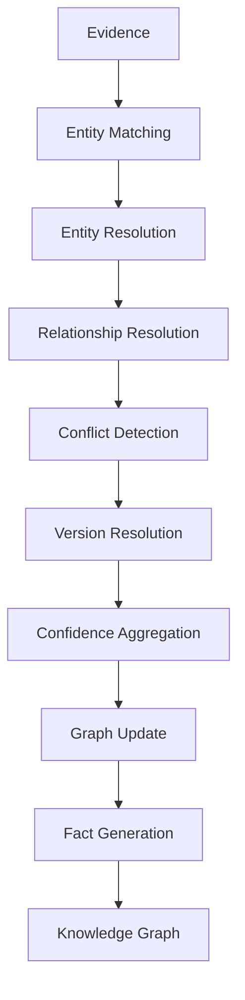
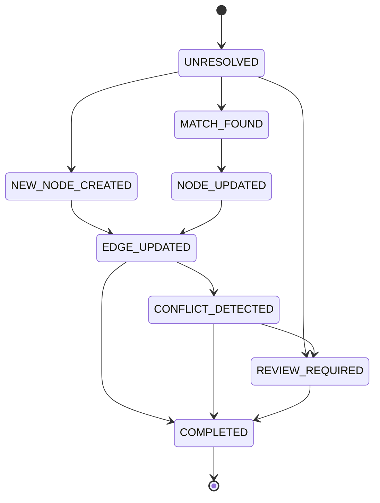

# NeuroVerify: Multimodal Neuro-Symbolic Misinformation Verification Platform
## Graph Resolution & Update Engine — Conceptual Architecture Specification, Version 1.0

| | |
|---|---|
| **Document status** | Draft for review |
| **Location** | `docs/architecture/GRAPH_RESOLUTION_ENGINE_SPEC_v1.0.md` |
| **Builds on (frozen, unmodified)** | Phase 1 — Data Engineering Foundation; Phase 2 — `ARCHITECTURE_SPEC.md` v1.0 and `ADDENDUM_v1.1.md`; Phase 3 — `KNOWLEDGE_REPRESENTATION_SPEC_v1.0.md`; Phase 4.1 — `KNOWLEDGE_GRAPH_SPEC_v1.0.md`; Phase 4.2 — `EVIDENCE_STORE_SPEC_v1.0.md` |
| **Nature of this document** | Conceptual architecture only. It defines how evidence is transformed into persistent knowledge while preserving provenance, consistency, auditability, and graph integrity — not the algorithms, models, or matching techniques that perform that transformation |
| **Explicitly excluded** | Python, SQL, Cypher, Neo4j, graph databases, vector databases, embeddings, similarity algorithms, LLMs, machine learning models, prompt engineering, infrastructure, APIs, cloud providers, performance benchmarks, implementation details, algorithms, mathematical formulas |
| **Audience** | Engineers who will implement the Graph Resolution & Update Engine in the next phase; every subsystem team whose objects this engine reads or writes |

This document does not redefine any canonical object. `KnowledgeNode`,
`KnowledgeEdge`, `FactRecord`, `EvidenceRecord`, `EntityRecord`, and
`RelationRecord` retain exactly the field definitions, validation rules,
and lifecycle behavior fixed in `KNOWLEDGE_REPRESENTATION_SPEC_v1.0.md`
§1. It does not redefine the resolution *philosophy* Phase 4.1 already
established (§5, §6, §7 of `KNOWLEDGE_GRAPH_SPEC_v1.0.md`). This
document's sole subject is the **engine architecture** — the subsystem,
its stages, its states, and its governance — that carries that
already-established philosophy out in practice.

---

## 1. Purpose

### 1.1 Why a Resolution Engine Exists

Phase 4.1 specified *what* the Knowledge Graph is and *how* it is
organized — nodes, edges, facts, taxonomy, and the philosophy governing
resolution and conflict (Phase 4.1 §2, §5, §6, §7). Phase 4.1 §5.3
explicitly named the stages a claim's contribution to the graph passes
through (entity extraction, resolution, relation extraction, edge
creation, fact generation) but described them as *pipeline stages*, not
as a subsystem with its own boundaries, states, governance, and
scalability model. Something in this architecture must be the
**accountable, singular mechanism** that actually performs that
transformation, every time, for every claim, consistently. That
mechanism is the Graph Resolution & Update Engine.

Without a dedicated engine occupying this role explicitly, resolution
logic would risk being duplicated or reimplemented inconsistently across
every module that happens to touch the graph — undermining the very
determinism, auditability, and integrity guarantees Phase 4.1 and Phase
4.2 depend on. This document exists to give that mechanism one name, one
set of boundaries, and one governance model.

### 1.2 Four Subsystems, Four Distinct Roles

| Subsystem | Role | What it holds or does |
|---|---|---|
| **Evidence Store** (Phase 4.2) | Evidentiary memory | Preserves raw, attributable source content — permanently, immutably (Phase 4.2 §9) |
| **Resolution Engine** (this document) | Transformation mechanism | Reads evidence and existing graph state; performs matching, resolution, conflict detection, and graph updates |
| **Knowledge Graph** (Phase 4.1) | Semantic memory | Holds the persistent, organized result of resolution — `KnowledgeNode`, `KnowledgeEdge`, `FactRecord` |
| **Verification Engine** (NLI Verification, Phase 2 §5.5) | Reasoning over knowledge | Determines a claim's stance against facts the graph already holds — reads the graph, never writes to it |

A fifth subsystem, the **Decision Engine** (Phase 2 Addendum §6), sits
further downstream still — it applies policy and thresholds to the
*output of verification and fusion*, not to the graph itself. The
Resolution Engine and the Decision Engine never interact directly; they
are separated by the entire verification and fusion stage (§7.6
elaborates the one indirect relationship that does exist, via conflict
metadata).

### 1.3 Why the Knowledge Graph Should Never Update Itself Directly

The Knowledge Graph, as specified in Phase 4.1, is a **passive data
structure** — a store of nodes, edges, and facts with defined objects
and relationships (Phase 4.1 §2), not an active process. It has no
mechanism of its own for deciding whether a new mention matches an
existing node, whether two edges conflict, or how confidence should be
recomputed when new evidence arrives. If every module that happened to
touch the graph could write to it independently, using its own ad hoc
resolution logic, three guarantees this platform depends on would break:

| Guarantee | Why direct, uncoordinated writes would break it |
|---|---|
| Determinism (§8.6) | Different callers resolving the same mention differently, at different times, would make the graph's state depend on write order rather than on the evidence itself |
| Auditability (§10) | A change to the graph would only be explainable if every possible writer's logic were separately documented and inspectable — multiplying, rather than centralizing, the audit surface |
| Referential and structural integrity (§8.7) | Concurrent, uncoordinated writers risk producing inconsistent aggregate state (Phase 4.1 §3.3's append-only fields) or violating the validation rules Phase 3 §6 already fixes |

The Resolution Engine exists specifically to be the **single governed
writer** to the Knowledge Graph. Every graph mutation, without exception,
passes through this engine's pipeline (§3) and is subject to its
governance model (§10). The Knowledge Graph remains exactly what Phase
4.1 specified: a structure that is read by many, but written to by
exactly one accountable mechanism.

### 1.4 Why Resolution Is a Separate Architectural Concern

Resolution — deciding whether a new mention refers to an existing entity,
whether a new relation confirms or conflicts with an existing edge, how
confidence should be recomputed — is inherently a **judgment-laden
transformation**, distinct in kind from both the passive storage it
writes to (the Knowledge Graph) and the truth-oriented reasoning that
happens downstream (Verification, Fusion, Decision). This is the same
neuro-symbolic separation principle that has organized every phase of
this platform (Phase 2 §0.2; Phase 4.1 §12.2; Phase 4.2 §9.9), applied
here to the transformation step specifically:

- If resolution logic were embedded inside the Knowledge Graph itself,
  the graph would no longer be a simple, inspectable data structure — it
  would carry hidden procedural behavior, undermining Phase 4.1's
  conceptual simplicity.
- If resolution logic were embedded inside Verification or Fusion, those
  modules would be reasoning about claim truth using a graph that could
  simultaneously be changing underneath them, conflating "what does the
  graph currently say" with "what is the graph currently deciding to
  say" — two different concerns that must never be entangled.

Isolating resolution into its own engine, with its own pipeline (§3),
states (§4), and governance (§10), keeps every other subsystem in this
architecture free to treat the Knowledge Graph as what Phase 4.1 always
intended it to be: a stable, queryable structure, updated through one
accountable process.

---

## 2. Architectural Role

### 2.1 Position in the Platform

```
   Evidence Store (Phase 4.2)
          │
          │  governed, immutable evidentiary content
          ▼
   Resolution Engine (this document)
          │
          │  KnowledgeNode / KnowledgeEdge / FactRecord — created, updated
          ▼
   Knowledge Graph (Phase 4.1)
          │
          │  read-only queries — facts available for verification
          ▼
   Verification Engine (NLI Verification, Phase 2 §5.5)
          │
          │  VerificationResult
          ▼
   Fusion Intelligence → Decision Engine (Phase 2 §5.8, Addendum §6)
```

The Resolution Engine sits at exactly one position in this chain: between
governed evidence and persistent knowledge. It has no upstream dependency
beyond the Evidence Store and the Knowledge Graph's current state, and
its only downstream consumer, in the strict sense of "writes state that
subsystem reads," is the Knowledge Graph itself (§12 details the broader
consumption of its metadata outputs by other subsystems).

### 2.2 Responsibilities

| Responsibility | Description |
|---|---|
| Entity matching and resolution | Determine whether a mention (`EntityRecord`) refers to an existing `KnowledgeNode` or represents a new one (§5) |
| Relationship resolution | Determine whether a mention (`RelationRecord`) confirms an existing `KnowledgeEdge`, represents a genuine conflict, or represents a new relationship (§6) |
| Conflict detection | Identify when new information is in tension with existing graph state, and route that tension into preserved, coexisting structure rather than overwriting it (§7) |
| Graph update execution | Perform the actual, deterministic creation and append-only modification of `KnowledgeNode`, `KnowledgeEdge`, and `FactRecord` objects (§8) |
| Confidence aggregation | Recompute aggregate confidence fields as new supporting evidence accumulates (§9) |
| Resolution governance | Maintain the audit trail, human-review routing, and traceability that make every graph update explainable after the fact (§10) |

### 2.3 Inputs

| Input | Source |
|---|---|
| `EntityRecord`, `RelationRecord` | Produced during Claim Extraction / Linguistic Analysis and the early Knowledge Representation stage (Phase 2 §5.1, §5.4), per Phase 4.1 §5.3 |
| `EvidenceRecord`, `ArticleRecord` | The Evidence Store (Phase 4.2), per its interface contract (Phase 4.2 §11.2) |
| Existing `KnowledgeNode`, `KnowledgeEdge` | The Knowledge Graph's current state, read by the engine to determine match/conflict outcomes |

### 2.4 Outputs

| Output | Destination |
|---|---|
| New or updated `KnowledgeNode`, `KnowledgeEdge` | Committed to the Knowledge Graph (Phase 4.1) |
| New `FactRecord` | Committed to the Knowledge Graph; consumed downstream by Verification (§12) |
| Resolution metadata, audit history, conflict metadata, version metadata | Consumed by governance, explainability, and review processes (§10, §12) |

### 2.5 Boundaries

The Resolution Engine does not retrieve evidence (that is Evidence
Retrieval and the Evidence Store, §1.2), does not reason about claim
truth (that is Verification, Fusion, and Decision), and does not persist
evidentiary content itself (that remains the Evidence Store's exclusive
responsibility, Phase 4.2 §9). Its boundary is precisely the
transformation step between the two — everything upstream of "here is
governed evidence" and downstream of "here is updated graph state" is
out of scope (§13 states this boundary exhaustively).

### 2.6 Lifecycle Participation

The Resolution Engine is invoked as the operative mechanism behind
Stages 3–9 of Phase 4.1 §5.3's Knowledge Lifecycle (Entity Resolution
through Graph Update) — this document does not introduce a competing
lifecycle; it specifies the engine that executes the lifecycle Phase 4.1
already named. Within the broader platform pipeline (Phase 2 §1.1,
orchestrated by the Pipeline Orchestrator per Phase 2 Addendum §1), the
Resolution Engine is invoked once per claim's Knowledge Representation
step, exactly as Phase 2 §5.4 and Phase 2 Addendum §1.7's module
interaction table already specify for that module — this document gives
that invocation its full internal architecture.

### 2.7 Architectural Dependencies

| Dependency | Nature |
|---|---|
| Evidence Store (Phase 4.2) | Read dependency — the engine consumes governed evidence but never writes to it |
| Knowledge Graph (Phase 4.1) | Read-and-write dependency — the engine is the graph's sole writer (§1.3) and also reads current state to perform resolution |
| Pipeline Orchestrator (Phase 2 Addendum §1) | Invocation dependency — the engine is invoked, scheduled, and retried by the Orchestrator like any other module, with the same failure-handling contract (Phase 2 Addendum §1.6) |
| Event Logger (Phase 2 Addendum §2) | Observability dependency — every resolution decision emits structured log events, feeding the platform's shared observability subsystem rather than a separate logging mechanism (mirroring Phase 4.2 §9.3's identical choice for evidence governance) |

---

## 3. Resolution Pipeline

### 3.1 Pipeline Diagram



### 3.2 Stage-by-Stage Explanation

**Stage 1 — Evidence.** The pipeline begins with governed
`EvidenceRecord`/`ArticleRecord` content (from the Evidence Store, Phase
4.2) already associated with `EntityRecord`/`RelationRecord` mentions
extracted upstream (Phase 2 §5.1, §5.4).

**Stage 2 — Entity Matching.** Candidate `KnowledgeNode`s that might
correspond to each `EntityRecord` mention are identified, using the
signal types Phase 4.1 §6.2 already establishes (alias match,
abbreviation match, external identifier match, contextual similarity,
type consistency) — this stage produces *candidates*, not a decision.

**Stage 3 — Entity Resolution.** Candidates from Stage 2 are evaluated
and one of the three outcomes Phase 4.1 §6.3 already defines is reached:
confident merge, confident new node, or ambiguous (routed to §5.6/§10.2's
human review path). This stage is where `EntityRecord.canonical_node_id`
is populated or a new `KnowledgeNode` is created.

**Stage 4 — Relationship Resolution.** With entities resolved, candidate
`KnowledgeEdge`s are identified and evaluated using the same
match/merge/new-or-conflict logic, applied to relationships (§6) —
this stage depends structurally on Stage 3's output, since a relationship
cannot be resolved before its subject and object entities are (§3.3).

**Stage 5 — Conflict Detection.** Newly resolved relationships are
checked against existing graph state for tension — same
subject/predicate, different object; or evidence directly contradicting
an existing edge or fact (§7). This stage determines whether Stage 8
appends corroborating support to existing structure or creates
independently coexisting, conflicting structure (Phase 4.1 §7.2).

**Stage 6 — Version Resolution.** Where the new information represents a
temporal change rather than a conflict (a role that has ended, a
relationship superseded by a later one), this stage determines the
temporal bounds to apply — closing a prior edge's validity window and
opening a new one (Phase 4.1 §9.2) — rather than treating supersession as
a conflict requiring dual preservation in the same sense §7 addresses.

**Stage 7 — Confidence Aggregation.** Aggregate confidence fields
(`KnowledgeEdge.confidence`, and transitively `FactRecord.trust_tier`)
are recomputed to reflect the newly incorporated evidence, per the
philosophy in §9 — this stage runs after conflict and version resolution
because confidence recomputation depends on knowing whether the new
evidence corroborates, conflicts with, or supersedes existing structure.

**Stage 8 — Graph Update.** The actual, deterministic creation and
append-only modification of `KnowledgeNode`/`KnowledgeEdge` objects is
executed (§8) — this is the only stage that performs a write to the
Knowledge Graph's persistent state.

**Stage 9 — Fact Generation.** One or more `FactRecord`s are synthesized
from the now-updated graph structure, exactly as Phase 4.1 §5.3's Stage 8
already specifies, ready to be handed to Verification.

**Terminus — Knowledge Graph.** The pipeline's output is committed,
durable graph state, available for query by every downstream subsystem
per Phase 4.1's interface contract (Phase 4.1 §11).

### 3.3 Why Ordering Matters

The pipeline's ordering is not incidental — each stage structurally
depends on the output of the one before it, and reordering would produce
incoherent or non-deterministic results:

| Ordering constraint | Why it must hold |
|---|---|
| Entity Matching/Resolution before Relationship Resolution | A relationship's subject and object must be resolved entities before the relationship itself can be matched against existing edges — resolving relationships against un-resolved entity mentions would make edge matching ambiguous in a way that has nothing to do with genuine relationship ambiguity |
| Conflict Detection before Confidence Aggregation | Confidence recomputation must know whether new evidence corroborates or conflicts with existing structure — aggregating confidence before knowing this would risk conflating corroboration-driven confidence increases with conflict-driven uncertainty |
| Version Resolution before Graph Update | Whether a temporal supersession applies must be settled before the update is executed, since it determines whether the update closes a prior edge's validity window as part of the same atomic change |
| Graph Update before Fact Generation | `FactRecord`s derived `from_knowledge_edge` (Phase 3 §1.8) must reference an edge that already exists in its final, updated form — generating facts before the update completes would risk facts referencing transient, not-yet-committed state |

This fixed ordering is itself part of what makes the engine's behavior
deterministic (§8.6) — the same evidence, presented to the engine in the
same graph state, always passes through the same sequence of decisions in
the same order.

---

## 4. Resolution States

### 4.1 Purpose of Naming States

Every mention or relation that enters the pipeline (§3) passes through a
sequence of conceptual states. Naming these states explicitly — rather
than treating resolution as an opaque black box between input and output
— is what makes an in-progress or completed resolution attempt
individually inspectable: at any point, "what state is this mention in"
is a well-defined, answerable question. This section defines the
conceptual state vocabulary; it is not a formal state-machine
implementation specification (per this document's implementation-agnostic
mandate).

### 4.2 State Diagram



### 4.3 State Definitions

| State | Meaning | Entered when |
|---|---|---|
| `UNRESOLVED` | A mention has entered the pipeline but no match determination has been made | Stage 2 (Entity Matching) begins |
| `MATCH_FOUND` | A confident correspondence to an existing `KnowledgeNode`/`KnowledgeEdge` has been identified | Stage 3/4 concludes with a confident merge outcome (Phase 4.1 §6.3) |
| `NEW_NODE_CREATED` | No existing match was found and a new canonical entity has been established | Stage 3 concludes with a confident-new-node outcome |
| `NODE_UPDATED` | An existing `KnowledgeNode`'s aggregate fields (aliases, `mention_count`) have been appended to | Following a `MATCH_FOUND` entity outcome, once the append-only update (§8) is applied |
| `EDGE_UPDATED` | An existing `KnowledgeEdge`'s aggregate fields (`supporting_relation_record_ids`, `confidence`) have been appended to, or a new edge created | Stage 4/8, for relationship-level resolution |
| `CONFLICT_DETECTED` | New information is in tension with existing graph state | Stage 5, per §7's criteria |
| `REVIEW_REQUIRED` | Resolution confidence is insufficient for an automated determination, or a detected conflict/merge decision meets the threshold for human review | Reachable from `UNRESOLVED` (ambiguous entity match, Phase 4.1 §6.4) or from `CONFLICT_DETECTED` (high-stakes conflict, §7.5) |
| `COMPLETED` | The mention's contribution to the graph has been fully processed — either committed, or explicitly deferred to human review with that deferral itself recorded | Terminal state for every resolution attempt |

### 4.4 State Transitions

- `UNRESOLVED → MATCH_FOUND` or `UNRESOLVED → NEW_NODE_CREATED`: the two
  confident outcomes of entity resolution (§5).
- `UNRESOLVED → REVIEW_REQUIRED`: the ambiguous outcome (§5.6), bypassing
  automated determination entirely rather than forcing a low-confidence
  guess.
- `MATCH_FOUND → NODE_UPDATED`, `NEW_NODE_CREATED → EDGE_UPDATED`,
  `NODE_UPDATED → EDGE_UPDATED`: the pipeline's progression from
  entity-level to relationship-level resolution (§3.3's ordering
  constraint).
- `EDGE_UPDATED → CONFLICT_DETECTED` or `EDGE_UPDATED → COMPLETED`:
  whether Stage 5's conflict check found tension.
- `CONFLICT_DETECTED → REVIEW_REQUIRED` or `CONFLICT_DETECTED →
  COMPLETED`: not every detected conflict requires human review (§7.5
  distinguishes routine, structurally-preserved conflicts from
  high-stakes ones); every detected conflict is preserved either way.
- `REVIEW_REQUIRED → COMPLETED`: reached once human review (§10.2)
  concludes, whatever its outcome — `REVIEW_REQUIRED` is never a
  permanent dead end; it always eventually resolves to `COMPLETED`, with
  the review's outcome and rationale recorded as part of that
  completion.

### 4.5 State Meaning Is Retained, Not Discarded

Consistent with this platform's append-only philosophy (Phase 3 §0.3;
Phase 4.1 §3.3; Phase 4.2 §9.2), a mention's full state history — not
merely its final `COMPLETED` state — is retained as part of the
resolution audit trail (§10.4). "This mention passed through
`CONFLICT_DETECTED` before reaching `COMPLETED`" is itself meaningful,
auditable information, distinct from a mention that reached `COMPLETED`
directly.

### 4.6 Auditability Through States

Naming states explicitly is what allows §10's governance model to answer,
for any graph update, a precise question: *at which stage, and in which
state, was this decision made, and what alternative states were
available but not taken?* This is a stronger auditability guarantee than
simply logging a final outcome — it preserves the shape of the decision
process itself, not just its result.

---

## 5. Entity Resolution Strategy

### 5.1 Relationship to Phase 4.1's Established Philosophy

Phase 4.1 §6 already fixes the philosophy of entity resolution: the
signal types considered (§6.2), the three possible outcomes (§6.3), the
handling of ambiguity (§6.4), and the principle of incremental refinement
(§6.5). This section does not restate or alter that philosophy — it
specifies the **engine-level architecture** that carries it out: how the
Resolution Engine is structured to apply that philosophy consistently,
stage by stage, as part of the pipeline in §3.

### 5.2 Canonical Identity

The Resolution Engine's central responsibility at the entity level is
maintaining exactly one `KnowledgeNode` per real-world entity (Phase 4.1
§1.4's disambiguation benefit depends entirely on this being upheld
consistently). Canonical identity is never asserted unilaterally by a
single resolution attempt — it is the accumulated result of every
resolution attempt that has ever touched a given node, which is why
Phase 4.1 §6.5's incremental-refinement principle is architecturally
central, not a minor detail: the engine treats each new mention as an
opportunity to strengthen (or, rarely, question, §5.5) an existing
canonical identity, never as a one-shot classification exercise.

### 5.3 Aliases, Abbreviations, and Alternative Spellings

These are treated architecturally as **the same kind of signal at
different levels of transformation** — an alias is a full alternate name,
an abbreviation is a compressed form, an alternative spelling is a
surface-level variant — all of which the engine's matching stage (§3.2,
Stage 2) considers as candidate-generating signals per Phase 4.1 §6.2,
and all of which, on confident resolution, are accumulated into the
target node's `aliases` field (Phase 4.1 §1.6) through the same
append-only mechanism (§8.3). The engine does not architecturally
distinguish these three kinds of surface variation in how they are
processed — the distinction matters for matching signal design (Phase
4.1 §6.2, explicitly out of this document's scope), not for the engine's
own architecture.

### 5.4 Ambiguous and Duplicate Entities

**Ambiguous entities** (Phase 4.1 §6.4) are mentions where the available
signals do not converge confidently on one candidate. The engine's
architecture handles this not by forcing a decision, but by routing the
mention to the `REVIEW_REQUIRED` state (§4.3) — ambiguity is a legitimate
resolution outcome the engine is structurally designed to represent, not
a failure mode to be suppressed.

**Duplicate entities** are the outcome the engine's matching-and-merge
process (§5.2) exists specifically to prevent — but duplicates can still
arise (e.g. two nodes created independently before enough corroborating
evidence existed to link them). Detecting and correcting an
already-created duplication is addressed by the merge philosophy below
(§5.5), applied retroactively rather than only at initial resolution
time.

### 5.5 Merge Philosophy

When the engine determines — at initial resolution or upon later review
— that two existing `KnowledgeNode`s in fact represent the same
real-world entity, a merge is performed. Architecturally, a merge is:

- **Additive, never destructive.** The surviving node's `aliases` and
  supporting-mention references absorb the merged node's, following the
  same append-only accumulation already governing ordinary resolution
  (§8.3) — no information the merged-away node held is discarded.
- **Recorded as an explicit governance event** (§10.4), not silently
  applied — a merge changes what "this identifier means" for every
  existing reference to the merged-away node, which is consequential
  enough to require the same auditability as any other high-stakes
  resolution decision (§5.6).
- **Never automatic for high-stakes cases.** Consistent with Phase 4.1
  §6.4, a merge affecting heavily-referenced or long-established nodes is
  routed through human review (§10.2) rather than performed purely on
  automated signal convergence, regardless of how confident the matching
  signals appear.

### 5.6 Split Philosophy

The inverse operation — determined, on review, that a single
`KnowledgeNode` actually conflates two distinct real-world entities — is
architecturally supported as the rare, governed exception it is. A split:

- Is **never performed automatically.** Unlike ordinary resolution, which
  the engine performs continuously as part of its regular pipeline, a
  split is exclusively a human-review-initiated operation (§10.2) — the
  engine's automated matching logic is designed to prevent
  under-resolution and over-resolution at the point of initial
  contact, but correcting a standing conflation after the fact is a
  judgment call this architecture reserves for accountable human
  decision, never automated inference.
- **Preserves history rather than rewriting it.** Following this
  platform's consistent preserve-don't-overwrite principle (Phase 4.1
  §7.1, §9.5; Phase 4.2 §8.3), a split does not erase the record that a
  single node once existed — it establishes two new canonical identities
  going forward, with the prior conflated node's history remaining
  inspectable as part of the audit trail (§10.4), and every mention
  previously resolved to the old node re-attributed to whichever new
  node it actually belongs to, with that re-attribution itself recorded
  as a governance event.

### 5.7 Incremental Refinement

Identical in principle to Phase 4.1 §6.5: every resolution attempt, not
just the first, is an opportunity to strengthen a node's canonical
identity. The engine's architecture treats this as continuous, ongoing
behavior rather than a one-time classification step — which is precisely
why the engine, not the Knowledge Graph itself, must be the mechanism
performing it: refinement requires an active process evaluating new
mentions against accumulated history, not a passive structure that merely
holds whatever it was last told.

### 5.8 Human Review

Human review is the architecture's designated escape valve for exactly
three situations at the entity level: initial ambiguity (§5.4), high-stakes
merges (§5.5), and any split (§5.6). In every case, the engine's role is
to detect that the situation warrants review and route it accordingly
(entering `REVIEW_REQUIRED`, §4.3) — not to perform the review itself.
This mirrors the same human-validation-gate discipline already
established for the Feedback Service (Phase 2 Addendum §3.4) and Phase
4.1's own entity-resolution philosophy (Phase 4.1 §6.4): the engine
proposes and detects; accountable humans decide, wherever the stakes or
ambiguity of a decision exceed the engine's automated confidence.

---

## 6. Relationship Resolution Strategy

### 6.1 Relationship to Phase 4.1's Established Philosophy

Phase 4.1 §4 (Relationship Taxonomy) and §7 (Conflict Representation)
already establish what a `KnowledgeEdge` means, how it carries
provenance and temporal validity, and how conflicting edges coexist. As
with §5, this section specifies the engine architecture that carries
that philosophy out — how relationship resolution is structured as an
ongoing, governed process — not a new relationship model.

### 6.2 Relationship Creation

A new `KnowledgeEdge` is created when a resolved `RelationRecord` (Stage
4, §3.2) has no existing edge to match against — same subject node, same
predicate, and (for entity-typed objects) same object node, none of
which already exists. Creation is the terminal case of the matching
process, not the default: the engine's architecture always attempts
reuse (§6.3) before creation, to avoid the same edge-fragmentation
problem Phase 4.1 §1.4 identifies for entities.

### 6.3 Relationship Reuse

When a resolved `RelationRecord` matches an existing edge exactly (same
subject, predicate, and object), the engine reuses that edge rather than
creating a duplicate — appending the new `RelationRecord`'s id to
`supporting_relation_record_ids` (Phase 4.1 §1.7), which is also the
mechanism by which cross-claim corroboration (Phase 4.1 §1.4, §6.7 of
the Evidence Store spec) is realized architecturally: reuse *is* the
corroboration-accumulation operation.

### 6.4 Relationship Refinement and Confidence Refinement

Refinement is what happens to an edge's aggregate fields
(`confidence`, and via `mention_count`-equivalent accumulation) every
time reuse (§6.3) occurs — the engine recomputes these fields as part of
Stage 7 (Confidence Aggregation, §3.2), following the philosophy in §9.
Refinement is continuous and additive; it is never a wholesale
recalculation that discards the edge's prior accumulated state, only an
incorporation of the newly available support.

### 6.5 Temporal and Historical Relationships

Where a new `RelationRecord` represents not corroboration or conflict but
a **succession** — a role that has ended, a relationship that has been
superseded — the engine's Version Resolution stage (§3.2, Stage 6)
applies Phase 4.1 §9.2's `valid_from`/`valid_until` model: the prior
edge's `valid_until` is set, and a new edge is created for the
current/succeeding relationship, with both permanently retained (Phase
4.1 §9.3). The engine's architectural responsibility here is
**distinguishing succession from conflict** — the two are structurally
different (§7 addresses conflict specifically) even though both involve
"new information differing from existing structure."

### 6.6 Relationship Provenance

Every relationship-level resolution outcome (reuse, creation, refinement,
retirement) is recorded with the same provenance discipline Phase 4.1 §8
already establishes for the graph generally — every `KnowledgeEdge`
mutation is traceable to the specific `RelationRecord`(s) and, further
back, the `EvidenceRecord`/`ArticleRecord` (Phase 4.2) that justified it.
The Resolution Engine's contribution is ensuring this provenance chain is
populated correctly and completely at the moment of every update (§8.7),
not that the chain exists at all (which Phase 4.1's object schema already
guarantees structurally).

### 6.7 Relationship Retirement

"Retirement" names the case where an edge's `valid_until` is set with no
succeeding edge created — the relationship simply ended, rather than
being replaced by a new one (e.g. an organization dissolved, a product
was discontinued). Architecturally identical to succession (§6.5) except
for the absence of a new edge at its conclusion; the retired edge is
never deleted, only marked as no longer current, per Phase 4.1 §9.3's
current-vs-historical model.

### 6.8 Relationship Evolution

"Evolution" names the accumulated pattern of refinement, succession, and
retirement events that a single subject/predicate pairing accrues over
the platform's operating lifetime — the full historical record Phase 4.1
§9.5 argues is essential to retain. The engine does not treat evolution
as a special case requiring distinct handling; it is simply what emerges
from consistently applying §6.3–§6.7's operations over time, which is
itself the architectural point: the engine's job is to apply the same
disciplined operations every time, and evolution is the natural,
emergent result of doing so consistently.

---

## 7. Conflict Resolution Architecture

### 7.1 Relationship to Phase 4.1's Established Philosophy

Phase 4.1 §7 already establishes the platform's conflict philosophy in
full: conflicts are preserved, never overwritten (§7.1), both sides of a
conflict are stored (§7.3), and truth-adjudication belongs exclusively to
downstream reasoning modules (§7.4). This section specifies the engine
architecture that **detects** conflicts and **executes** their
structurally-preserved representation — it introduces no new philosophy,
only the mechanism that carries Phase 4.1 §7's philosophy out reliably,
every time.

### 7.2 Conflict Detection

Detection occurs at Stage 5 of the pipeline (§3.2) and applies uniformly
across three levels:

| Level | What is checked |
|---|---|
| Conflicting facts | A new `FactRecord` candidate whose subject/predicate matches an existing `FactRecord` but whose object differs |
| Conflicting relationships | A new `RelationRecord` whose subject/predicate matches an existing `KnowledgeEdge` but whose object differs (Phase 4.1 §7.2) |
| Conflicting evidence | Two `EvidenceRecord`/`ArticleRecord` sources (Phase 4.2) that assert incompatible claims about the same subject/predicate, surfaced via the `contradicts`-typed edge Phase 4.1 §4.5 already defines |

Detection is a **comparison operation against existing graph state**,
performed by the engine as a normal part of every resolution attempt —
it is not a separate audit process run periodically; every single
relationship resolution (§6) includes a conflict check as a matter of
course.

### 7.3 Conflict Propagation

Once detected, a conflict is not resolved locally and silently — it is
**propagated** as explicit, structured metadata through the remainder of
the pipeline (§3.2, Stages 5 onward) and into the graph update itself
(§8): the resulting `KnowledgeEdge`(s) or `FactRecord`(s) carry
`conflict_detected`-equivalent status (mirroring the pattern
`FusionResult.conflict_detected` already establishes at the fusion layer,
Phase 3 §1.11), and this status is itself recorded in the audit trail
(§10.4) so that the conflict's existence is visible to every downstream
consumer, not just resolvable by inspecting graph structure directly.

### 7.4 Conflict Preservation

Per Phase 4.1 §7.1–§7.3, the engine's response to a detected conflict is
always to preserve both sides as independently addressable, fully
provenanced structure — never to select a winner, average confidences
together, or discard the less-corroborated side. This is enforced
architecturally by the engine never having a code path that deletes or
overwrites an existing `KnowledgeEdge`/`FactRecord` in response to
conflicting new information — the only operations available to the
engine when a conflict is detected are: create new, independently
coexisting structure, or (for high-stakes conflicts, §7.5) route to
human review before doing so.

### 7.5 When Conflicts Require Human Review

Not every detected conflict requires human review before being committed
— most are preserved automatically, exactly as Phase 4.1 §7.3 describes,
since preservation itself requires no adjudication. Human review (routing
to `REVIEW_REQUIRED`, §4.3) is reserved for conflicts meeting criteria
such as:

- The conflict involves a node or edge with unusually high
  `mention_count`/corroboration (Phase 4.1 §1.6), where an error in
  automated handling would have outsized downstream impact.
- The conflicting sources are both high-trust-tier (Phase 4.2 §6),
  making the disagreement itself unusually significant rather than an
  expected low-trust-source discrepancy.
- The conflict pattern is novel or does not cleanly fit the structural
  categories Phase 4.1 §7.2 already anticipates.

This mirrors the same review-threshold philosophy already established
for entity merges (§5.5) and Phase 4.1 §6.4's ambiguity handling —
routine cases are handled by consistent, deterministic engine behavior;
unusual or high-stakes cases are escalated to accountable human judgment.

### 7.6 Multiple Viewpoints

Where a conflict reflects not a factual discrepancy but genuinely
differing viewpoints reported by different sources (e.g. differing
characterizations of the same event by sources with different
editorial perspectives), the engine's architecture treats this
identically to any other conflict (§7.2–§7.4) — it does not attempt to
distinguish "factual disagreement" from "viewpoint disagreement"
structurally, since that distinction is itself an interpretive judgment
belonging to downstream reasoning (§7.7), not to the engine's mechanical
detection and preservation role.

### 7.7 Why Conflicts Should Never Overwrite Knowledge

Restating and reinforcing Phase 4.1 §7.3's rationale specifically at the
engine level: an engine that resolved conflicts by overwriting would be
making a truth judgment inside the transformation layer — precisely the
responsibility this document's §1.4 and Phase 2 §0.2 reserve for
downstream reasoning modules. An overwriting engine would also be
**irreversible in a way this architecture cannot tolerate**: once
overwritten, the losing side of a conflict would no longer be available
for a future re-evaluation (e.g. if new evidence later vindicates the
initially-less-corroborated side) — violating this platform's permanent-
history principle (§4.5, Phase 4.1 §9.5) at the moment it would matter
most.

### 7.8 Relationship With the Decision Engine

The Resolution Engine and the Decision Engine (Phase 2 Addendum §6) never
interact directly (§1.2) — there is no data path from this engine to that
one. The connection is indirect and mediated by the full verification and
fusion pipeline: a conflict this engine detects and preserves in the
graph becomes visible to NLI Verification as `stance = conflicting`
(Phase 3 §1.9) when that conflicting structure is retrieved as evidence
for a claim, which in turn becomes visible to Fusion Intelligence's
`conflict_detected` field (Phase 3 §1.11) and, ultimately, to the
Decision Engine's conflict-resolution policy layer (Phase 2 Addendum
§6.3, §6.6). The Resolution Engine's conflict metadata (§12) is what
makes this entire downstream chain possible — it does not participate in
the chain's actual truth-adjudication at any point.

---

## 8. Graph Update Strategy

### 8.1 Append-Only Philosophy

Every graph update this engine performs is additive. This is not a
stylistic preference — it is the same structural discipline Phase 3
§0.3, Phase 4.1 §3.3, and Phase 4.2 §9.2 establish platform-wide, applied
here as the Resolution Engine's core operating constraint: the engine
has no operation in its architecture that deletes or destructively
modifies an existing `KnowledgeNode`, `KnowledgeEdge`, or `FactRecord`.
Every apparent "change" is realized as either an append to an existing
aggregate field or the creation of new, independently addressable
structure (§7.4, §6.5).

### 8.2 Aggregate Updates

Aggregate fields — `KnowledgeNode.mention_count`, `KnowledgeNode.aliases`,
`KnowledgeEdge.supporting_relation_record_ids`,
`KnowledgeEdge.confidence` — are the specific, narrow fields Phase 4.1
§3.3 permits to change after object creation. The Resolution Engine is
the **only** subsystem architecturally permitted to perform these
updates, and it performs them exclusively through Stage 8 of the pipeline
(§3.2), never as a side effect of any other operation.

### 8.3 `KnowledgeNode` Updates

A `KnowledgeNode` update, performed by this engine, can only ever: add a
new alias, increment `mention_count`, or update `last_updated_at` (Phase
4.1 §1.6). No other field of an existing `KnowledgeNode` is ever modified
by ordinary resolution — `canonical_name` and `node_type` are treated as
stable once established, changeable only through the governed merge/split
processes (§5.5, §5.6), which are themselves explicit governance events
distinct from ordinary Stage 8 updates.

### 8.4 `KnowledgeEdge` Updates

A `KnowledgeEdge` update can only ever: append to
`supporting_relation_record_ids`, recompute `confidence` (§9), or set
`valid_until` (as part of version resolution, §6.5, §6.7). A
`KnowledgeEdge`'s `subject_node_id`, `predicate`, and
`object_node_id`/`object_literal` are immutable once created — any
apparent change to these is, by architectural definition, a new edge
(§6.2), never a modification of an existing one.

### 8.5 `FactRecord` Updates

`FactRecord`s are not updated at all once created — per Phase 3 §1.8's
existing design, a `FactRecord` is a snapshot rendering of graph state at
the moment it was needed for verification. When underlying graph state
changes (a superseding edge, new corroborating evidence), the engine
generates a **new** `FactRecord` reflecting the updated state (Stage 9,
§3.2) rather than mutating the prior one — consistent with every other
object in this platform's write-once discipline (Phase 3 §0.3).

### 8.6 Statistics and Timestamp Updates

`mention_count`, `last_updated_at`, and equivalent bookkeeping fields are
updated as a direct, deterministic consequence of every Stage 8 write —
never independently or on a separate schedule. This determinism is
architecturally important: given the same sequence of resolution
decisions, these statistics are always fully reconstructable, which is
part of what makes the engine's behavior auditable (§10) and
reproducible (§10.5).

### 8.7 Graph Consistency and Referential Integrity

Every update the engine performs must leave the graph in a state that
satisfies Phase 3 §6.6's cross-object consistency rules — no update is
partially applied. Concretely, this means: if a `KnowledgeEdge` update
requires a corresponding `FactRecord` regeneration, both occur together,
or neither does — the engine's architecture treats each pipeline
invocation's full set of graph writes (§3.2, Stage 8–9) as a single
consistency boundary, never leaving the graph in a state where an edge
exists but its dependent facts do not, or vice versa.

### 8.8 Why Updates Must Remain Deterministic

Determinism — the same evidence, applied to the same graph state,
producing the same result every time — is what makes every other
guarantee in this document possible: without it, auditability (§10)
could only explain *that* an update happened, not *why it was the
correct update to make given the inputs*; reproducibility (§10.5) would
be impossible even in principle; and the Knowledge Graph's claim to be a
stable, trustworthy structure (Phase 4.1 §1.6) would be undermined by
the possibility that identical circumstances could have produced
different graph states depending on incidental factors like processing
order or timing. Determinism is this document's single most
load-bearing architectural commitment, referenced throughout §3–§10 as
the property every other design decision protects.

---

## 9. Confidence Aggregation

### 9.1 Philosophy, Not Formula

Consistent with this document's constraints and with Phase 4.2 §6.1's
identical stance on evidence trust, confidence aggregation is specified
here purely as **philosophy** — what considerations govern how
confidence should evolve as evidence accumulates — never as a formula,
weighting scheme, or algorithm. The actual computation is next-phase
implementation work; this section constrains what that computation must
respect, conceptually.

### 9.2 Evidence Accumulation

As more `RelationRecord`s corroborate an existing `KnowledgeEdge` (§6.3),
the edge's confidence is expected to reflect that accumulated support —
more independent corroboration should be capable of increasing
confidence, never decreasing it purely by virtue of accumulating more
agreeing evidence. This is the direct architectural consequence of
Phase 4.1 §1.4's cross-claim corroboration principle: accumulation is
only valuable if it is actually reflected in the graph's confidence
state over time.

### 9.3 Corroboration vs. Repetition

Mirroring Phase 4.2 §7.4's syndication distinction precisely: the engine's
confidence-aggregation philosophy must distinguish **independent**
corroboration (distinct sources, arriving at the same relationship
independently) from **repetition** (the same underlying source
encountered multiple times, or syndicated copies of one original, per
Phase 4.2 §7.4). Only the former should be capable of meaningfully
increasing confidence; the latter is already handled upstream by the
Evidence Store's deduplication and Evidence Relationship linking (Phase
4.2 §2.6, §7), which is precisely what allows the engine to trust that
what reaches it as "another corroborating source" is genuinely
independent rather than a duplicate presented differently.

### 9.4 Trust Propagation

An edge's or fact's confidence is never considered independently of the
trust characteristics of the evidence supporting it (Phase 4.2 §6).
Trust propagates from `EvidenceRecord.source_trust_tier`, through
`RelationRecord`, into `KnowledgeEdge.confidence`, and finally into
`FactRecord.trust_tier` — the engine's responsibility at each stage of
this propagation is to ensure the linkage is faithfully carried forward
(§6.6), not to determine the trust values themselves, which originate
from the Evidence Store's governance process (Phase 4.2 §6).

### 9.5 Confidence Refinement

Refinement — the recomputation Stage 7 (§3.2) performs on every
resolution attempt — is treated as continuous and cumulative, never a
one-time assessment finalized at creation. This directly extends Phase
4.1 §6.5's incremental-refinement principle from entity identity to
confidence specifically: a `KnowledgeEdge`'s confidence one year after
creation reflects everything corroborating or refining it has
accumulated in that year, not merely its state at creation.

### 9.6 Confidence Inheritance

`FactRecord.trust_tier` inherits from the minimum tier across supporting
evidence — already fixed as a design decision in Phase 3 §1.8 and
explained philosophically in Phase 4.2 §6.7. This document's contribution
is confirming that the Resolution Engine, as the mechanism generating
`FactRecord`s (Stage 9, §3.2), is the point at which this inheritance
rule is actually applied — the engine does not introduce a different or
competing inheritance philosophy at the graph-update layer.

### 9.7 Historical Refinement

Confidence assigned to now-historical (`valid_until`-set) edges is not
retroactively altered once an edge transitions to historical status
(§6.5, §6.7) — a historical edge's confidence reflects the corroboration
it had accumulated up to the point it stopped being current, permanently.
This is what makes a historical edge's confidence itself a meaningful,
stable piece of the permanent record (Phase 4.1 §9.5), rather than a
value that continues silently drifting after the relationship it
describes has ended.

### 9.8 Uncertainty

Where accumulated evidence remains sparse, low-trust, or conflicting
(§7), the engine's confidence-aggregation philosophy requires honest
representation of that uncertainty rather than forcing convergence toward
false confidence — directly consistent with this platform's
honesty-under-uncertainty principle, established at the verdict level in
Phase 2 §6.5 and extended here to the knowledge layer: a
sparsely-supported `KnowledgeEdge` should present as
sparsely-supported, not be artificially inflated by the aggregation
process to appear more established than the evidence warrants.

---

## 10. Resolution Governance

### 10.1 Human Oversight

Human oversight is woven throughout this document's operational sections
(§5.5's merge review, §5.6's split requirement, §5.8's ambiguity routing,
§7.5's conflict-review criteria) rather than treated as a separate,
add-on process. This section consolidates the governance model those
sections each individually invoke: every point at which the engine
routes a decision to `REVIEW_REQUIRED` (§4.3) feeds one consistent human
review process, mirroring the human-validation-gate discipline already
established for the Feedback Service (Phase 2 Addendum §3.4) and applied
consistently across Phase 4.1 (§6.4) and Phase 4.2 (§6.8).

### 10.2 The Review Process

| Step | Description |
|---|---|
| Detection | The engine identifies a situation meeting a review criterion (ambiguity, high-stakes merge, split candidate, high-stakes conflict) and enters `REVIEW_REQUIRED` |
| Queuing | The pending resolution, with its full context (candidate matches, conflicting structure, or split rationale), is queued for human attention, mirroring the Feedback Service's review-queue pattern (Phase 2 Addendum §3.4) |
| Human determination | A reviewer examines the queued case and reaches a decision — which candidate is correct, whether a merge/split should proceed, how a conflict should be represented |
| Completion | The engine applies the reviewer's determination through its ordinary, deterministic update mechanisms (§8) — human review changes *which* resolution is applied, never *how* it is applied structurally |

### 10.3 Rollback Philosophy

Because every update is append-only (§8.1) and every state transition is
retained (§4.5), "rollback" in this architecture does not mean deleting
or reverting a prior update — it means **applying a new, corrective
update that supersedes the erroneous one**, with both the original and
the correction permanently visible in the audit trail. This is the same
philosophy §5.6 (split) already applies at the entity level, generalized:
correcting a mistake is itself an append, never an erasure, because
erasure would destroy the very audit trail that allows the mistake to be
identified and understood in the first place.

### 10.4 Governance Logs and Resolution Traceability

Every stage of the pipeline (§3), every state transition (§4), and every
governance event (merge, split, conflict routing, human review outcome)
is recorded as a structured event, consistent with the platform's shared
Event Logger discipline (Phase 2 Addendum §2.4) — the Resolution Engine
does not maintain a separate audit mechanism, it feeds the same
centralized observability subsystem every other module feeds, ensuring
resolution-specific audit trails are queryable through the same tooling
as the rest of the platform. This log, combined with the provenance
chains Phase 4.1 §8.2 already establishes, is what makes "why does the
graph currently assert this" answerable not just in terms of *what
evidence* supports it, but *what sequence of engine decisions* produced
it.

### 10.5 Deterministic Resolution and Reproducibility

Because the pipeline (§3) is ordered and deterministic (§8.8), and
because every decision is logged (§10.4) against a specific evidence
input and graph-state snapshot, a past resolution outcome is, in
principle, fully reconstructable — directly extending Phase 2 Addendum
§5.4's experiment-reproducibility framing and Phase 4.2 §5.5's evidence-
reproducibility framing to the resolution/graph-update layer
specifically. This is the third leg of a three-part reproducibility
guarantee this platform now provides end to end: reproducible evidence
(Phase 4.2), reproducible resolution (this document), and reproducible
pipeline configuration (Phase 2 Addendum §5).

### 10.6 Integrity

Integrity, at the resolution-governance level, means that the graph's
current state is always the correct, deterministic consequence of the
full sequence of governed updates applied to it — never the result of an
update bypassing the pipeline (§3), the state model (§4), or the
append-only discipline (§8). This is the governance-level restatement of
§1.3's architectural claim that the Resolution Engine is the graph's sole
writer — integrity is what that exclusivity is *for*.

### 10.7 Why Every Graph Update Should Always Be Explainable

This section's cumulative purpose: a graph update that cannot be
explained — that cannot answer "what evidence, resolved through what
pipeline stages, in what states, under what governance review if any,
produced this specific change" — is architecturally indistinguishable
from an ungoverned one, regardless of how sound the underlying matching
logic happens to be. Explainability at the resolution layer is not a
downstream Explainability Engine (Phase 2 §5.9) concern alone — it begins
here, at the moment knowledge is created or changed, because an
Explanation the Explainability Engine renders later can only be as
truthful as the resolution history it is built on.

---

## 11. Scalability Strategy

### 11.1 Growth Characteristics

The Resolution Engine's workload grows with two independent factors: the
rate of incoming claims (and thus evidence requiring resolution) and the
size of the existing Knowledge Graph each new resolution attempt must be
checked against (§3.2, Stage 2). Both are expected to grow substantially
as the platform matures, consistent with the growth profiles Phase 4.1
§10.1 and Phase 4.2 §10.1 already establish for the subsystems this
engine writes to and reads from.

### 11.2 Incremental Graph Updates

Because every resolution attempt (§3) only requires comparing new
mentions against existing graph state — never reprocessing the graph in
full — the engine's workload per claim is bounded by that claim's own
evidence, not by total graph size in any way that grows unfavorably;
this is the same incremental-processing property Phase 4.1 §10.2
establishes for the Knowledge Graph's resolution process generally,
restated here as the engine's own defining scalability characteristic.

### 11.3 Concurrent Resolution

Multiple claims' resolution attempts may occur concurrently, since each
claim's evidence is independent (Phase 2 §1.1's claim-level parallelism
already establishes this at the pipeline level). The architectural
requirement this places on the engine is that its single-writer role
(§1.3) must remain coherent even under concurrent invocation — i.e., the
engine's determinism guarantee (§8.8) must hold regardless of how many
resolution attempts are in flight simultaneously, a property the
engine's architecture must provide without this document prescribing the
specific mechanism (per its implementation-agnostic scope).

### 11.4 Large-Scale Graphs

As the Knowledge Graph grows into the millions-of-nodes/edges range
(Phase 4.1 §10.1), the engine's matching stage (§3.2, Stage 2) faces a
growing candidate space to search. This document does not prescribe how
that search remains efficient at scale (indexing, candidate
pre-filtering, and similar concerns are explicitly out of scope, §0) —
it establishes that the conceptual pipeline (§3) and state model (§4)
impose no structural obstacle to whatever efficient search mechanism a
future implementation phase adopts.

### 11.5 Streaming Evidence

The pipeline (§3) is specified as a per-claim, per-mention process, which
is naturally compatible with a future streaming ingestion model (evidence
arriving continuously rather than in discrete batches) without any
structural change — each unit of evidence entering the pipeline is
already treated independently, subject only to its ordering dependencies
on prior graph state (§3.3), which a streaming architecture must respect
regardless of how it schedules work.

### 11.6 Future Concerns (Conceptual Only)

| Concern | Conceptual compatibility requirement |
|---|---|
| Distributed resolution | Because the engine's single-writer role (§1.3) is a logical property, not a physical one, a future distributed implementation must preserve the *appearance* of a single, deterministic writer even if the underlying work is physically distributed — this document's contribution is fixing that requirement, not satisfying it |
| Graph partitioning | Should the Knowledge Graph itself be partitioned in a future implementation (Phase 4.1 §10.3 already anticipates this), the engine's matching stage (§3.2, Stage 2) must be able to search across partition boundaries — a requirement this document states without prescribing a partitioning scheme |
| Asynchronous resolution | The pipeline's stages (§3) are logically sequential per mention but do not require synchronous, blocking execution — a future implementation may process stages asynchronously as long as the ordering constraints in §3.3 are respected for any given mention's resolution |

### 11.7 What This Section Deliberately Does Not Address

Consistent with this document's implementation-agnostic scope, this
section names no specific technology, indexing structure, concurrency
mechanism, or distributed-systems approach. Its contribution is
confirming that the conceptual pipeline (§3), state model (§4), and
governance model (§10) impose no structural barrier to any reasonable
technical approach to the concerns above.

---

## 12. Interface Contracts

### 12.1 What the Resolution Engine Consumes

| Input | Source | Role |
|---|---|---|
| `EvidenceRecord` | Evidence Store (Phase 4.2), via Evidence Retrieval (Phase 2 §5.3) | Governed evidentiary content entering the pipeline (§3.2, Stage 1) |
| `ArticleRecord` | Evidence Store (Phase 4.2) | Source-document context behind `EvidenceRecord` |
| `EntityRecord` | Claim Extraction / Linguistic Analysis (Phase 2 §5.1) | Mentions requiring resolution (§3.2, Stages 2–3) |
| `RelationRecord` | Knowledge Representation's extraction step (Phase 2 §5.4) | Relations requiring resolution (§3.2, Stage 4) |
| `KnowledgeNode`, `KnowledgeEdge` | The Knowledge Graph's current state (Phase 4.1) | Read for matching and conflict detection (§3.2, Stages 2, 5) |
| Evidence Store | Phase 4.2 subsystem, as a whole | Provides the persistent evidentiary basis the engine reasons over |
| Knowledge Graph | Phase 4.1 subsystem, as a whole | Provides current state to resolve against; receives this engine's writes |

### 12.2 What the Resolution Engine Produces

| Output | Realized as | Consumed by |
|---|---|---|
| `KnowledgeNode` updates | New nodes, or append-only updates to existing ones (§8.3) | Knowledge Graph (Phase 4.1) |
| `KnowledgeEdge` updates | New edges, or append-only updates to existing ones (§8.4) | Knowledge Graph (Phase 4.1) |
| `FactRecord` | Newly generated per Stage 9 (§3.2), per Phase 3 §1.8's existing schema | NLI Verification (Phase 2 §5.5), per Phase 3 §4's interface contract table |
| Resolution metadata | State-transition history (§4.5) | Governance and audit processes (§10.4) |
| Audit history | Structured log events (§10.4) | The platform's shared Event Logger (Phase 2 Addendum §2) |
| Conflict metadata | `conflict_detected`-equivalent status on affected graph structure (§7.3) | NLI Verification (via graph state), and transitively Fusion Intelligence and the Decision Engine (§7.8) |
| Version metadata | `valid_from`/`valid_until` assignments (§6.5, §6.7) | Any consumer querying temporal graph state (Phase 4.1 §9) |

### 12.3 How These Outputs Are Consumed Downstream

| Consumer | What it consumes | How |
|---|---|---|
| **Knowledge Graph** (Phase 4.1) | Every write this engine performs | As its sole source of state change (§1.3) |
| **Verification Engine** (NLI Verification, Phase 2 §5.5) | `FactRecord`, and transitively conflict/version metadata via graph state | As the evidentiary and factual basis for `VerificationResult` |
| **Fusion Intelligence** (Phase 2 §5.8) | Nothing directly | Indirect, via `VerificationResult` — mirroring Phase 4.1 §11.4's identical observation |
| **Decision Engine** (Phase 2 Addendum §6) | Nothing directly | Indirect, via `FusionResult` (§7.8) |
| **Explainability Engine** (Phase 2 §5.9) | Provenance and resolution audit trails, transitively via `FactRecord`/`KnowledgeEdge` citation chains | To render explanations whose knowledge-layer basis is fully traceable back through this engine's governed decisions (§10.7) |

### 12.4 Consistency With Previous Phases

This section introduces no new canonical object and no change to any row
of Phase 2 §4's, Phase 3 §4's, Phase 4.1 §11's, or Phase 4.2 §11's
interface contract tables. It makes explicit, at the Resolution Engine's
own level of description, the mechanism that has always been implicitly
required to make those tables' "Knowledge Representation produces
`KnowledgeNode[]`, `KnowledgeEdge[]`, `FactRecord[]`" row (Phase 3 §4)
actually happen.

---

## 13. Non-Goals

### 13.1 Explicit Boundaries

The Graph Resolution & Update Engine does **not**:

| Non-goal | Why it belongs elsewhere |
|---|---|
| Retrieve evidence | Evidence Retrieval (Phase 2 §5.3) and the Evidence Store (Phase 4.2) are responsible for finding and preserving evidence; this engine only consumes what they supply (§2.3) |
| Determine truth | No object this engine produces carries a truth verdict — that is the exclusive responsibility of Fusion Intelligence (Phase 2 §5.8) and the Decision Engine (Phase 2 Addendum §6), a boundary this document restates at every level (§1.4, §7.7) |
| Perform reasoning | The engine's entire mandate is transformation and governed update (§1.4, §10.6) — matching and resolving are structural operations, not inferential reasoning about claim veracity |
| Verify claims | NLI Verification (Phase 2 §5.5) determines the logical relationship between a claim and facts; this engine supplies the facts, it does not evaluate claims against them |
| Rank evidence | Relevance ranking is Evidence Retrieval's responsibility (Phase 2 §5.3); trust-tier assignment is the Evidence Store's governance responsibility (Phase 4.2 §6) — this engine consumes both as given inputs |
| Replace the Knowledge Graph | The two subsystems are distinct by design (§1.2, §1.3) — the graph is passive persistent structure; this engine is the active mechanism that updates it; neither substitutes for the other |
| Replace the Evidence Store | This engine reads governed evidence but never persists, governs, or deduplicates evidentiary content itself — that remains the Evidence Store's exclusive responsibility (Phase 4.2 §9) |
| Generate explanations | The Explainability Engine (Phase 2 §5.9) renders reasoning chains into human-readable form; this engine supplies the provenance and resolution audit trail that explanation draws on (§10.7), but does not itself produce prose |
| Execute machine learning | This document is deliberately silent on *how* matching, similarity, or resolution decisions are computed — whatever technique a future implementation phase selects, it operates *within* the architecture this document specifies, not as part of the architecture itself |

### 13.2 Why This Separation Is Critical

Every non-goal above protects this document's central architectural
claim: the Resolution Engine is a **governed transformation mechanism**,
not a reasoning system. Its guarantees — determinism (§8.8), append-only
integrity (§8.1), full auditability (§10) — depend entirely on its scope
remaining narrow and mechanical. If this engine additionally reasoned
about truth, ranked evidence, or generated explanations, those
guarantees would become entangled with judgment calls that are properly
contestable, revisable, and owned by other named, accountable modules
elsewhere in this architecture — the same argument Phase 4.1 §12.2 and
Phase 4.2 §12.2 each make for their own subsystems, extended here to the
mechanism that connects them.

---

*End of Graph Resolution & Update Engine Conceptual Architecture Specification, Version 1.0.*
*This document supplements the frozen Phase 1, Phase 2 (`ARCHITECTURE_SPEC.md` v1.0,*
*`ADDENDUM_v1.1.md`), Phase 3 (`KNOWLEDGE_REPRESENTATION_SPEC_v1.0.md`), Phase 4.1*
*(`KNOWLEDGE_GRAPH_SPEC_v1.0.md`), and Phase 4.2 (`EVIDENCE_STORE_SPEC_v1.0.md`) documents;*
*none of them is altered by it.*
