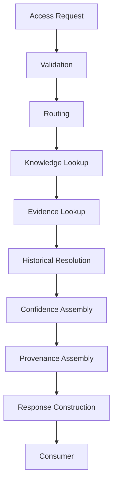

# NeuroVerify: Multimodal Neuro-Symbolic Misinformation Verification Platform
## Knowledge Access Layer — Conceptual Architecture Specification, Version 1.0

| | |
|---|---|
| **Document status** | Draft for review |
| **Location** | `docs/architecture/KNOWLEDGE_ACCESS_LAYER_SPEC_v1.0.md` |
| **Builds on (frozen, unmodified)** | Phase 1 — Data Engineering Foundation; Phase 2 — `ARCHITECTURE_SPEC.md` v1.0 and `ADDENDUM_v1.1.md`; Phase 3 — `KNOWLEDGE_REPRESENTATION_SPEC_v1.0.md`; Phase 4.1 — `KNOWLEDGE_GRAPH_SPEC_v1.0.md`; Phase 4.2 — `EVIDENCE_STORE_SPEC_v1.0.md`; Phase 4.3 — `GRAPH_RESOLUTION_ENGINE_SPEC_v1.0.md` |
| **Nature of this document** | Conceptual architecture only. It defines how every subsystem in the platform reads persistent knowledge and evidence — not the query language, database, indexing, or API technology that will eventually implement that access |
| **Explicitly excluded** | Database specifications, query languages, GraphQL, REST, Cypher, SQL, vector search, implementation details, API definitions, indexing mechanisms, caching implementation, technology choices |
| **Audience** | Engineers who will implement the Knowledge Access Layer in the next phase; every subsystem team that reads `KnowledgeNode`, `KnowledgeEdge`, `FactRecord`, `EvidenceRecord`, or `ArticleRecord` |

This document does not redefine any canonical object. `KnowledgeNode`,
`KnowledgeEdge`, `FactRecord`, `EvidenceRecord`, and `ArticleRecord`
retain exactly the field definitions, validation rules, and lifecycle
behavior fixed in `KNOWLEDGE_REPRESENTATION_SPEC_v1.0.md` §1. It does not
redefine the Knowledge Graph's organization (Phase 4.1), the Evidence
Store's governance (Phase 4.2), or the Resolution Engine's write
authority (Phase 4.3). This document's sole subject is the **read
gateway** standing in front of those subsystems.

---

## 1. Purpose

### 1.1 Why the Knowledge Access Layer Exists

Three subsystems now hold and govern the platform's persistent memory:
the Knowledge Graph (Phase 4.1, semantic knowledge), the Evidence Store
(Phase 4.2, evidentiary memory), and the Resolution Engine (Phase 4.3,
the sole governed mechanism that writes to the Knowledge Graph). None of
these three specifies how the platform's many *consumers* — NLI
Verification, Fusion Intelligence, the Explainability Engine, the
Feedback Service, and any future external-facing capability — should
actually read from them. Left unspecified, every consumer would develop
its own way of querying the Knowledge Graph, its own way of querying the
Evidence Store, and its own way of stitching the two together to
assemble provenance — producing exactly the duplicated, inconsistent
logic this platform's every prior phase has worked to avoid.

The Knowledge Access Layer exists to be that missing, single, consistent
answer: **the one architectural gateway through which every subsystem
reads persistent knowledge and evidence**, so that read behavior — like
write behavior (Phase 4.3 §1.3) — is centralized, consistent, and
governed, rather than reimplemented ad hoc by every consumer.

### 1.2 Why Subsystems Should Never Directly Access the Knowledge Graph

Phase 4.1 specifies the Knowledge Graph as a passive data structure and
Phase 4.3 §1.3 already establishes that it must never be written to
except through the Resolution Engine. The identical argument applies to
reading, for closely related reasons:

| Risk of direct access | How a single gateway avoids it |
|---|---|
| Inconsistent provenance assembly | Every consumer would need to independently implement the chain-walking logic Phase 4.1 §8.2 and Phase 4.2 §5.2 describe; a shared gateway implements it once, consistently (§6) |
| Inconsistent temporal semantics | Whether a query means "current state" or "state as of claim date" (Phase 4.1 §9.3) would be answered differently by different consumers absent one governed interpretation (§4.5, §4.6) |
| No single point of audit | Read access, like write access (Phase 4.3 §10.4), needs one place where "who accessed what, and why" is answerable (§7.4) |
| Coupling to internal graph structure | Consumers reaching directly into `KnowledgeNode`/`KnowledgeEdge` internals would be coupled to Phase 4.1's internal organization, making any future evolution of that organization a breaking change for every consumer instead of an internal concern the gateway absorbs |

### 1.3 Why the Evidence Store Should Not Be Queried Independently

The same argument applies with an additional, sharper reason specific to
evidence: a meaningful answer to "why does the platform believe this"
almost always requires **both** knowledge-layer structure (which fact,
which edge) **and** evidence-layer content (which source, what trust
tier, Phase 4.2 §6) **assembled together**. If a consumer queried the
Evidence Store independently of the Knowledge Graph, it would receive
evidentiary content with no guarantee that it correctly corresponds to
the specific knowledge structure that consumer actually needed explained
— reconstructing that correspondence correctly, every time, in every
consumer, is precisely the cross-subsystem assembly work this document
centralizes (§3, §6).

### 1.4 Four Subsystems, Four Distinct Roles

| Subsystem | Role | Directionality |
|---|---|---|
| **Knowledge Graph** (Phase 4.1) | Persistent semantic memory | Passive — holds state |
| **Evidence Store** (Phase 4.2) | Persistent evidentiary memory | Passive — holds state |
| **Resolution Engine** (Phase 4.3) | Governed write mechanism | Active — the platform's sole writer to the Knowledge Graph |
| **Knowledge Access Layer** (this document) | Governed read mechanism | Active — the platform's sole gateway for reading the Knowledge Graph and the Evidence Store |

This gives the platform's persistent memory layer a clean, symmetric
shape: exactly one accountable path in (Resolution Engine, Phase 4.3),
and exactly one accountable path out (Knowledge Access Layer, this
document). Every other subsystem's relationship to persistent knowledge
and evidence is mediated by one or the other of these two gateways —
never a direct connection to the stores themselves.

---

## 2. Architectural Role

### 2.1 Position in the Platform

```
   Any Consumer (NLI Verification, Fusion Intelligence,
   Explainability Engine, Feedback Service, future
   external-facing capabilities)
          │
          │  access request
          ▼
   Knowledge Access Layer (this document)
          │
          ├──────────────► Knowledge Graph (Phase 4.1)
          │                 read-only queries
          │
          └──────────────► Evidence Store (Phase 4.2)
                            read-only queries, primarily for
                            provenance and citation assembly
```

The Access Layer sits at exactly one position: between every consumer
and both persistent stores. It has no upstream dependency beyond
receiving requests, and its only downstream dependencies are read-only
relationships to the Knowledge Graph and the Evidence Store — it never
depends on, or is depended on by, the Resolution Engine (Phase 4.3),
with which it shares no direct interaction (§2.6).

### 2.2 Responsibilities

| Responsibility | Description |
|---|---|
| Single point of read access | Every read of `KnowledgeNode`, `KnowledgeEdge`, `FactRecord`, `EvidenceRecord`, or `ArticleRecord` by any consumer passes through this layer (§1.2, §1.3) |
| Request validation and routing | Determine what kind of access is being requested (§5) and route it to the appropriate lookup logic against the Knowledge Graph, the Evidence Store, or both |
| Cross-subsystem assembly | Combine Knowledge Graph structure and Evidence Store content into one coherent response, including provenance (§6) |
| Temporal interpretation | Resolve whether a request concerns current or historical state (§4.5, §4.6), consistently, on behalf of every consumer |
| Consistency and determinism | Guarantee that the same request, against the same underlying state, always produces the same response (§7) |
| Access governance | Apply access policy (§8) and maintain an audit trail of what was accessed, by whom, and when (§7.4) |

### 2.3 Boundaries

The Access Layer does not create, modify, or delete any `KnowledgeNode`,
`KnowledgeEdge`, `FactRecord`, `EvidenceRecord`, or `ArticleRecord` — it
is read-only with respect to both stores, full stop (§11 states this
exhaustively). It does not perform entity resolution, conflict
detection, or any of the transformation work Phase 4.3 specifies — it
reads whatever state the Resolution Engine has already committed. It
does not reason about claim truth, rank evidence, or generate
explanations — it supplies the material those activities depend on.

### 2.4 Inputs

| Input | Description |
|---|---|
| Access request | A request from any consumer, conceptually shaped as one of the query categories in §5 |
| Requesting consumer's identity/context | Used for access-policy enforcement (§8), not for altering what data exists — only for determining what a given consumer is permitted to see |
| Current Knowledge Graph state | Read at request time (Phase 4.1) |
| Current Evidence Store state | Read at request time (Phase 4.2) |

### 2.5 Outputs

| Output | Description |
|---|---|
| Knowledge response | The requested `KnowledgeNode`/`KnowledgeEdge`/`FactRecord` content (§4.1) |
| Evidence response | The requested `EvidenceRecord`/`ArticleRecord` content (§4.2) |
| Provenance chain | The assembled lineage connecting the two (§6.1) |
| Confidence metadata | The relevant confidence/trust information, exposed rather than silently embedded (§6, §7.7) |
| Historical view | Where requested, the state of knowledge or evidence as of a specified point in time (§4.5) |
| Conflict metadata | Where relevant graph structure carries conflict status (Phase 4.3 §7.3), surfaced explicitly rather than silently resolved |

### 2.6 Dependencies

| Dependency | Nature |
|---|---|
| Knowledge Graph (Phase 4.1) | Read-only dependency |
| Evidence Store (Phase 4.2) | Read-only dependency |
| Resolution Engine (Phase 4.3) | **No direct dependency.** The Access Layer never invokes, waits on, or coordinates with the Resolution Engine — the two gateways are connected only indirectly, through the state each independently reads from or writes to the same underlying stores |
| Event Logger (Phase 2 Addendum §2) | Observability dependency, for access auditing (§7.4), mirroring the same shared-logging choice Phase 4.2 §9.3 and Phase 4.3 §10.4 already make for their own subsystems |

### 2.7 Why No Direct Relationship With the Resolution Engine

It would be architecturally tempting to connect the Access Layer directly
to the Resolution Engine — for instance, to let a read request trigger
fresh resolution. This document deliberately rejects that connection:
the Access Layer's guarantee of deterministic, read-only response (§7.2)
would be compromised if reading could trigger writing, and the
Resolution Engine's own determinism guarantee (Phase 4.3 §8.8) depends on
operating strictly within its own governed pipeline (Phase 4.3 §3), never
being invoked as a side effect of an unrelated subsystem's read request.
The two gateways remain connected only through the state they
respectively write to and read from — never through direct invocation.

---

## 3. Access Lifecycle

### 3.1 Lifecycle Diagram



### 3.2 Stage-by-Stage Explanation

**Stage 1 — Access Request.** A consumer submits a request shaped as one
of the query categories defined in §5 — an entity lookup, a fact lookup,
a provenance query, and so on. The request is the only way any consumer
interacts with persistent knowledge or evidence (§1.2, §1.3).

**Stage 2 — Validation.** The request is checked for well-formedness and
against access policy (§8) — does this requesting consumer have standing
to make this kind of request at all. Validation happens before any
lookup work begins, so that policy is enforced at the earliest possible
point rather than after state has already been read.

**Stage 3 — Routing.** The validated request is directed to the
appropriate lookup logic based on its query category (§5) — a pure
entity lookup routes differently than a composite query spanning
knowledge and evidence, but every route passes through the same
governed gateway (§2.2).

**Stage 4 — Knowledge Lookup.** The Knowledge Graph (Phase 4.1) is
queried for the requested `KnowledgeNode`/`KnowledgeEdge`/`FactRecord`
structure. This stage precedes Evidence Lookup deliberately (§3.3) — the
typical access pattern is "get the knowledge, then get what backs it
up," mirroring how provenance chains are structured (Phase 4.1 §8.2)
starting from knowledge and working backward to evidence.

**Stage 5 — Evidence Lookup.** Where the request requires it (directly,
or because Provenance Assembly at Stage 8 will need it), the Evidence
Store (Phase 4.2) is queried for the `EvidenceRecord`/`ArticleRecord`
content backing the knowledge retrieved in Stage 4.

**Stage 6 — Historical Resolution.** If the request specifies a
temporal scope (a point in time, rather than "current"), this stage
resolves which version of the relevant knowledge (Phase 4.1 §9) or
evidence (Phase 4.2 §8) applies — selecting historical rather than
current structure where appropriate (§4.5, §4.6).

**Stage 7 — Confidence Assembly.** The confidence and trust metadata
associated with the retrieved knowledge and evidence (`KnowledgeEdge.confidence`,
`FactRecord.trust_tier`, `EvidenceRecord.source_trust_tier`) is gathered
and attached to the response rather than left implicit — consistent with
this document's principle that confidence is always exposed, never
silently absorbed (§7.7).

**Stage 8 — Provenance Assembly.** The full lineage chain connecting the
retrieved knowledge back through to its originating evidence (Phase 4.1
§8.2, Phase 4.2 §5.2) is constructed, so the response is independently
explainable without the consumer needing to make follow-up requests to
reconstruct it themselves (§6.1).

**Stage 9 — Response Construction.** Every element gathered in Stages
4–8 is assembled into one coherent response, shaped consistently
regardless of which query category (§5) originated the request.

**Stage 10 — Consumer.** The completed response is delivered to the
requesting consumer, and the request's full path through this lifecycle
is recorded for audit (§7.4).

### 3.3 Why This Ordering Matters

| Ordering constraint | Why it must hold |
|---|---|
| Validation before any lookup | Access policy (§8) must gate a request before any state is read, not after — reading state to decide whether reading was permitted would be a contradiction |
| Knowledge Lookup before Evidence Lookup | Evidence relevant to a request is typically identified *through* the knowledge structure that references it (`FactRecord.supporting_evidence_ids`, Phase 3 §1.8) — evidence lookup without a knowledge anchor would have nothing to connect its results to |
| Historical Resolution before Confidence Assembly | Confidence must be assembled for the *correct version* of the knowledge/evidence in question — assembling confidence before resolving which version applies risks attaching the wrong version's confidence to the response |
| Provenance Assembly after both lookups | A provenance chain, by definition, spans both knowledge and evidence content (§6.1) — it cannot be assembled until both have been retrieved |
| Response Construction last | Every other stage's output is a necessary ingredient of the final response — constructing the response earlier would mean constructing it incompletely |

This fixed ordering gives every access request the same deterministic
shape (§7.2), regardless of which specific query category (§5) it
belongs to.

### 3.4 Worked Example

To make the lifecycle concrete: consider NLI Verification (Phase 2 §5.5)
needing to verify a claim asserting a specific organization's leadership.
The request is a Composite Query (§5.10) — conceptually, "give me
everything relevant to whether this person currently leads this
organization."

| Stage | What happens in this example |
|---|---|
| Access Request | NLI Verification requests fact and provenance information relevant to a `president_of`-type relationship between a specific Person node and a specific Organization node |
| Validation | Confirmed as a legitimate internal-module request (§8.2) within NLI Verification's established scope |
| Routing | Routed as a composite request spanning Fact Lookup and Provenance Query (§5.4, §5.8) |
| Knowledge Lookup | The relevant `KnowledgeEdge`(s) between the two nodes, and any `FactRecord`(s) already derived from them, are retrieved from the Knowledge Graph |
| Evidence Lookup | The `EvidenceRecord`(s) supporting those edges/facts are retrieved from the Evidence Store |
| Historical Resolution | Because the claim's `temporal_context` (Phase 3 §1.2) specifies "currently," current-state structure is selected (§4.4) — if the claim instead concerned a past date, this stage would instead select whichever edge's `[valid_from, valid_until]` window covers that date (§4.5) |
| Confidence Assembly | The edge's `confidence` and the fact's `trust_tier` are attached to the response explicitly |
| Provenance Assembly | The full chain — fact, edge, supporting relation records, supporting evidence, and originating articles — is walked and attached |
| Response Construction | One coherent response is assembled, containing the fact, its confidence, and its complete provenance |
| Consumer | NLI Verification receives everything needed to produce a `VerificationResult`, without having made a single additional request or having had to independently query the Evidence Store |

This example illustrates why composite queries (§5.10) are treated as the
ordinary case, not a special one: a realistic consumer need almost always
spans knowledge, evidence, temporal scope, and provenance together, and
the lifecycle's fixed stage ordering (§3.3) exists precisely to serve
that need in one coherent access rather than requiring the consumer to
orchestrate several separate ones.

---

## 4. Access Model

### 4.1 Knowledge Access

Knowledge access concerns retrieving `KnowledgeNode`, `KnowledgeEdge`, or
`FactRecord` structure (Phase 4.1, Phase 3 §1.6–§1.8) — the platform's
resolved, canonical understanding. The Access Layer's responsibility here
is retrieval and assembly only; it never alters what it retrieves,
consistent with the Knowledge Graph's read-only exposure to every
consumer but the Resolution Engine (Phase 4.3 §1.3).

### 4.2 Evidence Access

Evidence access concerns retrieving `EvidenceRecord` or `ArticleRecord`
content (Phase 4.2) — typically in service of a knowledge request's
provenance (§6.1), but occasionally requested directly (e.g. the
Feedback Service reviewing a specific evidence item, Phase 4.2 §11.4).
As with Knowledge Access, this is strictly read-only.

### 4.3 Fact Access

Fact access is a specialization of Knowledge Access, scoped specifically
to `FactRecord` — the verification-ready object NLI Verification consumes
(Phase 3 §4). It is named separately here because it is the platform's
single most frequent access pattern (every claim's verification requires
it, Phase 2 §5.5) and warrants its own conceptual category (§5.3)
distinct from general entity/relationship access.

### 4.4 Current-State Access

The default access mode: retrieving whatever `KnowledgeNode`,
`KnowledgeEdge`, or evidence version currently applies, per Phase 4.1
§9.3's current/historical distinction and Phase 4.2 §8.4's identical
distinction for evidence. Most requests from Verification and Fusion
(Phase 2 §5.5, §5.8) are current-state requests, since most claims
concern the present state of the world.

### 4.5 Historical Access

Retrieving knowledge or evidence as it existed at a specified past point
in time — necessary whenever a claim's `temporal_context` (Phase 3 §1.2)
concerns the past. The Access Layer's responsibility is applying Phase
4.1 §9.2's `valid_from`/`valid_until` model and Phase 4.2 §8's version
model correctly and consistently, so that every consumer requesting
historical access receives the same, correctly-resolved answer rather
than independently reimplementing temporal resolution logic (§1.2).

### 4.6 Relationship Traversal

Retrieving the `KnowledgeEdge`(s) connected to a given `KnowledgeNode` —
the graph-native operation Phase 4.1 §1.4 identifies as a core benefit of
graph reasoning (multi-hop traversal). The Access Layer exposes this as a
conceptual capability (following one or more edges from a starting node)
without prescribing how many hops, in what direction, or under what
filtering — those are request-shape details belonging to the query
categories in §5, not to this document's architectural description of
the capability itself.

### 4.7 Entity Lookup

Retrieving a specific `KnowledgeNode` by identity — the starting point
for most traversal and fact-access requests. Entity lookup may itself
need to resolve ambiguity in how an entity is specified (e.g. by alias
rather than canonical name), but the Access Layer performs no *new*
resolution here — it only reads the alias/identity structure the
Resolution Engine has already established (Phase 4.3 §5), never
re-deciding identity itself.

### 4.8 Cross-Reference Lookup

Retrieving the set of `ClaimRecord`s, `EvidenceRecord`s, or `FactRecord`s
that reference a given piece of knowledge or evidence — the inverse
direction of a typical provenance chain (§6.1), useful for questions like
"what else has the platform concluded using this fact" or "which claims
cite this source." This is a read-only traversal of existing reference
structure (Phase 3 §0.3's reference-by-id discipline), never a new
computation.

### 4.9 Responsibility Boundary, Restated

Every access mode above shares one property: it retrieves and assembles
existing state; it never creates, infers, or modifies anything. This
section describes *what can be asked for*, not *how the answer is
computed* — computation of the underlying knowledge and evidence remains
entirely the Resolution Engine's (Phase 4.3) and Evidence Store's (Phase
4.2) responsibility.

---

## 5. Query Categories

### 5.1 Purpose

Where §4 describes access *modes* (what kind of content is being
accessed), this section describes access *categories* (the shape of a
request as the Routing stage, §3.2 Stage 3, sees it). The two are
related but distinct: a single query category (e.g. Composite Query,
§5.9) may span several access modes (§4.1–§4.8) at once.

### 5.2 Entity Lookup

A request for a specific `KnowledgeNode`, identified by canonical
identity or by a known alias. Used whenever a consumer needs to establish
"does the platform know about this entity, and what does it know."

### 5.3 Relationship Lookup

A request for `KnowledgeEdge`(s) matching a given subject, predicate, or
object pattern. Used for questions structured around a specific kind of
relationship (e.g. "what organizations is this person affiliated with").

### 5.4 Fact Lookup

A request for `FactRecord`(s) relevant to a specific claim's subject
matter — the category NLI Verification (Phase 2 §5.5) uses most heavily,
per §4.3.

### 5.5 Evidence Lookup

A request for `EvidenceRecord`/`ArticleRecord` content, either directly
or as a component of provenance assembly (§6.1). Used when a consumer
needs the underlying source material itself, not just the knowledge
derived from it.

### 5.6 Historical Queries

A request scoped to a specific point in time rather than current state
(§4.5). Used whenever a claim's temporal context requires it, or when a
consumer (e.g. the Feedback Service reviewing a past verdict, Phase 2
Addendum §3) needs to reconstruct exactly what the platform knew at a
specific past moment.

### 5.7 Conflict Queries

A request specifically for graph structure carrying conflict status
(Phase 4.1 §7, Phase 4.3 §7.3) — used by Fusion Intelligence or the
Decision Engine (indirectly, via `VerificationResult`/`FusionResult`,
Phase 4.3 §7.8) when reasoning about disagreement requires seeing every
side of it explicitly, not just a single resolved answer.

### 5.8 Provenance Queries

A request whose primary purpose is retrieving the lineage chain itself
(§6.1) rather than the knowledge/evidence content at its endpoints — used
principally by the Explainability Engine (Phase 2 §5.9) and by human
review processes (Phase 4.1 §6.4, Phase 4.2 §6.8, Phase 4.3 §10.2)
investigating how a specific piece of knowledge came to exist.

### 5.9 Confidence Queries

A request for the confidence/trust metadata associated with a piece of
knowledge or evidence, independent of the content itself — used when a
consumer needs to reason about *how sure* the platform is, separately
from *what* the platform holds (e.g. the Decision Engine's threshold
logic, Phase 2 Addendum §6.5).

### 5.10 Composite Queries

A request combining several of the above in one coherent access — most
real consumer needs are actually composite (e.g. NLI Verification's
typical need is simultaneously a Fact Lookup, an Evidence Lookup, and a
Provenance Query). The Access Layer's lifecycle (§3) is structured
precisely so that composite queries are the natural case, not a special
one — every request passes through Knowledge Lookup, Evidence Lookup,
Confidence Assembly, and Provenance Assembly regardless of category,
with simpler categories simply having less work to do at each stage.

### 5.11 When Each Category Should Be Used

| Category | Typical consumer | Typical purpose |
|---|---|---|
| Entity Lookup | Knowledge Representation, Resolution Engine's own matching stage (reading, not writing) | Establishing whether an entity is already known |
| Relationship Lookup | Fusion Intelligence, research/review tooling | Understanding how entities relate |
| Fact Lookup | NLI Verification | Retrieving verification-ready assertions |
| Evidence Lookup | Explainability Engine, Feedback Service | Retrieving citable source material |
| Historical Queries | NLI Verification (past-dated claims), Feedback Service | Reconstructing past state |
| Conflict Queries | Fusion Intelligence, Decision Engine (indirectly) | Reasoning over disagreement explicitly |
| Provenance Queries | Explainability Engine, human reviewers | Explaining how knowledge came to exist |
| Confidence Queries | Decision Engine (indirectly), Fusion Intelligence | Reasoning about certainty independent of content |
| Composite Queries | Most consumers, most of the time | Everything needed for one coherent task in a single access |

---

## 6. Provenance & Explainability Access

### 6.1 How Provenance Is Returned

Every response the Access Layer constructs (§3.2, Stage 9) that
originates from knowledge or evidence content carries its provenance
chain assembled and attached — never as a separate, optional follow-up
request. This directly operationalizes the two lineage chains Phase 4.1
§8.2 and Phase 4.2 §5.2 already define conceptually:

```
FactRecord → KnowledgeEdge → RelationRecord → EntityRecord → ClaimRecord / ArticleRecord
                                                   (Phase 4.1 §8.2)

FactRecord → EvidenceRecord → ArticleRecord
                                                   (Phase 4.2 §5.2)
```

The Access Layer's Provenance Assembly stage (§3.2, Stage 8) walks
whichever of these chains applies to the requested knowledge, and
attaches the full, walked chain to the response — so a consumer receives
not just "this fact," but "this fact, and everything that establishes
where it came from," in one access.

### 6.2 How Evidence Is Linked

Every `FactRecord` or `KnowledgeEdge` returned by the Access Layer is
linked to its supporting `EvidenceRecord`(s) through the reference fields
Phase 3 §1.7–§1.8 already fix (`supporting_relation_record_ids`,
`supporting_evidence_ids`) — the Access Layer's Evidence Lookup stage
(§3.2, Stage 5) resolves these references into actual retrieved content,
rather than leaving the consumer to perform that resolution itself.

### 6.3 How Explanation Modules Consume Provenance

The Explainability Engine (Phase 2 §5.9) is this platform's primary
consumer of assembled provenance: `ExplanationRecord.evidence_cited`
(Phase 3 §1.13) is populated from exactly the kind of response this
layer's Provenance Assembly stage produces. The Access Layer's
contribution to explainability is ensuring that by the time content
reaches the Explainability Engine, it is already fully
provenance-complete — the Explainability Engine's own responsibility
(Phase 2 §5.9) remains rendering that already-assembled material into
prose, never assembling it itself.

### 6.4 How Traceability Is Preserved

Traceability is preserved by the Access Layer never summarizing,
truncating, or omitting a link in a provenance chain to simplify a
response — every retrieved chain is returned in full, exactly as it
exists in the underlying stores. Where a chain is long or spans many
supporting sources (a heavily-corroborated `KnowledgeEdge`, Phase 4.1
§1.4), the Access Layer's responsibility is complete, faithful assembly,
not selective simplification — any summarization for human readability
is downstream, explicitly the Explainability Engine's task (§6.3), never
performed silently during access.

### 6.5 How Every Returned Result Remains Explainable

This section's cumulative guarantee: because every response includes its
full provenance chain (§6.1), its linked evidence (§6.2), and its
confidence metadata (§7.7) by construction — not as an optional or
separately-requestable extra — nothing the Access Layer returns can be
presented to a consumer without also being explainable. This closes the
loop Phase 4.1 §8.4 and Phase 4.2 §5.5 both open: those documents
establish that provenance is essential for explainability; this
document's Access Layer is the mechanism that guarantees provenance is
actually present, every time, in every response, rather than
theoretically available but practically omitted.

---

## 7. Consistency & Governance

### 7.1 Read Consistency

A single access request, even one spanning multiple lookups (Knowledge
Lookup and Evidence Lookup, §3.2 Stages 4–5), must observe one coherent
view of underlying state — the Access Layer does not return a response
assembled from a knowledge state and an evidence state that were true at
different, inconsistent moments. This does not require the underlying
stores to be locked or unavailable to concurrent writes (§9.2) — it
requires the Access Layer's assembly logic to establish one consistent
reference point for the duration of a single request.

### 7.2 Deterministic Responses

Given the same request, against the same underlying Knowledge Graph and
Evidence Store state, the Access Layer always produces the same
response. This is the read-side counterpart to Phase 4.3 §8.8's
write-side determinism guarantee — together, the two guarantees mean the
platform's entire persistent-memory layer behaves predictably: writes are
deterministic given the same evidence and prior state (Phase 4.3), and
reads are deterministic given the same request and current state (this
document).

### 7.3 Deterministic Responses Are Not Static Responses

Determinism here means "no incidental variation for the same
request against the same state" — it does not mean a request made today
and the same request made after new knowledge has been resolved (Phase
4.3) must return the same answer. Current-state access (§4.4) is
expected to reflect the platform's evolving understanding; determinism
applies to the mapping from *(request, state)* to *response*, not to the
response being frozen for all time (historical access, §4.5, exists
precisely to retrieve a frozen, past state on request).

### 7.4 Access Auditing

Every access request's full lifecycle path (§3) — what was requested, by
whom, what was validated, what was ultimately returned — is recorded as
a structured event, feeding the platform's shared Event Logger (Phase 2
Addendum §2.4), mirroring the identical choice already made for Evidence
Store governance (Phase 4.2 §9.3) and Resolution Engine governance
(Phase 4.3 §10.4). This is what makes "who has read what, and when"
answerable after the fact, independent of any individual consumer's own
record-keeping.

### 7.5 Governance

Access governance is the read-side counterpart to Phase 4.3 §10's
resolution governance: the Access Layer is where access policy (§8) is
actually enforced (§3.2, Stage 2), and where the audit trail (§7.4)
that makes access accountable is generated. As with every other
governance model in this platform, governance here is separated from
reasoning — the Access Layer enforces who may see what; it never reasons
about what any of it means (§11).

### 7.6 Historical Reproducibility

Because historical access (§4.5) resolves against the permanent version
history Phase 4.1 §9 and Phase 4.2 §8 already guarantee, any past
response this layer ever produced can, in principle, be exactly
reproduced by re-issuing the same historically-scoped request — directly
extending the three-part reproducibility guarantee Phase 4.3 §10.5
establishes (reproducible evidence, reproducible resolution, reproducible
pipeline configuration) with a fourth part: reproducible access. A past
`ExplanationRecord`'s citations (§6.3) remain independently re-verifiable
for exactly this reason.

### 7.7 Version-Aware Access and Exposed Confidence

Every response is version-aware by construction (§3.2, Stage 6) — a
consumer never receives ambiguous "current or historical, unspecified"
content. Confidence is likewise never implicit: every response's
Confidence Assembly stage (§3.2, Stage 7) attaches the relevant
confidence and trust metadata explicitly, consistent with this
document's founding principle (§7.9) that nothing about a response's
certainty is left for the consumer to infer or separately look up.

### 7.8 Append-Only History and Integrity

The Access Layer contributes nothing new to append-only governance
(Phase 3 §0.3, Phase 4.1 §3.3, Phase 4.2 §9.2, Phase 4.3 §8.1) beyond
reading it faithfully — its own integrity guarantee is that it never
presents a response inconsistent with what the underlying stores
actually hold (§7.1), and that its own operation (being strictly
read-only, §2.3) can never be the source of any integrity violation in
either store.

### 7.9 Consistency and Governance, Summarized

Every property in this section — read consistency, determinism, auditing,
reproducibility, version-awareness, exposed confidence — exists to
support one governing commitment: **an Access Layer response must be as
trustworthy, in its own right, as the knowledge and evidence it draws
from.** A perfectly governed Knowledge Graph and Evidence Store would
still fail this platform's accountability requirements if the gateway
standing between them and every consumer introduced its own
inconsistency, non-determinism, or silent omission — this section exists
to foreclose that possibility.

---

## 8. Access Policies

### 8.1 Philosophy: Boundaries, Not Mechanisms

This section defines conceptual categories of requesting consumer and the
trust boundaries between them — it does not define an authentication or
authorization mechanism (per this document's implementation-agnostic
scope). It establishes *what* must be distinguished; a future
implementation phase determines *how*.

### 8.2 Consumer Categories

| Category | Description | Typical access pattern |
|---|---|---|
| Internal modules | The platform's own reasoning subsystems — NLI Verification, Fusion Intelligence, the Decision Engine, the Explainability Engine (Phase 2 §5, Addendum §6) | Full read access to current and historical knowledge and evidence, as required by their established responsibilities |
| Administrative access | Human reviewers and governance processes (Phase 4.1 §6.4, Phase 4.2 §6.8, Phase 4.3 §10.2) | Access to resolution/conflict/audit metadata not ordinarily needed by reasoning modules, in service of oversight |
| Research access | Internal analysis, evaluation, and experiment-tracking activity (Phase 2 Addendum §5) | Broad historical and provenance access, for reproducibility and evaluation purposes, without write capability |
| Public consumers | End users of the platform's verification output | Access mediated entirely through `Verdict`/`ExplanationRecord` (Phase 3 §1.13, §1.12) — never direct access to raw `KnowledgeNode`/`KnowledgeEdge`/`EvidenceRecord` structure |
| Future external APIs | Third-party integrations not yet specified | Explicitly anticipated as a future category (§8.5) requiring its own, more restrictive policy than internal modules |

### 8.3 Access Boundaries

| Boundary | What it separates |
|---|---|
| Internal vs. administrative | Ordinary reasoning access (what a claim needs to be verified) vs. oversight access (what a human reviewer needs to audit *how* the platform reached its knowledge state) |
| Internal vs. public | Full canonical object access vs. access mediated through the platform's own explanation layer — a public consumer never receives raw graph structure directly, only what the Explainability Engine has already rendered from it |
| Current vs. historical, by consumer | Not every consumer category necessarily has equal historical-access breadth — research and administrative access are expected to need deeper historical reach than routine reasoning access, though this document does not fix specific limits (an implementation and governance decision) |

### 8.4 Trust Boundaries

Trust boundaries in this architecture are not about whether a consumer
is "trusted" in a general sense — every internal module is, by
construction, part of the same governed platform. They are about
**scope of legitimate need**: a module should be able to access what its
established responsibility (Phase 2 §5, Phase 2 Addendum §1–§6) requires,
and no more. This is the same least-scope principle already implicit in
every subsystem boundary this document series has drawn (e.g. Fusion
Intelligence never directly touching Knowledge Graph objects, Phase 4.1
§11.4) — restated here explicitly as an access-policy concern rather than
left only implicit in module interface contracts.

### 8.5 Future External APIs

This document explicitly anticipates that the platform may eventually
expose knowledge or evidence access beyond its own internal modules —
research partners, integrators, or a public-facing query capability. It
establishes only that such access, whenever it is built, must pass
through this same Access Layer gateway (§1.1, §2.2) under its own,
more restrictive policy category (§8.2) — never through a separate,
parallel access path that bypasses this document's consistency (§7) and
provenance (§6) guarantees.

### 8.6 How Permissions Are Enforced Conceptually

Permission enforcement happens at the Validation stage (§3.2, Stage 2),
before any lookup work begins (§3.3) — a request outside its consumer
category's legitimate scope (§8.2–§8.4) is rejected at that point, not
filtered out of an otherwise-fully-assembled response. This is a
deliberate architectural choice: enforcing scope before assembly means a
consumer without standing to see certain knowledge never causes that
knowledge to be read from the underlying stores at all, keeping the
enforcement boundary as early and as clean as possible.

### 8.7 Illustrative Comparison

The following table illustrates, conceptually, how the same underlying
knowledge is exposed differently depending on consumer category — not as
a fixed policy specification (which remains an implementation and
governance decision), but to make §8.2–§8.4's distinctions concrete:

| Consumer category | Can request current knowledge/evidence | Can request historical views | Can request conflict/resolution metadata | Can request raw canonical objects directly |
|---|---|---|---|---|
| Internal modules | Yes, within established responsibility (§8.4) | Yes, as required by claim context | Limited to what fusion/decision reasoning requires (Phase 4.3 §7.8) | Yes |
| Administrative access | Yes | Yes, broadly | Yes, fully — this is oversight's core purpose | Yes |
| Research access | Yes | Yes, broadly | Yes, for evaluation purposes | Yes |
| Public consumers | No — mediated only through `Verdict`/`ExplanationRecord` | No, except as rendered into an explanation's stated caveats (Phase 3 §1.13) | No | No |
| Future external APIs | Governed independently per §8.5, expected to be narrower than internal-module access | Case-by-case, per future policy | Case-by-case, per future policy | Expected no, by default |

This table is illustrative of the *kind* of distinction this
architecture requires, not a binding permission matrix — the specific
boundaries a future implementation enforces are a governance decision
outside this document's implementation-agnostic scope (§8.1).

---

## 9. Scalability Strategy

### 9.1 Growth Characteristics

The Access Layer's load grows with the platform's overall usage — more
claims processed means more access requests, compounding the growth
already anticipated for the Knowledge Graph (Phase 4.1 §10.1) and
Evidence Store (Phase 4.2 §10.1) it reads from. Unlike those two stores,
the Access Layer itself holds no persistent state of its own to grow —
its scalability concern is throughput and latency of read operations
against growing underlying stores, not storage growth.

### 9.2 Concurrent Access

Many consumers may issue access requests simultaneously — claim-level
parallelism (Phase 2 §1.1) already implies this at the pipeline level,
and the Access Layer must support it without requiring the underlying
stores to serialize reads, or requiring reads to block concurrent writes
from the Resolution Engine (Phase 4.3). The read-consistency guarantee
(§7.1) applies *within* a single request, not as a claim that concurrent
requests observe a frozen, platform-wide snapshot — each request
establishes its own consistent reference point independently.

### 9.3 Large Graph Traversal

As the Knowledge Graph grows into the millions-of-nodes/edges range
(Phase 4.1 §10.1), relationship-traversal requests (§4.6) face a growing
structure to search. This document does not prescribe how traversal
remains efficient at scale (indexing and caching are explicitly out of
scope, per this document's header) — it establishes that the conceptual
access model (§4) and query categories (§5) impose no structural obstacle
to whatever efficient traversal mechanism a future implementation adopts.

### 9.4 Historical Queries at Scale

Historical access (§4.5) grows in cost alongside the version history
Phase 4.1 §9 and Phase 4.2 §8 accumulate over the platform's operating
lifetime — the Access Layer's conceptual responsibility (correctly
resolving temporal scope, §3.2 Stage 6) does not change as that history
grows, though the volume of historical structure to search through does.

### 9.5 Future Concerns (Conceptual Only)

| Concern | Conceptual compatibility requirement |
|---|---|
| Caching | Frequently-requested knowledge (heavily-corroborated facts, commonly-traversed entities) is a natural caching candidate, mirroring the identical observation Phase 4.1 §10.3 and Phase 4.2 §10.5 already make for their own high-value content — caching is a performance layer beneath this document's conceptual model, not a change to it |
| Indexing | Fast lookup by entity identity, relationship pattern, or temporal scope is a query-performance concern layered beneath the access model (§4) and query categories (§5), not a property those concepts themselves need to encode |
| Distributed knowledge | Should the Knowledge Graph or Evidence Store be distributed in a future implementation (Phase 4.1 §10.3, Phase 4.2 §10.5 already anticipate this), the Access Layer's role as a single logical gateway (§1.1) must be preserved even if the underlying stores are physically distributed — mirroring the identical requirement Phase 4.3 §11.6 states for the Resolution Engine's write side |
| Federated repositories | A future scenario where knowledge or evidence spans multiple, federated stores (e.g. a partner organization's own evidence holdings) is architecturally compatible with this document's model as long as the Access Layer remains the single point through which federation is resolved on the consumer's behalf — a consumer should never need to know whether a response was assembled from one store or several |

### 9.6 What This Section Deliberately Does Not Address

Consistent with this document's implementation-agnostic scope, this
section names no caching mechanism, indexing structure, or distributed-
systems approach, and provides no capacity numbers or latency targets.
Its contribution is confirming that the conceptual access model (§4),
query categories (§5), and consistency guarantees (§7) impose no
structural barrier to any reasonable technical approach to the concerns
above.

---

## 10. Interface Contracts

### 10.1 What the Knowledge Access Layer Consumes

| Input | Source | Role |
|---|---|---|
| `KnowledgeNode`, `KnowledgeEdge`, `FactRecord` | Knowledge Graph (Phase 4.1) | The knowledge content underlying every Knowledge Lookup (§3.2, Stage 4) |
| `EvidenceRecord`, `ArticleRecord` | Evidence Store (Phase 4.2) | The evidentiary content underlying every Evidence Lookup (§3.2, Stage 5) |
| Knowledge Graph | Phase 4.1 subsystem, as a whole | Read-only dependency (§2.6) |
| Evidence Store | Phase 4.2 subsystem, as a whole | Read-only dependency (§2.6) |

### 10.2 What the Knowledge Access Layer Produces

| Output | Description | Realized via |
|---|---|---|
| Knowledge responses | Assembled `KnowledgeNode`/`KnowledgeEdge`/`FactRecord` content, per the requested query category (§5) | §3.2, Stages 4, 9 |
| Evidence responses | Assembled `EvidenceRecord`/`ArticleRecord` content | §3.2, Stages 5, 9 |
| Provenance chains | Full lineage assembly per §6.1 | §3.2, Stage 8 |
| Confidence metadata | Explicit confidence/trust information per §7.7 | §3.2, Stage 7 |
| Historical views | Version-resolved knowledge/evidence per §4.5 | §3.2, Stage 6 |
| Conflict metadata | Explicit exposure of conflict-carrying structure per §5.7 | Carried through from underlying `KnowledgeEdge`/`FactRecord` status (Phase 4.3 §7.3) |
| Explainability metadata | The combination of provenance, confidence, and conflict metadata specifically shaped for the Explainability Engine's consumption (§6.3) | §3.2, Stage 9 |

### 10.3 How These Outputs Are Consumed Downstream

| Consumer | What it consumes | How |
|---|---|---|
| **NLI Verification** (Phase 2 §5.5) | Fact and Evidence responses, primarily via Fact Lookup and Composite Queries (§5.4, §5.10) | As the evidentiary and factual basis for `VerificationResult` |
| **Fusion Intelligence** (Phase 2 §5.8) | Conflict metadata (indirectly, via `VerificationResult`) | Continues to never directly consume Knowledge Graph or Evidence Store objects (Phase 4.1 §11.4) — the Access Layer does not change this; it is Verification, not Fusion, that issues requests to this layer |
| **Decision Engine** (Phase 2 Addendum §6) | Confidence metadata (indirectly, via `FusionResult`) | Same indirect pattern, unchanged by this document |
| **Explainability Engine** (Phase 2 §5.9) | Explainability metadata, provenance chains, evidence responses | To render `ExplanationRecord` citations that are, by construction, already fully provenance-complete (§6.5) |
| **Feedback Service** (Phase 2 Addendum §3) | Historical views, provenance chains, administrative-category access (§8.2) | To support human review of disputed verdicts (Phase 2 Addendum §3.4) |
| **Resolution Engine** (Phase 4.3) | Current Knowledge Graph state, via its own Stage 2 (Entity Matching, Phase 4.3 §3.2) | The one case where the Resolution Engine reads graph state as part of its own pipeline — this read occurs through the same Access Layer gateway as any other consumer's read, preserving §1.1's single-gateway guarantee even for the platform's own writer |

### 10.4 Consistency With Previous Phases

This section introduces no new canonical object and no change to any row
of Phase 2 §4's, Phase 3 §4's, Phase 4.1 §11's, Phase 4.2 §11's, or Phase
4.3 §12's interface contract tables. It makes explicit the read path
those tables have always implicitly required — every "Consumed by: NLI
Verification" or "Consumed by: Explainability Engine" row in a prior
phase's interface contract table is now understood to mean "consumed by,
through the Knowledge Access Layer."

---

## 11. Non-Goals

### 11.1 Explicit Boundaries

The Knowledge Access Layer does **not**:

| Non-goal | Why it belongs elsewhere |
|---|---|
| Verify claims | NLI Verification (Phase 2 §5.5) determines the logical relationship between a claim and facts; this layer supplies the facts, it does not reason about what they imply |
| Update the graph | The Resolution Engine (Phase 4.3) is the Knowledge Graph's sole writer (Phase 4.3 §1.3); this layer is strictly read-only (§2.3) |
| Resolve entities | Entity resolution is the Resolution Engine's responsibility (Phase 4.3 §5); this layer reads whatever identity structure the Resolution Engine has already established, never re-deciding it (§4.7) |
| Retrieve evidence from the web | Evidence Retrieval (Phase 2 §5.3) and the Evidence Store's ingestion lifecycle (Phase 4.2 §3) are responsible for sourcing new evidence; this layer only reads what has already been governed and stored |
| Perform reasoning | This layer assembles and returns existing state; it draws no inferences and reaches no conclusions about what any of it means (§2.3, §7.5) |
| Generate explanations | The Explainability Engine (Phase 2 §5.9) renders reasoning chains into human-readable form; this layer supplies the provenance-complete material that explanation draws on (§6.3), but produces no prose itself |
| Modify evidence | The Evidence Store's immutability guarantee (Phase 4.2 §9.1) is absolute; this layer has no write capability toward it whatsoever |
| Modify knowledge | Symmetrically, this layer has no write capability toward the Knowledge Graph — that capability belongs exclusively to the Resolution Engine (Phase 4.3) |

### 11.2 Why This Separation Is Critical

Every non-goal above protects the same single property this entire
document exists to guarantee: **a consumer can trust that what this
layer returns is exactly, faithfully, and consistently what the
underlying stores hold — nothing added, nothing inferred, nothing
silently altered.** If the Access Layer additionally reasoned about
truth, resolved entities, or modified state, that guarantee would become
entangled with judgment calls properly owned by other named, accountable
subsystems elsewhere in this architecture — the same argument every
prior phase in this series has made for its own subsystem (Phase 4.1
§12.2, Phase 4.2 §12.2, Phase 4.3 §13.2), extended here to the gateway
that stands between all of them and the rest of the platform. An Access
Layer that stays within these boundaries is what allows every consumer
in this platform to treat a response from it as ground truth about *what
the platform currently knows and holds* — never as an opinion about what
that knowledge means.

---

*End of Knowledge Access Layer Conceptual Architecture Specification, Version 1.0.*
*This document supplements the frozen Phase 1, Phase 2 (`ARCHITECTURE_SPEC.md` v1.0,*
*`ADDENDUM_v1.1.md`), Phase 3 (`KNOWLEDGE_REPRESENTATION_SPEC_v1.0.md`), Phase 4.1*
*(`KNOWLEDGE_GRAPH_SPEC_v1.0.md`), Phase 4.2 (`EVIDENCE_STORE_SPEC_v1.0.md`), and Phase 4.3*
*(`GRAPH_RESOLUTION_ENGINE_SPEC_v1.0.md`) documents; none of them is altered by it.*
