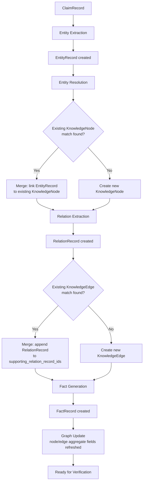

# NeuroVerify: Multimodal Neuro-Symbolic Misinformation Verification Platform
## Knowledge Graph Subsystem — Conceptual Architecture Specification, Version 1.0

| | |
|---|---|
| **Document status** | Draft for review |
| **Location** | `docs/architecture/KNOWLEDGE_GRAPH_SPEC_v1.0.md` |
| **Builds on (frozen, unmodified)** | Phase 1 — Data Engineering Foundation; Phase 2 — `ARCHITECTURE_SPEC.md` v1.0 and `ADDENDUM_v1.1.md`; Phase 3 — `KNOWLEDGE_REPRESENTATION_SPEC_v1.0.md` |
| **Nature of this document** | Conceptual architecture only. It defines how knowledge is organized, evolves, and is governed — not how it is stored, indexed, or queried by any specific technology |
| **Explicitly excluded** | Code, pseudocode, Cypher, SQL, database schemas, API endpoint definitions, indexing implementation, performance benchmarks, deployment/infrastructure topology |
| **Audience** | Engineers who will implement the Knowledge Graph subsystem in the next phase; every subsystem team that consumes `KnowledgeNode`, `KnowledgeEdge`, or `FactRecord` |

This document does not redefine any canonical object. `KnowledgeNode`,
`KnowledgeEdge`, `FactRecord`, `EntityRecord`, `RelationRecord`,
`ClaimRecord`, `EvidenceRecord`, and every other object referenced below
retain exactly the field definitions, validation rules, and lifecycle
behavior fixed in `KNOWLEDGE_REPRESENTATION_SPEC_v1.0.md` §1–§8. Where
this document says "as defined in Phase 3," no restatement should be
read as an amendment.

---

## 1. Purpose

### 1.1 Why a Knowledge Graph Is Needed

Misinformation verification is fundamentally a **relational** problem,
not merely a classification problem. Determining whether "Company A's
subsidiary was fined by the agency that regulates Company B's industry"
requires traversing a chain of relationships — ownership, regulatory
jurisdiction, industry classification — that no single document, and no
single claim-evidence pair, contains in full. The platform needs a
structure that:

- Persists what has been learned about entities and their relationships
  **across** claims, not just within one claim's verification.
- Supports **multi-hop reasoning** (A relates to B relates to C) as a
  first-class operation, not an emergent side effect of text similarity.
- Represents **contradiction and change over time** as legitimate,
  queryable states, not as data-quality noise to be resolved away at
  write time.
- Gives every downstream module (NLI Verification, Fusion Intelligence,
  Explainability Engine — all defined in Phase 2) a stable, addressable
  substrate of *things* (entities) and *facts about those things*
  (relations), rather than requiring each module to re-derive structure
  from raw text on every invocation.

### 1.2 Why Vector Databases Alone Are Insufficient

Vector-based retrieval (semantic similarity search over embeddings)
answers "what text is similar in meaning to this claim?" It does not
answer:

| Question a verification platform must answer | Why vector similarity alone cannot answer it |
|---|---|
| "Is entity X in this claim the *same* entity X mentioned in a document from three years ago?" | Similarity scores degrade gracefully rather than resolving identity decisively; there is no persistent notion of "this is the canonical X" — every query re-derives an approximate answer |
| "What is the chain of ownership from A to C?" | A similarity index has no concept of a directed, typed edge to traverse; multi-hop reasoning over embeddings is not a native operation |
| "Was this true as of the claim's date, or only later?" | Vector stores are not inherently temporal; validity windows are not a structural property of a similarity index |
| "Which specific prior facts justify this conclusion, in order?" | Retrieval returns ranked-by-similarity passages, not a traceable, ordered reasoning path |

Vector retrieval remains valuable — it is precisely what Evidence
Retrieval (Phase 2 §5.3) uses to find candidate passages. But passage
similarity is not the same primitive as **entity identity** and
**relationship structure**, which is what a graph provides.

### 1.3 Why Relational Databases Alone Are Insufficient

A relational (tabular) model is a poor conceptual fit for this domain for
three structural reasons:

1. **Schema rigidity vs. relationship heterogeneity.** The relationship
   taxonomy (§4) is open-ended and growing (`works_for`, `located_in`,
   `caused`, `funded_by`, and indefinitely more). A relational schema
   would need either a table per relation type (unbounded schema growth)
   or a single generic "relationships" table that discards typed
   structure — reintroducing, in table form, exactly the graph model this
   document defines, but without native traversal semantics.
2. **Multi-hop traversal cost grows with schema, not with data.** "Who
   indirectly owns this company" is a recursive join in a relational
   model — expressible, but conceptually foreign to the model, whereas it
   is the graph's native operation.
3. **Conflicting and time-varying facts require the graph's append-only
   philosophy (§7, §9), which a normalized relational schema actively
   resists** — normalization pushes toward one current value per
   attribute, which is precisely the behavior this platform must avoid
   (§7.1: the graph must not overwrite history).

### 1.4 How Graph Reasoning Benefits Misinformation Verification

| Capability | Benefit |
|---|---|
| Entity disambiguation | The same real-world entity, mentioned differently across thousands of claims and articles, resolves to one canonical `KnowledgeNode` (§6), so verification benefits from everything previously learned about that entity |
| Transitive fact-checking | A claim asserting an indirect relationship can be checked by traversing a path of directly-asserted `KnowledgeEdge`s, rather than requiring a single source to have stated the indirect claim explicitly |
| Contradiction surfacing | Because conflicting `KnowledgeEdge`s and `FactRecord`s coexist rather than overwrite (§7), the graph makes disagreement between sources visible and queryable, which downstream Fusion Intelligence (Phase 2 §5.8) and the Decision Engine (Phase 2 Addendum §6) need in order to reason about conflicting evidence at all |
| Cross-claim corroboration | Independent claims that resolve to the same entities and relations reinforce each other's supporting `KnowledgeEdge`s (via `supporting_relation_record_ids` accumulation, Phase 3 §1.7, §3.3), giving the platform a notion of *how well-established* a fact is, distinct from any single evidence passage's trust tier |
| Network-level pattern visibility | A persistent graph makes it possible to observe structural patterns (e.g. many claims funneling through the same small set of low-trust sources) that are invisible when each claim is verified in isolation |

### 1.5 How the Knowledge Graph Complements Phase 3's Canonical Knowledge Representation

Phase 3 defined **what the objects are**: precise fields, types,
validation rules, and serialization for `EntityRecord`, `RelationRecord`,
`KnowledgeNode`, `KnowledgeEdge`, and `FactRecord`, among others. It did
not define **how those objects, once created, organize into a coherent,
navigable, persistent structure** — that is this document's entire
subject. Where Phase 3 §2 distinguished the *pipeline hierarchy*
(per-claim, ephemeral) from the *knowledge hierarchy* (persistent,
cumulative), this document is exclusively concerned with the internal
architecture of that second hierarchy: how it is organized (§2, §3, §4),
how it grows and resolves conflicts (§5, §6, §7), how it is audited (§8),
how it changes over time (§9), and how it must be expected to scale
(§10).

### 1.6 Role as the Platform's Persistent Semantic Memory

Every other object in the pipeline hierarchy (Phase 3 §2.2) — `ClaimRecord`,
`VerificationResult`, `FusionResult`, `DecisionRecord`, `ExplanationRecord`
— exists for the duration of one pipeline run and is never mutated
afterward. The Knowledge Graph is the platform's only subsystem whose
entire purpose is to **outlive individual pipeline runs**: it is what the
platform "remembers" about the world, accumulated claim after claim,
available to every future verification without having to be
re-established from raw text each time. This is the sense in which it is
the platform's persistent semantic memory — analogous to how a human
fact-checker's accumulated institutional knowledge makes each subsequent
investigation faster and better-grounded than the last.

---

## 2. Graph Model

### 2.1 The Three Conceptual Layers

The Knowledge Graph subsystem is organized into three conceptual layers.
Each layer corresponds to canonical objects already defined in Phase 3;
this document's contribution is naming and specifying the layering
itself, and the responsibilities each layer holds.

```
┌─────────────────────────────────────────────────────────────┐
│  MENTION LAYER  (ephemeral, per-document)                        │
│  EntityRecord — an entity as it appears in one claim/article       │
│  RelationRecord — a relation as extracted from one claim/article   │
└───────────────────────────┬─────────────────────────────────┘
                             │ resolution (§5, §6)
                             ▼
┌─────────────────────────────────────────────────────────────┐
│  CANONICAL LAYER  (persistent, cumulative)                       │
│  KnowledgeNode — one deduplicated entity, across all mentions      │
│  KnowledgeEdge — one deduplicated relation, across all sources     │
└───────────────────────────┬─────────────────────────────────┘
                             │ synthesis (§2.4)
                             ▼
┌─────────────────────────────────────────────────────────────┐
│  FACT LAYER  (verification-ready)                                │
│  FactRecord — an atomic, evidence-traceable statement, either       │
│  derived from a KnowledgeEdge or directly from trusted evidence     │
└─────────────────────────────────────────────────────────────┘
```

### 2.2 Layer Responsibilities

| Layer | Responsibility | Does NOT do |
|---|---|---|
| Mention Layer | Capture entities and relations exactly as they appear in one specific source, with full local context | Decide whether two mentions refer to the same real-world thing |
| Canonical Layer | Maintain one persistent identity per real-world entity and per real-world relationship, accumulating evidence across every mention that resolves to it | Decide what is *true* — the canonical layer records that a relationship *was asserted*, with what confidence and by what sources, not that it *is settled fact* |
| Fact Layer | Package a canonical or evidence-grounded assertion into the precise, atomic, verification-ready shape NLI Verification (Phase 2 §5.5) requires | Perform the verification itself — `FactRecord` is an input to verification, never a verdict |

### 2.3 Object Responsibilities Within Each Layer

**`KnowledgeNode`** (Canonical Layer) is the graph's vertex: one
persistent identity for one real-world entity or concept. Its
responsibility is identity persistence — everything the graph knows
*about* an entity is reachable by following edges from its node, and
every mention of that entity, however phrased, ultimately resolves to
this one node (§6).

**`KnowledgeEdge`** (Canonical Layer) is the graph's edge: one persistent,
typed, directed relationship between two nodes (or a node and a literal
value). Its responsibility is relationship persistence with full
provenance and temporal accounting (§4, §8, §9) — an edge is not merely
"A relates to B" but "A relates to B, asserted by these sources, with
this confidence, valid over this time window."

**`FactRecord`** (Fact Layer) is the graph's export interface to the rest
of the platform. Its responsibility is translating graph structure (or,
where the graph has no relevant structure yet, a directly-cited evidence
passage) into the flat, self-contained, natural-language-plus-structured
form that NLI Verification consumes — without requiring NLI Verification
to understand graph traversal at all.

### 2.4 How the Layers Relate to Each Other

The relationship between `EntityRecord` and `KnowledgeNode`, and between
`RelationRecord` and `KnowledgeEdge`, is **many-to-one with accumulation**,
exactly as fixed in Phase 3 §1.3, §1.4, §1.6, §1.7: many mentions resolve
to one node; many extracted relations aggregate into one edge. This
document adds the conceptual framing that this is a **resolution
process** (§5, §6) — the Knowledge Graph subsystem's core ongoing
activity — rather than a one-time migration. Every new claim potentially
contributes new mentions that must be resolved against the existing
canonical layer, which is precisely why the graph is described as
persistent semantic memory (§1.6) rather than a static reference dataset.

`ClaimRecord` and `EvidenceRecord` are Mention-Layer-adjacent but not
themselves graph objects: a `ClaimRecord` is the *reason* mentions get
extracted (it is the source context, Phase 3 §1.2), and an
`EvidenceRecord` is both a potential source of new mentions and, via
`FactRecord.derivation = from_evidence_passage` (Phase 3 §1.8), an
alternate on-ramp into the Fact Layer that bypasses the canonical graph
entirely when no graph-backed relationship yet exists. This dual on-ramp
(from `KnowledgeEdge` or directly from `EvidenceRecord`) is a deliberate
design decision: the graph should never be a bottleneck that blocks
verification of a claim about an entity or relationship it has not yet
encountered.

---

## 3. Node Taxonomy

### 3.1 Taxonomy Philosophy

`KnowledgeNode.node_type` is specified in Phase 3 §1.6 as an open enum
sharing the same taxonomy as `EntityRecord.entity_type` (Phase 3 §1.3).
This section defines the categories that populate that taxonomy at
launch. The taxonomy is **hierarchical in meaning but flat in
representation**: several categories below are conceptual specializations
of a broader category (e.g. `city` and `country` both specialize
`location`), but each is its own `node_type` value rather than a
separate object type — this keeps every node interchangeable at the
graph-traversal level (any node can be the subject or object of any
edge) while still letting downstream modules reason about a node's
specific kind when it matters.

### 3.2 Category Definitions

| Category | Purpose | When used | Expected behavior | Extensibility notes |
|---|---|---|---|---|
| **Person** | Represents an individual human being | Any claim mentioning a named individual (public official, executive, researcher, private citizen named in a claim) | Accumulates aliases (name variants, titles held over time via edges, not node mutation); a person's *roles* (e.g. "president of") are represented as edges to Organization/Government Agency nodes, not as node properties, so role changes over time follow the temporal-edge model (§9) rather than requiring the node itself to change |
| **Organization** | Represents a company, non-profit, informal group, or other collective entity that is not a government body | Any claim mentioning a company, NGO, advocacy group, etc. | Parent category for more specific organizational types not separately enumerated (e.g. a political party is represented as `organization` unless a more specific category is warranted); ownership/membership/employment relationships are edges to Person and other Organization nodes |
| **Location** | Generic geographic place not further specified | A place is mentioned without needing country/city precision (e.g. "the region," "downtown") | Serves as the fallback geographic category; claims and evidence extraction should prefer `country` or `city` when precision is extractable, falling back to `location` otherwise |
| **Country** | A sovereign nation-state | Any claim referencing a country by name | More specific than `location`; supports `located_in` edges from `city` nodes and jurisdictional edges from `government_agency`/`law`/`policy` nodes |
| **City** | A municipality or urban area | Any claim referencing a specific city, town, or municipality | Typically has a `located_in` edge to a `country` node; distinguished from `country` because jurisdictional and administrative reasoning (e.g. "which agency has authority here") differs by level |
| **Event** | A specific, time-bounded occurrence (an election, a natural disaster, a court ruling, a product launch) | Any claim asserting something happened at a specific time | Always expected to carry temporal context (via edges with `as_of_date`/`valid_from`, §9); distinguished from ongoing states (e.g. "being president" is a temporal edge on a Person node, not an Event node) |
| **Product** | A commercial or manufactured good or service | Claims about a specific product (a vaccine, a vehicle model, a software release) | Frequently the object of `developed`/`manufactured_by`/`recalled` edges from Organization nodes |
| **Government Agency** | A public-sector body with regulatory, administrative, or enforcement authority | Claims mentioning a specific agency (a health ministry, a securities regulator, a police department) | Specialization of `organization` distinguished because regulatory/jurisdictional edges (`regulates`, `enforces`) are common and semantically distinct from commercial relationships |
| **Disease** | A medical condition or illness | Claims in the public-health domain | Frequently linked to `virus`/`publication`/`scientific_paper` nodes via `caused_by`/`studied_in` edges |
| **Virus** | A specific pathogen | Claims about a specific pathogen distinct from the disease it causes | Kept distinct from `disease` because a single virus can cause a named disease, and claims frequently need to distinguish "the virus mutated" from "the disease spread" |
| **Publication** | A general media outlet or publishing body (a newspaper, a broadcaster, a publisher) | Identifying the source organization behind an `ArticleRecord` (Phase 3 §1.1) | Distinguished from `scientific_paper` — a `publication` node is the *outlet*, not an individual work |
| **Scientific Paper** | A specific individual research work | Claims citing or contradicting specific research | Specialization of the general "work" concept, kept distinct from `publication` (the outlet) and from `dataset` (the underlying data an analysis was performed on) |
| **Dataset** | A named, specific collection of data referenced as a basis for a claim or a scientific finding | Claims citing statistics or figures traceable to a specific dataset | Distinguished from `scientific_paper` because a dataset may underlie many papers, and a claim's veracity can depend on dataset provenance independent of any specific paper's conclusions |
| **Website** | A specific online domain or platform, distinct from the publishing organization behind it | Claims about where content originated online, especially where the operating organization is unclear or distinct from editorial content | Distinguished from `publication` when the technical/hosting identity and the editorial identity need to be reasoned about separately (e.g. a syndication platform hosting many publishers) |
| **Social Account** | A specific account/handle on a social platform | Claims originating from or about a specific social media account | Distinguished from `person`/`organization` because an account's claimed identity and its verified real-world identity are not guaranteed to match — this is itself frequently the subject of misinformation claims |
| **Law** | A specific enacted statute or regulation | Claims about legal requirements or prohibitions | Distinguished from `policy` by formal enactment status; carries strong temporal-validity relevance (§9) since laws are amended and repealed |
| **Policy** | A stated position, plan, or administrative rule not necessarily codified into law | Claims about an organization's or government's stated intentions or internal rules | Distinguished from `law` because policies can change administratively without the formal process laws require, and claims about "the policy is X" vs. "the law requires X" have different verification paths |
| **Other** | Any entity that does not fit an existing category | Extraction produces a well-formed entity mention that doesn't map to any defined category | Never a permanent home — see §3.4 (extensibility process); a high volume of `other`-typed nodes accumulating around a common pattern is the trigger for proposing a new category |

### 3.3 Cross-Category Structural Notes

- **Specialization is expressed through category choice, not
  inheritance machinery.** `country` and `city` do not "inherit from"
  `location` in any structural sense enforced by this specification —
  they are simply more specific enum values. A module reasoning generally
  about geography can treat `country`/`city`/`location` as a group by
  convention; this specification does not mandate a formal is-a
  hierarchy beyond what §3.2's table documents in prose.
- **A single real-world thing is one node, one category — never
  multiple nodes for the same entity under different categories.** If an
  entity could plausibly be categorized more than one way (e.g. a
  government-run enterprise that is both `government_agency` and
  `organization`-like), the more specific category is chosen once, and
  the more general relationship (it *is* an organization) is left
  implicit rather than modeled as a second node.
- **Category assignment happens at resolution time (§5, §6), not
  extraction time.** `EntityRecord.entity_type` (Phase 3 §1.3) is
  proposed by extraction from a single mention's context; the
  `KnowledgeNode.node_type` it resolves to is the graph's settled
  categorization, which may refine an individual mention's proposed type
  (e.g. an extractor might tag an ambiguous mention as `organization`
  generically, while the canonical node it resolves to is more
  specifically `government_agency`).

### 3.4 Extensibility

The category list in §3.2 is the launch taxonomy, not a closed set. New
categories are added under the same governance already established for
extending `node_type` in Phase 3 §7.2/§7.4: an additive, minor-version
schema change, registered centrally so no subsystem silently invents an
unregistered category. The practical trigger for proposing a new category
is a sustained pattern of `other`-typed nodes sharing a common,
identifiable shape — at that point, a new named category is a better fit
than continuing to route those entities through `other`.

---

## 4. Relationship Taxonomy

### 4.1 Taxonomy Philosophy

`KnowledgeEdge.predicate` (Phase 3 §1.7) is a free-form string field,
deliberately not a closed enum — relationship types are far more
open-ended than node categories, and new predicates emerge continuously
as new domains of claims are verified. This section defines the launch
vocabulary of well-understood predicates and the structural properties
every predicate — defined or future — must carry.

### 4.2 Representative Relationship Categories

| Predicate | Semantic meaning | Directionality | Typical subject → object |
|---|---|---|---|
| `works_for` | Employment or formal affiliation | Directed, asymmetric | Person → Organization |
| `located_in` | Physical or jurisdictional containment | Directed, asymmetric, often transitive | City → Country; Organization → Location |
| `owns` | Ownership or controlling interest | Directed, asymmetric | Organization/Person → Organization/Product |
| `developed` | Creation or authorship | Directed, asymmetric | Organization/Person → Product/ScientificPaper |
| `published` | Editorial release of a work | Directed, asymmetric | Publication → ScientificPaper/Article-level content |
| `reported` | Attribution of a claim to its original source | Directed, asymmetric | Publication/Person → Event/Fact |
| `supports` | Evidentiary corroboration between claims/sources | Directed, asymmetric (A supports B does not imply B supports A) | Evidence-bearing node → Claim-related node |
| `contradicts` | Evidentiary conflict between claims/sources | Directed but conceptually symmetric in effect (§4.5) | Evidence-bearing node → Claim-related node |
| `member_of` | Formal membership | Directed, asymmetric | Person/Organization → Organization |
| `funded_by` | Financial support relationship | Directed, asymmetric | Organization/Event/ScientificPaper → Organization/Person |
| `part_of` | Compositional containment | Directed, asymmetric, transitive | Organization → Organization; Product → Product |
| `caused` | Causal relationship | Directed, asymmetric | Event/Virus → Event/Disease |
| `president_of` / analogous role predicates | Formal leadership role | Directed, asymmetric, temporally bounded (§9) | Person → Organization/GovernmentAgency/Country |
| `acquired` | Ownership transfer event | Directed, asymmetric, punctual (has an `as_of_date` marking the transaction) | Organization → Organization |

This list is representative, not exhaustive (per task scope) — the
taxonomy grows the same way the node taxonomy does (§3.4): additively,
under central registration, triggered by a recurring pattern of relations
that don't fit an existing predicate.

### 4.3 Relationship Metadata

Every `KnowledgeEdge`, regardless of predicate, carries the same
structural metadata already fixed in Phase 3 §1.7 — this section explains
*why* each piece of metadata is conceptually necessary, not what its
field name or type is:

| Metadata concern | Why it matters conceptually |
|---|---|
| Confidence | Relations are extracted with varying certainty; a `works_for` relation stated plainly in a primary source carries different weight than one inferred from context. Confidence lets downstream reasoning distinguish "well-established" from "tentatively asserted" relationships without discarding the tentative ones |
| Provenance | A relationship's trustworthiness is inseparable from *who asserted it* — the same predicate asserted by a single low-trust source versus corroborated by many independent sources (§1.4, cross-claim corroboration) means something different, and only tracked provenance makes that distinction visible |
| Temporal validity | Many relationships are true only for a bounded period (a role, an ownership stake, a policy). A relationship without temporal bounds is implicitly claimed to be permanently true, which is false for most real-world relations — see §9 |

### 4.4 Directionality

Every relationship in this taxonomy is **directed**: subject → predicate
→ object, matching `KnowledgeEdge.subject_node_id` /
`object_node_id`/`object_literal` (Phase 3 §1.7). Even conceptually
symmetric-sounding relationships (e.g. two organizations that are
"partners") are represented directionally by convention (the entity that
is grammatical subject of the natural-language assertion is the edge's
subject) — the graph does not have a separate undirected-edge concept.
Where a relationship is genuinely bidirectional in meaning, this is
represented as two edges (A `partners_with` B, and B `partners_with` A),
each with its own independent provenance — because the evidence for "A
asserts partnership with B" and "B asserts partnership with A" may
differ, and collapsing them into one undirected edge would lose that
distinction.

### 4.5 The `contradicts` Relationship Is Not Truth Resolution

`contradicts` deserves special note: it represents that two pieces of
evidence or two claims are in tension, as an observed, extractable fact
about the state of discourse — it does not represent, and must never be
read as, the Knowledge Graph's own judgment about which side is correct.
That judgment belongs exclusively to NLI Verification, Fusion
Intelligence, and the Decision Engine (§12). A `contradicts` edge is
itself just another typed, provenanced, directed edge, subject to every
rule in this document.

### 4.6 Why Relationships Are First-Class Objects, Not Arbitrary Strings

A tempting simplification would be to store relationships as free-text
annotations on nodes (e.g. a "notes" field containing "works for
Acme Corp"). This specification rejects that approach for four reasons,
each already implied by Phase 3's field-level design but worth stating
explicitly as architectural rationale:

1. **Provenance requires a place to live.** A string annotation has no
   structural slot for "which sources asserted this, with what
   confidence" (§4.3) — provenance would have to be smuggled into the
   string itself or maintained in a disconnected side-table, both of
   which defeat auditability (§8).
2. **Temporal validity requires structure.** "Was true from date X to
   date Y" cannot be queried or reasoned about if it is embedded in
   unstructured text (§9).
3. **Traversal requires typed, addressable structure.** Multi-hop
   reasoning (§1.4) requires following a specific predicate from a
   specific node — an operation that is native to a typed edge and
   requires text parsing (fragile, ambiguous) if relationships are
   strings.
4. **Conflict representation requires independent objects.** Two
   contradictory relationship claims can coexist as two distinct
   `KnowledgeEdge` objects (§7); two contradictory strings appended to
   the same node's notes field have no clean way to be individually
   traced, weighted, or superseded.

---

## 5. Knowledge Lifecycle

### 5.1 Overview

This section elaborates Phase 3 §3.1's Stage 3 ("Knowledge Resolution")
into its full conceptual sequence. Every object named below already
exists in Phase 3's canonical schema; nothing here introduces a new
object, only a more detailed account of the process that connects them.

### 5.2 Lifecycle Diagram



### 5.3 Stage-by-Stage Explanation

**Stage 1 — Claim.** The lifecycle begins with a `ClaimRecord` (Phase 3
§1.2) that has entered the verification pipeline. The Knowledge Graph
subsystem is invoked by the Knowledge Representation module (Phase 2
§5.4) as part of that claim's parallel analysis stage (Phase 2 §1.1).

**Stage 2 — Entity Extraction.** Named entities within the claim's text
are identified and produced as `EntityRecord` objects (Phase 3 §1.3),
each document-local and unresolved (`canonical_node_id = null`,
`resolution_confidence = 0`) at this point.

**Stage 3 — Entity Resolution.** Each `EntityRecord` is compared against
the existing canonical layer to determine whether it refers to an
already-known entity. This is the process detailed in §6.

**Stage 4 — KnowledgeNode Lookup / Existing Node?** This is the decision
point at the heart of resolution: does a `KnowledgeNode` already exist
that this mention should resolve to? The answer is not always binary —
§6.4 discusses the ambiguous middle ground and how it is handled.

**Stage 5 — Create or Merge.** On a confident match, the `EntityRecord`
is linked to the existing `KnowledgeNode` (its `canonical_node_id` is
populated, and the node's aggregate fields — `mention_count`,
potentially `aliases` — are updated, per the append-only pattern fixed in
Phase 3 §3.3). On no match, a new `KnowledgeNode` is created, and this
mention becomes its first supporting `EntityRecord`.

**Stage 6 — Relation Extraction.** With entities resolved (or newly
created), relationships between them, as asserted by the claim, are
identified and produced as `RelationRecord` objects (Phase 3 §1.4),
referencing the now-resolved `EntityRecord`s as subject/object.

**Stage 7 — KnowledgeEdge Creation.** Analogous to Stages 3–5 but for
relationships: each `RelationRecord` is checked against existing
`KnowledgeEdge`s between the same (now-canonical) nodes with the same
predicate. A match causes aggregation (the `RelationRecord`'s id is
appended to `supporting_relation_record_ids`, and the edge's `confidence`
is recomputed); no match causes a new `KnowledgeEdge` to be created. Note
that a conflicting assertion (same subject/predicate, *different*
object) is **not** treated as a match — it results in a separate,
coexisting edge, per §7.

**Stage 8 — Fact Generation.** One or more `FactRecord`s (Phase 3 §1.8)
are synthesized from the resulting `KnowledgeEdge`(s), rendering the
structured subject/predicate/object into the natural-language
`statement_text` and carrying forward the evidence traceability chain.

**Stage 9 — Graph Update.** Aggregate fields across the canonical layer
are refreshed to reflect the new contributions — this is bookkeeping, not
a new conceptual stage: `KnowledgeNode.last_updated_at`,
`KnowledgeNode.mention_count`, `KnowledgeEdge.confidence`, and similar
fields are updated to reflect the just-completed resolution.

**Stage 10 — Ready for Verification.** The resulting `FactRecord`(s) are
now valid inputs to NLI Verification (Phase 2 §5.5), exactly as specified
in Phase 3 §4's interface contract table.

### 5.4 Lifecycle Properties Worth Naming Explicitly

- **The lifecycle runs once per claim, but its effects are cumulative
  across all claims.** This is the same distinction Phase 3 §2.2 draws
  between the pipeline hierarchy and the knowledge hierarchy: Stages 1–2
  and 6 are pipeline-hierarchy activity (claim-scoped); Stages 3–5 and 7
  are where pipeline-hierarchy objects feed the persistent knowledge
  hierarchy.
- **The lifecycle is non-blocking with respect to missing structure.**
  If Stage 4 finds no existing node and Stage 7 finds no existing edge,
  the lifecycle does not stall — it creates what's missing and proceeds.
  The graph is never a gate that prevents verification of genuinely new
  entities or relationships; it only enriches what it already knows when
  it can.
- **Every stage's output is provenance-traceable back to Stage 1**
  (§8) — this is what makes the lifecycle auditable end to end, not just
  locally correct at each step.

---

## 6. Entity Resolution & Deduplication Strategy

### 6.1 The Core Problem

The same real-world entity appears under many surface forms: full names,
abbreviations, translations, historical names, and colloquial
shorthand. Resolution is the process of mapping every such surface form
to exactly one `KnowledgeNode`. Getting this wrong in either direction is
costly: **under-merging** (treating the same entity as many nodes)
fragments the graph's accumulated knowledge and defeats cross-claim
corroboration (§1.4); **over-merging** (treating different entities as
one node) corrupts the graph with false relationships, which is a more
serious failure mode for a misinformation-verification platform than
almost any other kind of error, since it can cause the platform itself
to assert something false.

### 6.2 Signal Types Used for Resolution

Resolution is a matter of accumulating and weighing multiple independent
signals, conceptually — no single signal is treated as sufficient on its
own:

| Signal | Description | Illustrative example |
|---|---|---|
| Exact alias match | The mention text exactly matches an existing `KnowledgeNode.aliases` entry (Phase 3 §1.6) | "World Health Organization" matching a node whose aliases already include that exact string |
| Abbreviation/acronym match | The mention is a recognized abbreviation of an existing canonical name or alias | "WHO" or "W.H.O." matching the "World Health Organization" node |
| External identifier match | The mention resolves (via an upstream entity-linking step) to the same external identifier already recorded in `KnowledgeNode.external_ids` (Phase 3 §1.6) | Two mentions both linking to the same external knowledge-base identifier, even under different surface text |
| Contextual similarity | Surrounding context in the claim/article (co-occurring entities, domain, temporal context) is consistent with a specific existing node and inconsistent with others | "The council" resolving to the specific "Sprucedale City Council" node because the surrounding text names Sprucedale |
| Type consistency | The mention's proposed `entity_type` (Phase 3 §1.3) is consistent with the candidate node's `node_type` (Phase 3 §1.6) | A mention typed `organization` is not resolved against a `person`-typed node, even if the name strings are superficially similar |

### 6.3 Resolution Outcomes

Each `EntityRecord` resolution attempt reaches one of three conceptual
outcomes:

| Outcome | Description | Resulting `resolution_confidence` (Phase 3 §1.3) |
|---|---|---|
| **Confident merge** | Signals converge strongly on one existing `KnowledgeNode` | High — `canonical_node_id` populated |
| **Confident new node** | No existing node is plausible, and the mention is well-formed enough to represent a genuine new entity | N/A to matching, but the new node is created with this `EntityRecord` as its first supporting mention |
| **Ambiguous** | Signals are mixed, weak, or point to more than one plausible candidate node | Low, or resolution deferred — see §6.4 |

### 6.4 Handling Ambiguity

Ambiguity is expected, not exceptional, and this specification requires
it to be handled honestly rather than forced to a confident-looking but
potentially wrong answer:

- **Genuinely ambiguous mentions** (e.g. "Georgia" the country versus
  "Georgia" the constituent state of another country) are resolved using
  the strongest available contextual signal (§6.2); when context is
  insufficient to disambiguate confidently, the `EntityRecord` is left
  with a low `resolution_confidence` rather than an arbitrary forced
  pick — a low-confidence resolution is conceptually honest in exactly
  the way Phase 2 §6.5 already requires "unverifiable" to be an honest
  first-class outcome at the verdict level; the same honesty applies here
  at the entity level.
- **Human review** is the designated escape valve for resolutions that
  remain ambiguous after automated signal-weighing, or for cases with
  unusually high stakes (e.g. a resolution that would merge two
  previously-distinct, heavily-referenced nodes). This mirrors the human
  validation gate already established for the Feedback Service (Phase 2
  Addendum §3.4) — resolution disputes are logged and queued for review
  rather than silently auto-resolved when confidence is insufficient.
- **A low-confidence or deferred resolution does not block the
  pipeline.** Per §5.4's non-blocking property, an ambiguous
  `EntityRecord` can still support relation extraction and fact
  generation using its best-available (even if unresolved or
  low-confidence) node association; the ambiguity is preserved and
  visible rather than hidden, consistent with the honesty principle above.

### 6.5 Incremental Refinement

Resolution is never a one-time, final judgment — it improves over time as
more mentions accumulate:

- A `KnowledgeNode`'s `aliases` list grows as new surface forms are
  observed and confidently attributed to it, following the append-only
  aggregation pattern fixed in Phase 3 §3.3.
- A node created from a single, ambiguous early mention can later be
  confirmed, merged, or (in the rare case a genuine resolution error is
  identified through human review) flagged for correction — always
  through the addition of new information, never by silently deleting
  the historical record of the original mention or resolution (§7.1's
  preserve-don't-overwrite principle applies to resolution decisions
  themselves, not just to facts).
- The more mentions a node accumulates, the stronger future contextual
  disambiguation against it becomes — an emergent property of the
  resolution process rather than a separately engineered mechanism.

### 6.6 Worked Example

| Mention text | Context | Resolution outcome |
|---|---|---|
| "World Health Organization" | First-ever mention in the platform | No existing node; new `KnowledgeNode` created, `canonical_name = "World Health Organization"`, `node_type = government_agency` (or `organization`, depending on category judgment at creation time) |
| "WHO" | Later claim, in a public-health context | Abbreviation signal + contextual consistency → confident merge with the existing node; "WHO" added to `aliases` |
| "W.H.O." | Later still, punctuated variant | Normalized abbreviation match → confident merge; punctuation variant added to `aliases` if not already equivalent under normalization |

This progression illustrates §6.5's incremental-refinement property
directly: the node's `aliases` list is more complete after the third
mention than after the first, with no mention's original record altered
or lost.

---

## 7. Conflict Representation Strategy

### 7.1 The Preserve-Don't-Overwrite Principle

When new information conflicts with what the graph already holds, the
graph's obligation is to **preserve both**, not to silently overwrite the
older assertion with the newer one, and not to silently discard the newer
one in favor of the established one. This is a foundational property of
the Knowledge Graph subsystem, not an edge-case accommodation:

- Facts about the world are asserted by sources, and sources disagree.
  A graph that resolves disagreement at write time is making a truth
  judgment — which belongs exclusively to NLI Verification, Fusion
  Intelligence, and the Decision Engine (§12), never to the Knowledge
  Graph.
- History itself is valuable. A relationship that was true and later
  became false (§9) is not an error to be corrected by deletion — the
  fact that it was once true, and when it stopped being true, is
  information a verification platform needs to retain (e.g. to correctly
  evaluate a claim written before the change).

### 7.2 What Conflict Looks Like Structurally

| Conflict type | How it manifests |
|---|---|
| Conflicting facts | Two `FactRecord`s with the same subject/predicate but different objects, each with its own `supporting_evidence_ids` (Phase 3 §1.8) |
| Multiple sources, same claim | Multiple `RelationRecord`s aggregating into the same `KnowledgeEdge.supporting_relation_record_ids` (Phase 3 §1.7) when sources agree — this is corroboration, not conflict, and is the expected common case |
| Multiple sources, disagreeing | Two distinct `KnowledgeEdge`s between the same nodes with the same predicate but different objects (or object_literal values) — each with its own `confidence` and its own supporting relations, coexisting as independently addressable edges |
| Contradictory evidence | Represented explicitly via `contradicts`-typed edges (§4.5) linking the evidence-bearing or claim-related nodes in tension, in addition to (not instead of) each side's own independent edges/facts |
| Historical revision | A `KnowledgeEdge` whose `valid_until` (Phase 3 §1.7) has been set once a superseding edge is created, with both edges permanently retained (§9) |

### 7.3 Why Both Sides of a Conflict Are Stored

Storing only the "winning" side of a conflict would require the graph to
decide which side wins — precisely the judgment this architecture
reserves for downstream reasoning modules (Phase 2 §0.2's neuro-symbolic
separation principle, restated here at the knowledge layer). Storing both
sides:

- Gives Fusion Intelligence and the Decision Engine the actual
  conflicting evidence to reason over, rather than a pre-collapsed
  single answer that hides the disagreement.
- Allows the same underlying conflict to be re-evaluated differently
  over time as confidence models, policy thresholds (Phase 2 Addendum
  §6.5), or additional corroborating evidence evolve — none of which is
  possible if one side was never retained.
- Makes the conflict itself explainable: an `ExplanationRecord` (Phase 3
  §1.13) can cite "source A says X, source B says Y" only if both X and Y
  persist as addressable, evidence-traceable objects.

### 7.4 How Later Modules Decide Truth

The Knowledge Graph subsystem's responsibility ends at making conflicting
knowledge visible, queryable, and provenance-complete. Determining which
side of a conflict is more credible for a specific claim's verdict is
performed downstream:

- **NLI Verification** (Phase 2 §5.5) evaluates a specific claim against
  the available `FactRecord`s/`EvidenceRecord`s and may itself report
  `stance = conflicting` (Phase 3 §1.9) when the evidence it draws on is
  in tension.
- **Fusion Intelligence** (Phase 2 §5.8) applies its rule-based
  aggregation (Phase 2 §6) — including the explicit conflict-detection
  and `misleading_context` handling already specified there — using
  the `VerificationResult`'s reported conflict as one of its inputs.
- **The Decision Engine** (Phase 2 Addendum §6) applies confidence
  thresholds and policy rules that may, for instance, require a higher
  evidentiary bar before resolving a conflict into a decisive verdict.

The Knowledge Graph does not participate in any of these decisions; it
only ensures the conflicting knowledge those decisions depend on was
never lost or artificially pre-resolved before reaching them.

---

## 8. Provenance Model

### 8.1 The Four Questions Every Object Must Answer

Every `KnowledgeNode`, `KnowledgeEdge`, and `FactRecord` must be able to
answer, at all times:

| Question | Answered by |
|---|---|
| Where did I come from? | The chain of `supporting_*_ids` fields already fixed in Phase 3 (`KnowledgeNode` ← `EntityRecord`; `KnowledgeEdge.supporting_relation_record_ids` ← `RelationRecord`; `FactRecord.supporting_evidence_ids` / `supporting_knowledge_edge_id`) |
| When was I created? | `created_at`, universal to every object per Phase 3 §1 |
| Who (which subsystem) created me? | `produced_by`, universal to every object per Phase 3 §1 |
| How trustworthy am I? | `KnowledgeEdge.confidence`, `FactRecord.trust_tier` (inherited from the trust tier of supporting evidence, per Phase 3 §1.8), and — transitively — the `source_trust_tier` of every `EvidenceRecord` at the root of the provenance chain |

"Which evidence created me?" is a specialization of the first question,
answered concretely by walking the provenance chain down to its
`EvidenceRecord` and `ArticleRecord` roots (§8.2).

### 8.2 Lineage Chains

Provenance in this graph is never a single pointer — it is a **chain**
that can be walked arbitrarily far back:

```
FactRecord
   │ supporting_knowledge_edge_id
   ▼
KnowledgeEdge
   │ supporting_relation_record_ids
   ▼
RelationRecord
   │ subject_entity_id / object_entity_id
   ▼
EntityRecord
   │ source_claim_id / source_article_id
   ▼
ClaimRecord / ArticleRecord
```

Alternatively, for a `FactRecord` with `derivation = from_evidence_passage`
(Phase 3 §1.8):

```
FactRecord
   │ supporting_evidence_ids
   ▼
EvidenceRecord
   │ source_article_id
   ▼
ArticleRecord
```

Both chains terminate at the same kind of root — an `ArticleRecord` or
`ClaimRecord` that a human can inspect — regardless of which path a
given `FactRecord` took into existence. This convergence is deliberate:
it means every fact in the graph, however it was produced, is auditable
by the same procedure.

### 8.3 Traceability and Auditability

Because every link in every chain above is an explicit, validated
reference (Phase 3 §6.6's referential-integrity rule), auditability is a
structural guarantee, not a best-effort capability:

- Any `KnowledgeEdge` can be fully explained by walking its supporting
  chain to every contributing claim and article — answering not just
  "what does the graph assert" but "why does the graph assert it, and on
  whose word."
- Confidence is never asserted without a traceable basis: `KnowledgeEdge.confidence`
  is an aggregate over identifiable `RelationRecord`s (Phase 3 §1.7's
  validation rule that `supporting_relation_record_ids` must be
  non-empty already enforces this structurally).
- A human reviewer investigating a disputed fact (e.g. via the Feedback
  Service, Phase 2 Addendum §3) can reconstruct the graph's full
  reasoning path without needing access to anything beyond the canonical
  objects themselves.

### 8.4 Why Provenance Is Essential for Explainability

The Explainability Engine (Phase 2 §5.9) and `ExplanationRecord` (Phase 3
§1.13) exist to render a reasoning chain in human-readable form —
but they can only render what is traceable. A `FactRecord` cited in an
explanation is only as trustworthy as the explanation's ability to say
*where it came from and how sure the platform is* — which is exactly
§8.1's four questions. Provenance is therefore not a Knowledge Graph
convenience feature; it is the precondition that makes the entire
platform's explainability guarantee (Phase 2 §10: "no verdict may be
produced without a complete `ReasoningRecord` chain") achievable at the
knowledge layer specifically. Without enforced provenance at every node,
edge, and fact, the reasoning chain would have unauditable gaps at
exactly the layer where "what does the platform know, and why" matters
most.

---

## 9. Versioning & Temporal Knowledge

### 9.1 Why the Graph Must Be Temporal

Facts about the world are not static. A person holds a role, then leaves
it. A company owns a subsidiary, then divests it. A policy is in effect,
then superseded. A misinformation-verification platform that only
represents the *current* state of these relationships cannot correctly
verify claims about the *past* — and a large share of misinformation
concerns exactly this: claims that were once true presented as still
true, or claims about the past evaluated against only-current knowledge.

### 9.2 The `valid_from` / `valid_until` Model

`KnowledgeEdge` already carries `valid_from`, `valid_until`, and
`as_of_date` (Phase 3 §1.7). This section states the conceptual
convention governing their use:

| State | Representation |
|---|---|
| Currently valid, ongoing relationship | `valid_from` set to when it began; `valid_until = null` |
| Historically valid, now superseded | `valid_from` set to when it began; `valid_until` set to when it ended |
| Punctual event (not an ongoing state) | `as_of_date` set to when it occurred; `valid_from`/`valid_until` may both be null or coincide with `as_of_date`, since a punctual event (e.g. `acquired`) does not have a "duration" in the same sense a role does |

### 9.3 Current vs. Historical Knowledge

At any point in time, for a given subject/predicate pair, the graph may
hold:

- **Exactly one edge with `valid_until = null`** — the currently valid
  relationship, if one exists.
- **Any number of edges with `valid_until` set** — the historical record
  of prior relationships that have since ended.

A query for "what is currently true" filters to `valid_until = null`
edges. A query for "what was true as of claim X's `temporal_context`"
(Phase 3 §1.2) filters to edges whose `[valid_from, valid_until]` window
contains that date — which may select a historical edge rather than the
current one. This is precisely why the graph must retain historical
edges rather than overwriting them (§7.1) — a claim about the past is
unverifiable against a graph that has discarded the past.

### 9.4 Entity Evolution vs. Relationship Change

A `KnowledgeNode`'s identity is treated as persistent — the entity itself
does not have a `valid_from`/`valid_until` (an organization existing
today is the same node it will be next year, even if its name, ownership,
or leadership changes). What changes over time is **its relationships**,
represented as edges, each independently temporally bounded. This
separation is deliberate:

- If an organization is renamed, this is represented as a new alias
  added to the existing node (§6.5's incremental refinement), or, when
  the identity genuinely changes discontinuously (e.g. a full corporate
  restructuring that a reasonable observer would consider a new entity),
  a new node with an explicit relationship (e.g. `succeeded_by`) to the
  old one — a judgment call made at resolution time (§6), not a
  mechanical rule this document fixes.
- If an organization's leadership changes, this is represented entirely
  through the `president_of`-type edge's temporal bounds (§9.2) — the
  Person and Organization nodes themselves are unaffected.

### 9.5 Why the Graph Stores History Rather Than Replacing It

Beyond the direct verification need (§9.1), storing history rather than
replacing it is what makes §7's conflict-preservation principle and
§8's provenance guarantees meaningful over time, not just at a single
point in time. A graph that overwrites in place would make yesterday's
provenance chain unreconstructable today — undermining auditability
retroactively, not just prospectively. Temporal retention and
provenance retention are, in this architecture, the same underlying
commitment applied along two different axes (what was known, and when it
was known) — the ongoing implementation of Phase 3 §3.3's append-only
aggregation discipline, extended from individual field updates to the
graph's relationship structure as a whole.

---

## 10. Scalability Strategy

### 10.1 Growth Characteristics

The Knowledge Graph, by design (§1.6, §7.1, §9.5), only grows — nodes and
edges are added and superseded, never deleted in the ordinary course of
operation (administrative/legal removal is an exceptional, out-of-scope
process). This gives the subsystem a predictable growth profile to plan
around conceptually:

| Dimension | Growth driver |
|---|---|
| Nodes | New distinct entities encountered across all claims processed |
| Edges | New distinct relationships, plus historical edges retained under §9 |
| Facts | Generated per claim-verification need; may reference shared underlying edges, so fact growth is not strictly proportional to edge growth |
| Provenance chains | Grow in lockstep with nodes/edges/facts, since every one requires a traceable chain (§8) |

At full production scale, this subsystem is expected to hold millions of
nodes and millions of edges, growing continuously as the platform
verifies more claims across more domains.

### 10.2 Incremental Update Model

Because the lifecycle (§5) processes one claim's contribution to the
graph at a time, and because resolution (§6) only requires comparing new
mentions against existing canonical entries (not reprocessing the whole
graph), growth is **incremental by construction** — there is no
conceptual requirement for periodic full-graph reprocessing as the
platform scales. This property is what makes the graph viable as
persistent semantic memory (§1.6) rather than a periodically-rebuilt
batch artifact.

### 10.3 Future Scalability Concerns (Conceptual)

The following are named here as concerns this conceptual architecture
must remain compatible with, without this document prescribing any
specific technical mechanism:

| Concern | Conceptual compatibility requirement |
|---|---|
| Sharding | The graph's identifier scheme (Phase 3 §6.2's type-prefixed, globally unique ids) already supports location-transparent references — a future partitioning of the graph across multiple physical stores does not require any change to how objects reference each other by id |
| Indexing | Fast lookup by alias, external id, or node type (§6.2's resolution signals) is a query-performance concern layered on top of this conceptual model, not a property the model itself needs to encode |
| Caching | Frequently-traversed nodes and edges (well-established, heavily-corroborated entities and relationships) are natural caching candidates by virtue of their high `mention_count`/aggregate-confidence, but caching strategy itself is an implementation concern this document does not prescribe |
| Distributed storage | Because every object is immutable once created (Phase 3 §0.3) except for the narrow, explicit append-only aggregate fields (Phase 3 §3.3), the consistency requirements a distributed store must satisfy are already minimized by this conceptual model — there is no requirement to support arbitrary concurrent mutation of the same object |
| Graph growth over time | §10.1's growth profile (append-only, no deletion) means future scalability work can assume monotonic growth and design around it, rather than needing to accommodate arbitrary shrink/grow patterns |

### 10.4 What This Section Deliberately Does Not Address

Consistent with this document's implementation-agnostic scope, this
section does not name a storage technology, a sharding algorithm, an
indexing structure, or a caching mechanism, and does not provide
performance benchmarks or capacity numbers. Those are next-phase
implementation decisions; this section's contribution is confirming that
nothing in the conceptual model (§1–§9) would need to change to
accommodate any reasonable technical approach to the concerns listed in
§10.3.

---

## 11. Interface Contracts

### 11.1 The Knowledge Graph as a Subsystem, Distinct From the Knowledge Representation Module

Phase 2 §5.4 defines **Knowledge Representation** as a pipeline module:
invoked once per claim, consuming `ClaimRecord`/`EvidenceRecord`,
producing structured knowledge output for that claim. This document's
**Knowledge Graph** is the persistent subsystem that the Knowledge
Representation module reads from and writes to during that invocation —
the graph is the durable store and organizing structure; Knowledge
Representation is the pipeline-facing module that operates it once per
claim. This distinction matters for interface clarity: every input/output
below is described at the conceptual data-contract level (matching how
Phase 2 §4 and Phase 3 §4 already specify every other module boundary),
not as a network API.

### 11.2 What the Knowledge Graph Consumes

| Input | Source | Role |
|---|---|---|
| `EntityRecord` | Produced during Claim Extraction / Linguistic Analysis's entity-tagging (Phase 2 §5.1) and passed into the lifecycle (§5.3, Stage 2) | Raw material for resolution (§6) |
| `RelationRecord` | Produced during Stage 6 of the lifecycle (§5.3), itself dependent on already-resolved `EntityRecord`s | Raw material for edge creation/aggregation (§5.3, Stage 7) |
| `EvidenceRecord` | Produced by Evidence Retrieval (Phase 2 §5.3) | Alternate on-ramp into the Fact Layer (§2.4) when no graph-backed relationship yet exists; also a potential source of additional entity/relation mentions |
| `ClaimRecord` | Produced by Claim Extraction (Phase 2 §5.1) | The originating context for every mention and the ultimate root of every provenance chain (§8.2) |

### 11.3 What the Knowledge Graph Produces

| Output | Consumed by | Role |
|---|---|---|
| `KnowledgeNode` | Internally, by future resolution attempts (§6); indirectly, by any subsystem needing entity-level context | Persistent entity identity |
| `KnowledgeEdge` | Internally, by future relation aggregation (§5.3, Stage 7) and fact generation (§5.3, Stage 8) | Persistent relationship record |
| `FactRecord` | NLI Verification (Phase 2 §5.5), per Phase 3 §4's interface contract table | Verification-ready atomic assertion |

### 11.4 How Downstream Modules Consume These Outputs

- **NLI Verification** (Phase 2 §5.5) consumes `FactRecord` directly, exactly
  as fixed in Phase 3 §1.9's `VerificationResult.evidence_ids` field,
  which accepts both `EvidenceRecord` and `FactRecord` references (Phase 3
  §6.2's documented polymorphic exception).
- **Fusion Intelligence** (Phase 2 §5.8) never consumes `KnowledgeNode`/
  `KnowledgeEdge`/`FactRecord` directly — it consumes `VerificationResult`,
  which already encapsulates whatever graph-derived facts contributed to
  the verification outcome. This indirection is intentional: Fusion
  Intelligence reasons about verification outcomes, not graph structure.
- **The Explainability Engine** (Phase 2 §5.9) reaches `FactRecord` and,
  transitively, `KnowledgeEdge`/`KnowledgeNode` only through the
  provenance chains (§8.2) referenced by the `ReasoningRecord`/
  `DecisionRecord` chain it renders — it does not query the graph
  independently.
- **The Feedback Service** (Phase 2 Addendum §3) may, per §6.4's human
  review process, surface a specific resolution or edge for review — this
  is the one path by which a human-facing subsystem interacts with graph
  objects individually rather than through the verification pipeline.

### 11.5 Consistency With Phase 2 and Phase 3

This section introduces no new module, no new canonical object, and no
change to any row of Phase 2 §4's or Phase 3 §4's interface contract
tables. It exists to make explicit, at the Knowledge Graph subsystem's
own level of description, what those tables already established at the
pipeline-module level — consistent with this document's mandate to
extend, not redesign, the frozen architecture.

---

## 12. Non-Goals

### 12.1 Explicit Boundaries

The Knowledge Graph subsystem does **not**:

| Non-goal | Why it belongs elsewhere |
|---|---|
| Perform Natural Language Inference | NLI Verification (Phase 2 §5.5) determines the logical relationship between a claim and evidence/facts; the graph supplies facts, it does not reason about claims against them |
| Determine truth | No object this subsystem produces (`KnowledgeNode`, `KnowledgeEdge`, `FactRecord`) carries a truth verdict — that is the exclusive responsibility of Fusion Intelligence (Phase 2 §5.8) and the Decision Engine (Phase 2 Addendum §6), and §7.4 states this boundary explicitly for conflict cases |
| Rank or select evidence | Evidence Retrieval (Phase 2 §5.3) is responsible for querying the evidence corpus and scoring passage relevance (`retrieval_score`, Phase 3 §1.5); the graph consumes `EvidenceRecord` as an input, it does not produce or rank it |
| Generate explanations | The Explainability Engine (Phase 2 §5.9) renders reasoning chains into human-readable form; the graph supplies the provenance chains (§8) that explanation draws on, but does not itself produce prose explanations |
| Make decisions | The Decision Engine (Phase 2 Addendum §6) applies confidence thresholds and policy rules to produce a standardized verdict category; the graph has no concept of a threshold or a policy |
| Replace Evidence Retrieval | The Fact Layer's `from_evidence_passage` derivation path (§2.4) is an *alternate on-ramp*, not a substitute — the graph depends on Evidence Retrieval for evidence and never independently sources evidence from outside the platform's established evidence corpus (Phase 2 §5.3) |
| Perform claim extraction | Claim Extraction (Phase 2 §5.1) segments raw input into `ClaimRecord`s; the graph's lifecycle (§5) begins only once a `ClaimRecord` already exists |
| Perform image, video, or audio forensics | Modality-specific forensic assessment (Phase 2 §5.6; future modalities per Phase 2 §9) is structurally separate from knowledge-graph reasoning — a `KnowledgeNode` may represent an entity depicted in an image, but the graph does not itself assess that image's authenticity |
| Resolve conflicting knowledge into a single answer | Per §7.4, this is deferred in full to downstream reasoning modules; the graph's obligation is completeness and traceability of what exists, not adjudication of what is correct |

### 12.2 Why This Separation Is Critical

Every non-goal in §12.1 protects the same architectural principle
established at the very top of this platform's design (Phase 2 §0.2):
**neuro-symbolic separation between evidence-gathering and verdict
construction**. The Knowledge Graph sits firmly on the evidence-gathering
side — it organizes, persists, and makes traceable what has been
observed and asserted. If it were to additionally rank evidence, infer
truth, or resolve conflicts, its outputs would silently encode judgments
that the rest of the architecture is specifically designed to keep
visible, contestable, and attributable to a named, accountable module
(Fusion Intelligence, the Decision Engine). A Knowledge Graph that stayed
within these boundaries is what makes the platform's explainability
guarantee (§8.4) sound: every fact the graph supplies is exactly as
trustworthy as its provenance says it is — no more, because the graph
never quietly upgrades its own confidence by pretending to have resolved
something it has, correctly, left open for the modules whose job it is
to resolve it.

---

*End of Knowledge Graph Subsystem Conceptual Architecture Specification, Version 1.0.*
*This document supplements the frozen Phase 1, Phase 2 (`ARCHITECTURE_SPEC.md` v1.0,*
*`ADDENDUM_v1.1.md`), and Phase 3 (`KNOWLEDGE_REPRESENTATION_SPEC_v1.0.md`) documents;*
*none of them is altered by it.*
