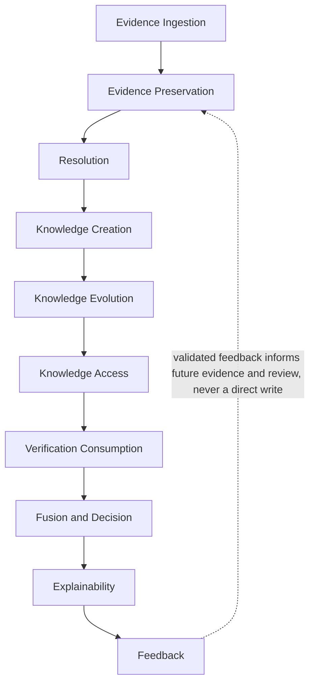
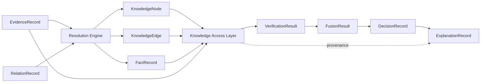

# NeuroVerify: Multimodal Neuro-Symbolic Misinformation Verification Platform
## Knowledge Management Subsystem — Integration Specification, Version 1.0

| | |
|---|---|
| **Document status** | Draft for review |
| **Location** | `docs/architecture/KNOWLEDGE_MANAGEMENT_INTEGRATION_SPEC_v1.0.md` |
| **Integrates (frozen, unmodified)** | Phase 4.1 — `KNOWLEDGE_GRAPH_SPEC_v1.0.md` (how knowledge is organized); Phase 4.2 — `EVIDENCE_STORE_SPEC_v1.0.md` (how evidence is preserved); Phase 4.3 — `GRAPH_RESOLUTION_ENGINE_SPEC_v1.0.md` (how knowledge evolves); Phase 4.4 — `KNOWLEDGE_ACCESS_LAYER_SPEC_v1.0.md` (how knowledge is consumed) |
| **Nature of this document** | A synthesis. It introduces no new subsystem, no new canonical object, and no new algorithm. Every claim in this document is a cross-reference to, not a restatement or reinterpretation of, its source phase |
| **Audience** | Engineers approaching the Knowledge Management subsystem for the first time — intended as the entry point read before the detailed Phase 4.1–4.4 specifications, not a substitute for them |

---

## 1. Purpose

### 1.1 Why This Document Exists

Phases 4.1 through 4.4 were each written to answer one question in
depth: how knowledge is organized (4.1), how evidence is preserved
(4.2), how knowledge evolves (4.3), and how knowledge is consumed (4.4).
Each document is complete and authoritative on its own subject. None of
them, individually, is written to answer a different, equally necessary
question: **how do all four work together, as one subsystem, end to
end?** An engineer who reads only Phase 4.3 will understand resolution
governance in detail but will not, from that document alone, see where
resolution sits relative to evidence ingestion or knowledge access. This
document exists to close that gap — to be the map that shows how the
four detailed documents fit together, without repeating what any of them
already says.

### 1.2 How This Document Complements 4.1–4.4

| Relationship | Description |
|---|---|
| No redefinition | Every canonical object, subsystem responsibility, and architectural rule in this document is cited to its source phase, never restated with new meaning |
| No new authority | Where this document and a source phase appear to differ, the source phase governs — this document is a reader's map, not a competing specification |
| Additive value | This document's contribution is exclusively the *connections* between 4.1–4.4 — the end-to-end lifecycle (§3), the responsibilities matrix (§4), the cross-subsystem data flows (§5), and the unified governance and principle summary (§6, §7) that no single source phase was scoped to provide |
| Reading order | This document is intended to be read first, as orientation, with each section pointing to the specific source-phase section that covers the corresponding detail in full |

---

## 2. Knowledge Management Overview

### 2.1 Subsystem Diagram

```
   Evidence Retrieval (Phase 2 §5.3)
          │
          ▼
   Evidence Store (Phase 4.2)
          │  governed, immutable evidentiary content
          ▼
   Resolution Engine (Phase 4.3)
          │  the platform's sole governed writer
          ▼
   Knowledge Graph (Phase 4.1)
          │  persistent semantic memory
          ▼
   Knowledge Access Layer (Phase 4.4)
          │  the platform's sole governed reader
          ▼
   ┌──────────────┬──────────────┬──────────────┐
   ▼              ▼              ▼              ▼
Verification   Fusion        Decision      Explainability
(Phase 2 §5.5) (Phase 2 §5.8) (Phase 2      (Phase 2 §5.9)
                               Addendum §6)
```

### 2.2 What Each Interaction Means

| Interaction | Governed by | Nature |
|---|---|---|
| Evidence Retrieval → Evidence Store | Phase 4.2 §3 (Evidence Lifecycle) | Ingestion — raw retrieved content becomes governed, permanent evidentiary record |
| Evidence Store → Resolution Engine | Phase 4.2 §11 / Phase 4.3 §2.3 | Read — the Resolution Engine consumes governed evidence as its raw material, never modifying the Evidence Store |
| Resolution Engine → Knowledge Graph | Phase 4.3 §1.3, §8 | Write — the *only* path by which the Knowledge Graph's state changes |
| Knowledge Graph → Knowledge Access Layer | Phase 4.1 §11 / Phase 4.4 §2.6 | Read — the Access Layer's only means of reaching Knowledge Graph content |
| Knowledge Access Layer → Verification/Fusion/Decision/Explainability | Phase 4.4 §10.3 | Read — every downstream reasoning module receives knowledge and evidence exclusively through this gateway |

### 2.3 The Shape of the Whole

Two properties, each established piecemeal across the four source
documents, become visible only when the subsystem is viewed as a whole:

1. **One directional flow, two governed gateways.** Content flows in
   exactly one direction — evidence in, knowledge out — through exactly
   two accountable chokepoints: the Resolution Engine (the sole writer,
   Phase 4.3 §1.3) and the Knowledge Access Layer (the sole reader
   gateway, Phase 4.4 §1.1). No other path into or out of the Knowledge
   Graph or Evidence Store exists anywhere in this architecture.
2. **Two passive stores, two active gateways.** The Knowledge Graph
   (Phase 4.1) and Evidence Store (Phase 4.2) hold state; the Resolution
   Engine (Phase 4.3) and Knowledge Access Layer (Phase 4.4) are the only
   subsystems that act on that state. This symmetry, first named
   explicitly in Phase 4.4 §1.4, is the Knowledge Management subsystem's
   defining architectural shape.

---

## 3. End-to-End Knowledge Lifecycle

### 3.1 One Continuous Lifecycle

Each source phase specifies its own internal lifecycle (Phase 4.2 §3,
Phase 4.3 §3–§4, Phase 4.4 §3). This section is the single continuous
thread connecting them — no stage below introduces new behavior; each
cites the source-phase stage(s) it summarizes.



### 3.2 Stage-by-Stage Summary

**Evidence Ingestion.** Content retrieved by Evidence Retrieval (Phase 2
§5.3) enters the Evidence Store's lifecycle at normalization and metadata
enrichment (Phase 4.2 §3.2, Stages 1–3).

**Evidence Preservation.** The Evidence Store deduplicates (Phase 4.2
§7), assesses trust (Phase 4.2 §6), and commits content as a permanent,
immutable record (Phase 4.2 §9.1, Stage 6), forming the Evidence
Repository (Phase 4.2 §2.4).

**Resolution.** The Resolution Engine reads governed evidence and current
Knowledge Graph state to perform entity matching, entity resolution,
relationship resolution, conflict detection, and version resolution
(Phase 4.3 §3.2, Stages 2–6).

**Knowledge Creation.** Confidence is aggregated (Phase 4.3 §3.2, Stage
7) and the graph update is executed (Phase 4.3 §3.2, Stage 8) — new or
updated `KnowledgeNode`/`KnowledgeEdge` objects are committed, and
`FactRecord`s are generated (Phase 4.3 §3.2, Stage 9).

**Knowledge Evolution.** Over time, and across many claims, this same
resolution process (Phase 4.3 §5–§9) accumulates corroboration,
supersedes outdated relationships (Phase 4.1 §9), and preserves conflicts
(Phase 4.1 §7, Phase 4.3 §7) — the graph's state is never static.

**Knowledge Access.** Any consumer needing knowledge or evidence issues a
request through the Knowledge Access Layer, which validates, routes,
looks up, resolves temporal scope, assembles confidence, and assembles
provenance before returning one coherent response (Phase 4.4 §3.2).

**Verification Consumption.** NLI Verification (Phase 2 §5.5) uses
`FactRecord` and `EvidenceRecord` content, retrieved through the Access
Layer, to determine a claim's stance (`VerificationResult`, Phase 3
§1.9).

**Fusion and Decision.** Fusion Intelligence and the Decision Engine
(Phase 2 §5.8, Addendum §6) consume `VerificationResult` — neither
touches Knowledge Graph or Evidence Store objects directly (Phase 4.1
§11.4, Phase 4.4 §10.3).

**Explainability.** The Explainability Engine (Phase 2 §5.9) renders the
already provenance-complete material the Access Layer assembled (Phase
4.4 §6.5) into a human-readable `ExplanationRecord` (Phase 3 §1.13).

**Feedback.** Where a user or reviewer disputes a verdict, the Feedback
Service (Phase 2 Addendum §3) draws on historical and provenance access
(Phase 4.4 §8.2, administrative category) to investigate — any resulting
correction re-enters the subsystem only as new, reviewed evidence or a
governed resolution event (Phase 4.3 §10.2), never as a direct edit to
existing knowledge or evidence.

### 3.3 Why This Is One Lifecycle, Not Ten

Every stage above depends on the one before it producing governed,
trustworthy output — evidence cannot be resolved before it is preserved;
knowledge cannot be accessed before it is created; a claim cannot be
explained before it is verified. The four source phases each specify
one or two stages in rigorous isolation; this section's contribution is
confirming that, laid end to end, they form exactly one lifecycle with
no gaps and no redundant paths.

---

## 4. Responsibilities Matrix

| Subsystem | Primary Responsibility | Reads | Writes | Produces | Consumes | Boundaries |
|---|---|---|---|---|---|---|
| **Evidence Store** (4.2) | Preserve evidentiary content permanently and governedly | Evidence Retrieval output | `ArticleRecord`, `EvidenceRecord` (append-only, Phase 4.2 §9.2) | Governed evidence, provenance, version history (Phase 4.2 §11.2) | Raw retrieved content | Never retrieves evidence itself; never ranks, verifies, or reasons (Phase 4.2 §12) |
| **Resolution Engine** (4.3) | Transform evidence into persistent knowledge | `EvidenceRecord`, `ArticleRecord`, `EntityRecord`, `RelationRecord`, current Knowledge Graph state (via the Access Layer, Phase 4.4 §10.3) | `KnowledgeNode`, `KnowledgeEdge` (append-only, Phase 4.3 §8) | `FactRecord`, resolution/conflict/version metadata (Phase 4.3 §12.2) | Governed evidence | The Knowledge Graph's sole writer (Phase 4.3 §1.3); never verifies claims or determines truth (Phase 4.3 §13) |
| **Knowledge Graph** (4.1) | Hold persistent semantic knowledge | — (passive) | — (written to exclusively by the Resolution Engine) | `KnowledgeNode`, `KnowledgeEdge`, `FactRecord` as durable state | Resolution Engine writes | Never updates itself (Phase 4.3 §1.3); never reasons about truth (Phase 4.1 §12) |
| **Knowledge Access Layer** (4.4) | Serve governed reads to every consumer | Knowledge Graph, Evidence Store | — (strictly read-only, Phase 4.4 §2.3) | Knowledge/evidence responses, provenance chains, confidence metadata, historical views, conflict metadata (Phase 4.4 §10.2) | Access requests from every downstream consumer | The stores' sole read gateway (Phase 4.4 §1.1); never modifies, resolves, or reasons (Phase 4.4 §11) |
| **Verification** (Phase 2 §5.5) | Determine claim stance against facts | `FactRecord`, `EvidenceRecord` (via Access Layer) | — | `VerificationResult` | `ClaimRecord`, knowledge/evidence responses | Never writes to Knowledge Graph or Evidence Store |
| **Fusion** (Phase 2 §5.8) | Combine module outputs into one synthesis | `VerificationResult` and other module outputs (Phase 3 §3.2) | — | `FusionResult`, `ReasoningRecord` | `VerificationResult` | Never touches Knowledge Graph/Evidence Store objects directly (Phase 4.1 §11.4) |
| **Decision** (Phase 2 Addendum §6) | Apply policy/thresholds to fusion output | `FusionResult` | — | `DecisionRecord` | `FusionResult` | Never touches knowledge-layer objects directly |
| **Explainability** (Phase 2 §5.9) | Render reasoning into human-readable form | `DecisionRecord`, provenance chains (via Access Layer) | — | `ExplanationRecord`, `Verdict` | `DecisionRecord`, assembled provenance | Never assembles provenance itself (Phase 4.4 §6.3); never makes new reasoning decisions |

Every "Boundaries" cell above is a citation to its source phase's
Non-Goals section, not a new rule introduced by this document.

---

## 5. Cross-Subsystem Data Flow

### 5.1 Purpose

Where §4 shows what each subsystem does, this section traces
individual canonical objects across subsystem boundaries — showing, for
each object, where it originates, what transforms it, and where it
terminates. Every object below retains exactly its Phase 3 (or Phase
4.1) definition; only its journey through the subsystem is new here.

### 5.2 `EvidenceRecord` Flow

```
Evidence Retrieval → Evidence Store (governed, permanent) → Resolution Engine (read) → Knowledge Access Layer (read, for provenance) → Explainability Engine (citation)
```
Governed by Phase 4.2 §3 (creation), §9 (immutability). Never written to
by any subsystem after initial commitment.

### 5.3 `RelationRecord` Flow

```
Knowledge Representation extraction (Phase 2 §5.4) → Resolution Engine (Stage 4, relationship resolution) → aggregated into KnowledgeEdge.supporting_relation_record_ids
```
Governed by Phase 4.3 §6. Ephemeral at the mention layer (Phase 4.1
§2.1); its contribution persists only via accumulation into a
`KnowledgeEdge`.

### 5.4 `KnowledgeNode` Flow

```
Resolution Engine (creation or append-only update, Phase 4.3 §8.3) → Knowledge Graph (persistent) → Knowledge Access Layer (read) → every downstream consumer
```
Governed by Phase 4.1 §1.6 (definition), Phase 4.3 §5 (resolution),
Phase 4.4 §4.7 (lookup).

### 5.5 `KnowledgeEdge` Flow

```
Resolution Engine (creation, reuse, or version resolution, Phase 4.3 §6, §8.4) → Knowledge Graph (persistent, temporally versioned) → Knowledge Access Layer (read, current or historical) → Verification / Fusion (via VerificationResult)
```
Governed by Phase 4.1 §1.7, §9 (temporal model), Phase 4.3 §6, §8.4.

### 5.6 `FactRecord` Flow

```
Resolution Engine (generation, Phase 4.3 §3.2 Stage 9) → Knowledge Graph → Knowledge Access Layer (Fact Lookup, Phase 4.4 §5.4) → NLI Verification → VerificationResult.evidence_ids
```
Governed by Phase 3 §1.8 (definition), Phase 4.1 §2.3 (Fact Layer role),
Phase 4.3 §8.5 (never updated — regenerated fresh when underlying state
changes).

### 5.7 `VerificationResult` Flow

```
NLI Verification (Phase 2 §5.5) → Fusion Intelligence (Phase 2 §5.8) → FusionResult.contributing_result_ids
```
Entirely outside the Knowledge Management subsystem's write/read
gateways (§2.3) — this object never touches the Knowledge Graph or
Evidence Store directly; it is the *product* of consuming them.

### 5.8 `DecisionRecord` Flow

```
Decision Engine (Phase 2 Addendum §6) → Explainability Engine → ExplanationRecord.decision_record_id
```
Likewise entirely downstream of the Knowledge Management subsystem —
included here to show where the subsystem's responsibility ends: at
`FactRecord`/`VerificationResult`, not beyond.

### 5.9 `ExplanationRecord` Flow

```
Explainability Engine ← provenance chains, confidence metadata, evidence citations (Knowledge Access Layer, Phase 4.4 §6) ← Knowledge Graph + Evidence Store
```
Shown in reverse to emphasize the point Phase 4.4 §6.5 establishes: an
`ExplanationRecord`'s citations are only as trustworthy as the Knowledge
Management subsystem's provenance guarantees (§7) all the way back to
original evidence.

### 5.10 Combined View



---

## 6. Architectural Principles

### 6.1 The Complete Principle Set

Every principle below was established in one or more of the four source
phases. This section's contribution is collecting them into one place
and showing that they are mutually reinforcing, not independent rules
that happen to coexist.

| Principle | Established in | Summary |
|---|---|---|
| One writer | Phase 4.3 §1.3 | The Resolution Engine is the Knowledge Graph's sole writer |
| One reader (gateway) | Phase 4.4 §1.1 | The Knowledge Access Layer is the sole gateway for reading the Knowledge Graph and Evidence Store |
| Evidence is immutable | Phase 4.2 §9.1 | Once stored, evidentiary content is never altered |
| Knowledge is append-only | Phase 4.1 §3.3, Phase 4.3 §8.1 | Graph updates only add; they never delete or destructively modify |
| History is permanent | Phase 4.1 §9.5, Phase 4.2 §8.3 | Superseded knowledge and evidence versions remain permanently accessible |
| Updates are deterministic | Phase 4.3 §8.8 | The same evidence, against the same graph state, always produces the same update |
| Reads are deterministic | Phase 4.4 §7.2 | The same request, against the same state, always produces the same response |
| Provenance is never lost | Phase 4.1 §8, Phase 4.2 §5, Phase 4.3 §6.6 | Every node, edge, fact, and evidence item is traceable to its origin |
| Conflicts are preserved | Phase 4.1 §7, Phase 4.3 §7.4 | Disagreeing knowledge coexists; neither side is discarded or silently resolved |
| Confidence evolves | Phase 4.3 §9.5 | Confidence is recomputed continuously as corroborating evidence accumulates, never fixed at creation |
| Explainability by construction | Phase 4.4 §6.5 | Every response includes its provenance and confidence by default, not as an optional extra |
| Governance everywhere | Phase 4.2 §9, Phase 4.3 §10, Phase 4.4 §7.5 | Every subsystem separates governance (custody, access control) from reasoning (truth, relevance) |
| Subsystems remain loosely coupled | §2.3 of this document | Each of the four subsystems depends only on well-defined canonical objects and interface contracts, never on another subsystem's internal structure |

### 6.2 How the Principles Reinforce Each Other

These are not eleven independent rules — they form two mutually
dependent chains:

- **The immutability chain**: evidence is immutable (Phase 4.2) →
  knowledge built from it is append-only (Phase 4.1, 4.3) → history is
  therefore permanent (4.1, 4.2) → which is what makes deterministic
  reads (4.4) and reproducibility (§7.4) possible at all. Break any link
  — allow evidence to be edited, or knowledge to be overwritten — and
  every principle downstream of it stops holding.
- **The accountability chain**: one writer (4.3) and one reader (4.4)
  are what make governance (§7) and auditability enforceable at a single
  point each, rather than scattered across every subsystem that might
  otherwise touch the stores directly — which is what makes
  explainability by construction (4.4) achievable, since a response can
  only be reliably provenance-complete if there is exactly one place
  responsible for assembling it correctly, every time.

---

## 7. Governance Model

### 7.1 Four Governance Layers, One Model

Each source phase specifies its own governance mechanism, scoped to its
own subsystem. Viewed together, they form one coherent governance model
spanning the entire Knowledge Management subsystem:

| Layer | Source | Governs |
|---|---|---|
| Evidence governance | Phase 4.2 §9 | Immutability, retention, chain of custody, integrity, and authenticity of stored evidence |
| Resolution governance | Phase 4.3 §10 | Human oversight of merges/splits/conflicts, rollback-as-correction, deterministic resolution, resolution traceability |
| Access governance | Phase 4.4 §7, §8 | Read consistency, access auditing, access policy enforcement by consumer category |
| Feedback governance | Phase 2 Addendum §3 | Human validation gate for user-reported issues, before any correction re-enters the subsystem |

### 7.2 Auditability

Every layer above feeds the same shared Event Logger (Phase 2 Addendum
§2.4) rather than maintaining a separate logging mechanism — this choice
is made independently but identically in Phase 4.2 §9.3, Phase 4.3
§10.4, and Phase 4.4 §7.4. The practical consequence: a single,
consistent audit trail spans evidence ingestion, resolution decisions,
and access requests, queryable through one shared observability
subsystem rather than four disconnected logs.

### 7.3 Human Review

Human review is not one mechanism reused four times — it is one
consistent *pattern* applied at each layer's own decision points:

| Layer | Human review trigger |
|---|---|
| Evidence | Trust-tier classification disputes (Phase 4.2 §6.8) |
| Resolution | Ambiguous entity resolution, high-stakes merges, all splits, high-stakes conflicts (Phase 4.3 §5.8, §7.5) |
| Access | Not routine — administrative-category access exists precisely to let reviewers investigate the other three layers (Phase 4.4 §8.2) |
| Feedback | Every user-reported issue, before any correction proceeds (Phase 2 Addendum §3.4) |

### 7.4 Traceability and Reproducibility

Because every layer's governance is itself logged (§7.2) and every
canonical object carries lineage back to its origin (§6.1's provenance
principle), the subsystem provides a three-part reproducibility
guarantee, assembled here from parts each source phase establishes
separately: reproducible evidence (Phase 4.2 §5.5), reproducible
resolution (Phase 4.3 §10.5), and reproducible access (Phase 4.4 §7.6).
Together, these mean any past `Verdict` can, in principle, be fully
reconstructed — not merely re-explained, but re-derived from the exact
evidence, resolution decisions, and knowledge state that originally
produced it.

### 7.5 How the Layers Complement One Another

No single governance layer is sufficient alone. Evidence governance
without resolution governance would guarantee trustworthy inputs but
say nothing about whether they were transformed into knowledge
correctly. Resolution governance without access governance would
guarantee correct graph updates but leave every consumer free to read
that graph inconsistently or without audit. Access governance without
evidence and resolution governance would guarantee consistent reads of
potentially ungoverned content. The four layers are only complete
together — which is precisely why this document exists: no single
Phase 4.x document was scoped to state that completeness explicitly.

---

## 8. Integration Contracts

### 8.1 Purpose

This section states, in one place, the conceptual contract each
subsystem boundary already established individually (Phase 4.1 §11,
Phase 4.2 §11, Phase 4.3 §12, Phase 4.4 §10) — no new contract is
introduced; this is a consolidated index.

### 8.2 Evidence Store ↔ Resolution Engine

| | |
|---|---|
| Direction | Resolution Engine reads from Evidence Store only |
| What crosses | `ArticleRecord`, `EvidenceRecord` |
| Governing sections | Phase 4.2 §11.2 (produces), Phase 4.3 §2.3 (consumes) |
| Nature of contract | The Evidence Store guarantees immutability and completeness of what it exposes; the Resolution Engine guarantees it never writes back |

### 8.3 Resolution Engine ↔ Knowledge Graph

| | |
|---|---|
| Direction | Resolution Engine writes to and reads from the Knowledge Graph |
| What crosses | `KnowledgeNode`, `KnowledgeEdge`, `FactRecord` |
| Governing sections | Phase 4.3 §8 (update strategy), Phase 4.1 §3.3 (permitted mutation scope) |
| Nature of contract | The Resolution Engine guarantees every write is append-only, deterministic, and provenance-complete; the Knowledge Graph guarantees it accepts writes from no other source |

### 8.4 Knowledge Graph / Evidence Store ↔ Knowledge Access Layer

| | |
|---|---|
| Direction | Access Layer reads from both; writes to neither |
| What crosses | `KnowledgeNode`, `KnowledgeEdge`, `FactRecord`, `EvidenceRecord`, `ArticleRecord` |
| Governing sections | Phase 4.4 §2.6, §10.1 |
| Nature of contract | Both stores guarantee consistent, current-and-historical state is available to read; the Access Layer guarantees it never mutates either |

### 8.5 Knowledge Access Layer ↔ Downstream Reasoning Modules

| | |
|---|---|
| Direction | Downstream modules request; the Access Layer responds |
| What crosses | Knowledge/evidence responses, provenance chains, confidence metadata, historical views, conflict metadata |
| Governing sections | Phase 4.4 §10.3 |
| Nature of contract | The Access Layer guarantees every response is provenance-complete and deterministic; downstream modules guarantee they never bypass it to reach the stores directly |

### 8.6 Conceptual, Not Technical

Every contract above is stated purely in terms of which canonical
objects cross which boundary, and what each side guarantees the other —
no protocol, format, or technology is specified, consistent with every
source phase's identical constraint.

---

## 9. Scalability View

### 9.1 One Combined Growth Picture

Each source phase specifies its own subsystem's scalability
considerations (Phase 4.1 §10, Phase 4.2 §10, Phase 4.3 §11, Phase 4.4
§9). This section's contribution is showing that they describe one
consistent, compounding growth picture rather than four separate ones.

| Dimension | Grows with | Source |
|---|---|---|
| Evidence volume | Claims processed × sources retrieved per claim | Phase 4.2 §10.1 |
| Graph size (nodes/edges) | Distinct entities and relationships encountered, net of resolution | Phase 4.1 §10.1 |
| Resolution workload | Incoming evidence rate × existing graph size (candidate search) | Phase 4.3 §11.1 |
| Access query volume | Every downstream module's request rate, compounding across all consumers | Phase 4.4 §9.1 |

### 9.2 Why Growth Is Incremental Throughout

Every stage of the lifecycle (§3) is individually incremental — evidence
ingestion doesn't reprocess prior evidence (Phase 4.2 §10.3), resolution
doesn't reprocess the whole graph (Phase 4.3 §11.2), and access doesn't
require the stores to be reorganized to serve a new query shape (Phase
4.4 §9.1). This means the subsystem's growth is, end to end, incremental
by construction — no stage in the lifecycle requires a full
reprocessing pass as the platform scales, a property that only becomes
visible when every stage's individual incrementality (each established
separately in its own phase) is viewed together.

### 9.3 Concurrent Reads and Writes

The one-writer/one-reader-gateway shape (§2.3) is what makes concurrency
tractable across the whole subsystem: the Resolution Engine's
determinism guarantee must hold under concurrent claim processing (Phase
4.3 §11.3); the Access Layer's consistency guarantee must hold under
concurrent requests without blocking those writes (Phase 4.4 §9.2).
Because there is exactly one writer and one reader gateway, this is two
well-defined concurrency problems, not an unbounded number of
independent ones each subsystem-pair would otherwise need to solve
pairwise.

### 9.4 Future Distributed Architecture

Every source phase independently anticipates a future distributed
implementation while remaining implementation-agnostic about it (Phase
4.1 §10.3, Phase 4.2 §10.5, Phase 4.3 §11.6, Phase 4.4 §9.5). The
consistent requirement across all four: **logical single-writer and
single-reader-gateway semantics must be preserved even if the physical
implementation is distributed.** This document adds no new distribution
strategy — it confirms the same requirement was independently reached
from four different angles, which is a strong signal that it is a
correct, load-bearing constraint for any future implementation phase to
respect.

---

## 10. Non-Goals

### 10.1 What This Document Does Not Do

| Non-goal | Clarification |
|---|---|
| Does not redefine subsystems | Every responsibility, boundary, and canonical object referenced in this document retains exactly its definition from Phase 4.1, 4.2, 4.3, or 4.4 |
| Does not replace subsystem specifications | An engineer implementing any one subsystem must still read that subsystem's full Phase 4.x document — this document is orientation, not a substitute for the detail those documents contain |
| Does not introduce implementation | No storage technology, query language, protocol, or algorithm is named or implied anywhere in this document, consistent with every source phase's identical constraint |
| Does not introduce algorithms | Matching, resolution, ranking, and confidence computation remain exactly as unspecified here as in their source phases — this document describes *that* these processes exist and *where* they sit, never *how* they compute their results |

### 10.2 Why This Document's Scope Stays Narrow

This document's entire value is in being a trustworthy map — if it
introduced even small new interpretations of subsystem behavior, it
would create a second, competing source of truth alongside the four
frozen specifications it is meant to help readers navigate. Keeping this
document strictly integrative, with every substantive claim traceable to
a specific source-phase section, is what allows it to serve as the
Knowledge Management subsystem's entry point without ever risking
contradiction of the documents it introduces.

---

*End of Knowledge Management Subsystem Integration Specification, Version 1.0.*
*This document integrates, and does not alter, the frozen Phase 4.1*
*(`KNOWLEDGE_GRAPH_SPEC_v1.0.md`), Phase 4.2 (`EVIDENCE_STORE_SPEC_v1.0.md`),*
*Phase 4.3 (`GRAPH_RESOLUTION_ENGINE_SPEC_v1.0.md`), and Phase 4.4*
*(`KNOWLEDGE_ACCESS_LAYER_SPEC_v1.0.md`) documents.*

---

## Appendix A: Reading Guide

### A.1 Suggested Reading Order

This document is designed to be read first. After it, the suggested
order through the detailed specifications follows the direction content
actually flows (§2.1), so each document's subject matter builds on
context the previous one has already established:

| Order | Document | Read this to understand |
|---|---|---|
| 1 | This document | The whole subsystem's shape, before any detail |
| 2 | `EVIDENCE_STORE_SPEC_v1.0.md` (4.2) | How evidence enters and is permanently governed |
| 3 | `GRAPH_RESOLUTION_ENGINE_SPEC_v1.0.md` (4.3) | How that evidence becomes knowledge |
| 4 | `KNOWLEDGE_GRAPH_SPEC_v1.0.md` (4.1) | The shape and organization of the knowledge that results |
| 5 | `KNOWLEDGE_ACCESS_LAYER_SPEC_v1.0.md` (4.4) | How every other part of the platform reads it |

Phase 4.1 is read third rather than first in this suggested order,
despite being numbered first among the Phase 4.x documents, because its
subject — the *shape* of persistent knowledge — is easier to absorb
once the reader has already seen, from Phase 4.3, how that knowledge
comes to exist. Both orderings are valid; this one is a reading
suggestion, not a dependency requirement — each of the four documents
is independently self-contained and citable on its own.

### A.2 Where to Look for a Specific Question

| If you need to know... | Go to |
|---|---|
| What counts as evidence, and how it's categorized | Phase 4.2 §1, §4 |
| What a `KnowledgeNode`/`KnowledgeEdge` means and how nodes/relationships are categorized | Phase 4.1 §2, §3, §4 |
| How a duplicate entity gets merged, or a conflict gets preserved | Phase 4.3 §5, §7 (mechanism) and Phase 4.1 §6, §7 (philosophy) |
| How to query for a fact, a relationship, or historical state | Phase 4.4 §5 |
| Why the platform trusts (or doesn't trust) a given source | Phase 4.2 §6 |
| How a past verdict could be reproduced or audited | This document §7.4, then Phase 4.2 §5.5, Phase 4.3 §10.5, Phase 4.4 §7.6 |
| Who is allowed to update the graph, and how | Phase 4.3 §1.3, §10 |
| Who is allowed to read the graph, and how | Phase 4.4 §8 |

### A.3 What Not to Look For Here

This document contains no field-level schema (see Phase 3 for canonical
object definitions), no worked resolution examples beyond what §3, §5
summarize (see Phase 4.1 §6.6, Phase 4.3 §3–§7 for full detail), and no
governance procedure detail beyond the consolidated view in §7 (see
Phase 4.2 §9, Phase 4.3 §10, Phase 4.4 §7–§8 for the complete
procedures). Its purpose is orientation and cross-reference, not
exhaustive coverage of any single subject — that exhaustiveness belongs
entirely to the four documents it introduces.
