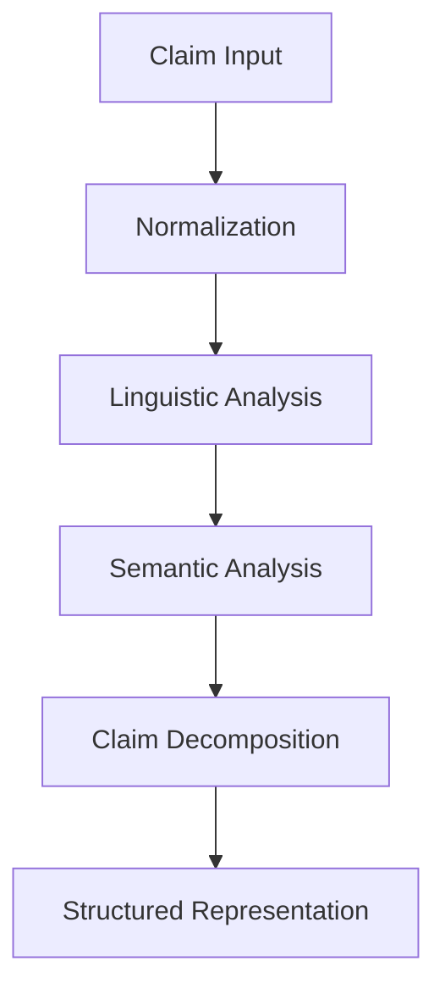

# NeuroVerify: Multimodal Neuro-Symbolic Misinformation Verification Platform
## Claim Analysis Engine — Conceptual Architecture Specification, Version 1.0

| | |
|---|---|
| **Document status** | Draft for review |
| **Location** | `docs/architecture/PHASE_5/CLAIM_ANALYSIS_ENGINE_SPEC_v1.0.md` |
| **Phase** | Phase 5 — Verification Intelligence (first subsystem) |
| **Builds on (frozen, unmodified)** | Phase 2 — `ARCHITECTURE_SPEC.md` v1.0 and `ADDENDUM_v1.1.md`; Phase 3 — `KNOWLEDGE_REPRESENTATION_SPEC_v1.0.md`; Phase 4.1–4.4 — Knowledge Graph, Evidence Store, Graph Resolution & Update Engine, Knowledge Access Layer |
| **Nature of this document** | Conceptual architecture only. It defines what the Claim Analysis Engine understands about a claim and why — not the linguistic algorithms, models, or techniques that perform that understanding |
| **Explicitly excluded** | Code, pseudocode, algorithms, NLP models, technology choices, APIs, implementation schemas, mathematical formulas |
| **Audience** | Engineers who will implement the Claim Analysis Engine and every downstream Phase 5 subsystem that consumes its output |

This document does not redefine any canonical object. `ClaimRecord`
(Phase 3 §1.2) retains exactly its existing field definition,
validation rules, and lifecycle behavior — it is this document's sole
input, unchanged. This document does not redefine Claim Extraction
(Phase 2 §5.1), Evidence Retrieval (Phase 2 §5.3), NLI Verification
(Phase 2 §5.5), or any subsystem responsibility fixed in Phase 2, 3, or
4. Its sole subject is a new Phase 5 subsystem — the Claim Analysis
Engine — and the conceptual output object it introduces,
`StructuredClaim`.

---

## 1. Purpose

### 1.1 What the Claim Analysis Engine Is

The Claim Analysis Engine is the entry point of Verification
Intelligence (Phase 5). It receives a `ClaimRecord` — already extracted,
already atomic-in-principle, already tagged `checkable` (Phase 3 §1.2,
Phase 2 §2.1–§2.3) — and produces a much richer, structured semantic
understanding of that claim: what it actually asserts, in what
grammatical and logical form, about which entities, relationships,
quantities, and time frame, with what certainty of interpretation, and
with precisely what should be targeted for verification. Its
responsibility is **understanding**, not **verification** — it answers
"what does this claim mean and what would it take to check it," never
"is this claim true."

### 1.2 Why Claim Understanding Is Separated From Verification

This separation is the same neuro-symbolic principle that has organized
every phase of this platform (Phase 2 §0.2; restated at the knowledge
layer in Phase 4.1 §12.2, Phase 4.2 §12.2, Phase 4.3 §1.4, Phase 4.4
§1.4), applied here to the very first step of verification intelligence:

| Reason | Explanation |
|---|---|
| Understanding and verification are different kinds of task | Determining that a claim asserts "Person A holds Role R at Organization O as of date D" is a linguistic/semantic task with a correct answer independent of whether that assertion is true. Determining whether it *is* true is an evidentiary and logical task. Conflating them risks letting an engine's confidence in its own *parsing* leak into confidence about the world — a different and more dangerous kind of error than a parsing mistake alone |
| A shared, high-quality understanding benefits every downstream module identically | Evidence Retrieval, NLI Verification, and any future Phase 5 reasoning subsystem all need to know what a claim is about. If each independently interpreted the raw claim text, their interpretations could silently diverge — the same failure mode Phase 4.1 §1.4 and Phase 4.4 §1.2 identify for knowledge and evidence access, now addressed at the claim-understanding stage before verification even begins |
| Errors of understanding must be visible as understanding errors, not verification errors | If a claim is misunderstood (an ambiguous pronoun resolved incorrectly, a negation missed), the resulting verdict is wrong for a reason that has nothing to do with the quality of evidence or reasoning. Keeping understanding as its own accountable stage, with its own explicit output (§5), means this class of error is visible and attributable at its true source, consistent with this platform's founding explainability commitment (Phase 2 §10) |
| Determinism at the understanding layer supports determinism everywhere downstream | Phase 4.3 §8.8 and Phase 4.4 §7.2 established deterministic writes and reads as load-bearing platform properties. A claim's structured understanding is the first input every downstream reasoning step depends on — if that understanding were unstable or inconsistent, no downstream determinism guarantee could hold regardless of how rigorously it was engineered |

### 1.3 What This Buys the Rest of Verification Intelligence

By fully resolving a claim's structure — its entities, relations,
temporal and numerical content, modality, polarity, ambiguity, and exact
verification scope — before any evidence is sought, every downstream
Phase 5 subsystem receives a claim already reduced to precisely what
needs to be checked, in a form suited to targeted, efficient evidence
retrieval and reasoning, rather than raw natural language each
subsystem would otherwise need to reinterpret independently.

---

## 2. Position in Overall Architecture

### 2.1 Position Diagram

```
   Claim Extraction (Phase 2 §5.1)
          │
          │  ClaimRecord (Phase 3 §1.2)
          ▼
   Claim Analysis Engine (this document)
          │
          │  StructuredClaim (§5)
          ▼
   Evidence Retrieval Strategy (Phase 5, next subsystem)
          │
          ▼
   Evidence Retrieval (Phase 2 §5.3) → NLI Verification (Phase 2 §5.5) → ...
```

### 2.2 Relationship to Claim Extraction

Claim Extraction (Phase 2 §5.1) segments raw input into atomic,
`checkable`-tagged `ClaimRecord` objects, with basic entity and temporal
tagging already populated (Phase 3 §1.2's `entity_ids`,
`temporal_context` fields). The Claim Analysis Engine does not repeat or
second-guess this segmentation — it never re-decides `checkable` status,
never merges or discards a `ClaimRecord`, and never creates new
`ClaimRecord` objects. It takes each `ClaimRecord` Claim Extraction has
already produced and analyzes it far more deeply than that upstream
stage's basic tagging requires, producing an entirely separate,
non-canonical output object (§5) rather than modifying the input in any
way — `ClaimRecord` remains, after this engine runs, exactly what
Claim Extraction produced (Phase 3 §0.3's immutability principle applies
here as it does everywhere else in this platform).

### 2.3 Relationship to Evidence Retrieval Strategy

The Claim Analysis Engine's output, `StructuredClaim`, is consumed by
Evidence Retrieval Strategy — the next Phase 5 subsystem, responsible for
deciding *how* to search for evidence given a claim's specific structure
(out of scope for this document). This document's boundary ends exactly
at producing `StructuredClaim`; how that structure informs retrieval
strategy, and how Evidence Retrieval (Phase 2 §5.3) itself operates,
belong to that subsystem's own specification.

### 2.4 Subsystem Boundaries

| Boundary | Statement |
|---|---|
| Upstream boundary | The Claim Analysis Engine's only input is a single `ClaimRecord` (§7.2) — it never reads `RawInput`, `ArticleRecord`, or any other upstream object directly |
| Downstream boundary | The Claim Analysis Engine's only output is `StructuredClaim` (§5) — it never writes to, or reads from, the Knowledge Graph, Evidence Store, or Knowledge Access Layer (§2.5) |
| Lateral boundary | The Claim Analysis Engine does not invoke, depend on, or coordinate with Evidence Retrieval, NLI Verification, or any other Phase 2/5 reasoning module — its relationship to them is entirely producer-to-consumer, one direction, through `StructuredClaim` alone |

### 2.5 Why This Engine Never Accesses the Knowledge Graph Directly

Consistent with Phase 4.4 §1.1's single-gateway principle — every
consumer of persistent knowledge reads through the Knowledge Access
Layer, never the Knowledge Graph or Evidence Store directly — the Claim
Analysis Engine in fact needs **no persistent knowledge or evidence
access at all**. Its task is entirely self-contained: understanding what
a claim's own text asserts requires nothing beyond that text (and the
`ClaimRecord` fields already populated around it). This makes the engine
a natural, clean example of Phase 4.4 §1.1's boundary working as
intended — a subsystem with no legitimate need for persistent knowledge
has no access path to it whatsoever, rather than an unused access path
sitting available for future misuse.

### 2.6 Statelessness

The Claim Analysis Engine holds no memory between invocations — each
`ClaimRecord` is analyzed entirely on its own terms, with no dependency
on any prior claim's analysis. This is a stronger isolation property
than most Phase 2/4 subsystems require, and it exists because nothing
about understanding one claim's structure should ever depend on what
claims came before it — a property directly required by the
determinism principle this document reinforces throughout (§6.2).

---

## 3. Responsibilities

### 3.1 Claim Normalization

Bringing the claim's text into a consistent form suitable for
downstream linguistic and semantic analysis — resolving surface-level
inconsistencies (irregular punctuation, inconsistent quotation
conventions, stray formatting artifacts surviving from Claim Extraction,
Phase 2 §5.1) without altering the claim's asserted meaning in any way.
Normalization is conservative by design, mirroring the same restraint
Phase 1's `text_cleaning.py` philosophy already established at the data
layer: clean the form, never the substance.

### 3.2 Language Identification

Determining the claim's language, extending the `language` field
`ClaimRecord` already carries (Phase 3 §1.2) with the confirmation and
precision downstream linguistic analysis (§3.3–§3.8) requires. Language
identification is foundational — every subsequent responsibility in this
section depends on knowing which language's grammar, idiom, and
convention apply.

### 3.3 Entity Recognition

Identifying every entity mentioned within the claim's text — a deeper
pass than Claim Extraction's basic `entity_ids` tagging (Phase 3 §1.2),
resolving each mention's span, surface form, and apparent type within the
claim's own local context. This responsibility produces the raw material
for the Entities component of `StructuredClaim` (§5.3) — it is
**not** entity resolution against the Knowledge Graph's canonical
identities (Phase 4.3 §5), which remains exclusively the Resolution
Engine's responsibility, performed later, by a different subsystem, with
access this engine deliberately lacks (§2.5).

### 3.4 Relation Identification

Identifying the relationships the claim asserts between its recognized
entities (and between entities and numerical or temporal values) —
answering "what does this claim say relates to what," independent of
whether that relationship is true. This is the semantic core of most
claims (Phase 2 §2.2's `entity_relation` claim type exists precisely
because so much of what is checkable takes this shape) and produces the
Relations component of `StructuredClaim` (§5.4).

### 3.5 Temporal Understanding

Identifying every temporal expression in the claim — dates, durations,
relative time references ("last year," "since the merger") — and
resolving them, where possible, to the precision the claim itself
supports. This extends `ClaimRecord.temporal_context` (Phase 3 §1.2,
a single field) into a fuller structural account of every temporal
element the claim actually contains, which may be more than one (a claim
can assert something about one time while referencing another, e.g. "the
policy announced in March takes effect in July").

### 3.6 Numerical Understanding

Identifying quantities, statistics, percentages, and other numerical
content the claim asserts, along with their units and the entities or
relations they modify — directly relevant to Phase 2 §2.2's `statistical`
claim type, and essential for Evidence Retrieval Strategy to know that a
specific number, not merely a general topic, needs to be matched against
evidence.

### 3.7 Coreference Resolution

Resolving pronouns and other referring expressions within the claim's
own text to the entities they refer to (e.g. "the senator... she voted
against it" — resolving "she" and "it" to their respective referents
already identified per §3.3). This is scoped strictly to the claim's own
internal text — it never reaches into external context, prior claims, or
the Knowledge Graph to resolve a reference; where a reference cannot be
resolved from the claim's own text alone, this is recorded as an
ambiguity (§3.8), never guessed.

### 3.8 Ambiguity Detection

Identifying places where the claim's meaning is genuinely underspecified
or admits more than one plausible reading — an unresolved coreference
(§3.7), a vague temporal reference, an entity mention too generic to
identify confidently. Consistent with this platform's honesty-under-
uncertainty principle (Phase 2 §6.5, extended to entity resolution in
Phase 4.1 §6.4 and to evidence trust in Phase 4.2 §6.1), ambiguity is
recorded explicitly as a first-class part of the claim's structured
understanding (§5.9) — never silently resolved by an arbitrary default
interpretation.

### 3.9 Atomic Claim Decomposition

Even a `ClaimRecord` that Claim Extraction has already treated as atomic
(Phase 2 §2.1) can, on closer semantic analysis, contain more than one
independently checkable proposition (e.g. "the senator, who voted
against the bill, later apologized" asserts both a vote and a subsequent
apology). This responsibility identifies such internal structure and
represents it explicitly within `StructuredClaim` (§5.10) — it does
**not** create new `ClaimRecord` objects, re-invoke Claim Extraction, or
alter the canonical claim boundary Phase 2 §2.1 already established; it
produces an internal semantic decomposition that Evidence Retrieval
Strategy can use to know multiple sub-propositions may need independent
evidence, entirely within the scope of the one `ClaimRecord` this engine
was given.

### 3.10 Verification Scope Identification

Determining, within an already-`checkable` claim (Phase 3 §1.2), exactly
which part of its asserted content is the target of verification, as
distinct from surrounding framing, context, or incidental detail that
does not itself require checking. This responsibility does not revisit
*whether* the claim is checkable (Phase 2 §2.1–§2.3's determination,
already made upstream) — it refines *what precisely, within a checkable
claim, evidence must speak to*, which is the final, most consequential
component of `StructuredClaim` (§5.11) and the primary signal Evidence
Retrieval Strategy depends on.

---

## 4. Processing Lifecycle

### 4.1 Lifecycle Diagram



### 4.2 Stage-by-Stage Explanation

**Stage 1 — Claim Input.** A single `ClaimRecord` (Phase 3 §1.2) enters
the engine. No other object is consumed at this or any later stage
(§2.4).

**Stage 2 — Normalization.** The claim's text is brought into consistent
form (§3.1), and its language is confirmed (§3.2) — establishing the
stable foundation every subsequent stage depends on.

**Stage 3 — Linguistic Analysis.** Entity recognition (§3.3) and
coreference resolution (§3.7) are performed against the normalized text
— establishing *what* the claim mentions and *how those mentions relate
to each other referentially*, before any attempt is made to interpret
what the claim asserts about them.

**Stage 4 — Semantic Analysis.** Relation identification (§3.4),
temporal understanding (§3.5), and numerical understanding (§3.6) are
performed, building on the entities and resolved references Stage 3
established — this is where the claim's actual asserted content takes
structured shape. Ambiguity detection (§3.8) runs alongside this stage,
flagging any point where Stage 3 or Stage 4's analysis could not reach a
confident, singular interpretation.

**Stage 5 — Claim Decomposition.** With the claim's full semantic content
now structured, atomic claim decomposition (§3.9) identifies whether that
content in fact contains more than one independently checkable
proposition, and verification scope identification (§3.10) determines
precisely what within the claim (or each decomposed sub-proposition)
must be the target of evidence-based checking.

**Stage 6 — Structured Representation.** Every stage's output is
assembled into one coherent `StructuredClaim` (§5), ready for Evidence
Retrieval Strategy to consume.

### 4.3 Why This Ordering Matters

| Ordering constraint | Why it must hold |
|---|---|
| Normalization before any analysis | Every later stage depends on stable, consistently-formed text — analyzing un-normalized text risks inconsistent results for claims that differ only in incidental formatting |
| Linguistic Analysis before Semantic Analysis | Relations, temporal expressions, and numerical expressions are frequently expressed *in terms of* entities and coreferential structure — resolving "what does 'it' refer to" before "what relation does the claim assert about it" is a strict prerequisite, not a convenience |
| Ambiguity Detection alongside, not after, Semantic Analysis | Ambiguity is a property *of* the semantic analysis process itself (where it could not reach a confident interpretation) — detecting it as a separate, later pass would require re-deriving the same uncertainty Stage 4 already encountered |
| Claim Decomposition after Semantic Analysis | Recognizing that a claim contains multiple independent propositions requires first understanding its full relational and temporal structure — decomposition is a structural observation *about* completed semantic analysis, not a precondition for it |
| Structured Representation last | Every prior stage's output is a necessary component of the final `StructuredClaim` (§5) — nothing is assembled until every contributing analysis has completed |

This fixed ordering is what makes the engine's output deterministic
(§6.2): the same `ClaimRecord`, analyzed by this engine, always passes
through the same sequence of interpretive stages in the same order.

---

## 5. StructuredClaim Concept

### 5.1 What `StructuredClaim` Is

`StructuredClaim` is the Claim Analysis Engine's sole output — a
conceptual representation of everything the engine has understood about
one `ClaimRecord`. It is described here purely in terms of its
components and their purpose, never as a field-level schema; how each
component is technically represented is next-phase implementation work.
`StructuredClaim` is not a canonical object in the sense Phase 3 defines
that term (Phase 3 §0.3's lineage/versioning discipline still applies
conceptually — every `StructuredClaim` traces to exactly one
`ClaimRecord` — but this document does not assign it the formal schema
apparatus Phase 3 §1 reserves for the platform's canonical knowledge
objects).

### 5.2 Normalized Claim

The claim's text after normalization (§3.1) — the stable textual
foundation every other component of `StructuredClaim` refers back to.
This is the closest component to the original `ClaimRecord.text` (Phase
3 §1.2), differing only by the conservative, meaning-preserving cleanup
normalization performs.

### 5.3 Entities

The full set of entity mentions identified within the claim (§3.3), each
retaining its local textual context — a richer, claim-internal account
than `ClaimRecord.entity_ids` (Phase 3 §1.2) alone provides, though
never in conflict with it (§2.2's non-modification principle).

### 5.4 Relations

The relationships the claim asserts between its entities, or between
entities and numerical/temporal values (§3.4) — the semantic core most
verification work will target, expressed independent of any judgment
about whether the asserted relationship is true.

### 5.5 Temporal Expressions

Every temporal reference the claim contains, resolved to whatever
precision the claim's own language supports (§3.5) — potentially more
than one, and potentially related to each other (e.g. an announcement
date and a separate effective date).

### 5.6 Numerical Expressions

Every quantity, statistic, or numerical assertion the claim contains,
together with its unit and what it modifies (§3.6) — essential for
verification work that must match a specific figure, not merely a
general topic.

### 5.7 Modality

The claim's asserted *strength and nature of assertion* — whether it
states something as certain fact, as reported speech (what someone else
said, distinct from what is objectively so), as possibility, or as
obligation/permission. Modality matters because a claim reporting "Source
X said Y" is, strictly, a claim about what Source X said — verifiable
independent of whether Y itself is true — while a claim directly
asserting Y requires verifying Y itself. Distinguishing these is
essential to correctly scoping verification (§3.10, §5.11) and is
precisely why Phase 2 §2.2 treats `quote_attribution` as its own claim
type.

### 5.8 Polarity

Whether the claim asserts something affirmatively or negatively — "the
policy was approved" versus "the policy was not approved." Polarity must
be captured explicitly and separately from the relation itself (§5.4),
since a negated claim requires evidence bearing on the same relationship
but supporting the opposite conclusion, not different evidence entirely.

### 5.9 Ambiguity Markers

Explicit, structured flags for every point in the claim where
interpretation could not be resolved to a single confident reading
(§3.8) — an unresolved coreference, an underspecified temporal reference,
an entity mention too generic to identify. Ambiguity markers are a
first-class, always-present component of `StructuredClaim` (present as
an empty set when no ambiguity was found, never simply absent) —
consistent with this platform's established pattern (Phase 3 §3.1's
"absence is explicit" principle) of representing "nothing found" as a
positive, structured statement rather than a silent gap.

### 5.10 Decomposition Into Atomic Claims

Where semantic analysis reveals that the claim contains more than one
independently checkable proposition (§3.9), this component represents
that internal structure — each sub-proposition described with its own
relevant entities, relations, and temporal/numerical content, drawn from
the same components already established elsewhere in `StructuredClaim`.
For a claim with no such internal compound structure, this component is
a single element matching the claim's own overall content — decomposition
never reduces below one, and a `StructuredClaim` with genuinely one
atomic proposition is not treated differently in shape from one with
several.

### 5.11 Verification Scope

The precise specification of what evidence must speak to for this claim
(or each decomposed sub-proposition, §5.10) to be considered checked —
the culmination of every other component in `StructuredClaim`. Where
`ClaimRecord.checkable` (Phase 3 §1.2) is a binary determination made
upstream, Verification Scope is the positive, structured statement of
*what specifically, within a checkable claim, evidence must address* —
distinguishing the claim's asserted core (§5.4–§5.8) from incidental
framing that does not itself require verification. This is the single
component Evidence Retrieval Strategy depends on most directly (§2.3).

### 5.12 How the Components Relate

```
Normalized Claim (5.2)
   │
   ├── Entities (5.3) ──┐
   ├── Relations (5.4) ─┼── inform ──► Modality (5.7), Polarity (5.8)
   ├── Temporal (5.5) ──┤
   └── Numerical (5.6) ─┘
                          │
                          ▼
                 Ambiguity Markers (5.9)
                          │
                          ▼
         Decomposition into Atomic Claims (5.10)
                          │
                          ▼
              Verification Scope (5.11)
```

Every component builds on the ones above it, mirroring the lifecycle's
ordering (§4.3) — `StructuredClaim` is not an unordered bag of
attributes but a layered representation where later components are only
meaningful in terms of the earlier ones they are built from.

### 5.13 Worked Example

To make §5.2–§5.11 concrete without introducing any implementation
detail, consider a `ClaimRecord` whose text reads: *"The health ministry
claimed last week that the new regulation, which critics say was
rushed, had already reduced hospital admissions by 15 percent."*

| Component | Illustrative content |
|---|---|
| Normalized Claim (5.2) | The same text, with formatting/punctuation normalized (§3.1) |
| Entities (5.3) | The health ministry; the new regulation; hospital admissions |
| Relations (5.4) | health ministry → asserted → [reduction in hospital admissions]; regulation → [modifies] → hospital admissions |
| Temporal Expressions (5.5) | "last week" (when the claim was made); an implicit "already" indicating the reduction is asserted as having occurred before the claim's own utterance |
| Numerical Expressions (5.6) | 15 percent, modifying "reduced hospital admissions" |
| Modality (5.7) | Reported assertion — the text is framed as "the ministry claimed," not a direct assertion of fact, per §5.7's distinction |
| Polarity (5.8) | Affirmative (a reduction is asserted, not a denial of one) |
| Ambiguity Markers (5.9) | "critics say was rushed" is flagged as a separate, vaguer assertion whose source ("critics") is not specifically identified — a genuine ambiguity, not resolved by guessing which critics |
| Decomposition (5.10) | Two sub-propositions: (1) the ministry's claim that admissions fell 15%; (2) the separate, vaguer claim that critics called the regulation rushed |
| Verification Scope (5.11) | Sub-proposition (1) is squarely in scope — a specific, checkable statistical assertion attributed to a specific source. Sub-proposition (2) is flagged as having a much narrower verification scope (whether critics said this at all, not whether the regulation was in fact "rushed," which is itself a value judgment per Phase 2 §2.3) |

This example illustrates why modality (5.7) and decomposition (5.10)
matter jointly: naively verifying "hospital admissions fell 15%" as a
direct factual claim would be a scope error — what is actually
checkable is *that the ministry claimed this*, a `quote_attribution`-type
verification target (Phase 2 §2.2), distinct from independently
verifying the underlying statistic itself. Correctly scoping this
distinction here is what allows Evidence Retrieval Strategy to search
for the right kind of evidence — a ministry statement, versus independent
health data — rather than conflating the two.

---

## 6. Architectural Principles

### 6.1 Understanding Before Reasoning

The Claim Analysis Engine's entire reason for existing (§1.2): a claim
must be correctly understood before any evidence is sought or any
verification logic is applied. This is not merely a pipeline-ordering
convenience — it is the architectural claim that understanding errors and
verification errors are different failure modes deserving independent
visibility (§1.2).

### 6.2 Deterministic Interpretation

The same `ClaimRecord`, analyzed by this engine, always produces the
same `StructuredClaim`. This mirrors the determinism guarantees already
established for graph updates (Phase 4.3 §8.8) and knowledge access
(Phase 4.4 §7.2), extended here to the very first interpretive step of
verification intelligence — every downstream determinism guarantee
ultimately rests on this one holding first (§1.2).

### 6.3 Language Independent

The engine's responsibilities (§3) and `StructuredClaim`'s components
(§5) are specified independent of any particular language — language
identification (§3.2) is itself one of the engine's responsibilities,
not a precondition imposed on it from outside. This directly extends
Phase 2 §9.5's multilingual-support design (claims carry a `language`
field; modules declare supported languages; unsupported languages are an
explicit, honest failure mode rather than a degraded silent attempt) to
this engine specifically — a claim in a language this engine cannot yet
support is a declared limitation (§9), never a forced, low-quality
attempt.

### 6.4 Modular Semantics

Each responsibility in §3 — entity recognition, relation identification,
temporal understanding, and so on — is conceptually independent and
separately addressable, even though the lifecycle (§4) applies them in a
fixed order. This modularity is what allows any one aspect of claim
understanding to be improved or extended without requiring changes to
the others, mirroring the same modular-registry philosophy Phase 2 §9.3
and Phase 4.1 §3.4/§4.1 already establish for modality and taxonomy
extension elsewhere in this platform.

### 6.5 No Truth Inference

Nothing the Claim Analysis Engine produces carries any judgment about
whether the claim is true. `StructuredClaim`'s components (§5) describe
*what the claim asserts*, never *whether the assertion holds* — this
boundary is as absolute here as the identical boundary Phase 4.1 §12.1
and Phase 4.2 §12.1 draw for the Knowledge Graph and Evidence Store,
applied at the very first stage of the verification pipeline rather than
at the knowledge-storage layer.

### 6.6 No Evidence Dependency

The engine requires no evidence, no Knowledge Graph access, and no
Evidence Store access to complete its work (§2.5) — understanding a
claim's structure is entirely a property of the claim's own text.
This is what makes the engine's statelessness (§2.6) and determinism
(§6.2) achievable without qualification: there is no external, evolving
state its output could depend on.

### 6.7 Explainability Begins Here

Phase 4.4 §6.5 established that every Knowledge Access Layer response is
explainable by construction. This document extends that commitment one
step earlier: because `StructuredClaim` makes every aspect of the
engine's interpretation explicit — including where it was uncertain
(§5.9) — a downstream verdict's explanation (`ExplanationRecord`, Phase 3
§1.13) can, in principle, trace not only its evidentiary and reasoning
basis but its very understanding of the claim back to a specific,
inspectable interpretive structure, rather than an opaque preprocessing
step no one can later examine.

### 6.8 Separation of Concerns

Every principle above is an instance of one governing commitment: this
engine does exactly one thing — understand a claim's structure — and
delegates everything else (verification, evidence, knowledge, decision,
explanation rendering) to the subsystems this platform has already,
separately, built to do those things well. This document introduces no
exception to that discipline anywhere in its scope.

---

## 7. Interface Contracts

### 7.1 Contract Philosophy

Consistent with every prior Phase 4 specification's identical choice,
this section states the conceptual data contract at the boundary of this
subsystem — never an API, protocol, or technology (per this document's
header).

### 7.2 Incoming: `ClaimRecord`

| | |
|---|---|
| Source | Claim Extraction (Phase 2 §5.1) |
| Object | `ClaimRecord`, exactly as defined in Phase 3 §1.2 — unmodified by this document |
| Precondition | The `ClaimRecord` has already been determined `checkable` (or not) by Claim Extraction; the Claim Analysis Engine does not gate on this — it may still analyze a `checkable = false` claim's structure if invoked (though in ordinary pipeline operation, non-checkable claims are not routed here, matching Phase 2 §2.3's existing handling) |
| Cardinality | One `ClaimRecord` per invocation (§2.6's statelessness) |

### 7.3 Outgoing: `StructuredClaim`

| | |
|---|---|
| Destination | Evidence Retrieval Strategy (Phase 5, next subsystem) |
| Object | `StructuredClaim`, as conceptually defined in §5 |
| Postcondition | Every component in §5.2–§5.11 is present (§5.9's "always present, possibly empty" pattern applies to ambiguity markers specifically; every other component reflects the claim's actual content, which may be minimal for a simple claim but is never omitted) |
| Traceability | Every `StructuredClaim` is traceable to exactly one `ClaimRecord` (§5.1) |

### 7.4 What This Engine Never Receives or Returns

| Never received | Never returned |
|---|---|
| `RawInput`, `ArticleRecord`, or any object other than `ClaimRecord` (§2.4) | `VerificationResult`, any confidence score about claim truth, or any object implying a truth judgment (§6.5) |
| Any Knowledge Graph or Evidence Store object (§2.5) | Any modification to the input `ClaimRecord` (§2.2) |
| Any prior claim's analysis or engine state (§2.6) | Any new `ClaimRecord` object (§3.9's decomposition remains internal to `StructuredClaim`) |

---

## 8. Scalability Considerations

### 8.1 High Claim Volume

Because the engine is stateless (§2.6) and each `ClaimRecord` is analyzed
entirely independently, claim-level parallelism (already established at
the platform level, Phase 2 §1.1) extends naturally to this engine — high
volume is addressed by running more independent analyses concurrently,
never by any coordination between them, since none is required.

### 8.2 Multiple Languages

Language independence (§6.3) means supporting an additional language is,
conceptually, an additive extension — a new language's grammar and idiom
inform how §3.1–§3.10's responsibilities are carried out, without
changing what `StructuredClaim` represents (§5) or how the lifecycle
(§4) is ordered. This mirrors Phase 2 §9.5's multilingual extension
model precisely: language support is a per-responsibility capability
declaration, not a structural change to the engine or its output shape.

### 8.3 Long-Form Claims

A `ClaimRecord`, though conceptually atomic (Phase 2 §2.1), may still
contain substantial text (e.g. a detailed statistical claim with
extensive qualifying detail). The engine's responsibilities (§3) and
lifecycle (§4) impose no length limit conceptually — the same stages
apply regardless of claim length, though the volume of entities,
relations, and temporal/numerical content a long claim yields will
naturally be proportionally larger.

### 8.4 Compound Claims

Handled directly by atomic claim decomposition (§3.9, §5.10) — a claim
that reads as compound in ordinary language is not a scalability problem
requiring special handling; it is the expected case decomposition exists
to address, structurally represented within `StructuredClaim` rather
than requiring any exception to this engine's ordinary processing.

### 8.5 Streaming Claims

Because each `ClaimRecord` is processed independently and statelessly
(§2.6), the engine's architecture is naturally compatible with a future
streaming ingestion model — claims arriving continuously rather than in
discrete batches — without structural change, mirroring the identical
observation Phase 4.3 §11.5 makes for streaming evidence.

### 8.6 What This Section Deliberately Does Not Address

Consistent with this document's implementation-agnostic scope, this
section names no specific throughput target, concurrency mechanism, or
processing technology. Its contribution is confirming that the
conceptual responsibilities (§3), lifecycle (§4), and output shape (§5)
impose no structural obstacle to scaling along any of the dimensions
above.

---

## 9. Non-Goals

### 9.1 Explicit Boundaries

The Claim Analysis Engine does **not**:

| Non-goal | Why it belongs elsewhere |
|---|---|
| Determine truth | No component of `StructuredClaim` (§5) carries any judgment about whether the claim is accurate — that is the exclusive responsibility of NLI Verification (Phase 2 §5.5), Fusion Intelligence (Phase 2 §5.8), and the Decision Engine (Phase 2 Addendum §6) |
| Retrieve evidence | Evidence Retrieval (Phase 2 §5.3) and Evidence Retrieval Strategy (Phase 5, next subsystem) are responsible for finding evidence; this engine produces the structured understanding that informs *how* to search, but performs no search itself |
| Compute confidence about claim truth | This engine may internally distinguish confident from ambiguous interpretation (§3.8, §5.9), but nothing it produces is a confidence score about whether the claim is true — that concept does not exist at this stage of the pipeline |
| Perform NLI | Natural Language Inference — comparing a claim against evidence — is NLI Verification's exclusive responsibility (Phase 2 §5.5); this engine never compares the claim against anything external to itself |
| Access the Knowledge Graph directly | Per §2.5, this engine has no access path to the Knowledge Graph, Evidence Store, or Knowledge Access Layer whatsoever — not a restricted access path, no path at all |
| Modify persistent knowledge | This engine has no write capability of any kind toward any persistent store in this platform |
| Make decisions | Verdict determination is the Decision Engine's exclusive responsibility (Phase 2 Addendum §6); this engine's output feeds a pipeline stage many steps upstream of any decision |

### 9.2 Why This Separation Is Critical

Every non-goal above protects this document's central claim (§1.2, §6.8):
the Claim Analysis Engine understands; it does not verify, retrieve,
decide, or persist. If this engine additionally performed any of those
functions, its output could no longer be trusted as pure, unbiased
understanding — a `StructuredClaim` shaped even slightly by
evidence-awareness or truth-judgment would contaminate every downstream
subsystem's ability to reason about the claim independently and fairly.
Keeping this engine strictly within understanding, exactly as every
other subsystem in this platform stays strictly within its own
accountable boundary (Phase 4.1 §12.2, Phase 4.2 §12.2, Phase 4.3 §13.2,
Phase 4.4 §11.2), is what allows Verification Intelligence to build
confidently on top of it.

---

*End of Claim Analysis Engine Conceptual Architecture Specification, Version 1.0.*
*This document is the first subsystem specification of Phase 5 — Verification*
*Intelligence — and builds on, without altering, the frozen Phase 2*
*(`ARCHITECTURE_SPEC.md` v1.0, `ADDENDUM_v1.1.md`), Phase 3*
*(`KNOWLEDGE_REPRESENTATION_SPEC_v1.0.md`), and Phase 4.1–4.4 documents.*
