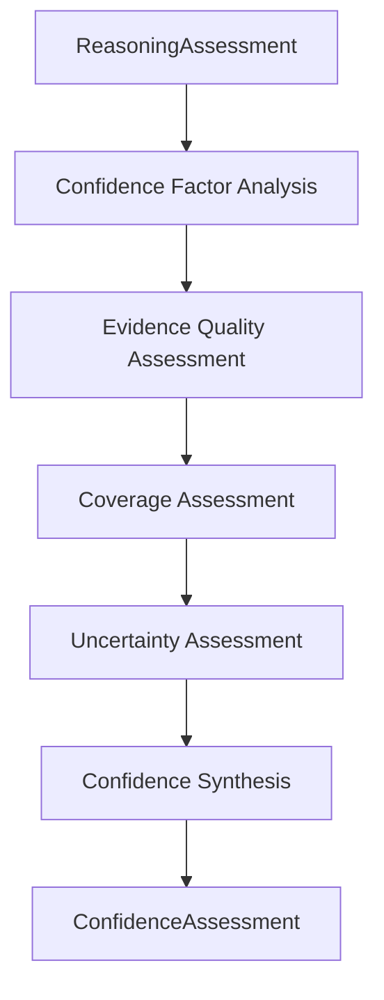

# NeuroVerify: Multimodal Neuro-Symbolic Misinformation Verification Platform
## Confidence Engine — Conceptual Architecture Specification, Version 1.0

| | |
|---|---|
| **Document status** | Draft for review |
| **Location** | `docs/architecture/PHASE_5/CONFIDENCE_ENGINE_SPEC_v1.0.md` |
| **Phase** | Phase 5 — Verification Intelligence (fifth subsystem) |
| **Builds on (frozen, unmodified)** | Phase 2 — `ARCHITECTURE_SPEC.md` v1.0 and `ADDENDUM_v1.1.md`; Phase 3 — `KNOWLEDGE_REPRESENTATION_SPEC_v1.0.md`; Phase 4.1–4.4; Phase 5.1 — `CLAIM_ANALYSIS_ENGINE_SPEC_v1.0.md`; Phase 5.2 — `EVIDENCE_RETRIEVAL_STRATEGY_SPEC_v1.0.md`; Phase 5.3 — `NLI_VERIFICATION_ENGINE_SPEC_v1.0.md`; Phase 5.4 — `MULTI_EVIDENCE_REASONING_SPEC_v1.0.md` |
| **Nature of this document** | Conceptual architecture only. It defines what confidence estimation evaluates and produces — not the scoring formulas, statistical models, or calibration techniques that would eventually compute a confidence value |
| **Explicitly excluded** | Code, pseudocode, algorithms, scoring formulas, statistical/calibration models, technology choices, APIs, implementation schemas, mathematical formulas |
| **Audience** | Engineers who will implement the Confidence Engine and whatever final step assembles `VerificationResult` from its output |

This document does not redefine any canonical object or subsystem
responsibility. `StructuredClaim` (Phase 5.1) and `ReasoningAssessment`
(Phase 5.4 §5) retain exactly their existing definitions — they are this
document's sole inputs, unchanged. `VerificationResult` (Phase 3 §1.9)
and the overall "NLI Verification" module responsibility (Phase 2 §5.5)
are unaffected. This document's sole subject is a new Phase 5
subsystem — the Confidence Engine — and the conceptual output object it
introduces, `ConfidenceAssessment`.

---

## 1. Purpose

### 1.1 What the Confidence Engine Is

The Confidence Engine evaluates the trustworthiness of a completed
`ReasoningAssessment` (Phase 5.4 §5). It receives a `StructuredClaim`
(Phase 5.1 §5) and the `ReasoningAssessment` synthesized for it, and
determines *how much confidence the evidentiary picture that assessment
describes actually warrants* — accounting for evidence quality,
corroboration strength, contradiction impact, coverage completeness, and
every source of uncertainty surfaced at every prior Phase 5 stage. Its
output, `ConfidenceAssessment` (§5), is the final piece of material
Phase 5's pipeline produces before `VerificationResult` (Phase 3 §1.9)
can be assembled. It estimates confidence. It performs no reasoning of
its own.

### 1.2 Relationship to Phase 5.4 and to Phase 2 §5.5

Phase 5.4 §1.2 and §3.9 explicitly deferred confidence computation,
describing `ReasoningAssessment` as prepared specifically so "a
downstream confidence-computing step... has everything it needs without
needing to re-derive any of this subsystem's synthesis work." This
document is that step. Together, Phase 5.1 through 5.5 now give the
"NLI Verification" responsibility Phase 2 §5.5 named as a single module
its complete internal architecture — the same decomposition already
completed for "Knowledge Representation" (Phase 2 §5.4) across Phase
4.1–4.4. `ConfidenceAssessment`'s **Overall Confidence** (§5.2) and
`ReasoningAssessment`'s **Synthesized Stance** (Phase 5.4 §5.2) together
contain everything `VerificationResult.stance` and
`VerificationResult.stance_confidence` (Phase 3 §1.9) require — but
assembling `VerificationResult` itself, however direct that mapping may
be, is **not** this document's output and remains outside its scope
(§9). This document produces `ConfidenceAssessment`, ready to be
consumed by that final, unspecified assembly step, and nothing further.

### 1.3 Why Confidence Estimation Is Independent From Reasoning

| Reason | Explanation |
|---|---|
| Confidence estimation and reasoning are different kinds of task | `ReasoningAssessment` (Phase 5.4) determines *what the evidence shows* — corroboration, contradiction, coverage, as qualitative structure. Confidence estimation determines *how much that structure should be trusted*. Conflating them risks a synthesis subsystem quietly inflating or deflating its own qualitative conclusions to make them "sound" more or less certain, rather than reporting the evidentiary structure honestly and letting a separately-accountable subsystem judge its trustworthiness |
| A confidence estimate must be able to critically evaluate reasoning it did not produce | If the Confidence Engine were the same subsystem that performed synthesis, it would have every incentive — structural, even if unintended — to rate its own work favorably. Keeping the two subsystems separate and sequential means confidence is assessed by a subsystem with no stake in how favorably the reasoning it evaluates comes out |
| Confidence is not truth, and keeping it structurally separate from reasoning is what protects that distinction | A `ReasoningAssessment` with `Synthesized Stance = conflicting` (Phase 5.4 §5.2) is not itself a low-confidence result — it may be a *highly confident* characterization that the evidence is genuinely split. Only a subsystem operating one level removed from the reasoning itself can make this distinction cleanly (§6.2 elaborates further) |
| Errors of confidence miscalibration must be visible as such, not confused with reasoning errors | If a claim's eventual verdict is questioned on the grounds of overconfidence or underconfidence, being able to inspect the confidence determination separately from the reasoning it was based on (Phase 5.4) is what keeps this platform's explainability commitment (Phase 2 §10) intact stage by stage, exactly as every preceding Phase 5 boundary has argued for its own separation (Phase 5.1 §1.2, Phase 5.2 §1.2, Phase 5.3 §1.3, Phase 5.4 §1.3) |

### 1.4 What This Buys Downstream Assembly, Fusion, and Decision

By fully evaluating confidence before `VerificationResult` is assembled,
whatever step performs that assembly receives a complete, independently-
derived confidence figure with full rationale (§5.3) — and Fusion
Intelligence (Phase 2 §5.8) and the Decision Engine (Phase 2 Addendum
§6) inherit a `VerificationResult.stance_confidence` that was arrived at
through the same disciplined, stage-separated process as everything else
in this pipeline, rather than an ad hoc figure attached at the last
minute.

---

## 2. Position in Architecture

### 2.1 Position Diagram

```
   Claim Analysis Engine (Phase 5.1)
          │
          │  StructuredClaim
          ▼
   Evidence Retrieval Strategy (5.2) → Evidence Retrieval (Phase 2 §5.3)
          │                                        │
          │                          CandidateEvidenceSet
          │                                        ▼
          │                      NLI Verification Engine (5.3)
          │                                        │
          │                          EvidenceAssessment[]
          │                                        ▼
          │                     Multi-Evidence Reasoning (5.4)
          │                                        │
          │                          ReasoningAssessment
          │                                        │
          └────────────────┬───────────────────────┘
                             ▼
                   Confidence Engine (this document)
                             │
                             │  ConfidenceAssessment
                             ▼
              (final assembly step — out of scope, §9)
                             │
                             ▼
                 VerificationResult (Phase 3 §1.9)
```

### 2.2 Two Inputs, One Evaluative Task

This subsystem takes the same `StructuredClaim` (Phase 5.1 §5) every
prior Phase 5 subsystem has consumed, and the complete
`ReasoningAssessment` (Phase 5.4 §5) produced for it. Unlike Multi-
Evidence Reasoning (Phase 5.4), which synthesizes many individual
`EvidenceAssessment` objects, this subsystem evaluates one already-
synthesized structure — its task is evaluative, not constructive: it
does not build a new picture of the evidence, it judges how much the
existing picture warrants trust.

### 2.3 Subsystem Boundaries

| Boundary | Statement |
|---|---|
| Upstream boundary | This subsystem's only inputs are `StructuredClaim` and `ReasoningAssessment` (§7.2) — it never reads `EvidenceAssessment[]`, `CandidateEvidenceSet`, or raw evidence content directly; every property it evaluates about the evidence, it evaluates through what `ReasoningAssessment` already reports |
| Downstream boundary | This subsystem's only output is `ConfidenceAssessment` (§5) — never a `VerificationResult`, never a verdict, never a modification to its own inputs |
| Lateral boundary | This subsystem does not invoke, depend on, or coordinate with Multi-Evidence Reasoning, the NLI Verification Engine, or any other Phase 2/5 module — its relationship to them is entirely producer-to-consumer |

### 2.4 Why This Subsystem Never Accesses the Knowledge Graph Directly

As with every prior Phase 5 subsystem (Phase 5.1 §2.5, Phase 5.2 §2.5,
Phase 5.3 §2.5, Phase 5.4 §2.4), this subsystem has no independent need
for persistent knowledge or evidence access — everything relevant to its
evaluation is already summarized within `ReasoningAssessment`, including,
via Assessment Traceability (Phase 5.4 §5.11), transitive access to
every provenance reference that document's inputs ultimately carry.
Consistent with Phase 4.4 §1.1's single-gateway principle, this
subsystem correctly has no access path to the Knowledge Graph, Evidence
Store, or Knowledge Access Layer whatsoever.

### 2.5 Statelessness

This subsystem holds no memory between invocations, mirroring every
prior Phase 5 subsystem — each claim's `ReasoningAssessment` is evaluated
entirely on its own terms, with no dependency on how confidently any
other claim was ever assessed. This deliberately forecloses any notion of
a "baseline" or "typical" confidence level drifting in from prior claims
— every evaluation is grounded solely in the specific evidentiary
structure presented to it this time (§6.3).

---

## 3. Responsibilities

### 3.1 Evaluate Evidence Quality

Assessing the quality of the evidence underlying `ReasoningAssessment` —
drawing on the trust characteristics already established upstream (Phase
4.2 §6) and reachable through Assessment Traceability (Phase 5.4 §5.11)
— to determine how strong a foundation the reasoning actually rests on.
This responsibility does not re-derive trust tiers or re-assess sources
independently; it evaluates what the already-established provenance and
trust information implies for confidence in this specific claim's
verification.

### 3.2 Evaluate Corroboration

Assessing the strength of `ReasoningAssessment`'s Corroboration Groups
(Phase 5.4 §5.3) — already netted for redundancy (Phase 5.4 §3.4) — to
determine how much genuine, independent agreement the evidentiary
picture reflects. More independent corroboration, of higher-quality
evidence, warrants more confidence; this responsibility is where that
qualitative judgment is formed (§5.4).

### 3.3 Evaluate Contradiction

Assessing the severity and materiality of `ReasoningAssessment`'s
Contradiction Groups (Phase 5.4 §5.4) — determining how much unresolved
disagreement in the evidence should temper confidence, and whether the
contradiction concerns central or peripheral claim content (Phase 5.1
§5.11's verification scope). This responsibility never resolves a
contradiction (that remains preserved exactly as Phase 5.4 left it,
§6.4) — it evaluates what the contradiction's continued presence implies
for how much trust the overall assessment warrants.

### 3.4 Evaluate Coverage

Assessing `ReasoningAssessment`'s Claim Coverage Summary and Unresolved
Assertions (Phase 5.4 §5.7, §5.6) to determine how confidence should be
tempered by gaps — a claim whose verification scope is only partially
addressed by available evidence warrants lower confidence than one fully
covered, independent of how strong the available evidence is for the
part that *was* addressed.

### 3.5 Evaluate Uncertainty

Collecting and weighing every explicit uncertainty signal surfaced at
any prior Phase 5 stage — ambiguity markers (Phase 5.1 §5.9), unresolved
assertions (Phase 5.4 §5.6), and any other honestly-reported gap or
limitation — into one coherent picture of how much residual uncertainty
this specific claim's verification carries, independent of and in
addition to what evidence quality, corroboration, contradiction, and
coverage individually suggest.

### 3.6 Evaluate Reasoning Completeness

Assessing `ReasoningAssessment`'s own Reasoning Completeness statement
(Phase 5.4 §5.9) — determining what impact any acknowledged
incompleteness in the synthesis process itself should have on overall
confidence. A `ReasoningAssessment` that honestly reports incomplete
synthesis (some assessments resisting clean categorization) should
result in lower confidence than one reporting full, clean completion,
independent of what the synthesized content itself shows.

### 3.7 Explain Confidence

Producing a complete, human-inspectable rationale (§5.3) for whatever
confidence level this subsystem arrives at — never a bare number.
Consistent with the platform-wide principle that confidence is always
accompanied by its basis (Phase 2 §3.1's "every module output carries a
confidence field and a confidence_basis... explaining why"), this
responsibility ensures the Confidence Engine's output is never a score
without a reason.

### 3.8 Preserve Traceability

Ensuring `ConfidenceAssessment`'s determination remains traceable back
to the specific `ReasoningAssessment` components (§3.1–§3.6 each draw
on) that justify it, and transitively to the `EvidenceAssessment`
objects and provenance references beneath them (§5.9) — this subsystem
adds an evaluative layer, but never severs the link back to what is
being evaluated.

### 3.9 Prepare Verification Result Input

Structuring `ConfidenceAssessment`'s content so that the final assembly
of `VerificationResult` (§1.2, out of this document's scope) requires
no further evaluative work — only a direct mapping from Overall
Confidence (§5.2) and `ReasoningAssessment`'s Synthesized Stance (Phase
5.4 §5.2) into `VerificationResult.stance_confidence` and `.stance`.
This responsibility is explicitly **not** performing that assembly
itself (§9) — it is ensuring nothing stands in its way once invoked.

---

## 4. Confidence Lifecycle

### 4.1 Lifecycle Diagram



### 4.2 Stage-by-Stage Explanation

**Stage 1 — `ReasoningAssessment`.** The complete synthesis produced by
Multi-Evidence Reasoning (Phase 5.4) enters the subsystem, together with
the shared `StructuredClaim` (§2.2).

**Stage 2 — Confidence Factor Analysis.** `ReasoningAssessment` is
decomposed into the specific factors relevant to confidence:
Corroboration Groups and Contradiction Groups (Phase 5.4 §5.3–§5.4) are
evaluated for their strength and severity respectively (§3.2, §3.3) —
establishing the first, most direct inputs to confidence before the
broader evaluations that follow.

**Stage 3 — Evidence Quality Assessment.** The trust characteristics of
the evidence underlying the factors identified in Stage 2 are evaluated
(§3.1), drawing on provenance and trust-tier information reachable
through Assessment Traceability (Phase 5.4 §5.11) — establishing how
strong a foundation the corroboration and contradiction findings
actually rest on.

**Stage 4 — Coverage Assessment.** `ReasoningAssessment`'s Claim Coverage
Summary and Unresolved Assertions (Phase 5.4 §5.7, §5.6) are evaluated
(§3.4) — determining what confidence-reducing effect any coverage gaps
should have, independent of how strong the evidence is for the parts
that were covered.

**Stage 5 — Uncertainty Assessment.** Every explicit uncertainty signal
carried through from earlier Phase 5 stages — ambiguity markers,
unresolved assertions, and `ReasoningAssessment`'s own Reasoning
Completeness statement — is collected and weighed (§3.5, §3.6),
producing a coherent picture of residual uncertainty beyond what
evidence quality, corroboration, contradiction, and coverage
individually account for.

**Stage 6 — Confidence Synthesis.** Every prior stage's findings are
combined into an Overall Confidence determination (§5.2), together with
the full Confidence Rationale (§5.3) explaining how that determination
was reached.

**Stage 7 — `ConfidenceAssessment`.** Every component from Stages 2–6,
together with full traceability (§3.8, §5.9) back to `ReasoningAssessment`
and, transitively, every object beneath it, is assembled into one
complete `ConfidenceAssessment` (§5).

### 4.3 Why This Ordering Matters

| Ordering constraint | Why it must hold |
|---|---|
| Confidence Factor Analysis before Evidence Quality Assessment | Corroboration and contradiction (Stage 2) identify *which* evidence matters most to the confidence determination; evidence quality (Stage 3) then evaluates *how trustworthy* that specific evidence is — evaluating quality without first knowing what's relevant would be unfocused |
| Evidence Quality Assessment before Coverage Assessment | Understanding how strong the available evidence is (Stage 3) is a natural prerequisite for judging how much its coverage gaps (Stage 4) actually matter — strong evidence with minor gaps differs meaningfully from weak evidence with the same gaps |
| Coverage Assessment before Uncertainty Assessment | Coverage gaps (Stage 4) are themselves one *specific* source of uncertainty; Stage 5 assembles the complete uncertainty picture, which requires knowing about coverage gaps first so they are not double-counted or omitted |
| Uncertainty Assessment before Confidence Synthesis | Synthesis (Stage 6) must account for every factor already identified — nothing is concluded until every contributing evaluation (Stages 2–5) has completed |

This fixed ordering makes the subsystem's output deterministic (§6.4):
the same `ReasoningAssessment`, evaluated by this subsystem, always
produces the same `ConfidenceAssessment`.

---

## 5. ConfidenceAssessment Concept

### 5.1 What `ConfidenceAssessment` Is

`ConfidenceAssessment` is this subsystem's sole output — one per claim,
evaluating the trustworthiness of the `ReasoningAssessment` (Phase 5.4
§5) it was given. As with every conceptual object introduced across
Phase 5, it is described purely in terms of its components and their
purpose, never as a field-level schema. Every `ConfidenceAssessment`
traces to exactly one `StructuredClaim` and exactly one
`ReasoningAssessment`.

### 5.2 Overall Confidence

The subsystem's single, holistic determination of how much trust the
evidentiary picture `ReasoningAssessment` describes actually warrants —
expressed on the same [0,1]-range convention already established
platform-wide (Phase 3 §6.3), without this document prescribing how that
value is computed (per its philosophy-only, formula-free scope,
consistent with Phase 4.2 §6.1 and Phase 4.3 §9.1's identical
treatment). Overall Confidence is confidence **in the stance**
`ReasoningAssessment` reports — not confidence that the claim is true
(§6.2 elaborates this distinction, which is this document's single most
important architectural boundary).

### 5.3 Confidence Rationale

The complete, human-inspectable explanation of how Overall Confidence
(§5.2) was reached — never a bare figure (§3.7). Confidence Rationale
draws together the findings of every lifecycle stage (§4.2) into a
coherent account: what evidence quality, corroboration strength,
contradiction impact, coverage, and uncertainty each contributed to the
final determination.

### 5.4 Evidence Quality Summary

The subsystem's evaluation of the trustworthiness of the evidence
underlying `ReasoningAssessment` (§3.1) — a qualitative account of
whether the assessment rests on high-trust-tier, well-attributed
sources (Phase 4.2 §6) or thinner, less-established ones, without
re-deriving or restating the trust-tier determinations themselves,
which remain exactly as the Evidence Store (Phase 4.2) and NLI
Verification Engine (Phase 5.3) established them.

### 5.5 Corroboration Strength

The subsystem's evaluation of how much genuine, independent agreement
`ReasoningAssessment`'s Corroboration Groups (Phase 5.4 §5.3) represent
(§3.2) — a qualitative judgment of corroboration's contribution to
confidence, informed by group size, source independence (already netted
for redundancy upstream, Phase 5.4 §3.4), and the trust characteristics
evaluated in Evidence Quality Summary (§5.4).

### 5.6 Contradiction Impact

The subsystem's evaluation of how much `ReasoningAssessment`'s
Contradiction Groups (Phase 5.4 §5.4) should temper confidence (§3.3) —
assessed by materiality to the claim's verification scope (Phase 5.1
§5.11), not merely by the number of contradicting assessments. A
contradiction touching the claim's central assertion has more impact
than one touching incidental content, even if both are structurally
"a contradiction" at the `ReasoningAssessment` level.

### 5.7 Reasoning Completeness

The subsystem's evaluation of what `ReasoningAssessment`'s own Reasoning
Completeness statement (Phase 5.4 §5.9) implies for confidence (§3.6) —
carried forward and interpreted here specifically for its
confidence-relevant impact, distinct from Phase 5.4's own use of the
term to describe the *synthesis process's* completeness. Where Phase 5.4
§5.9 asks "how cleanly did synthesis resolve," this component asks "what
does that imply for how much we should trust the result."

### 5.8 Uncertainty Indicators

The complete, explicit set of uncertainty signals this subsystem
collected and weighed (§3.5) — ambiguity markers (Phase 5.1 §5.9),
unresolved assertions (Phase 5.4 §5.6), and any other honestly-reported
gap — assembled into one place rather than left scattered across the
upstream objects they originated in. Consistent with this platform's
"always present, possibly empty" convention (Phase 5.1 §5.9, Phase 5.4
§5.6), Uncertainty Indicators is always explicitly stated, even when no
significant uncertainty was found.

### 5.9 Confidence Factors

A structured breakdown of what contributed to Overall Confidence (§5.2)
— evidence quality (§5.4), corroboration strength (§5.5), contradiction
impact (§5.6), coverage (Phase 5.4 §5.7, as evaluated in §3.4), and
reasoning completeness (§5.7) — each identified individually rather than
collapsed into the single Overall Confidence figure alone. This
component is what makes Confidence Rationale (§5.3) more than prose: it
is the structured material that rationale narrates.

### 5.10 Traceability

Explicit, preserved links from Overall Confidence and every Confidence
Factor back to the specific `ReasoningAssessment` components that
justify them (§3.8), and transitively, through Phase 5.4 §5.11's
Assessment Traceability, to every contributing `EvidenceAssessment` and
its provenance. No confidence determination in this document exists
without a traceable path back to the reasoning it evaluates.

### 5.11 Explanation Summary

A concise, human-readable statement of how confident the platform is in
this claim's evidentiary assessment, and why — the most compact
representation of everything §5.2–§5.10 establish, intended to feed the
eventual `ExplanationRecord` (Phase 3 §1.13) directly, mirroring the
identical summary role Phase 5.3 §5.10 and Phase 5.4 §5.10 play at their
own stages.

### 5.12 How the Components Relate

```
ReasoningAssessment (input)
   │
   ├── Evidence Quality Summary (5.4) ──┐
   ├── Corroboration Strength (5.5) ────┼── combine into ── Confidence Factors (5.9)
   ├── Contradiction Impact (5.6) ──────┤
   └── Reasoning Completeness (5.7) ────┘
                                           │
                              Uncertainty Indicators (5.8)
                                           │
                                           ▼
                                Overall Confidence (5.2)
                                           │
                          ┌────────────────┼────────────────┐
                          ▼                ▼                ▼
              Confidence Rationale (5.3)  Traceability (5.10)  Explanation Summary (5.11)
```

As with every conceptual object in this series, `ConfidenceAssessment`
is a layered representation — later components depend on and are only
meaningful in terms of earlier ones, mirroring the lifecycle's ordering
(§4.3).

### 5.13 Worked Example

Concluding the running example from Phase 5.1 §5.13 through Phase 5.4
§5.13 — the health ministry's claimed 15% reduction in hospital
admissions — recall Phase 5.4 produced a `ReasoningAssessment` with
`Synthesized Stance = conflicting`: the attribution sub-proposition
confirmed, the statistical sub-proposition contradicted by independent
data, full coverage, and complete, clean synthesis.

| Component | Illustrative content |
|---|---|
| Overall Confidence (5.2) | High — notably, high confidence is entirely consistent with a `conflicting` stance here; this is confidence *that the evidence genuinely shows this split*, not confidence that the claim is true |
| Confidence Rationale (5.3) | Both sub-propositions were addressed by high-trust-tier, well-attributed evidence (the ministry's own statement; an independently-collected dataset); coverage was complete; synthesis was clean; there is little residual uncertainty about *what the evidence shows*, even though what it shows is a genuine split |
| Evidence Quality Summary (5.4) | Both contributing items carry strong provenance and trust-tier standing (Phase 5.3 §5.12's example) |
| Corroboration Strength (5.5) | Not applicable in the traditional sense — no Corroboration Group exists (Phase 5.4 §5.13); this component notes that absence explicitly rather than treating it as a gap |
| Contradiction Impact (5.6) | Material — the contradiction concerns the claim's central statistical assertion, not incidental detail, and is weighed accordingly |
| Reasoning Completeness (5.7) | Full — `ReasoningAssessment` reported clean, complete synthesis (Phase 5.4 §5.13), which supports rather than undermines confidence here |
| Uncertainty Indicators (5.8) | None significant — no unresolved assertions, no unresolved ambiguity from `StructuredClaim` |
| Confidence Factors (5.9) | Strong evidence quality + material but well-evidenced contradiction + full coverage + complete reasoning, combining into high confidence in a split-evidence characterization |
| Traceability (5.10) | Full chain preserved back through `ReasoningAssessment` to both `EvidenceAssessment` objects and their provenance |
| Explanation Summary (5.11) | "The platform is highly confident that the evidence is genuinely split: the ministry's statement is confirmed, but the statistic itself is contradicted by independent data." |

This example is chosen specifically to make §6.2's central distinction
concrete: a `conflicting` stance with high confidence is not a
contradiction in terms. It is the honest, well-evidenced report that the
claim's two parts point in different directions — precisely the kind of
nuanced outcome this platform's entire multi-stage design (Phase 5.1
through 5.5) exists to make possible, rather than forcing every claim
toward an artificially clean true/false characterization.

---

## 6. Architectural Principles

### 6.1 Reasoning Before Confidence

This subsystem's entire reason for existing (§1.3): the evidentiary
picture must be fully synthesized (Phase 5.4) before its trustworthiness
can be evaluated — confidence estimation operating over incomplete or
still-forming reasoning would have nothing stable to evaluate.

### 6.2 Confidence Is Not Truth

The single most important principle in this document, illustrated
concretely in §5.13: Overall Confidence (§5.2) is confidence in
`ReasoningAssessment`'s Synthesized Stance — whatever that stance is,
including `conflicting` — never confidence that the underlying claim is
true. High confidence and a `refutes` stance together mean the platform
is highly sure the evidence refutes the claim, not that the claim is
somehow "confidently true." This distinction is what keeps this
subsystem from ever drifting into the Decision Engine's territory
(§6.6).

### 6.3 Deterministic Confidence

The same `ReasoningAssessment`, evaluated by this subsystem, always
produces the same `ConfidenceAssessment` — extending the determinism
guarantee established at every prior Phase 5 stage (Phase 5.1 §6.2,
Phase 5.2 §6.2, Phase 5.3 §6.3, Phase 5.4 §6.2) into the final
evaluative layer.

### 6.4 Explainability

Every `ConfidenceAssessment` carries a complete rationale (§5.3),
structured factors (§5.9), and an explanation summary (§5.11) —
extending the "explainability begins here" commitment traced through
every prior Phase 5 subsystem (Phase 5.1 §6.7, Phase 5.2 §6.6, Phase 5.3
§6.4, Phase 5.4 §6.3) to its final stage: by the time confidence is
assigned, every step that produced it is independently inspectable.

### 6.5 Traceability

No confidence determination exists without a preserved path back to the
`ReasoningAssessment` components — and, transitively, the individual
`EvidenceAssessment` objects and provenance — that justify it (§5.10).
This mirrors the evidence-integrity and traceability principles every
prior Phase 5 subsystem has upheld at its own stage (Phase 5.3 §6.5,
Phase 5.4 §6.4), applied here to confidence rather than to reasoning
content.

### 6.6 No Verdict Generation

This subsystem never states whether the claim is true, and never
produces anything resembling a `Verdict` (Phase 3 §1.12) or
`DecisionRecord` (Phase 3 §1.12, Phase 2 Addendum §6) — those remain the
Decision Engine's exclusive responsibility, downstream of Fusion
Intelligence, downstream of `VerificationResult` itself, which this
subsystem's output only prepares material for (§1.2) but never produces.

### 6.7 Separation of Concerns

Every principle above is an instance of one governing commitment: this
subsystem does exactly one thing — evaluate the trustworthiness of an
already-completed reasoning synthesis — and delegates everything else
(reasoning itself, retrieval, planning, verdict assembly, decision,
explanation) to the subsystems already built, or yet to be built, for
those purposes. This is the fifth and final Phase 5 subsystem to make
this same commitment, completing the internal architecture Phase 2 §5.5
left as a single black box.

---

## 7. Interface Contracts

### 7.1 Contract Philosophy

Consistent with every prior Phase 4 and Phase 5 specification, this
section states the conceptual data contract at this subsystem's
boundary — never an API, protocol, or technology.

### 7.2 Incoming: `StructuredClaim` and `ReasoningAssessment`

| | `StructuredClaim` | `ReasoningAssessment` |
|---|---|---|
| Source | Claim Analysis Engine (Phase 5.1) | Multi-Evidence Reasoning (Phase 5.4) |
| Object | Exactly as conceptually defined in Phase 5.1 §5 | Exactly as conceptually defined in Phase 5.4 §5, unmodified |
| Cardinality | One per invocation | One complete `ReasoningAssessment` per invocation |

### 7.3 Outgoing: `ConfidenceAssessment`

| | |
|---|---|
| Destination | The final, unspecified `VerificationResult` assembly step (§1.2, out of this document's scope) |
| Object | `ConfidenceAssessment`, as conceptually defined in §5 |
| Postcondition | Every component in §5.2–§5.11 is present; Uncertainty Indicators (§5.8) is always explicitly stated, even when empty |
| Traceability | Every `ConfidenceAssessment` is traceable to exactly one `StructuredClaim` and exactly one `ReasoningAssessment` (§5.1) |

### 7.4 What This Subsystem Never Receives or Returns

| Never received | Never returned |
|---|---|
| `EvidenceAssessment[]`, `CandidateEvidenceSet`, or raw evidence content directly (§2.3) | `VerificationResult`, `Verdict`, or `DecisionRecord` (§6.6, §9) |
| Any Knowledge Graph, Evidence Store, or Knowledge Access Layer object (§2.4) | Any modification to the input `ReasoningAssessment` (§3.8, §6.5) |
| Any prior claim's `ConfidenceAssessment` or subsystem state (§2.5) | Any new `ReasoningAssessment` or `EvidenceAssessment` object |

---

## 8. Scalability

### 8.1 Large Reasoning Structures

Because this subsystem evaluates one already-synthesized
`ReasoningAssessment` rather than reasoning over raw evidence directly,
its workload scales with the internal size of that structure (how many
Corroboration/Contradiction Groups it contains, Phase 5.4 §5.3–§5.4)
rather than with the size of the original `CandidateEvidenceSet` — a
`ReasoningAssessment` that has already consolidated many assessments
into a few groups presents a bounded evaluative task regardless of how
much raw evidence contributed to it.

### 8.2 Streaming Updates

Because Phase 5.4 §8.2–§8.3 already anticipate `ReasoningAssessment`
being incrementally updated as new evidence assessments arrive, this
subsystem's evaluation may need to be re-invoked whenever
`ReasoningAssessment` materially changes — this document establishes
that its conceptual responsibilities (§3) apply equally to a one-time
evaluation of a final `ReasoningAssessment` or a repeated evaluation of
an evolving one, without prescribing which approach a future
implementation adopts.

### 8.3 Incremental Recomputation

Related to streaming updates (§8.2): where only part of
`ReasoningAssessment` has changed (e.g. a new Complementary Evidence
item added without altering existing Corroboration or Contradiction
Groups), this subsystem's conceptual responsibilities (§3) do not
require re-evaluating factors that are unaffected by the change — this
document establishes the requirement (confidence must reflect the
current, complete `ReasoningAssessment`) without prescribing whether a
future implementation recomputes from scratch or incrementally.

### 8.4 Distributed Confidence Evaluation

Should evaluation be distributed across multiple concurrent processes in
a future implementation, this subsystem's conceptual contract requires
that the final `ConfidenceAssessment` reflect the complete
`ReasoningAssessment` coherently — mirroring the identical logical-
coherence requirement Phase 5.4 §8.4 establishes for distributed
reasoning synthesis, and Phase 4.3 §11.6 / Phase 4.4 §9.5 establish for
their own future-distribution scenarios.

### 8.5 What This Section Deliberately Does Not Address

Consistent with this document's implementation-agnostic scope, this
section names no specific throughput target, computation mechanism, or
distributed-systems technology. Its contribution is confirming that this
subsystem's conceptual responsibilities (§3), lifecycle (§4), and output
shape (§5) remain well-defined regardless of how large or how frequently
updated the `ReasoningAssessment` structures it evaluates become.

---

## 9. Non-Goals

### 9.1 Explicit Boundaries

The Confidence Engine does **not**:

| Non-goal | Why it belongs elsewhere |
|---|---|
| Perform reasoning | Multi-Evidence Reasoning (Phase 5.4) produces `ReasoningAssessment`; this subsystem only evaluates its trustworthiness, never re-derives or extends its content |
| Retrieve evidence | Evidence Retrieval (Phase 2 §5.3) supplies evidence many stages upstream; this subsystem never reads raw evidence content, only what `ReasoningAssessment` already reports |
| Plan retrieval | Evidence Retrieval Strategy (Phase 5.2) determines what should be searched for; this subsystem operates many stages after that planning has concluded |
| Aggregate evidence | Multi-Evidence Reasoning (Phase 5.4) is exclusively responsible for corroboration/contradiction grouping and coverage synthesis; this subsystem evaluates the result, never performs the aggregation itself |
| Determine truth | Overall Confidence (§5.2) is confidence in a stance, never a truth judgment (§6.2) — that judgment belongs exclusively to the Decision Engine (Phase 2 Addendum §6) |
| Produce a verdict | This subsystem produces no `Verdict` or `DecisionRecord` of any kind — its output prepares material for `VerificationResult` (§1.2), many stages before any verdict is reached |
| Update knowledge | This subsystem has no write capability of any kind toward any persistent store in this platform |
| Access the Knowledge Graph directly | Per §2.4, this subsystem has no access path to the Knowledge Graph, Evidence Store, or Knowledge Access Layer whatsoever |

### 9.2 Why This Separation Is Critical

Every non-goal above protects this document's central claim (§1.3,
§6.7): the Confidence Engine evaluates; it does not reason, retrieve,
plan, aggregate, or conclude. If this subsystem additionally performed
any of those functions, its confidence determinations could no longer be
trusted as an independent, arm's-length judgment of reasoning it did not
itself produce (§1.3) — a `ConfidenceAssessment` shaped by involvement in
the very synthesis it is meant to evaluate would compromise the
evaluative independence this entire document exists to provide. Keeping
this subsystem strictly within confidence evaluation, exactly as every
subsystem before it in Phase 5 has stayed strictly within its own
accountable boundary, completes the internal architecture behind Phase 2
§5.5's "NLI Verification" module with the same discipline that has
governed every stage since Phase 5.1: each subsystem does exactly one
thing, and the whole remains trustworthy precisely because no single
subsystem's scope was ever allowed to quietly expand.

---

*End of Confidence Engine Conceptual Architecture Specification, Version 1.0.*
*This document is the fifth subsystem specification of Phase 5 — Verification*
*Intelligence — and builds on, without altering, the frozen Phase 2*
*(`ARCHITECTURE_SPEC.md` v1.0, `ADDENDUM_v1.1.md`), Phase 3*
*(`KNOWLEDGE_REPRESENTATION_SPEC_v1.0.md`), Phase 4.1–4.4, Phase 5.1*
*(`CLAIM_ANALYSIS_ENGINE_SPEC_v1.0.md`), Phase 5.2*
*(`EVIDENCE_RETRIEVAL_STRATEGY_SPEC_v1.0.md`), Phase 5.3*
*(`NLI_VERIFICATION_ENGINE_SPEC_v1.0.md`), and Phase 5.4*
*(`MULTI_EVIDENCE_REASONING_SPEC_v1.0.md`) documents.*
