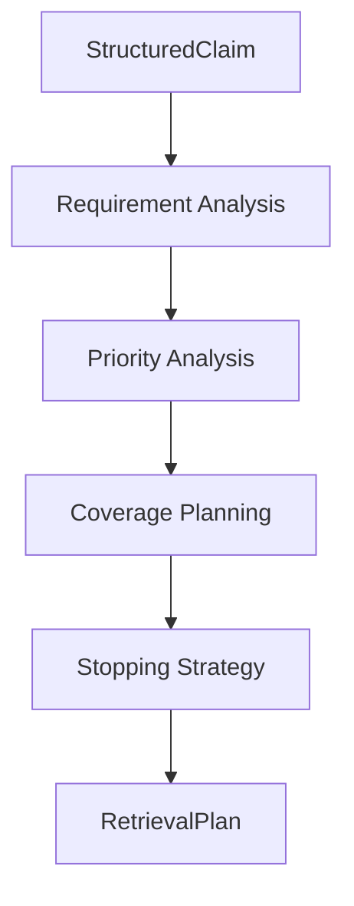

# NeuroVerify: Multimodal Neuro-Symbolic Misinformation Verification Platform
## Evidence Retrieval Strategy — Conceptual Architecture Specification, Version 1.0

| | |
|---|---|
| **Document status** | Draft for review |
| **Location** | `docs/architecture/PHASE_5/EVIDENCE_RETRIEVAL_STRATEGY_SPEC_v1.0.md` |
| **Phase** | Phase 5 — Verification Intelligence (second subsystem) |
| **Builds on (frozen, unmodified)** | Phase 2 — `ARCHITECTURE_SPEC.md` v1.0 and `ADDENDUM_v1.1.md`; Phase 3 — `KNOWLEDGE_REPRESENTATION_SPEC_v1.0.md`; Phase 4.1–4.4 — Knowledge Graph, Evidence Store, Graph Resolution & Update Engine, Knowledge Access Layer; Phase 5.1 — `CLAIM_ANALYSIS_ENGINE_SPEC_v1.0.md` |
| **Nature of this document** | Conceptual architecture only. It defines what must be searched for, and under what strategy, before any search is performed — not the retrieval algorithms, ranking techniques, or search technology that will eventually execute that strategy |
| **Explicitly excluded** | Code, pseudocode, algorithms, ranking/scoring formulas, search technology, APIs, implementation schemas, mathematical formulas |
| **Audience** | Engineers who will implement Evidence Retrieval Strategy and the Evidence Retrieval subsystem (Phase 2 §5.3) that consumes its output |

This document does not redefine any canonical object or subsystem
responsibility. `StructuredClaim` (Phase 5.1) retains exactly its
existing conceptual definition — it is this document's sole input,
unchanged. Evidence Retrieval (Phase 2 §5.3), the Evidence Store (Phase
4.2), the Knowledge Graph (Phase 4.1), and the Knowledge Access Layer
(Phase 4.4) retain exactly their existing responsibilities. This
document's sole subject is a new Phase 5 subsystem — Evidence Retrieval
Strategy — and the conceptual output object it introduces,
`RetrievalPlan`.

---

## 1. Purpose

### 1.1 What Evidence Retrieval Strategy Is

Evidence Retrieval Strategy is the planning subsystem of Verification
Intelligence. It receives a `StructuredClaim` (Phase 5.1 §5) — a claim
already decomposed into its entities, relations, temporal and numerical
content, modality, polarity, ambiguity, and verification scope — and
determines, before any evidence is sought, exactly what searching for
evidence should accomplish: what to look for, how thoroughly, in what
order of priority, across which evidence categories, and when enough has
been found. Its output, `RetrievalPlan`, is handed to Evidence Retrieval
(Phase 2 §5.3), which executes the actual search. This subsystem's
responsibility is **planning**, never **retrieving** — it answers "what
should be searched for, and how would we know when we've searched
enough," never "here is the evidence."

### 1.2 Why Retrieval Planning Is Independent From Retrieval

This separation extends the same neuro-symbolic principle this platform
has applied at every prior boundary (Phase 2 §0.2; Phase 4.1 §12.2;
Phase 4.2 §12.2; Phase 4.3 §1.4; Phase 4.4 §1.4; Phase 5.1 §1.2) to the
planning/execution boundary specifically:

| Reason | Explanation |
|---|---|
| Planning and searching are different kinds of task | Deciding *what evidence would settle this claim* is a semantic and logical exercise, grounded entirely in what `StructuredClaim` (Phase 5.1) already establishes about the claim's content. Actually finding that evidence is a search-and-ranking exercise, grounded in the contents of the Evidence Store (Phase 4.2) and the wider evidence corpus. Conflating the two risks letting the accidents of what a search technique happens to find easily shape what the platform considers worth looking for — precisely backwards from how a rigorous verification process should work |
| A well-formed plan benefits retrieval regardless of how retrieval is implemented | Evidence Retrieval (Phase 2 §5.3) can evolve its search technique, ranking approach, or source coverage over time without this planning subsystem changing at all, as long as it continues to consume a `RetrievalPlan` shaped as this document specifies (§5) — the same technology-independence benefit Phase 4.1–4.4 each secure for their own subsystem boundary |
| Stopping criteria must be decided independent of what has already been found | If "when to stop searching" were decided by the retrieval process itself, there would be a structural incentive to stop as soon as *something* is found, rather than what the claim's own structure genuinely requires for adequate coverage (§3.8, §5.9) — planning stopping criteria before any results exist keeps this decision honest and claim-driven, not results-driven |
| Errors of planning must be visible as planning errors, not retrieval errors | If retrieval returns poor evidence because the plan asked for the wrong thing, that is a planning failure, attributable to this subsystem, not a retrieval failure — keeping the two accountable separately is what makes the eventual verdict's shortcomings traceable to their true cause, consistent with this platform's explainability commitment (Phase 2 §10) |

### 1.3 What This Buys Evidence Retrieval

By fully specifying what to search for before any search begins, Evidence
Retrieval (Phase 2 §5.3) receives a precise, claim-derived target rather
than needing to reinterpret `StructuredClaim` itself — exactly the same
benefit Phase 5.1 §1.3 identifies for every downstream consumer of
`StructuredClaim`, now realized specifically for the retrieval step.

---

## 2. Position in Architecture

### 2.1 Position Diagram

```
   Claim Analysis Engine (Phase 5.1)
          │
          │  StructuredClaim (Phase 5.1 §5)
          ▼
   Evidence Retrieval Strategy (this document)
          │
          │  RetrievalPlan (§5)
          ▼
   Evidence Retrieval (Phase 2 §5.3)
          │
          │  EvidenceRecord[] (Phase 3 §1.5)
          ▼
   NLI Verification (Phase 2 §5.5) → ...
```

### 2.2 Relationship to the Claim Analysis Engine

Evidence Retrieval Strategy consumes `StructuredClaim` exactly as Phase
5.1 §5 defines it, without modification. It does not re-analyze the
claim's text, re-detect entities or relations, or revisit any ambiguity
determination (Phase 5.1 §5.9) — every semantic judgment about the
claim's content was already made upstream. This subsystem's task begins
precisely where Phase 5.1's ends: translating an already-understood claim
into a plan for finding out whether it holds.

### 2.3 Relationship to Evidence Retrieval

`RetrievalPlan` (§5) is hard input to Evidence Retrieval (Phase 2 §5.3),
which remains exactly as specified there: it queries available sources
— including, per Phase 2 §5.3, the trusted evidence corpus and, by
extension, the Evidence Store (Phase 4.2) via the Knowledge Access Layer
(Phase 4.4) — and produces `EvidenceRecord[]` (Phase 3 §1.5). This
document does not alter Evidence Retrieval's responsibilities, its
interface contract, or its relationship to trust tiers (Phase 4.2 §6) in
any way — it only specifies the plan Evidence Retrieval now receives as
input, where previously (in the pipeline as Phase 2 originally specified
it) Evidence Retrieval derived its own search intent directly from
`ClaimRecord`. This is a refinement of *what Evidence Retrieval's input
looks like*, not a change to what Evidence Retrieval *does* with
whatever input it receives.

### 2.4 Subsystem Boundaries

| Boundary | Statement |
|---|---|
| Upstream boundary | This subsystem's only input is a single `StructuredClaim` (§7.2) — it never reads `ClaimRecord`, `RawInput`, or any other object directly |
| Downstream boundary | This subsystem's only output is `RetrievalPlan` (§5) — it never issues a search, never reads `EvidenceRecord` or `ArticleRecord` content, and never invokes Evidence Retrieval, the Evidence Store, or the Knowledge Access Layer in any capacity |
| Lateral boundary | This subsystem does not invoke, depend on, or coordinate with NLI Verification, Fusion Intelligence, or any other Phase 2/5 reasoning module — its relationship to them is entirely producer-to-consumer, through `RetrievalPlan` alone, indirectly via Evidence Retrieval |

### 2.5 Why This Subsystem Never Accesses the Knowledge Graph Directly

As with the Claim Analysis Engine (Phase 5.1 §2.5), this subsystem has no
legitimate need for persistent knowledge or evidence access — planning
what to search for is entirely a function of what `StructuredClaim`
already establishes about the claim. Consistent with Phase 4.4 §1.1's
single-gateway principle, a subsystem with no genuine need for knowledge
access has no access path to it at all, rather than an unused path left
available.

### 2.6 Statelessness

Mirroring Phase 5.1 §2.6 exactly: this subsystem holds no memory between
invocations. Each `StructuredClaim` is planned for entirely on its own
terms, with no dependency on any prior claim's plan, any retrieval
outcome from a prior claim, or any evolving notion of "what usually works"
— planning is derived fresh, every time, from the claim currently at
hand.

---

## 3. Responsibilities

### 3.1 Determine Target Entities

Identifying which of `StructuredClaim`'s entities (Phase 5.1 §5.3) must
actually be represented in retrieved evidence for the claim to be
checkable — not necessarily every entity the claim mentions, but those
within its verification scope (Phase 5.1 §5.11). A claim's incidental
detail may mention an entity that is not itself part of what needs
verifying (Phase 5.1 §5.11's scope-narrowing example); this
responsibility is what carries that narrowing forward into a concrete
retrieval target.

### 3.2 Determine Target Relations

Identifying which of `StructuredClaim`'s relations (Phase 5.1 §5.4) must
be corroborated or refuted by evidence — the relational core the claim
actually asserts, within verification scope. This responsibility is what
turns "the claim is about a relationship between A and B" into "evidence
must speak to whether A and B stand in this specific relationship."

### 3.3 Determine Temporal Scope

Translating `StructuredClaim`'s temporal expressions (Phase 5.1 §5.5)
into a requirement on the evidence itself — evidence must be relevant to,
and where possible dated consistently with, the time frame the claim
concerns. This directly anticipates the temporal-consistency handling
Evidence Retrieval already performs per Phase 2 §7 (scenario 13) and
Phase 4.1 §9 — this subsystem's contribution is stating, ahead of
retrieval, exactly what that temporal requirement is for this specific
claim, rather than leaving Evidence Retrieval to infer it.

### 3.4 Determine Numerical Scope

Translating `StructuredClaim`'s numerical expressions (Phase 5.1 §5.6)
into a requirement that retrieved evidence address the same quantity, at
the same precision, that the claim asserts — a statistical claim (Phase
2 §2.2) is not adequately checked by evidence merely on the same general
topic; it requires evidence bearing on the same figure.

### 3.5 Determine Evidence Diversity

Determining how many independent sources, and how varied in origin, the
plan should require before the claim can be considered adequately
covered — directly informed by the corroboration philosophy Phase 4.1
§1.4 and Phase 4.2 §6.7 already establish (independent corroboration
strengthens confidence; repetition and syndication do not, Phase 4.2
§7.4, §9.3 of the Resolution Engine spec). This responsibility decides,
for this specific claim, how much independent diversity is enough to
plan for — not how to detect diversity once results exist, which remains
Evidence Retrieval's and the Evidence Store's concern.

### 3.6 Determine Retrieval Priorities

Where a claim's verification scope spans multiple entities, relations, or
sub-propositions (Phase 5.1 §5.10's decomposition), determining the
order in which they should be pursued — some sub-propositions may be more
central to the claim's overall verification scope (Phase 5.1 §5.11) than
others, and a plan that treats every target as equally urgent wastes
effort relative to one that reflects the claim's actual structure.

### 3.7 Determine Retrieval Breadth

Determining how widely evidence should be sought — a narrow, high-trust
search versus a broader search spanning more sources or more evidence
categories (§3.9) — calibrated to the claim's own characteristics (a
highly specific, easily-verified factual claim may warrant a narrower
plan than an ambiguous or unusually consequential one).

### 3.8 Determine Stopping Criteria

Specifying, in advance, what would constitute sufficient evidence to stop
searching — not a fixed universal threshold, but a claim-specific
condition derived from target entities/relations (§3.1–§3.2), required
diversity (§3.5), and priorities (§3.6). This is one of this subsystem's
most consequential responsibilities: deciding *before* any results exist
what "enough" means prevents the stopping decision from being distorted
by whatever happens to be found early or easily (§1.2).

### 3.9 Determine Required Evidence Categories

Identifying which categories from the Evidence Store's taxonomy (Phase
4.2 §4.2 — Government Publication, Scientific Paper, News Article,
Fact-check Article, Dataset, and so on) are relevant to this claim, given
its content and domain. A claim concerning a specific statistic may
particularly warrant Dataset or Government Publication evidence; a claim
concerning a public figure's statement may warrant News Article or direct
Press Release evidence — this responsibility makes that category
relevance explicit rather than leaving Evidence Retrieval to infer it
independently for every claim.

### 3.10 Determine Provenance Expectations

Specifying what level of provenance (Phase 4.1 §8, Phase 4.2 §5) the
plan expects returned evidence to carry — for instance, that evidence
lacking clear publisher attribution or retrieval-source identification
would not satisfy the plan, independent of whatever relevance ranking
Evidence Retrieval applies. This responsibility ensures that the
Knowledge Management subsystem's provenance guarantees (established
across Phase 4.1–4.4) are anticipated at the planning stage, not merely
enforced as an afterthought once evidence has already been retrieved.

---

## 4. Retrieval Planning Lifecycle

### 4.1 Lifecycle Diagram



### 4.2 Stage-by-Stage Explanation

**Stage 1 — StructuredClaim.** A single `StructuredClaim` (Phase 5.1 §5)
enters the subsystem. No other object is consumed at this or any later
stage (§2.4).

**Stage 2 — Requirement Analysis.** Target entities (§3.1), target
relations (§3.2), temporal scope (§3.3), and numerical scope (§3.4) are
derived directly from `StructuredClaim`'s corresponding components
(Phase 5.1 §5.3–§5.6, §5.11) — establishing *what* must be found, before
any consideration of *how thoroughly* or *in what order*.

**Stage 3 — Priority Analysis.** With requirements established, retrieval
priorities (§3.6) are determined — particularly relevant where Phase
5.1 §5.10's decomposition yields multiple sub-propositions requiring
independent evidence, this stage orders them by centrality to the
claim's verification scope (Phase 5.1 §5.11).

**Stage 4 — Coverage Planning.** Evidence diversity requirements (§3.5),
retrieval breadth (§3.7), and required evidence categories (§3.9) are
determined — establishing how wide and how varied the search should be,
calibrated to the claim's own characteristics rather than a fixed,
one-size-fits-all breadth.

**Stage 5 — Stopping Strategy.** Stopping criteria (§3.8) and provenance
expectations (§3.10) are finalized — the last planning decisions made,
since they depend on everything Stages 2–4 have already established
(what is being sought, in what priority, how broadly) in order to define
what "sufficient" actually means for this specific claim.

**Stage 6 — RetrievalPlan.** Every prior stage's output is assembled into
one coherent `RetrievalPlan` (§5), ready for Evidence Retrieval (Phase 2
§5.3) to execute.

### 4.3 Why This Ordering Matters

| Ordering constraint | Why it must hold |
|---|---|
| Requirement Analysis before Priority Analysis | Priorities are priorities *among* requirements — there is nothing to order until the targets themselves (entities, relations, temporal/numerical scope) are established |
| Priority Analysis before Coverage Planning | How broadly to search (§3.7) and how much diversity to require (§3.5) reasonably depend on how many independently-prioritized targets exist — a claim decomposed into several sub-propositions may warrant different breadth than a single simple assertion |
| Coverage Planning before Stopping Strategy | Stopping criteria (§3.8) are defined in terms of coverage already planned — "enough evidence" only has meaning relative to the diversity, breadth, and category coverage Stage 4 has already specified |
| RetrievalPlan assembly last | Every prior stage's output is a necessary component of the final plan (§5) — nothing is assembled until every contributing analysis has completed |

This fixed ordering makes the subsystem's output deterministic (§6.2):
the same `StructuredClaim`, planned for by this subsystem, always passes
through the same sequence of planning decisions in the same order.

---

## 5. RetrievalPlan Concept

### 5.1 What `RetrievalPlan` Is

`RetrievalPlan` is this subsystem's sole output — a conceptual
specification of what evidence retrieval should accomplish for one
claim, described here purely in terms of its components and their
purpose, never as a field-level schema (mirroring Phase 5.1 §5.1's
identical treatment of `StructuredClaim`). Every `RetrievalPlan` traces
to exactly one `StructuredClaim`, and, transitively, to exactly one
`ClaimRecord` (Phase 5.1 §5.1's lineage principle, extended one stage
further).

### 5.2 Retrieval Goals

A concise statement of what the plan as a whole is meant to establish —
directly derived from `StructuredClaim`'s verification scope (Phase 5.1
§5.11), restated in terms of what evidence would need to show for the
claim (or each decomposed sub-proposition, Phase 5.1 §5.10) to be
considered checked. This is the component every other part of
`RetrievalPlan` serves.

### 5.3 Target Entities

The entities (§3.1) that retrieved evidence must actually engage with —
derived from, and narrower than, `StructuredClaim.Entities` (Phase 5.1
§5.3), filtered to verification scope.

### 5.4 Target Relations

The relationships (§3.2) that retrieved evidence must corroborate or
refute — derived from `StructuredClaim.Relations` (Phase 5.1 §5.4),
likewise filtered to verification scope.

### 5.5 Required Evidence

The combination of target entities (§5.3), target relations (§5.4),
temporal scope (§3.3), and numerical scope (§3.4) into one concrete
statement of what evidence content is actually needed — the plan's
central specification of *what* to find, as distinct from *how broadly*
or *in what order* (captured separately below).

### 5.6 Search Scope

The temporal and numerical boundaries (§3.3, §3.4) evidence must respect
to be relevant — evidence outside the claim's temporal scope, or bearing
on a different numerical figure than the claim asserts, does not satisfy
Required Evidence (§5.5) regardless of topical similarity.

### 5.7 Priority

The relative ordering (§3.6) among the plan's targets — most consequential
where `StructuredClaim` decomposes into multiple sub-propositions (Phase
5.1 §5.10), ensuring retrieval effort is directed at what matters most to
the claim's overall verification first.

### 5.8 Breadth

How widely retrieval should search (§3.7) — including required evidence
categories (§3.9) — calibrated to the claim's own characteristics rather
than fixed uniformly across every claim.

### 5.9 Stopping Conditions

The claim-specific definition of "sufficient evidence" (§3.8) — expressed
in terms of the plan's other components (targets found, diversity
achieved, categories covered), never as a generic, claim-independent
threshold. Like `StructuredClaim`'s ambiguity markers (Phase 5.1 §5.9),
stopping conditions are always present and explicit, never left implicit
for Evidence Retrieval to improvise.

### 5.10 Expected Provenance

The provenance characteristics (§3.10) evidence must carry to be
considered plan-satisfying — clear attribution, identifiable source,
and retrieval traceability (Phase 4.1 §8, Phase 4.2 §5) — stated as an
expectation the plan carries, not merely a property Evidence Retrieval
happens to preserve as a matter of general practice.

### 5.11 Coverage Objectives

The combination of evidence diversity (§3.5) and required evidence
categories (§3.9) into one explicit statement of what a *complete*
response to this plan looks like — distinct from Stopping Conditions
(§5.9), which state when retrieval may cease; Coverage Objectives state
what full, ideal coverage would look like, which Stopping Conditions may
be satisfied by reaching, approaching, or explicitly falling short of
(§6.4 addresses this distinction further).

### 5.12 How the Components Relate

```
Retrieval Goals (5.2)
   │
   ├── Target Entities (5.3) ──┐
   └── Target Relations (5.4) ─┼── combine into ── Required Evidence (5.5)
                                 │
                    Search Scope (5.6) ── bounds ── Required Evidence (5.5)
                                 │
                                 ▼
                          Priority (5.7)
                                 │
                                 ▼
                           Breadth (5.8)
                                 │
                    ┌────────────┴────────────┐
                    ▼                          ▼
         Coverage Objectives (5.11)    Expected Provenance (5.10)
                    │
                    ▼
          Stopping Conditions (5.9)
```

As with `StructuredClaim` (Phase 5.1 §5.12), `RetrievalPlan` is a
layered representation, not an unordered attribute set — later
components are only meaningful in terms of the earlier ones, mirroring
the lifecycle's own ordering (§4.3).

### 5.13 Worked Example

Continuing Phase 5.1 §5.13's example claim — *"The health ministry
claimed last week that the new regulation, which critics say was
rushed, had already reduced hospital admissions by 15 percent"* — whose
`StructuredClaim` decomposed into two sub-propositions, with only the
first (the ministry's statistical claim) squarely within verification
scope (Phase 5.1 §5.11):

| Component | Illustrative content |
|---|---|
| Retrieval Goals (5.2) | Establish whether the health ministry did in fact claim a 15% reduction in hospital admissions, and whether independent data corroborates that figure |
| Target Entities (5.3) | The health ministry; hospital admissions (as a measured quantity) |
| Target Relations (5.4) | health ministry → [made a public statement asserting] → reduction in hospital admissions |
| Required Evidence (5.5) | A direct record of the ministry's statement; independent health data on hospital admissions in the same period |
| Search Scope (5.6) | Temporally bounded to "last week" and the period the 15% figure would cover; numerically bounded to the specific 15% figure, not general admissions trends |
| Priority (5.7) | The ministry's statement itself is highest priority (it establishes whether the `quote_attribution`-type sub-claim is even accurate); independent corroborating data is second priority |
| Breadth (5.8) | Narrow-to-moderate — a Press Release or Government Publication category (Phase 4.2 §4.2) search for the ministry's own statement, plus a Dataset or Scientific Paper category search for independent corroboration |
| Stopping Conditions (5.9) | Sufficient once the ministry's original statement is located AND at least one independent, high-trust-tier data source either corroborates or contradicts the figure |
| Expected Provenance (5.10) | The ministry statement must be attributable to an official source; independent data must carry clear publisher and collection-methodology attribution (Phase 4.2 §4.2's Dataset category expectations) |
| Coverage Objectives (5.11) | Full coverage would include the original statement, independent corroborating or contradicting data, and, where available, prior context on hospital admission trends before the regulation |

Note what this plan deliberately does *not* target: the second
sub-proposition ("critics say was rushed") was assigned a narrow
verification scope in Phase 5.1's example (whether critics said this at
all, not whether the regulation was objectively rushed, which Phase 2
§2.3 treats as an opinion/value judgment). This plan reflects that
scoping directly — it does not request evidence attempting to adjudicate
whether the regulation was "rushed" in some objective sense, because
`StructuredClaim`'s verification scope (Phase 5.1 §5.11) already
established that no such evidence would be relevant.

---

## 6. Architectural Principles

### 6.1 Planning Before Retrieval

This subsystem's entire reason for existing (§1.2): what to search for
must be decided before searching begins, so that the search itself is
governed by claim-derived intent rather than by the accidents of what a
retrieval technique happens to surface first.

### 6.2 Deterministic Planning

The same `StructuredClaim`, planned for by this subsystem, always
produces the same `RetrievalPlan`. This extends the determinism guarantee
Phase 5.1 §6.2 establishes for claim understanding one stage further —
every downstream determinism guarantee in the Verification Intelligence
pipeline depends on both this and the prior stage holding.

### 6.3 Evidence Agnostic

This subsystem plans without ever inspecting actual evidence — it has no
access to the Evidence Store, the Knowledge Graph, or the Knowledge
Access Layer (§2.5), and therefore cannot be biased by what evidence
happens to already exist or be easy to find. A plan is exactly as
demanding as the claim requires, never adjusted downward because
satisfying evidence would be hard to locate.

### 6.4 No Retrieval Execution

This subsystem never issues a search, never reads an `EvidenceRecord`,
and never determines whether any actual evidence satisfies its own plan
— that determination is Evidence Retrieval's (Phase 2 §5.3), operating
against the plan this subsystem produces. Coverage Objectives (§5.11)
and Stopping Conditions (§5.9) are targets this subsystem defines;
whether they are actually met is discovered downstream, not here.

### 6.5 Coverage Before Efficiency

Where a tension exists between planning for thorough coverage (§3.5,
§3.9, §5.11) and planning for a narrow, fast search, this subsystem
resolves it in favor of coverage — consistent with this platform's
honesty-under-uncertainty principle (Phase 2 §6.5) applied to the
planning stage: a plan that under-specifies what's needed risks a
verdict built on inadequate evidence, which is a more serious failure
than a plan that asks for more than strictly minimal. Efficiency
optimization within a sound plan's bounds is Evidence Retrieval's
concern (Phase 2 §5.3), not this subsystem's.

### 6.6 Explainability

Every component of `RetrievalPlan` (§5) is an explicit, inspectable
statement of intent, derived transparently from specific
`StructuredClaim` components (§4.2). This means that if a claim's
eventual verdict is questioned on the grounds of inadequate evidence, the
plan that governed retrieval is itself available for inspection — was
the plan well-formed given the claim, or did retrieval simply fail to
satisfy a sound plan — extending Phase 5.1 §6.7's "explainability begins
here" commitment one stage further into the pipeline.

### 6.7 Separation of Concerns

Every principle above is an instance of one governing commitment: this
subsystem does exactly one thing — plan retrieval — and delegates
everything else (understanding the claim, executing search, verifying,
deciding, explaining) to the subsystems already built to do those things.
This document introduces no exception to that discipline anywhere in its
scope.

---

## 7. Interface Contracts

### 7.1 Contract Philosophy

Consistent with every prior Phase 4 and Phase 5.1 specification's
identical choice, this section states the conceptual data contract at
the boundary of this subsystem — never an API, protocol, or technology.

### 7.2 Incoming: `StructuredClaim`

| | |
|---|---|
| Source | Claim Analysis Engine (Phase 5.1) |
| Object | `StructuredClaim`, exactly as conceptually defined in Phase 5.1 §5 — unmodified by this document |
| Precondition | The `StructuredClaim`'s Verification Scope (Phase 5.1 §5.11) is populated — this subsystem's planning is derived directly from it |
| Cardinality | One `StructuredClaim` per invocation (§2.6's statelessness) |

### 7.3 Outgoing: `RetrievalPlan`

| | |
|---|---|
| Destination | Evidence Retrieval (Phase 2 §5.3) |
| Object | `RetrievalPlan`, as conceptually defined in §5 |
| Postcondition | Every component in §5.2–§5.11 is present — Stopping Conditions (§5.9) and Expected Provenance (§5.10) are always explicitly stated, never left for Evidence Retrieval to infer |
| Traceability | Every `RetrievalPlan` is traceable to exactly one `StructuredClaim`, and transitively to exactly one `ClaimRecord` (§5.1) |

### 7.4 What This Subsystem Never Receives or Returns

| Never received | Never returned |
|---|---|
| `ClaimRecord`, `RawInput`, or any object other than `StructuredClaim` (§2.4) | `EvidenceRecord`, `VerificationResult`, or any object implying evidence has actually been found or evaluated (§6.4) |
| Any Knowledge Graph, Evidence Store, or Knowledge Access Layer object (§2.5) | Any confidence score about claim truth (that concept does not exist at this stage, mirroring Phase 5.1 §7.4) |
| Any prior claim's plan or subsystem state (§2.6) | Any modification to the input `StructuredClaim` |

---

## 8. Scalability

### 8.1 Large Knowledge Bases

This subsystem's planning workload does not grow with the size of the
Knowledge Graph or Evidence Store (Phase 4.1 §10.1, Phase 4.2 §10.1) —
because it never queries either directly (§2.5), a plan for a given
`StructuredClaim` costs the same to produce regardless of how large the
platform's accumulated knowledge and evidence holdings have grown. Growth
in those stores affects Evidence Retrieval's execution cost (Phase 2
§5.3), not this subsystem's planning cost.

### 8.2 Streaming Evidence

Because this subsystem produces a plan before any evidence exists, it is
naturally compatible with a future streaming evidence-ingestion model
(Phase 4.2 §10 anticipates this for the Evidence Store; Phase 4.3 §11.5
for the Resolution Engine) without structural change — a `RetrievalPlan`
does not depend on evidence already being available at planning time, by
design (§6.3).

### 8.3 Many Sources

Determining required evidence categories (§3.9) and breadth (§3.7, §5.8)
scales conceptually regardless of how many underlying source types the
Evidence Store's taxonomy (Phase 4.2 §4.2) eventually grows to include —
this subsystem's responsibility is selecting *which* categories are
relevant to a given claim, a decision whose complexity depends on the
claim's own content, not on the total number of categories that exist
platform-wide.

### 8.4 High Query Volume

Because this subsystem is stateless (§2.6) and every `StructuredClaim`
is planned for entirely independently, claim-level parallelism (Phase 2
§1.1) extends naturally here exactly as it does for the Claim Analysis
Engine (Phase 5.1 §8.1) — high planning volume is addressed by running
more independent planning operations concurrently, never by
coordination between them.

### 8.5 Distributed Retrieval

Should Evidence Retrieval's execution become distributed across multiple
concurrent search processes in a future implementation, this subsystem's
conceptual contract is unaffected — a `RetrievalPlan` specifies *what*
should be found, not *how many processes* find it; distributing
execution against a single, coherent plan requires no change to how
that plan is produced.

### 8.6 What This Section Deliberately Does Not Address

Consistent with this document's implementation-agnostic scope, this
section names no specific throughput target, distributed-computing
mechanism, or search technology. Its contribution is confirming that
this subsystem's conceptual responsibilities (§3), lifecycle (§4), and
output shape (§5) impose no structural obstacle to scaling along any of
the dimensions above.

---

## 9. Non-Goals

### 9.1 Explicit Boundaries

Evidence Retrieval Strategy does **not**:

| Non-goal | Why it belongs elsewhere |
|---|---|
| Retrieve evidence | Evidence Retrieval (Phase 2 §5.3) executes the actual search against a `RetrievalPlan` this subsystem produces; this subsystem never issues a query or reads a search result |
| Verify claims | NLI Verification (Phase 2 §5.5) determines a claim's stance against evidence; this subsystem never evaluates whether any evidence supports or refutes anything |
| Rank truth | No component of `RetrievalPlan` (§5) ranks evidence by likely truth or credibility — trust-tier assessment is the Evidence Store's governance responsibility (Phase 4.2 §6), applied to evidence that does not yet exist at planning time |
| Compute confidence | Nothing this subsystem produces is a confidence score about claim truth — that concept does not exist at this stage, mirroring Phase 5.1 §9.1's identical boundary |
| Modify knowledge | This subsystem has no write capability of any kind toward any persistent store in this platform |
| Access the Knowledge Graph directly | Per §2.5, this subsystem has no access path to the Knowledge Graph, Evidence Store, or Knowledge Access Layer whatsoever |
| Persist evidence | Evidence persistence and governance remain exclusively the Evidence Store's responsibility (Phase 4.2 §9); this subsystem produces a plan, never a stored record of anything |

### 9.2 Why This Separation Is Critical

Every non-goal above protects this document's central claim (§1.2, §6.7):
Evidence Retrieval Strategy plans; it does not search, verify, rank, or
persist. If this subsystem additionally performed any of those
functions, its plans could no longer be trusted as a pure, claim-derived
statement of intent — a `RetrievalPlan` shaped even slightly by
awareness of what evidence happens to be easy to find would undermine
the entire rationale for separating planning from execution (§1.2).
Keeping this subsystem strictly within planning, exactly as the Claim
Analysis Engine stays strictly within understanding (Phase 5.1 §9.2) and
every Phase 4 subsystem stays strictly within its own accountable
boundary, is what allows Verification Intelligence to build confidently,
stage by stage, on subsystems whose scope never silently expands.

---

*End of Evidence Retrieval Strategy Conceptual Architecture Specification, Version 1.0.*
*This document is the second subsystem specification of Phase 5 — Verification*
*Intelligence — and builds on, without altering, the frozen Phase 2*
*(`ARCHITECTURE_SPEC.md` v1.0, `ADDENDUM_v1.1.md`), Phase 3*
*(`KNOWLEDGE_REPRESENTATION_SPEC_v1.0.md`), Phase 4.1–4.4, and Phase 5.1*
*(`CLAIM_ANALYSIS_ENGINE_SPEC_v1.0.md`) documents.*
