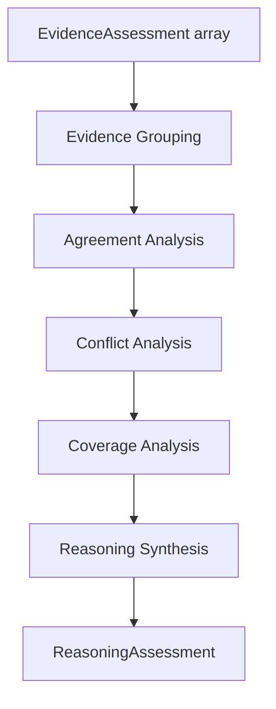

# NeuroVerify: Multimodal Neuro-Symbolic Misinformation Verification Platform
## Multi-Evidence Reasoning — Conceptual Architecture Specification, Version 1.0

| | |
|---|---|
| **Document status** | Draft for review |
| **Location** | `docs/architecture/PHASE_5/MULTI_EVIDENCE_REASONING_SPEC_v1.0.md` |
| **Phase** | Phase 5 — Verification Intelligence (fourth subsystem) |
| **Builds on (frozen, unmodified)** | Phase 2 — `ARCHITECTURE_SPEC.md` v1.0 and `ADDENDUM_v1.1.md`; Phase 3 — `KNOWLEDGE_REPRESENTATION_SPEC_v1.0.md`; Phase 4.1–4.4; Phase 5.1 — `CLAIM_ANALYSIS_ENGINE_SPEC_v1.0.md`; Phase 5.2 — `EVIDENCE_RETRIEVAL_STRATEGY_SPEC_v1.0.md`; Phase 5.3 — `NLI_VERIFICATION_ENGINE_SPEC_v1.0.md` |
| **Nature of this document** | Conceptual architecture only. It defines how many independent, local evidence judgments are synthesized into one coherent picture — not the aggregation algorithms, clustering techniques, or synthesis models that perform that work |
| **Explicitly excluded** | Code, pseudocode, algorithms, clustering/scoring models, technology choices, APIs, implementation schemas, mathematical formulas |
| **Audience** | Engineers who will implement Multi-Evidence Reasoning and any downstream Phase 5 subsystem that computes confidence or produces `VerificationResult` |

This document does not redefine any canonical object or subsystem
responsibility. `StructuredClaim` (Phase 5.1) and `EvidenceAssessment`
(Phase 5.3 §5) retain exactly their existing definitions — they are this
document's sole inputs, unchanged. `VerificationResult` (Phase 3 §1.9)
and the overall "NLI Verification" module responsibility (Phase 2 §5.5)
are unaffected. This document's sole subject is a new Phase 5
subsystem — Multi-Evidence Reasoning — and the conceptual output object
it introduces, `ReasoningAssessment`.

---

## 1. Purpose

### 1.1 What Multi-Evidence Reasoning Is

Multi-Evidence Reasoning is the global reasoning subsystem of
Verification Intelligence. Where the NLI Verification Engine (Phase 5.3)
produces one isolated `EvidenceAssessment` per evidence item — each
deliberately blind to every other item (Phase 5.3 §2.6, §6.2) — this
subsystem is where those isolated judgments are finally allowed to see
each other. It receives a `StructuredClaim` (Phase 5.1 §5) and the full
`EvidenceAssessment[]` (Phase 5.3 §5) produced for it, and synthesizes
them into one coherent `ReasoningAssessment` (§5): which assessments
corroborate each other, which contradict, which are complementary, which
parts of the claim remain unaddressed by any evidence at all, and what
the evidence *as a whole* — not any single item — appears to indicate.

### 1.2 Relationship to Phase 5.3 and to Phase 2 §5.5

Phase 5.3 §1.2 explained that the "NLI Verification" responsibility Phase
2 §5.5 named as a single module is being given its internal architecture
across multiple Phase 5 subsystems, the same way "Knowledge
Representation" (Phase 2 §5.4) was given its internal architecture
across Phase 4.1–4.4. Phase 5.3 built the first, local layer of that
architecture and explicitly deferred aggregation (Phase 5.3 §1.2, §9).
This document is that deferred aggregation layer. It still does not, by
itself, complete Phase 2 §5.5's full contract: `VerificationResult`
carries a numeric `stance_confidence` (Phase 3 §1.9), and this document
explicitly produces no confidence figure of any kind (§9). This
document's output, `ReasoningAssessment`, is structured specifically so
that a further, not-yet-specified downstream step can compute that
confidence from the material this document assembles (§3.9) — consistent
with, not a completion of, Phase 2 §5.5's contract.

### 1.3 Why Global Reasoning Is Separated From Local Reasoning

| Reason | Explanation |
|---|---|
| Global synthesis depends on local reasoning already being trustworthy | Corroboration, contradiction, and coverage are only meaningful judgments if each individual `EvidenceAssessment` being compared is itself sound and uncontaminated (Phase 5.3 §1.3). Global reasoning is only as good as the local judgments it operates over — which is exactly why Phase 5.3 had to be built, and frozen, first |
| Global synthesis introduces judgments that have no meaning at the local level | "These two pieces of evidence corroborate each other" or "the evidence collectively conflicts" are statements about *relationships between* assessments — Phase 5.3 §1.3 established that a single evidence item's assessment structurally cannot express these concepts. This subsystem exists specifically to be the place where cross-item relationships are, for the first time, legitimately considered |
| Keeping synthesis separate from local comparison prevents contamination in both directions | If this subsystem could re-examine or re-derive local stances while synthesizing, the resulting judgments would blur the boundary Phase 5.3 was built to protect (Phase 5.3 §6.2's item isolation). Conversely, if local comparison attempted to anticipate synthesis, it would compromise the very independence that makes synthesis meaningful. The two must remain sequential and separately accountable |
| Synthesis errors must be visible as synthesis errors, not confused with local misreadings or eventual verdict errors | If a claim's eventual verdict is questioned, being able to inspect *how the evidence was combined* — separately from what each item individually said (Phase 5.3) and separately from how a verdict was ultimately decided (Phase 2 Addendum §6) — is what keeps this platform's explainability commitment (Phase 2 §10) intact stage by stage |

### 1.4 What This Buys Downstream Confidence and Decision Work

By fully synthesizing the evidence's corroboration, contradiction, and
coverage structure before any confidence number is computed, whatever
subsystem eventually finalizes `VerificationResult` — and, further
downstream, Fusion Intelligence (Phase 2 §5.8) and the Decision Engine
(Phase 2 Addendum §6) — receives a qualitatively complete picture of what
the evidence shows, ready to be weighed, rather than needing to re-derive
that picture from a flat list of independent local assessments.

---

## 2. Position in Architecture

### 2.1 Position Diagram

```
   Claim Analysis Engine (Phase 5.1)
          │
          │  StructuredClaim
          ▼
   ┌──────────────────────────────────────────────┐
   │  NLI Verification Engine (Phase 5.3)              │
   │  produces EvidenceAssessment[]                      │
   └────────────────────┬─────────────────────────┘
                          │
        StructuredClaim   │   EvidenceAssessment[]
              │           │           │
              └───────────┼───────────┘
                          ▼
             Multi-Evidence Reasoning (this document)
                          │
                          │  ReasoningAssessment
                          ▼
          (downstream confidence computation — out of scope, §9)
                          │
                          ▼
              VerificationResult (Phase 3 §1.9)
```

### 2.2 Two Inputs, Both Already Established

This subsystem takes the same `StructuredClaim` (Phase 5.1 §5) that
every prior Phase 5 subsystem has consumed, and the complete
`EvidenceAssessment[]` (Phase 5.3 §5) — every local assessment produced
for this claim, not a subset. Unlike the NLI Verification Engine (Phase
5.3), which deliberately never sees more than one evidence item at a
time (Phase 5.3 §2.6), this subsystem's entire purpose requires seeing
all of them together (§1.3).

### 2.3 Subsystem Boundaries

| Boundary | Statement |
|---|---|
| Upstream boundary | This subsystem's only inputs are `StructuredClaim` and the complete `EvidenceAssessment[]` (§7.2) — it never reads `ClaimRecord`, `CandidateEvidenceSet`, or any raw evidence content directly; it reasons entirely over already-produced local assessments |
| Downstream boundary | This subsystem's only output is `ReasoningAssessment` (§5) — a single object per claim, never a confidence score, never a `VerificationResult`, never a verdict |
| Lateral boundary | This subsystem does not invoke, depend on, or coordinate with the NLI Verification Engine, Evidence Retrieval, or any other Phase 2/5 module — its relationship to them is entirely producer-to-consumer |

### 2.4 Why This Subsystem Never Accesses the Knowledge Graph Directly

As with every prior Phase 5 subsystem (Phase 5.1 §2.5, Phase 5.2 §2.5,
Phase 5.3 §2.5), this subsystem has no independent need for persistent
knowledge or evidence access — everything it reasons over
(`StructuredClaim`, `EvidenceAssessment[]`, and, transitively via
Assessment Traceability, §5.8, the provenance each assessment already
carries) has already been supplied as input. Consistent with Phase 4.4
§1.1's single-gateway principle, this subsystem correctly has no access
path to the Knowledge Graph, Evidence Store, or Knowledge Access Layer
whatsoever.

### 2.5 Statelessness

This subsystem holds no memory between invocations (mirroring every
prior Phase 5 subsystem) — each claim's full `EvidenceAssessment[]` is
synthesized entirely on its own terms, with no dependency on how any
other claim's evidence was ever synthesized. Unlike Phase 5.3 (§2.6),
which additionally isolates processing *within* one invocation across
evidence items, this subsystem's defining property is the opposite: full
visibility across every assessment *within* one invocation, and no
visibility whatsoever *across* invocations.

---

## 3. Responsibilities

### 3.1 Synthesize Assessments

Combining the full `EvidenceAssessment[]` into one coherent picture of
what the evidence, taken together, indicates about the claim — the
subsystem's overarching responsibility, discharged through the more
specific responsibilities below and culminating in `ReasoningAssessment`
(§5).

### 3.2 Identify Corroboration

Grouping assessments whose local stance and supported assertions (Phase
5.3 §5.3–§5.4) agree with each other on the same claim content —
producing Corroboration Groups (§5.3). Consistent with the corroboration
philosophy already established for the Knowledge Graph (Phase 4.1 §1.4)
and the Evidence Store (Phase 4.2 §6.7), this responsibility distinguishes
genuine, independent agreement from mere redundancy (§3.4) — two
assessments derived from syndicated copies of the same underlying source
(Phase 4.2 §7.4) do not corroborate each other in the sense that matters
for evidentiary strength, even though their local stances agree.

### 3.3 Identify Contradictions

Grouping assessments whose local stance or specific
supported/contradicted assertions (Phase 5.3 §5.3–§5.5) are in direct
tension with each other — producing Contradiction Groups (§5.4).
Consistent with this platform's conflict-preservation principle (Phase
4.1 §7.1, restated at the resolution layer in Phase 4.3 §7.4), this
responsibility identifies and preserves contradiction explicitly; it
never silently discards the less-numerous or seemingly-weaker side of a
contradiction.

### 3.4 Identify Redundancy

Distinguishing assessments that merely repeat the same underlying source
(via syndication, mirroring, or translation — the same variant types
already governed by Phase 4.2 §7) from assessments that constitute
genuine, independent corroboration (§3.2). This responsibility does not
discard redundant assessments — every `EvidenceAssessment` remains
traceable (§3.7) — but it ensures that Corroboration Groups (§5.3)
reflect independent agreement, not inflated apparent agreement from
counting the same underlying source more than once.

### 3.5 Identify Complementary Evidence

Recognizing when different assessments, without conflicting, each
address *different* parts of the claim's verification scope (Phase 5.1
§5.11) — particularly relevant where `StructuredClaim` has decomposed
the claim into multiple sub-propositions (Phase 5.1 §5.10). Complementary
evidence is neither corroboration (§3.2, same content, agreement) nor
contradiction (§3.3, same content, disagreement) — it is coverage
expansion, and this responsibility represents it as its own category
(§5.5) rather than forcing it into one of the other two.

### 3.6 Determine Claim Coverage

Aggregating every assessment's individual Claim Coverage (Phase 5.3
§5.6) into one overall picture of how much of the claim's verification
scope (Phase 5.1 §5.11) has been addressed by the evidence as a whole —
and, symmetrically, which assertions remain entirely unaddressed by any
assessment (§5.6's Unresolved Assertions). This is the aggregate,
whole-claim counterpart to the per-item measurement Phase 5.3 §5.6
already establishes.

### 3.7 Generate Reasoning Chain

Producing an ordered, inspectable account of how this subsystem arrived
at its grouping (§3.2–§3.5), coverage (§3.6), and synthesized stance
(§5.2) conclusions — the global analog of the local reasoning trace Phase
5.3 §3.6 establishes, and subject to the identical caution: this
subsystem's reasoning chain is a component internal to
`ReasoningAssessment` (§5.7), not itself a `ReasoningRecord` object
(Phase 3 §1.10's `fired_by` enum, fixed to `fusion_intelligence` and
`decision_engine`, is unchanged by this document).

### 3.8 Preserve Traceability

Ensuring every grouping, coverage determination, and synthesized
conclusion in `ReasoningAssessment` remains traceable back to the
specific `EvidenceAssessment` objects (and, transitively, their own
provenance references, Phase 5.3 §5.9) that support it — this subsystem
adds structure and relationship, but never severs the link back to the
individual local judgments a given synthesis conclusion rests on.

### 3.9 Prepare Confidence Input

Structuring `ReasoningAssessment`'s content — corroboration strength
(net of redundancy, §3.4), contradiction severity, and coverage
completeness — so that a downstream confidence-computing step (§1.2, out
of this document's scope) has everything it needs without needing to
re-derive any of this subsystem's synthesis work. This responsibility is
explicitly **not** confidence computation itself (§9) — it is ensuring
the raw material for that computation is complete, structured, and
unambiguous.

---

## 4. Reasoning Lifecycle

### 4.1 Lifecycle Diagram



### 4.2 Stage-by-Stage Explanation

**Stage 1 — `EvidenceAssessment[]`.** The complete set of local
assessments produced by the NLI Verification Engine (Phase 5.3) for this
claim enters the subsystem, together with the shared `StructuredClaim`
(§2.2).

**Stage 2 — Evidence Grouping.** Assessments are organized according to
which specific claim assertions (Phase 5.1 §5.4, §5.10) they address —
the structural precondition for every later stage, and the stage at
which redundancy (§3.4) is distinguished from independent assessment, so
that later grouping reflects genuinely distinct sources.

**Stage 3 — Agreement Analysis.** Within each group from Stage 2,
assessments that corroborate each other (§3.2) are identified, producing
Corroboration Groups (§5.3).

**Stage 4 — Conflict Analysis.** Within and across groups, assessments in
direct tension are identified (§3.3), producing Contradiction Groups
(§5.4); assessments that address different, non-overlapping claim
content without conflicting are identified as Complementary Evidence
(§3.5, §5.5).

**Stage 5 — Coverage Analysis.** Building on Stages 2–4, the subsystem
determines overall Claim Coverage (§3.6) and identifies Unresolved
Assertions (§5.6) — the claim content no assessment, individually or in
combination, actually addresses.

**Stage 6 — Reasoning Synthesis.** Every prior stage's findings are
combined into a Synthesized Stance (§5.2), and the full Reasoning Chain
(§3.7, §5.7) documenting how that stance was reached is assembled,
together with a Reasoning Completeness statement (§5.9) and Reasoning
Summary (§5.10).

**Stage 7 — `ReasoningAssessment`.** Every component from Stages 2–6,
together with full Assessment Traceability (§3.8, §5.8) back to every
contributing `EvidenceAssessment`, is assembled into one complete
`ReasoningAssessment` (§5).

### 4.3 Why This Ordering Matters

| Ordering constraint | Why it must hold |
|---|---|
| Evidence Grouping before Agreement/Conflict Analysis | Corroboration and contradiction are only meaningful *within* a group of assessments addressing the same claim content — grouping is the structural precondition for both |
| Agreement Analysis before Conflict Analysis | Establishing what agrees is a natural first pass that narrows what remains to be checked for genuine tension — though conceptually independent, performing agreement analysis first means conflict analysis operates over a smaller, already-partially-understood set |
| Conflict Analysis before Coverage Analysis | Knowing what is corroborated and what is contradicted (Stages 3–4) is a prerequisite for identifying what remains entirely unaddressed (Stage 5) — coverage is defined as what's left over once agreement and disagreement are both accounted for |
| Coverage Analysis before Reasoning Synthesis | A synthesized stance (Stage 6) that did not first account for coverage gaps (Stage 5) would risk overstating what the evidence, taken together, actually establishes |
| Reasoning Synthesis last | Every prior stage's output is a necessary component of the final synthesis — nothing is concluded until every contributing analysis has completed |

This fixed ordering makes the subsystem's output deterministic (§6.2):
the same `EvidenceAssessment[]`, synthesized by this subsystem, always
produces the same `ReasoningAssessment`.

---

## 5. ReasoningAssessment Concept

### 5.1 What `ReasoningAssessment` Is

`ReasoningAssessment` is this subsystem's sole output — one per claim,
synthesizing the complete `EvidenceAssessment[]` (Phase 5.3 §5) into one
coherent picture. As with every conceptual object introduced across
Phase 5 (`StructuredClaim`, Phase 5.1 §5.1; `RetrievalPlan`, Phase 5.2
§5.1; `EvidenceAssessment`, Phase 5.3 §5.1), it is described purely in
terms of its components and their purpose, never as a field-level
schema. Every `ReasoningAssessment` traces to exactly one
`StructuredClaim` and the complete `EvidenceAssessment[]` produced for
it.

### 5.2 Synthesized Stance

The subsystem's aggregate, qualitative characterization of what the
evidence collectively indicates: that it supports the claim, refutes it,
does not provide enough information, or — now meaningfully expressible
for the first time in this pipeline (Phase 5.3 §1.3, §5.3 explicitly
reserved this) — that it **conflicts**, with genuine, comparably-weighted
corroboration on more than one side. Synthesized Stance is a qualitative
determination, never a confidence-weighted one (§3.9, §9) — it describes
the *shape* of what the evidence shows, leaving *how confident to be
about it* to the downstream step this document's output is prepared for.

### 5.3 Corroboration Groups

Clusters of assessments (§3.2) that independently agree on the same
claim content, net of redundancy (§3.4) — each group representing
genuine, independently-sourced agreement rather than repetition of a
single underlying source. The size and independence of a corroboration
group is exactly the kind of structured material Phase 4.1 §1.4's
cross-claim corroboration principle and Phase 4.2 §6.7's confidence-
inheritance philosophy anticipate being used downstream (§3.9), without
this document itself assigning that material a numeric weight.

### 5.4 Contradiction Groups

Clusters of assessments (§3.3) that are in direct tension with each
other over the same claim content — preserved explicitly and completely,
never resolved or collapsed into a single "winning" side, consistent
with this platform's conflict-preservation principle (Phase 4.1 §7.1,
Phase 4.3 §7.4) applied here at the evidentiary-synthesis layer.

### 5.5 Complementary Evidence

The set of assessments (§3.5) that, without conflicting, each address
distinct parts of the claim's verification scope (Phase 5.1 §5.11) —
representing coverage breadth rather than either agreement or
disagreement on any single point. This component is what allows a
compound claim's sub-propositions (Phase 5.1 §5.10) to each be
recognized as addressed by different evidence, without any of that
evidence being mischaracterized as corroborating or contradicting
content it was never actually about.

### 5.6 Unresolved Assertions

The claim content — potentially an entire decomposed sub-proposition,
Phase 5.1 §5.10 — that no assessment in `EvidenceAssessment[]`,
individually or in combination, actually addresses (§3.6). Mirroring
Phase 5.3 §5.6's per-item unresolved content and Phase 5.1 §5.9's
"always present, possibly empty" pattern for ambiguity markers, this
component is always explicitly stated, even when empty, rather than left
as a silent gap.

### 5.7 Claim Coverage Summary

The aggregate statement of how much of the claim's overall verification
scope (Phase 5.1 §5.11) has been addressed by the evidence as a whole —
combining Corroboration Groups (§5.3), Contradiction Groups (§5.4), and
Complementary Evidence (§5.5) into one coherent coverage picture, with
Unresolved Assertions (§5.6) as its explicit complement.

### 5.8 Reasoning Chain

The ordered, inspectable account of how this subsystem moved from raw
`EvidenceAssessment[]` through grouping, agreement, conflict, and
coverage analysis to its final Synthesized Stance (§3.7) — internal to
`ReasoningAssessment`, not a `ReasoningRecord` object (§3.7 explains this
distinction, mirroring Phase 5.3 §5.7's identical treatment).

### 5.9 Reasoning Completeness

An honest, explicit statement of how completely this subsystem was able
to synthesize the available assessments — distinct from Claim Coverage
Summary (§5.7), which describes how much of the *claim* the *evidence*
covers. Reasoning Completeness instead describes how cleanly this
subsystem's own synthesis process resolved: whether every assessment was
successfully grouped and categorized, or whether some assessments
resisted clean categorization (e.g. an assessment too ambiguous to
confidently place in a corroboration or contradiction group).
Consistent with this platform's honesty-under-uncertainty principle
(Phase 2 §6.5, extended through Phase 5.1 §5.9's ambiguity markers and
Phase 5.2's stopping-condition honesty, §3.8), incomplete synthesis is
reported explicitly, never silently smoothed over.

### 5.10 Reasoning Summary

A concise, human-readable statement of what the evidence, taken
together, appears to show — the most compact representation of
everything §5.2–§5.9 establish, intended to give a downstream consumer
(or the eventual `ExplanationRecord`, Phase 3 §1.13) an immediately
legible account of the claim's overall evidentiary picture without
needing to parse every structured component individually, mirroring
Phase 5.3 §5.10's identical role at the local level.

### 5.11 Assessment Traceability

Explicit, preserved links from every component above back to the
specific `EvidenceAssessment` objects (§3.8) — and, transitively, to
their own Provenance References (Phase 5.3 §5.9) — that support it. No
grouping, coverage determination, or synthesized conclusion in
`ReasoningAssessment` exists without a traceable path back to the
individual local judgments it rests on.

### 5.12 How the Components Relate

```
EvidenceAssessment[] (input)
   │
   ▼
Corroboration Groups (5.3) ──┐
Contradiction Groups (5.4) ──┼── inform ──► Claim Coverage Summary (5.7)
Complementary Evidence (5.5)─┘                        │
                                                          ▼
                                            Unresolved Assertions (5.6)
                                                          │
                                                          ▼
                                              Synthesized Stance (5.2)
                                                          │
                                                          ▼
                                              Reasoning Chain (5.8)
                                                          │
                                     ┌────────────────────┼────────────────────┐
                                     ▼                    ▼                    ▼
                       Reasoning Completeness (5.9)  Reasoning Summary (5.10)  Assessment Traceability (5.11)
```

As with every conceptual object in this series, `ReasoningAssessment` is
a layered representation — later components depend on and are only
meaningful in terms of earlier ones, mirroring the lifecycle's ordering
(§4.3).

### 5.13 Worked Example

Continuing the running example from Phase 5.1 §5.13, Phase 5.2 §5.13,
and Phase 5.3 §5.12 — the health ministry's claimed 15% reduction in
hospital admissions — recall Phase 5.3 produced two assessments: the
ministry's own statement (`supports` the attribution sub-proposition
only) and an independent dataset (`refutes` the statistical
sub-proposition, showing 8% rather than 15%).

| Component | Illustrative content |
|---|---|
| Synthesized Stance (5.2) | `conflicting` — not because the two assessments disagree on the same point, but because, taken together, they reveal the claim's two sub-propositions point in different directions: the attribution is confirmed, while the underlying statistic is disputed |
| Corroboration Groups (5.3) | None — only two assessments exist, addressing different sub-propositions, so no group of independently-agreeing assessments exists yet |
| Contradiction Groups (5.4) | None in the strict sense — the two assessments do not contradict *each other* (they address different assertions); this is Complementary Evidence, not contradiction (see 5.5) |
| Complementary Evidence (5.5) | Both assessments together — the ministry's statement establishes attribution, the dataset addresses the statistic, jointly covering more of the claim's verification scope than either alone |
| Unresolved Assertions (5.6) | None remain, in this simplified example — both sub-propositions from Phase 5.1's decomposition are addressed by one assessment each |
| Claim Coverage Summary (5.7) | Full coverage of both decomposed sub-propositions, achieved through complementary rather than corroborating evidence |
| Reasoning Chain (5.8) | Documents that grouping placed the two assessments in separate categories (by sub-proposition), found no direct agreement or disagreement between them individually, but recognized their combined effect reveals a substantive internal tension in the original claim |
| Reasoning Completeness (5.9) | Complete — every assessment was successfully categorized, and coverage is full |
| Reasoning Summary (5.10) | "The ministry's claim to have made this statement is confirmed. The statistic itself, however, is contradicted by independent data showing a smaller reduction than claimed." |
| Assessment Traceability (5.11) | Both source `EvidenceAssessment` objects remain individually referenced and inspectable |

This example illustrates why `conflicting` (§5.2) required the full
grouping-then-synthesis pipeline (§4) to surface correctly: neither
individual assessment (Phase 5.3) was itself in conflict with anything —
the conflict only becomes visible once both are considered together
against the claim's decomposed structure, exactly the kind of judgment
Phase 5.3 §1.3 identified as structurally impossible at the local level
and reserved for this subsystem.

---

## 6. Architectural Principles

### 6.1 Local Reasoning Before Global Reasoning

This subsystem's entire reason for existing (§1.3): every evidence item
must be locally, independently assessed (Phase 5.3) before any
cross-item relationship is considered — global synthesis operating over
un-vetted or mutually-contaminated local judgments would be unsound from
the start.

### 6.2 Deterministic Synthesis

The same `EvidenceAssessment[]`, synthesized by this subsystem, always
produces the same `ReasoningAssessment` — extending the determinism
guarantee established at every prior Phase 5 stage (Phase 5.1 §6.2,
Phase 5.2 §6.2, Phase 5.3 §6.3) into the aggregation layer.

### 6.3 Explainability

Every `ReasoningAssessment` is fully traceable (§5.11) and carries its
own reasoning chain (§5.8) and honest completeness statement (§5.9) —
extending the "explainability begins here" commitment (Phase 5.1 §6.7,
Phase 5.2 §6.6, Phase 5.3 §6.4) one stage further: by the time synthesis
completes, not only is every local judgment explainable, but how they
were combined is explainable too.

### 6.4 Evidence Integrity

This subsystem never alters any `EvidenceAssessment` it synthesizes —
grouping, corroboration/contradiction/complementary classification, and
coverage analysis are all read-only operations over the input array;
every original assessment remains exactly as Phase 5.3 produced it,
reachable through Assessment Traceability (§5.11), mirroring the
evidence-integrity principle Phase 5.3 §6.5 establishes at the local
level.

### 6.5 No Confidence Estimation

Nothing in `ReasoningAssessment` (§5) is a numeric confidence value.
Synthesized Stance (§5.2) is qualitative; corroboration and contradiction
are represented as groups, not scores; Reasoning Completeness (§5.9) is
an honest statement of process completeness, not a confidence figure.
This boundary is as absolute as Phase 5.3 §6.6's "no truth inference"
boundary, applied here to confidence specifically rather than truth.

### 6.6 No Verdict Generation

`ReasoningAssessment` never states whether the claim is true — it states
what the evidence, considered together, shows. This is the same
boundary every Phase 5 subsystem has drawn at its own stage (Phase 5.1
§6.5, Phase 5.3 §6.6), restated here for the aggregation layer
specifically: even conflicting evidence, honestly surfaced (§5.2), is
not this subsystem concluding the claim is false or unresolvable — that
conclusion belongs to the Decision Engine (Phase 2 Addendum §6), many
stages downstream.

### 6.7 Separation of Concerns

Every principle above is an instance of one governing commitment: this
subsystem does exactly one thing — synthesize local assessments into a
coherent global picture — and delegates everything else (local
comparison, confidence computation, verdict determination, decision,
explanation) to the subsystems already built, or yet to be built, for
those purposes.

---

## 7. Interface Contracts

### 7.1 Contract Philosophy

Consistent with every prior Phase 4 and Phase 5 specification, this
section states the conceptual data contract at this subsystem's
boundary — never an API, protocol, or technology.

### 7.2 Incoming: `StructuredClaim` and `EvidenceAssessment[]`

| | `StructuredClaim` | `EvidenceAssessment[]` |
|---|---|---|
| Source | Claim Analysis Engine (Phase 5.1) | NLI Verification Engine (Phase 5.3) |
| Object | Exactly as conceptually defined in Phase 5.1 §5 | Exactly as conceptually defined in Phase 5.3 §5, unmodified |
| Cardinality | One per invocation | The complete set produced for this claim — not a subset (§2.2) |

### 7.3 Outgoing: `ReasoningAssessment`

| | |
|---|---|
| Destination | Downstream confidence computation (out of scope, §9) |
| Object | `ReasoningAssessment`, as conceptually defined in §5 |
| Postcondition | Every component in §5.2–§5.11 is present; Unresolved Assertions (§5.6) is always explicitly stated, even when empty (§5.6) |
| Traceability | Every `ReasoningAssessment` is traceable to exactly one `StructuredClaim` and the complete `EvidenceAssessment[]` it synthesized (§5.1) |

### 7.4 What This Subsystem Never Receives or Returns

| Never received | Never returned |
|---|---|
| `ClaimRecord`, `CandidateEvidenceSet`, or raw evidence content directly (§2.3) | `VerificationResult`, or any object carrying a numeric confidence value (§6.5) |
| Any Knowledge Graph, Evidence Store, or Knowledge Access Layer object (§2.4) | Any verdict, `DecisionRecord`, or truth judgment of any kind (§6.6) |
| A partial or filtered `EvidenceAssessment[]` (§2.2 requires the complete set) | Any modification to an input `EvidenceAssessment` (§6.4) |

---

## 8. Scalability

### 8.1 Large Evidence Collections

Unlike the NLI Verification Engine (Phase 5.3 §8.1), whose per-item
isolation makes its workload scale linearly and independently of
collection size, this subsystem's grouping and cross-comparison work
(§3.2–§3.5) inherently grows with the number of assessments being
synthesized, since relationships between assessments are exactly what
this subsystem exists to find. This is an intrinsic property of global
reasoning, not an architectural inefficiency — this document does not
prescribe how that growth is managed computationally (per its
implementation-agnostic scope), only that the conceptual responsibilities
(§3) remain well-defined regardless of collection size.

### 8.2 Streaming Evidence

Because Phase 5.3 §8.2 already establishes that evidence assessment can
proceed incrementally as items arrive, this subsystem's synthesis may
need to be re-invoked or incrementally updated as new assessments become
available rather than waiting for a single, complete
`EvidenceAssessment[]` — this document establishes that its conceptual
responsibilities (§3) apply equally whether invoked once over a complete
set or repeatedly as the set grows, without prescribing which approach a
future implementation adopts.

### 8.3 Incremental Synthesis

Related to streaming evidence (§8.2): because grouping (§3.2–§3.5) is
fundamentally a matter of relating each assessment to relevant others
addressing the same claim content, adding one new assessment to an
already-synthesized set conceptually requires re-evaluating that new
assessment's relationships to existing groups, not necessarily
re-deriving every relationship from scratch — this document establishes
the requirement (new evidence must be correctly incorporated) without
prescribing the incremental mechanism that satisfies it.

### 8.4 Distributed Reasoning

Should synthesis be distributed across multiple concurrent processes in
a future implementation, this subsystem's conceptual contract requires
that the final `ReasoningAssessment` reflect the complete
`EvidenceAssessment[]` coherently, regardless of how the underlying
grouping and analysis work was physically partitioned — mirroring the
identical logical-coherence requirement Phase 4.3 §11.6 and Phase 4.4
§9.5 establish for their own future-distribution scenarios.

### 8.5 What This Section Deliberately Does Not Address

Consistent with this document's implementation-agnostic scope, this
section names no specific throughput target, clustering mechanism, or
distributed-computing technology. Its contribution is confirming that
this subsystem's conceptual responsibilities (§3), lifecycle (§4), and
output shape (§5) remain well-defined at any scale, even though — unlike
Phase 5.3 — this subsystem's workload does not trivially decompose into
fully independent units of work.

---

## 9. Non-Goals

### 9.1 Explicit Boundaries

Multi-Evidence Reasoning does **not**:

| Non-goal | Why it belongs elsewhere |
|---|---|
| Compute confidence | `ReasoningAssessment` (§5) prepares structured material for confidence computation (§3.9) but contains no numeric confidence value itself — that computation is a distinct, downstream responsibility (§1.2) |
| Determine final truth | This subsystem characterizes what the evidence shows (§5.2), never whether the claim is true — that remains the Decision Engine's exclusive responsibility (Phase 2 Addendum §6), many stages downstream |
| Retrieve evidence | Evidence Retrieval (Phase 2 §5.3) supplies the evidence this subsystem's inputs are ultimately derived from; this subsystem never searches for anything itself |
| Plan retrieval | Evidence Retrieval Strategy (Phase 5.2) determines what should be searched for; this subsystem operates many stages after that planning has concluded |
| Perform local reasoning | The NLI Verification Engine (Phase 5.3) produces the individual `EvidenceAssessment` objects this subsystem consumes; this subsystem never independently compares the claim against raw evidence content |
| Update knowledge | This subsystem has no write capability of any kind toward any persistent store in this platform |
| Access the Knowledge Graph directly | Per §2.4, this subsystem has no access path to the Knowledge Graph, Evidence Store, or Knowledge Access Layer whatsoever |

### 9.2 Why This Separation Is Critical

Every non-goal above protects this document's central claim (§1.3, §6.7):
Multi-Evidence Reasoning synthesizes; it does not locally compare,
retrieve, plan, estimate confidence, or conclude. If this subsystem
additionally computed confidence or determined truth, its synthesis
could no longer be trusted as a pure, qualitative account of what the
evidence collectively shows — a `ReasoningAssessment` shaped by pressure
to also reach a numeric or truth-valued conclusion would compromise the
very separation between "what does the evidence show" and "how sure are
we, and is it true" that makes each stage of this pipeline independently
auditable. Keeping this subsystem strictly within synthesis, exactly as
every subsystem before it in Phase 5 has stayed strictly within its own
accountable boundary, is what allows whatever subsystem finally computes
confidence and produces `VerificationResult` to build on a foundation it
can trust was never quietly pre-judged.

---

*End of Multi-Evidence Reasoning Conceptual Architecture Specification, Version 1.0.*
*This document is the fourth subsystem specification of Phase 5 — Verification*
*Intelligence — and builds on, without altering, the frozen Phase 2*
*(`ARCHITECTURE_SPEC.md` v1.0, `ADDENDUM_v1.1.md`), Phase 3*
*(`KNOWLEDGE_REPRESENTATION_SPEC_v1.0.md`), Phase 4.1–4.4, Phase 5.1*
*(`CLAIM_ANALYSIS_ENGINE_SPEC_v1.0.md`), Phase 5.2*
*(`EVIDENCE_RETRIEVAL_STRATEGY_SPEC_v1.0.md`), and Phase 5.3*
*(`NLI_VERIFICATION_ENGINE_SPEC_v1.0.md`) documents.*
