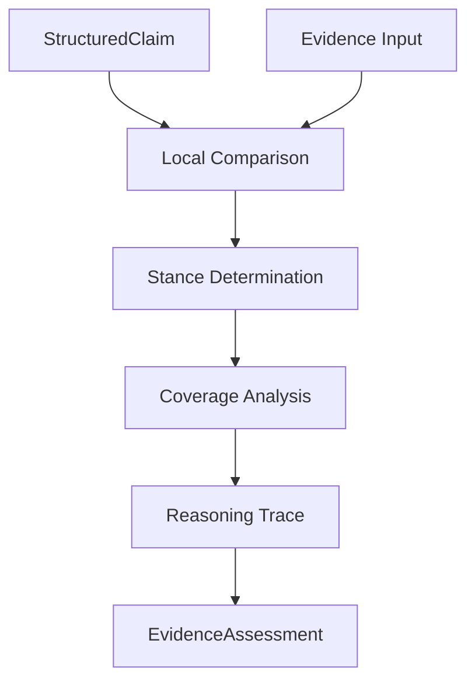

# NeuroVerify: Multimodal Neuro-Symbolic Misinformation Verification Platform
## NLI Verification Engine — Conceptual Architecture Specification, Version 1.0

| | |
|---|---|
| **Document status** | Draft for review |
| **Location** | `docs/architecture/PHASE_5/NLI_VERIFICATION_ENGINE_SPEC_v1.0.md` |
| **Phase** | Phase 5 — Verification Intelligence (third subsystem) |
| **Builds on (frozen, unmodified)** | Phase 2 — `ARCHITECTURE_SPEC.md` v1.0 and `ADDENDUM_v1.1.md`; Phase 3 — `KNOWLEDGE_REPRESENTATION_SPEC_v1.0.md`; Phase 4.1–4.4; Phase 5.1 — `CLAIM_ANALYSIS_ENGINE_SPEC_v1.0.md`; Phase 5.2 — `EVIDENCE_RETRIEVAL_STRATEGY_SPEC_v1.0.md` |
| **Nature of this document** | Conceptual architecture only. It defines what local, per-evidence-item comparison means and produces — not the inference techniques, models, or algorithms that perform that comparison |
| **Explicitly excluded** | Code, pseudocode, algorithms, NLI models, technology choices, APIs, implementation schemas, mathematical formulas |
| **Audience** | Engineers who will implement the NLI Verification Engine and any downstream Phase 5 subsystem that aggregates its output |

This document does not redefine any canonical object or subsystem
responsibility. `StructuredClaim` (Phase 5.1) and the evidence-bundle
concept `CandidateEvidenceSet` draws on (Phase 4.2 §2.5) retain exactly
their existing definitions. `VerificationResult` (Phase 3 §1.9) and the
overall "NLI Verification" module responsibility (Phase 2 §5.5) are
unchanged. This document's sole subject is a new Phase 5 subsystem — the
NLI Verification Engine — and the conceptual output object it
introduces, `EvidenceAssessment`.

---

## 1. Purpose

### 1.1 What the NLI Verification Engine Is

The NLI Verification Engine performs **local reasoning**: given a
`StructuredClaim` (Phase 5.1 §5) and one item drawn from a
`CandidateEvidenceSet` (§2.3), it determines that one item's stance
toward the claim — whether it supports, refutes, or does not speak to
the claim's assertions — and produces a structured, explainable
`EvidenceAssessment` (§5). It performs this comparison **one evidence
item at a time**, in isolation from every other item in the set. It
never combines assessments, never weighs one against another, and never
produces a claim-level verdict.

### 1.2 Relationship to Phase 2 §5.5's NLI Verification Module

Phase 2 §5.5 named "NLI Verification" as a single module: input
`ClaimRecord`, `EvidenceRecord[]`, `FactRecord[]`; output
`VerificationResult`, carrying an aggregate `stance` and
`stance_confidence` across all evidence considered (Phase 3 §1.9). That
description was, correctly for its level of detail, a black box — Phase
2 fixed the *contract*, not the *internal architecture* behind it. This
is exactly the situation Phase 4.1–4.4 addressed for the "Knowledge
Representation" responsibility Phase 2 §5.4 named as a single module
(elaborated across four Phase 4 documents into Evidence Store,
Resolution Engine, Knowledge Graph, and Knowledge Access Layer). Phase 5
is doing the same for "NLI Verification": this document specifies the
**first and most fundamental** internal subsystem behind that
responsibility — local, per-evidence-item comparison. It does not, by
itself, complete Phase 2 §5.5's full contract. Producing the aggregate
`VerificationResult` from many `EvidenceAssessment` objects is a
distinct, downstream concern, explicitly outside this document's scope
(§9) — consistent with, not a departure from, Phase 2 §5.5's frozen
contract, which describes the module's external behavior at a coarser
grain than this internal decomposition operates.

### 1.3 Why Local Reasoning Is Separated From Global Reasoning

| Reason | Explanation |
|---|---|
| Local comparison and aggregation are different kinds of task | Determining what *one* piece of evidence says about a claim is a bounded, self-contained comparison. Determining what *all* the evidence together implies — weighing corroboration, resolving disagreement, computing an overall confidence — is a synthesis task operating over many such comparisons. Conflating them risks letting the order evidence happens to arrive in, or the presence of one especially persuasive-seeming item, distort what should be an even-handed, complete assessment of every item on its own terms |
| Every evidence item deserves an assessment uncontaminated by any other | If this engine could see the full evidence set while assessing one item, its stance determination for that item could be subtly influenced by what else is present — a majority of refuting evidence might bias the reading of a supporting item, or vice versa. Isolating each comparison (§6.2) is what guarantees every `EvidenceAssessment` reflects only what that one piece of evidence actually says |
| Aggregation-level concepts do not belong at the local level | Notions like "the evidence conflicts" (Phase 3 §1.9's `stance = conflicting`) are only meaningful when comparing multiple items against each other — they have no content for a single item in isolation. Keeping this engine strictly local means its output vocabulary (§5.3) never needs, and structurally cannot express, a conclusion that only makes sense in aggregate |
| Errors of local misreading must be visible as such, not buried in a global score | If a claim's eventual verdict is questioned, being able to inspect exactly what each individual piece of evidence was found to say — before any weighing or combination occurred — is what makes the aggregate result auditable back to its individual parts, consistent with this platform's explainability commitment (Phase 2 §10) and the same rationale Phase 5.1 §1.2 and Phase 5.2 §1.2 give for their own boundaries |

### 1.4 What This Buys Downstream Aggregation

By producing one clean, isolated, fully-reasoned assessment per evidence
item, whatever subsystem eventually aggregates them into a
`VerificationResult` receives a complete, uncontaminated set of local
judgments to weigh — rather than needing to re-derive what each piece of
evidence individually says while simultaneously trying to reconcile them
against each other.

---

## 2. Position in Architecture

### 2.1 Position Diagram

```
   Claim Analysis Engine (Phase 5.1)
          │
          │  StructuredClaim
          ▼
   Evidence Retrieval Strategy (Phase 5.2)  ──►  RetrievalPlan  ──►  Evidence Retrieval (Phase 2 §5.3)
                                                                            │
                                                                            │  CandidateEvidenceSet
                                                                            ▼
   StructuredClaim ─────────────────────────────────────────────►  NLI Verification Engine (this document)
                                                                            │
                                                                            │  EvidenceAssessment[]
                                                                            ▼
                                                            (downstream aggregation — out of scope, §9)
                                                                            │
                                                                            ▼
                                                              VerificationResult (Phase 3 §1.9)
```

### 2.2 Two Inputs, Converging

Unlike Phase 5.1 and Phase 5.2, which each take a single input, this
engine takes two: the `StructuredClaim` (Phase 5.1 §5) that Evidence
Retrieval Strategy (Phase 5.2) also consumed, and the
`CandidateEvidenceSet` (§2.3) that Evidence Retrieval (Phase 2 §5.3)
produced by executing the resulting `RetrievalPlan` (Phase 5.2 §5). Both
trace back to the same originating claim; this engine is where they
converge.

### 2.3 What `CandidateEvidenceSet` Is

`CandidateEvidenceSet` is this document's name for the claim-scoped
collection of retrieved evidence — conceptually the same construct Phase
4.2 §2.5 already named **Evidence Bundle**: "the specific set of
`EvidenceRecord`s that Evidence Retrieval assembles and hands to NLI
Verification for one claim... a view — a selection of references into
the [Evidence] Repository — assembled fresh for each verification
attempt." This document introduces no new object; `CandidateEvidenceSet`
is simply this subsystem's name for consuming that already-established
concept as its second input. Consistent with Phase 2 §5.5's original
contract, the set may contain both `EvidenceRecord` (Phase 3 §1.5) and
`FactRecord` (Phase 3 §1.8) items — both already fetched and handed to
this engine by upstream subsystems; this engine never independently
queries the Evidence Store, Knowledge Graph, or Knowledge Access Layer to
obtain them (§2.5).

### 2.4 Subsystem Boundaries

| Boundary | Statement |
|---|---|
| Upstream boundary | This engine's only inputs are `StructuredClaim` and `CandidateEvidenceSet` (§7.2) — it never reads `ClaimRecord`, `RetrievalPlan`, or any other object directly |
| Downstream boundary | This engine's only output is `EvidenceAssessment[]` (§5) — one assessment per item in `CandidateEvidenceSet`, never a combined or aggregate result |
| Lateral boundary | This engine does not invoke, depend on, or coordinate with Evidence Retrieval, Fusion Intelligence, or any other Phase 2/5 module — its relationship to them is entirely producer-to-consumer |

### 2.5 Why This Engine Never Accesses the Knowledge Graph Directly

As with Phase 5.1 §2.5 and Phase 5.2 §2.5, this engine has no
independent need to query the Knowledge Graph, Evidence Store, or
Knowledge Access Layer — everything it needs (the claim's structure, and
the candidate evidence including any `FactRecord` content) has already
been supplied as input by upstream subsystems. Consistent with Phase 4.4
§1.1's single-gateway principle, a subsystem with no genuine independent
need for knowledge access has no access path to it at all.

### 2.6 Statelessness and Item Isolation

This engine holds no memory between invocations (mirroring Phase 5.1
§2.6, Phase 5.2 §2.6), and additionally holds no memory *within* a single
invocation across the evidence items it processes (§6.2) — assessing one
`CandidateEvidenceSet` item never depends on, or is visible to, the
assessment of any other item in the same set. This is a stronger
isolation property than either prior Phase 5 subsystem requires, and it
exists specifically to guarantee the local-reasoning purity §1.3
describes.

---

## 3. Responsibilities

### 3.1 Compare Claim and Evidence

Reading `StructuredClaim`'s verification scope (Phase 5.1 §5.11),
target entities and relations (Phase 5.1 §5.3–§5.4), and one
`CandidateEvidenceSet` item's content, and establishing what relationship
— if any — exists between what the claim asserts and what that evidence
item states. This is the engine's foundational responsibility; every
other responsibility in this section elaborates one aspect of it.

### 3.2 Determine Stance

Classifying the comparison from §3.1 into a local stance (§5.3) —
whether this one evidence item supports, refutes, or does not provide
enough information to speak to the claim. Because this determination
concerns exactly one evidence item, it never yields "conflicting" — that
classification only has meaning when comparing multiple items against
each other, an aggregation-level concept this engine structurally cannot
produce (§1.3).

### 3.3 Identify Supported Assertions

Where the evidence item supports the claim, identifying precisely
*which* of the claim's assertions it supports — potentially a subset
of the claim's full content, especially where `StructuredClaim` has
decomposed the claim into multiple sub-propositions (Phase 5.1 §5.10).
An evidence item rarely speaks to everything a claim asserts; this
responsibility makes explicit exactly what it does confirm.

### 3.4 Identify Contradictions

Symmetrically, identifying which of the claim's assertions the evidence
item contradicts. A single evidence item can, in principle, support one
part of a decomposed claim while contradicting another (§5.4's example
elaborates this) — this responsibility captures that granularity rather
than collapsing the item's relationship to the claim into one summary
judgment.

### 3.5 Identify Unresolved Content

Identifying which of the claim's assertions this evidence item simply
does not address at all — neither supporting nor contradicting them,
because the item is silent on that particular point. This is distinct
from ambiguity (Phase 5.1 §5.9, a property of the claim's own language)
and distinct from a `not_enough_info` stance about the claim as a whole
(§3.2) — it is a precise statement of *which specific assertions* this
item leaves unaddressed.

### 3.6 Generate Reasoning Trace

Producing an ordered, inspectable account of how this engine arrived at
its stance determination (§3.2) and assertion-level findings (§3.3–§3.5)
for this one evidence item — the local analog of the reasoning-chain
discipline Phase 3 §1.10's `ReasoningRecord` establishes at the fusion
and decision layers. This engine's reasoning trace is a component
internal to `EvidenceAssessment` (§5.7), not itself a `ReasoningRecord`
object — `ReasoningRecord.fired_by` (Phase 3 §1.10) is fixed to
`fusion_intelligence` or `decision_engine`, and this document introduces
no change to that enum. Where this engine's local trace later informs a
`ReasoningRecord` produced by Fusion Intelligence, that transformation
belongs to the downstream aggregation subsystem, not to this engine.

### 3.7 Preserve Provenance

Ensuring the evidence item's own provenance (Phase 4.1 §8, Phase 4.2 §5)
is carried through into `EvidenceAssessment` (§5.9) rather than lost or
summarized away during comparison — this engine does not reassemble
provenance itself (that remains the Knowledge Access Layer's
responsibility, Phase 4.4 §6.1, already discharged before this engine
ever receives the evidence item); it only ensures the reference is
faithfully preserved alongside its own findings.

### 3.8 Produce Explainable Assessment

Ensuring every `EvidenceAssessment` is, on its own, a complete,
human-inspectable account of one evidence item's relationship to the
claim — stance, specific supported/contradicted/unresolved content,
reasoning trace, and confidence, assembled together (§5.11) so that no
downstream consumer needs to re-derive what this engine already
determined.

---

## 4. Verification Lifecycle

### 4.1 Lifecycle Diagram



### 4.2 Stage-by-Stage Explanation

**Stage 1 — StructuredClaim.** The claim's full structured understanding
(Phase 5.1 §5) enters the engine once, shared across the assessment of
every evidence item in this invocation's `CandidateEvidenceSet`.

**Stage 2 — Evidence Input.** One item from `CandidateEvidenceSet` (§2.3)
is taken up for assessment. Per §2.6's item isolation, this stage
presents the engine with exactly one item at a time — the engine has no
visibility into the rest of the set while processing this one.

**Stage 3 — Local Comparison.** The claim's verification scope, target
entities, and target relations (Phase 5.1 §5.11, §5.3–§5.4) are compared
against this one evidence item's content (§3.1) — the foundational
analytical step every later stage builds on.

**Stage 4 — Stance Determination.** The comparison from Stage 3 is
classified into a local stance (§3.2) — supports, refutes, or
not_enough_info — together with the specific supported (§3.3) and
contradicted (§3.4) assertions that justify it.

**Stage 5 — Coverage Analysis.** Building on Stage 4's assertion-level
findings, this stage determines claim coverage (§5.6) — how much of the
claim's overall verification scope this one item actually addresses —
and identifies unresolved content (§3.5): the assertions this item
simply does not speak to.

**Stage 6 — Reasoning Trace.** The full sequence of findings from Stages
3–5 is assembled into an ordered, inspectable reasoning trace (§3.6) —
this stage does not introduce new findings; it organizes what has already
been determined into an explainable form.

**Stage 7 — EvidenceAssessment.** Every prior stage's output, together
with the evidence item's preserved provenance reference (§3.7) and a
local confidence determination, is assembled into one complete
`EvidenceAssessment` (§5).

**Repetition.** Stages 2–7 repeat independently for every item in
`CandidateEvidenceSet` — Stage 1's `StructuredClaim` is shared and
unchanging across every repetition, but no state carries forward from one
item's assessment to the next (§2.6).

### 4.3 Why This Ordering Matters

| Ordering constraint | Why it must hold |
|---|---|
| Local Comparison before Stance Determination | A stance classification (supports/refutes/not_enough_info) is a conclusion drawn *from* the comparison — there is nothing to classify until the comparison itself has been performed |
| Stance Determination before Coverage Analysis | Knowing what is supported and contradicted (Stage 4) is a prerequisite for identifying what remains unaddressed (Stage 5) — coverage is defined as what's left over once supported and contradicted content is accounted for |
| Coverage Analysis before Reasoning Trace | The reasoning trace (Stage 6) documents the complete path to this item's assessment, which is only complete once coverage analysis (Stage 5) has run |
| Item isolation throughout | No stage for one evidence item ever reads state from another item's processing (§2.6) — this is not an ordering constraint between stages but a constraint applied uniformly across every stage, essential to §1.3's local-reasoning-purity rationale |

This fixed ordering, applied identically and independently to every
evidence item, is what makes the engine's output deterministic (§6.3):
the same `StructuredClaim` and the same evidence item always yield the
same `EvidenceAssessment`, regardless of what else is present in the
same `CandidateEvidenceSet` or in what order items happen to be
processed.

---

## 5. EvidenceAssessment Concept

### 5.1 What `EvidenceAssessment` Is

`EvidenceAssessment` is this engine's sole output — one per item in
`CandidateEvidenceSet`, each a conceptual representation of that one
item's relationship to the claim. As with `StructuredClaim` (Phase 5.1
§5.1) and `RetrievalPlan` (Phase 5.2 §5.1), it is described here purely
in terms of its components and their purpose, never as a field-level
schema. Every `EvidenceAssessment` traces to exactly one
`StructuredClaim` and exactly one evidence item.

### 5.2 Evidence Reference

An unambiguous pointer to the specific `EvidenceRecord` or `FactRecord`
(§2.3) this assessment concerns — the anchor every other component of
`EvidenceAssessment` is about. Without this reference, an assessment
would be an orphaned judgment; with it, the assessment is precisely
attributable to one identifiable piece of evidence.

### 5.3 Local Stance

The engine's classification of this one item's relationship to the claim
(§3.2): `supports`, `refutes`, or `not_enough_info`. As established in
§3.2 and §1.3, `conflicting` is deliberately absent from this vocabulary
— it is not a smaller version of `VerificationResult.stance` (Phase 3
§1.9), it is a structurally narrower vocabulary reflecting that this
engine only ever reasons about one item at a time.

### 5.4 Supported Assertions

The specific claim content (§3.3) this evidence item confirms — which
may be the claim's entire verification scope, a single decomposed
sub-proposition (Phase 5.1 §5.10), or a specific target relation (Phase
5.1 §5.4) without the surrounding context. For example, an evidence item
might confirm that an organization made a particular statement (a
`quote_attribution`-type assertion, Phase 2 §2.2) without confirming the
truth of the statement's content — supported assertions captures exactly
that granularity.

### 5.5 Contradicted Assertions

The specific claim content this evidence item disputes (§3.4) — captured
with the same granularity as Supported Assertions. An evidence item is
not required to be uniformly supportive or uniformly contradictory: it
may confirm one sub-proposition of a decomposed claim while disputing
another, and both are captured independently rather than forced into one
overall judgment.

### 5.6 Claim Coverage

A structured statement of how much of the claim's overall verification
scope (Phase 5.1 §5.11) this one item actually addresses — distinct from
Phase 5.2 §5.11's Coverage Objectives, which describe what full coverage
*across an entire evidence set* would ideally look like at planning time.
Claim Coverage here is a per-item, post-hoc measurement: this specific
item covers this much of what needed checking, no more.

### 5.7 Reasoning Trace

The ordered, inspectable account of how this engine reached its stance
and assertion-level findings for this one item (§3.6) — internal to
`EvidenceAssessment`, not a `ReasoningRecord` (§3.6 explains this
distinction; Phase 3 §1.10's `fired_by` enum is unchanged by this
document).

### 5.8 Local Confidence

The engine's confidence in its own stance determination for this one
item — never a confidence in the claim's overall truth, and never
aggregated across items. Consistent with this platform's established
practice of stating confidence philosophy without formulas (Phase 4.2
§6.1, Phase 4.3 §9.1), this document specifies only that Local
Confidence must reflect how clearly this specific item's content
mapped onto the claim's assertions — a clear, direct statement warrants
higher local confidence than an oblique or loosely-related one.

### 5.9 Provenance Reference

The evidence item's own provenance chain (Phase 4.1 §8.2, Phase 4.2
§5.2), carried through unaltered from the Evidence Reference (§5.2) this
assessment concerns (§3.7) — this engine adds no new provenance of its
own; it preserves what was already established upstream.

### 5.10 Assessment Summary

A concise, human-readable statement of this item's overall relationship
to the claim — the most compact representation of everything §5.3–§5.7
establish, intended to give a downstream consumer (or the eventual
`ExplanationRecord`, Phase 3 §1.13) an immediately legible account
without needing to parse every structured component individually.

### 5.11 How the Components Relate

```
Evidence Reference (5.2)
   │
   ▼
Local Stance (5.3) ──┬── Supported Assertions (5.4)
                       └── Contradicted Assertions (5.5)
   │
   ▼
Claim Coverage (5.6)  [derived from what 5.4/5.5 leave unaddressed]
   │
   ▼
Reasoning Trace (5.7)  [documents the path through 5.2–5.6]
   │
   ├── Local Confidence (5.8)
   ├── Provenance Reference (5.9)
   └── Assessment Summary (5.10)
```

As with `StructuredClaim` (Phase 5.1 §5.12) and `RetrievalPlan` (Phase
5.2 §5.12), `EvidenceAssessment` is a layered representation — later
components depend on and are only meaningful in terms of earlier ones,
mirroring the lifecycle's ordering (§4.3).

### 5.12 Worked Example

Continuing the running example from Phase 5.1 §5.13 and Phase 5.2
§5.13 — the health ministry's claimed 15% reduction in hospital
admissions — suppose `CandidateEvidenceSet` contains two items: (a) the
ministry's original public statement, and (b) an independent health
dataset covering the same period.

**Assessment of item (a), the ministry's statement:**

| Component | Illustrative content |
|---|---|
| Evidence Reference (5.2) | The `EvidenceRecord` for the ministry's public statement |
| Local Stance (5.3) | `supports` |
| Supported Assertions (5.4) | That the ministry did in fact publicly claim a 15% reduction (the `quote_attribution`-type sub-proposition) |
| Contradicted Assertions (5.5) | None |
| Claim Coverage (5.6) | Covers only the attribution sub-proposition — this item is the ministry's own statement, not independent confirmation that the 15% figure is accurate |
| Reasoning Trace (5.7) | Notes that the statement's text directly matches the claim's attributed content, and explicitly notes it does not itself establish the figure's accuracy |
| Local Confidence (5.8) | High — the statement is a direct, unambiguous match to the attribution sub-proposition |
| Provenance Reference (5.9) | The statement's official-source attribution, carried through from the Evidence Store |
| Assessment Summary (5.10) | "Confirms the ministry made this claim; does not independently confirm the claim's accuracy" |

**Assessment of item (b), the independent dataset:**

| Component | Illustrative content |
|---|---|
| Evidence Reference (5.2) | The `EvidenceRecord`/`FactRecord` for the independent dataset |
| Local Stance (5.3) | `refutes` |
| Supported Assertions (5.4) | None |
| Contradicted Assertions (5.5) | The underlying statistical sub-proposition — suppose the dataset shows an 8% reduction, not 15% |
| Claim Coverage (5.6) | Covers the statistical sub-proposition the ministry's own statement (item a) did not independently establish |
| Reasoning Trace (5.7) | Notes the dataset's figure for the same period and population diverges materially from the claimed 15% |
| Local Confidence (5.8) | High — the dataset directly addresses the same quantity, over the same period |
| Provenance Reference (5.9) | The dataset's collection-methodology and publisher attribution |
| Assessment Summary (5.10) | "Independent data shows an 8% reduction, contradicting the claimed 15% figure" |

Note what this engine does *not* do with these two assessments: it never
combines them into one verdict, never notes that they "conflict" with
each other (that classification requires comparing across items, §1.3),
and never determines which is more credible. Both `EvidenceAssessment`
objects are produced independently and handed downstream exactly as
shown — the observation that item (a) and item (b) together paint a
richer picture than either alone is precisely the kind of judgment this
document reserves for downstream aggregation (§9).

---

## 6. Architectural Principles

### 6.1 Local Reasoning Before Aggregation

This engine's entire reason for existing (§1.3): every evidence item
must be understood on its own terms before any combination across items
is attempted, so that aggregation operates over clean, individually
sound judgments rather than needing to simultaneously interpret and
reconcile evidence in one entangled step.

### 6.2 One Evidence Item at a Time

Structurally enforced by §2.6 and §4.2's lifecycle: this engine's
processing of one `CandidateEvidenceSet` item has no visibility into any
other item, no matter how many items the set contains. This is the
principle every other guarantee in this document depends on — local
confidence (§5.8), local stance (§5.3), and the absence of a
`conflicting` classification (§5.3) are all direct consequences of this
one architectural choice.

### 6.3 Deterministic Comparison

The same `StructuredClaim` and the same evidence item always produce the
same `EvidenceAssessment`, regardless of what else is present in the
`CandidateEvidenceSet` or what order items are processed in (§4.3) —
extending the determinism guarantee Phase 5.1 §6.2 and Phase 5.2 §6.2
establish one stage further into the pipeline.

### 6.4 Explainability

Every `EvidenceAssessment` is a complete, self-contained explanation of
one evidence item's relationship to the claim (§3.8, §5.10) — extending
Phase 5.1 §6.7's "explainability begins here" commitment and Phase 5.2
§6.6's identical extension one stage further: by the time evidence
reaches aggregation, every individual judgment about it is already fully
reasoned and inspectable.

### 6.5 Evidence Integrity

This engine never alters, summarizes away, or discards any property of
the evidence item it assesses — its content, and its provenance (§3.7,
§5.9), pass through this engine exactly as received. The engine's
contribution is additive (a new `EvidenceAssessment` referencing the
item), never destructive or transformative of the item itself, mirroring
this platform's consistent immutability discipline (Phase 4.2 §9.1)
applied here to how evidence is *treated* during reasoning, not merely
how it is *stored*.

### 6.6 No Truth Inference

`EvidenceAssessment` never carries a judgment about whether the claim
itself is true — only about what one piece of evidence says in relation
to it. This is the same boundary Phase 5.1 §6.5 and Phase 5.2 draw at
their own stages, restated here: local stance (§5.3) is a statement about
the evidence's content, not a verdict.

### 6.7 Separation of Concerns

Every principle above is an instance of one governing commitment: this
engine does exactly one thing — locally compare a claim against one
evidence item — and delegates everything else (retrieval, planning,
aggregation, verification's final verdict, decision, explanation) to the
subsystems already built, or yet to be built, for those purposes. This
document introduces no exception to that discipline anywhere in its
scope.

---

## 7. Interface Contracts

### 7.1 Contract Philosophy

Consistent with every prior Phase 4 and Phase 5 specification's identical
choice, this section states the conceptual data contract at the boundary
of this subsystem — never an API, protocol, or technology.

### 7.2 Incoming: `StructuredClaim` and `CandidateEvidenceSet`

| | | |
|---|---|---|
| | `StructuredClaim` | `CandidateEvidenceSet` |
| Source | Claim Analysis Engine (Phase 5.1) | Evidence Retrieval (Phase 2 §5.3), executing a `RetrievalPlan` (Phase 5.2) |
| Object | Exactly as conceptually defined in Phase 5.1 §5 | The Evidence Bundle concept already established in Phase 4.2 §2.5 (§2.3) |
| Cardinality | One per invocation, shared across every evidence item assessed | One set, containing zero or more items, each assessed independently (§2.6) |

### 7.3 Outgoing: `EvidenceAssessment[]`

| | |
|---|---|
| Destination | Downstream aggregation (out of scope, §9) |
| Object | One `EvidenceAssessment` per `CandidateEvidenceSet` item, as conceptually defined in §5 |
| Postcondition | Every component in §5.2–§5.10 is present for every returned assessment; an empty `CandidateEvidenceSet` yields an empty `EvidenceAssessment[]`, never an error (§8.1's degenerate case) |
| Traceability | Every `EvidenceAssessment` is traceable to exactly one `StructuredClaim` and exactly one evidence item (§5.1) |

### 7.4 What This Engine Never Receives or Returns

| Never received | Never returned |
|---|---|
| `ClaimRecord`, `RetrievalPlan`, or any object other than `StructuredClaim`/`CandidateEvidenceSet` (§2.4) | `VerificationResult`, or any object implying claim-level truth or aggregate confidence (§6.6, §9) |
| Any Knowledge Graph, Evidence Store, or Knowledge Access Layer object accessed independently (§2.5) | Any modification to the input `StructuredClaim` or any evidence item (§6.5) |
| Any other evidence item while assessing one (§6.2) | Any new `ReasoningRecord` object (§3.6) |

---

## 8. Scalability

### 8.1 Large Evidence Collections

Because this engine's item isolation (§2.6, §6.2) means the cost of
assessing one evidence item never depends on how many other items are in
the same `CandidateEvidenceSet`, this engine's total workload for a claim
scales linearly with the number of retrieved items — there is no
structural cost that grows faster than the evidence volume itself, and no
degenerate case where a very large candidate set makes any individual
assessment more expensive or less reliable than a small one.

### 8.2 Streaming Evidence

Because each item is assessed independently and this engine holds no
state across items (§2.6), it is naturally compatible with evidence
arriving incrementally rather than as one complete
`CandidateEvidenceSet` — an assessment can be produced for each item as
it becomes available, without waiting for retrieval to fully complete,
mirroring the same streaming-compatibility property Phase 5.2 §8.2
establishes for retrieval planning and Phase 4.3 §11.5 for evidence
ingestion.

### 8.3 Parallel Assessment

Item isolation (§6.2) is what makes parallel assessment not merely
possible but architecturally trivial: because no item's assessment
depends on any other's, every item in a `CandidateEvidenceSet` can, in
principle, be assessed concurrently with every other, with no
coordination required between them — a stronger and simpler parallelism
guarantee than claim-level parallelism alone (Phase 2 §1.1) provides,
since it applies *within* a single claim's evidence set, not only across
claims.

### 8.4 Distributed Assessment

Should assessment be distributed across multiple concurrent processes in
a future implementation, this engine's conceptual contract is
unaffected — each `EvidenceAssessment` is independently produced and
independently valid regardless of which process produced it or how many
others were produced concurrently, requiring no synchronization or
shared state between them (§6.2's isolation guarantee extends naturally
to physical distribution).

### 8.5 What This Section Deliberately Does Not Address

Consistent with this document's implementation-agnostic scope, this
section names no specific throughput target, concurrency mechanism, or
processing technology. Its contribution is confirming that this engine's
conceptual responsibilities (§3), lifecycle (§4), and strict item
isolation (§6.2) impose no structural obstacle to scaling along any of
the dimensions above — if anything, item isolation makes this engine one
of the more naturally scalable subsystems in this platform, precisely
because it was designed to require no cross-item coordination in the
first place.

---

## 9. Non-Goals

### 9.1 Explicit Boundaries

The NLI Verification Engine does **not**:

| Non-goal | Why it belongs elsewhere |
|---|---|
| Aggregate evidence | Combining multiple `EvidenceAssessment` objects into one claim-level judgment is a distinct, downstream responsibility (§1.2) this document does not specify — this engine produces the inputs to that aggregation, never the aggregation itself |
| Determine a final verdict | `Verdict` (Phase 3 §1.12) and `DecisionRecord` (Phase 3 §1.12, Phase 2 Addendum §6) remain the exclusive responsibility of the Decision Engine, many stages downstream of this one |
| Compute overall confidence | `Local Confidence` (§5.8) concerns one item's clarity of relevance to the claim, never the claim's overall truth-confidence — that concept does not exist at this engine's stage of the pipeline |
| Retrieve evidence | Evidence Retrieval (Phase 2 §5.3) locates and supplies `CandidateEvidenceSet`; this engine only ever receives it, never searches for it |
| Plan retrieval | Evidence Retrieval Strategy (Phase 5.2) determines what should be searched for; this engine operates entirely after that planning and searching have already concluded |
| Update knowledge | This engine has no write capability of any kind toward any persistent store in this platform |
| Access the Knowledge Graph directly | Per §2.5, this engine has no access path to the Knowledge Graph, Evidence Store, or Knowledge Access Layer whatsoever — every piece of evidence it assesses was already fetched and handed to it by upstream subsystems |

### 9.2 Why This Separation Is Critical

Every non-goal above protects this document's central claim (§1.3, §6.7):
the NLI Verification Engine reasons locally; it does not combine,
conclude, retrieve, plan, or persist. If this engine additionally
aggregated evidence or produced a verdict, its per-item assessments could
no longer be trusted as pure, uncontaminated local judgments — an
`EvidenceAssessment` shaped even slightly by awareness of other evidence
in the set, or by pressure to reach an overall conclusion, would
undermine the entire rationale for isolating local reasoning from global
reasoning (§1.3). Keeping this engine strictly within local comparison,
exactly as the Claim Analysis Engine stays strictly within understanding
(Phase 5.1 §9.2) and Evidence Retrieval Strategy stays strictly within
planning (Phase 5.2 §9.2), is what allows whatever subsystem eventually
aggregates these assessments to build confidently on inputs it can trust
were never quietly pre-judged.

---

*End of NLI Verification Engine Conceptual Architecture Specification, Version 1.0.*
*This document is the third subsystem specification of Phase 5 — Verification*
*Intelligence — and builds on, without altering, the frozen Phase 2*
*(`ARCHITECTURE_SPEC.md` v1.0, `ADDENDUM_v1.1.md`), Phase 3*
*(`KNOWLEDGE_REPRESENTATION_SPEC_v1.0.md`), Phase 4.1–4.4, Phase 5.1*
*(`CLAIM_ANALYSIS_ENGINE_SPEC_v1.0.md`), and Phase 5.2*
*(`EVIDENCE_RETRIEVAL_STRATEGY_SPEC_v1.0.md`) documents.*
