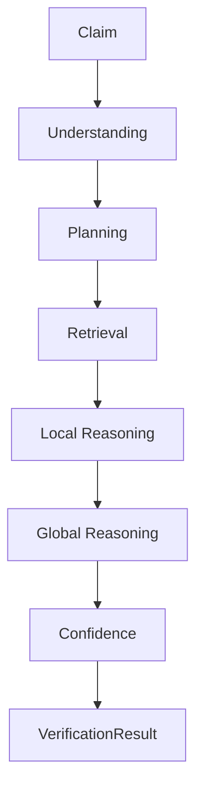
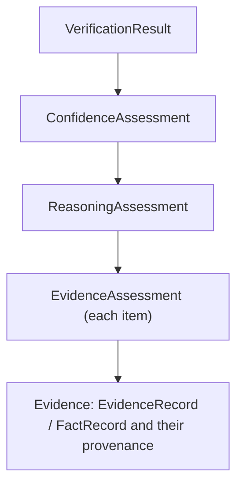

# NeuroVerify: Multimodal Neuro-Symbolic Misinformation Verification Platform
## Verification Intelligence — Integration Specification, Version 1.0

| | |
|---|---|
| **Document status** | Draft for review |
| **Location** | `docs/architecture/PHASE_5/VERIFICATION_INTELLIGENCE_INTEGRATION_SPEC_v1.0.md` |
| **Integrates (frozen, unmodified)** | Phase 5.1 — `CLAIM_ANALYSIS_ENGINE_SPEC_v1.0.md`; Phase 5.2 — `EVIDENCE_RETRIEVAL_STRATEGY_SPEC_v1.0.md`; Phase 5.3 — `NLI_VERIFICATION_ENGINE_SPEC_v1.0.md`; Phase 5.4 — `MULTI_EVIDENCE_REASONING_SPEC_v1.0.md`; Phase 5.5 — `CONFIDENCE_ENGINE_SPEC_v1.0.md` |
| **Nature of this document** | A synthesis. It introduces no new subsystem, no new canonical or conceptual object, no new algorithm, and no new responsibility. Every claim in this document is a cross-reference to, not a restatement or reinterpretation of, its source phase |
| **Audience** | Engineers approaching Verification Intelligence for the first time — intended as the entry point read before the five detailed Phase 5.1–5.5 specifications, not a substitute for them |

This document follows exactly the same integrative discipline already
established by `KNOWLEDGE_MANAGEMENT_INTEGRATION_SPEC_v1.0.md` for Phase
4.1–4.4: it is a map, not a sixth specification. Where that document
integrated the platform's persistent-memory subsystems, this document
integrates its claim-verification reasoning subsystems — the two
capstone documents together span everything between raw evidence and a
finished `VerificationResult`.

---

## 1. Purpose

### 1.1 What Verification Intelligence Is

Verification Intelligence is the name given, across Phase 5.1–5.5
collectively, to the complete internal architecture behind a single
responsibility Phase 2 §5.5 named but did not itself decompose: "NLI
Verification" — taking a claim and determining, on the basis of
evidence, what stance the evidence supports toward it. Five subsystems,
each already fully specified and frozen, together perform this task in
five clearly bounded stages: understanding a claim (Phase 5.1), planning
how to check it (Phase 5.2), locally reasoning about each piece of
evidence found (Phase 5.3), globally synthesizing those local judgments
(Phase 5.4), and evaluating how much confidence that synthesis warrants
(Phase 5.5).

### 1.2 Why This Document Exists

Each Phase 5.1–5.5 document was written to specify one stage in depth.
None of them, individually, was written to show the complete shape of
Verification Intelligence as a whole — what flows through all five
stages together, how every object handoff chains from claim to verdict-
ready result, and how the architectural principles each document argues
for individually turn out to be one consistent philosophy applied five
times. This document exists to make that whole visible, exactly as
`KNOWLEDGE_MANAGEMENT_INTEGRATION_SPEC_v1.0.md` did for Phase 4.1–4.4.

### 1.3 Why Verification Is Decomposed This Way

The decomposition is not arbitrary — each boundary was independently
argued for, in each source document, on the same recurring grounds
(§7 collects these in full):

| Boundary | Argued in |
|---|---|
| Understanding separated from verification | Phase 5.1 §1.2 |
| Planning separated from retrieval execution | Phase 5.2 §1.2 |
| Local, per-evidence reasoning separated from global synthesis | Phase 5.3 §1.3 |
| Global synthesis separated from confidence estimation | Phase 5.4 §1.3, Phase 5.5 §1.3 |
| Confidence estimation separated from verdict determination | Phase 5.5 §6.2, §6.6 |

Each boundary independently reflects this platform's founding
neuro-symbolic separation principle (Phase 2 §0.2), applied at
successively finer grain as Verification Intelligence's internal
architecture was built out stage by stage.

---

## 2. Relationship to Phase 2

### 2.1 One Module, Five Internal Subsystems

Phase 2 §5.5 specified "NLI Verification" as a single module: input
`ClaimRecord`, `EvidenceRecord[]`, `FactRecord[]`; output
`VerificationResult`. That specification was correct and complete at its
own level of description — it fixed an external contract without
prescribing internal architecture, exactly as Phase 2 §5.4's "Knowledge
Representation" module was later decomposed across Phase 4.1–4.4. Phase
5 performs the identical kind of decomposition for Phase 2 §5.5:

```
Phase 2 §5.5 "NLI Verification"  (single module, frozen external contract)
                    │
                    │  decomposed into
                    ▼
   Phase 5.1   Phase 5.2   Phase 5.3   Phase 5.4   Phase 5.5
   Claim       Evidence    NLI         Multi-      Confidence
   Analysis    Retrieval   Verification Evidence   Engine
   Engine      Strategy    Engine      Reasoning
```

### 2.2 What Changes and What Doesn't

| | Statement |
|---|---|
| Phase 2 §5.5's external contract | Unchanged — `VerificationResult` remains exactly as Phase 3 §1.9 fixed it |
| Phase 2 §5.5's position in the pipeline | Unchanged — it still sits between Evidence Retrieval (Phase 2 §5.3) and Fusion Intelligence (Phase 2 §5.8) exactly as originally specified |
| What is new | Only the internal decomposition — five accountable subsystems where Phase 2 described one, exactly as Phase 4.1–4.4 did for Knowledge Representation |

### 2.3 The One Deliberately Incomplete Edge

Every Phase 5.1–5.5 document has been explicit that its own output does
not, by itself, complete Phase 2 §5.5's contract (Phase 5.3 §1.2, Phase
5.4 §1.2, Phase 5.5 §1.2). `ConfidenceAssessment` (Phase 5.5 §5), the
final Phase 5 output, together with `ReasoningAssessment`'s Synthesized
Stance (Phase 5.4 §5.2), contains everything `VerificationResult`
requires — but the final assembly step that constructs
`VerificationResult` itself was consistently described as "out of
scope" in every document that touched it (Phase 5.5 §1.2, §9). This
document does not resolve that scope question or invent the assembly
step — doing so would introduce something new, which §10 forbids. It
states the fact plainly: Phase 5.1–5.5 collectively prepare everything
`VerificationResult` needs; the trivial final mapping remains, by every
source document's own explicit account, formally unspecified.

---

## 3. Overall Architecture

### 3.1 Full Pipeline Diagram

```
   ClaimRecord (Phase 3 §1.2)
          │
          ▼
   ┌─────────────────────────────────────────┐
   │  Claim Analysis Engine (Phase 5.1)          │
   │  understanding: normalization, entities,      │
   │  relations, temporal/numerical content,       │
   │  modality, polarity, ambiguity, decomposition,│
   │  verification scope                            │
   └────────────────────┬────────────────────┘
                          │  StructuredClaim
                          ▼
   ┌─────────────────────────────────────────┐
   │  Evidence Retrieval Strategy (Phase 5.2)    │
   │  planning: targets, priorities, breadth,      │
   │  stopping conditions, provenance expectations │
   └────────────────────┬────────────────────┘
                          │  RetrievalPlan
                          ▼
   ┌─────────────────────────────────────────┐
   │  Evidence Retrieval (Phase 2 §5.3)          │
   │  execution — unchanged, frozen at Phase 2      │
   └────────────────────┬────────────────────┘
                          │  CandidateEvidenceSet
                          ▼
   ┌─────────────────────────────────────────┐
   │  NLI Verification Engine (Phase 5.3)        │
   │  local reasoning: one evidence item at a       │
   │  time, fully isolated                          │
   └────────────────────┬────────────────────┘
                          │  EvidenceAssessment[]
                          ▼
   ┌─────────────────────────────────────────┐
   │  Multi-Evidence Reasoning (Phase 5.4)       │
   │  global reasoning: corroboration,              │
   │  contradiction, complementary evidence,        │
   │  coverage                                      │
   └────────────────────┬────────────────────┘
                          │  ReasoningAssessment
                          ▼
   ┌─────────────────────────────────────────┐
   │  Confidence Engine (Phase 5.5)              │
   │  evaluation: evidence quality, corroboration   │
   │  strength, contradiction impact, coverage,     │
   │  uncertainty                                   │
   └────────────────────┬────────────────────┘
                          │  ConfidenceAssessment
                          ▼
          (final assembly — see §2.3)
                          │
                          ▼
              VerificationResult (Phase 3 §1.9)
                          │
                          ▼
       Fusion Intelligence (Phase 2 §5.8) → ...
```

### 3.2 Reading the Diagram

Every box above is a subsystem already fully specified in its own Phase
5.1–5.5 (or Phase 2) document; every arrow is an object handoff already
fully specified in the corresponding document's Interface Contracts
section. This diagram introduces no new box and no new arrow — it is the
five already-frozen diagrams (Phase 5.1 §2.1, Phase 5.2 §2.1, Phase 5.3
§2.1, Phase 5.4 §2.1, Phase 5.5 §2.1), laid end to end.

### 3.3 The Shape of the Whole

Two properties become visible only when the pipeline is viewed in full,
mirroring the kind of whole-system observation
`KNOWLEDGE_MANAGEMENT_INTEGRATION_SPEC_v1.0.md` §2.3 made for Phase
4.1–4.4:

1. **A strict narrowing-then-widening shape.** The pipeline narrows from
   one claim (Phase 5.1) to a precise plan (Phase 5.2) to potentially
   many individual evidence items examined one at a time (Phase 5.3),
   then widens back to one synthesized picture (Phase 5.4) and one
   evaluated confidence (Phase 5.5) — fan-out for thorough, isolated
   local examination, fan-in for accountable, single-point global
   judgment.
2. **Every stage boundary is argued for on the same grounds.** Table
   §1.3 already showed this in list form; viewed as a pipeline, the
   pattern is visually obvious: each arrow crosses a boundary because the
   task on one side is qualitatively different from the task on the
   other (understanding vs. verifying, planning vs. executing, local vs.
   global, reasoning vs. evaluating) — never a boundary drawn merely for
   organizational convenience.

---

## 4. End-to-End Lifecycle

### 4.1 Lifecycle Diagram



### 4.2 Stage-by-Stage Summary

| Stage | Performed by | Governed by |
|---|---|---|
| Understanding | Claim Analysis Engine | Phase 5.1 §3, §4 |
| Planning | Evidence Retrieval Strategy | Phase 5.2 §3, §4 |
| Retrieval | Evidence Retrieval (Phase 2 §5.3, unchanged) | Phase 2 §5.3 |
| Local Reasoning | NLI Verification Engine | Phase 5.3 §3, §4 |
| Global Reasoning | Multi-Evidence Reasoning | Phase 5.4 §3, §4 |
| Confidence | Confidence Engine | Phase 5.5 §3, §4 |
| `VerificationResult` | Final assembly (§2.3, unspecified) | — |

### 4.3 One Continuous Lifecycle, Not Seven Independent Ones

Every stage above depends on the one before it producing sound,
trustworthy output — evidence cannot be locally reasoned about before it
is retrieved; retrieval cannot be executed before it is planned;
planning cannot occur before the claim is understood; global reasoning
cannot occur before every relevant local judgment exists; confidence
cannot be evaluated before global reasoning has concluded. This mirrors,
at the Verification Intelligence level, exactly the same "one continuous
lifecycle, not N independent stages" observation
`KNOWLEDGE_MANAGEMENT_INTEGRATION_SPEC_v1.0.md` §3.3 made for the
Knowledge Management subsystem's lifecycle.

---

## 5. End-to-End Object Flow

### 5.1 Object Flow Diagram


### 5.2 Object-by-Object Summary

| Object | Produced by | Governed by | Cardinality |
|---|---|---|---|
| `ClaimRecord` | Claim Extraction (Phase 2 §5.1) | Phase 3 §1.2 | One per claim |
| `StructuredClaim` | Claim Analysis Engine (Phase 5.1) | Phase 5.1 §5 | One per `ClaimRecord` |
| `RetrievalPlan` | Evidence Retrieval Strategy (Phase 5.2) | Phase 5.2 §5 | One per `StructuredClaim` |
| `CandidateEvidenceSet` | Evidence Retrieval (Phase 2 §5.3), executing the plan | The Evidence Bundle concept, Phase 4.2 §2.5, as named in Phase 5.3 §2.3 | One per claim, containing zero or more evidence items |
| `EvidenceAssessment` | NLI Verification Engine (Phase 5.3) | Phase 5.3 §5 | One per `CandidateEvidenceSet` item |
| `ReasoningAssessment` | Multi-Evidence Reasoning (Phase 5.4) | Phase 5.4 §5 | One per claim, synthesizing the complete `EvidenceAssessment[]` |
| `ConfidenceAssessment` | Confidence Engine (Phase 5.5) | Phase 5.5 §5 | One per `ReasoningAssessment` |
| `VerificationResult` | Final assembly (§2.3, unspecified) | Phase 3 §1.9 | One per claim |

### 5.3 The Fan-Out and Fan-In Point

`CandidateEvidenceSet → EvidenceAssessment` is the pipeline's only
one-to-many step (Phase 5.3 §2.6: one assessment per evidence item,
each fully isolated); `EvidenceAssessment[] → ReasoningAssessment` is
the corresponding many-to-one step that closes it (Phase 5.4 §2.2:
the complete set, never a subset, synthesized into one object). Every
other handoff in this flow is strictly one-to-one. This is the object-
level expression of §3.3's narrowing-then-widening architectural shape.

### 5.4 Why Every Object Is Named, Not Merely Implied

Phase 2 §5.5's original contract only named `ClaimRecord`,
`EvidenceRecord[]`/`FactRecord[]`, and `VerificationResult` — three
objects at the boundary of a black box. Phase 5.1–5.5 named four more
(`StructuredClaim`, `RetrievalPlan`, `EvidenceAssessment`,
`ReasoningAssessment`, `ConfidenceAssessment` — five, precisely) crossing
the internal boundaries that black box turned out to contain. Naming
every internal handoff explicitly, rather than leaving it as unspecified
internal state, is what makes every stage's output independently
inspectable (§8) — the same rationale each individual Phase 5 document
gave for introducing its own object (Phase 5.1 §6.7, Phase 5.2 §6.6,
Phase 5.3 §6.4, Phase 5.4 §6.3, Phase 5.5 §6.4).

### 5.5 The Running Example, End to End

Each Phase 5.1–5.5 document independently worked through the same
illustrative claim — a health ministry's assertion of a 15% reduction in
hospital admissions, contested by independent data — at its own stage.
Assembled together for the first time, that example traces the complete
pipeline in one continuous thread:

| Stage | Object | What happened |
|---|---|---|
| Understanding | `StructuredClaim` (Phase 5.1 §5.13) | The claim was decomposed into two sub-propositions: the ministry's attribution, and the underlying statistic; modality correctly identified the first as reported speech, not direct assertion |
| Planning | `RetrievalPlan` (Phase 5.2 §5.13) | Two distinct search targets were planned: the ministry's own statement, and independent corroborating or contradicting data — deliberately excluding any plan to adjudicate the separate, out-of-scope "was it rushed" characterization |
| Retrieval | `CandidateEvidenceSet` (Phase 2 §5.3, referenced in Phase 5.3 §5.12) | Two items were retrieved: the ministry's statement, and an independent health dataset |
| Local Reasoning | `EvidenceAssessment[]` (Phase 5.3 §5.12) | Two fully isolated assessments: one `supports` the attribution sub-proposition; one `refutes` the statistical sub-proposition (showing 8% rather than 15%) — neither assessment aware of the other |
| Global Reasoning | `ReasoningAssessment` (Phase 5.4 §5.13) | Synthesis recognized the two assessments as complementary, not contradictory, in the strict sense (they address different sub-propositions) — yet their combination revealed the claim overall to be `conflicting`, with full coverage and complete synthesis |
| Confidence | `ConfidenceAssessment` (Phase 5.5 §5.13) | High confidence was assigned specifically to the `conflicting` characterization itself — both contributing items carried strong provenance, the contradiction was material but well-evidenced, and no residual uncertainty remained |
| Result | `VerificationResult` (implied, §2.3) | Would carry `stance = conflicting` (from Phase 5.4) and a high `stance_confidence` (from Phase 5.5) — a result that neither collapses the claim into a false binary nor understates how clearly the evidence actually characterizes it |

This end-to-end trace is the clearest demonstration available of why the
five-stage decomposition (§1.3, §7) matters in practice, not just in
principle: no single stage, examined alone, produces the nuanced final
picture — it emerges only from the disciplined sequence of understanding,
planning, retrieving, locally reasoning, globally synthesizing, and
evaluating confidence, each stage contributing exactly its own part and
no more.

---

## 6. Responsibility Allocation

| Subsystem | Primary Responsibility | Reads | Writes | Produces | Never Does |
|---|---|---|---|---|---|
| **Claim Analysis Engine** (5.1) | Understand a claim's structure | `ClaimRecord` | Nothing (stateless, read-only input) | `StructuredClaim` | Verify, retrieve evidence, compute confidence, access the Knowledge Graph (Phase 5.1 §9) |
| **Evidence Retrieval Strategy** (5.2) | Plan what evidence to seek | `StructuredClaim` | Nothing | `RetrievalPlan` | Retrieve evidence, verify claims, rank truth, access the Knowledge Graph (Phase 5.2 §9) |
| **Evidence Retrieval** (Phase 2 §5.3) | Execute the plan against available sources | `RetrievalPlan` | Nothing (reads from Evidence Store via Knowledge Access Layer) | `CandidateEvidenceSet` | Unchanged by Phase 5 — governed entirely by Phase 2 §5.3 |
| **NLI Verification Engine** (5.3) | Locally compare claim against one evidence item at a time | `StructuredClaim`, `CandidateEvidenceSet` | Nothing | `EvidenceAssessment[]` | Aggregate, determine final truth, compute overall confidence, access the Knowledge Graph (Phase 5.3 §9) |
| **Multi-Evidence Reasoning** (5.4) | Synthesize local assessments into one coherent picture | `StructuredClaim`, `EvidenceAssessment[]` | Nothing | `ReasoningAssessment` | Compute confidence, determine truth, retrieve, plan, perform local reasoning (Phase 5.4 §9) |
| **Confidence Engine** (5.5) | Evaluate the trustworthiness of the synthesis | `StructuredClaim`, `ReasoningAssessment` | Nothing | `ConfidenceAssessment` | Reason, retrieve, plan, aggregate, produce a verdict (Phase 5.5 §9) |

### 6.1 Reading the Matrix

Every "Never Does" cell above is a citation to its own source document's
Non-Goals section — this table introduces no new prohibition. Read as a
whole, the matrix shows a clean, non-overlapping partition: every
Verification Intelligence responsibility belongs to exactly one
subsystem, and no responsibility is claimed twice or left unclaimed.

### 6.2 What No Subsystem Does

Consistent with every individual Non-Goals section, no subsystem in this
table:

- Accesses the Knowledge Graph, Evidence Store, or Knowledge Access
  Layer directly (each subsystem's own §2.5/§2.4 draws this boundary
  independently, all reaching the same conclusion via Phase 4.4 §1.1's
  single-gateway principle).
- Writes to any persistent store.
- Determines final truth or produces a verdict — that remains, across
  every one of the five documents, the Decision Engine's exclusive
  responsibility (Phase 2 Addendum §6), several stages downstream of
  Verification Intelligence's own output.

---

## 7. Architectural Principles

### 7.1 The Complete Principle Set

Every principle below was independently established in one or more
Phase 5.1–5.5 documents. This section collects them once, showing they
are five instances of the same recurring philosophy rather than five
unrelated rule sets.

| Principle | Established in | Summary |
|---|---|---|
| Understanding before reasoning | Phase 5.1 §6.1 | A claim must be correctly understood before any verification logic applies |
| Planning before retrieval | Phase 5.2 §6.1 | What to search for is decided before searching begins |
| Local reasoning before global reasoning | Phase 5.3 §6.1, Phase 5.4 §6.1 | Every evidence item is judged in isolation before any cross-item relationship is considered |
| Reasoning before confidence | Phase 5.5 §6.1 | The evidentiary picture is fully synthesized before its trustworthiness is evaluated |
| Deterministic interpretation, planning, comparison, synthesis, and confidence | Phase 5.1 §6.2, Phase 5.2 §6.2, Phase 5.3 §6.3, Phase 5.4 §6.2, Phase 5.5 §6.3 | The same input, at every one of the five stages, always produces the same output |
| Statelessness | Phase 5.1 §2.6, Phase 5.2 §2.6, Phase 5.3 §2.6, Phase 5.4 §2.5, Phase 5.5 §2.5 | No subsystem holds memory between invocations; each claim is processed entirely on its own terms |
| Language independence | Phase 5.1 §6.3 | Claim understanding is specified independent of any particular language |
| Modular semantics / modularity | Phase 5.1 §6.4, Phase 5.2's evidence-agnostic planning (§6.3) | Each responsibility is independently addressable |
| No truth inference / confidence is not truth | Phase 5.1 §6.5, Phase 5.3 §6.6, Phase 5.4 §6.6, Phase 5.5 §6.2 | Nothing produced anywhere in this pipeline asserts whether the claim is true |
| No evidence dependency (understanding and planning stages) | Phase 5.1 §6.6, Phase 5.2 §6.3 | Claim understanding and retrieval planning require no evidence to already exist |
| Evidence integrity | Phase 5.3 §6.5, Phase 5.4 §6.4 | Evidence and prior assessments are never altered, only referenced and built upon |
| No Knowledge Graph access | Phase 5.1 §2.5, Phase 5.2 §2.5, Phase 5.3 §2.5, Phase 5.4 §2.4, Phase 5.5 §2.4 | No Verification Intelligence subsystem has a legitimate need for, or access path to, persistent knowledge |
| Explainability begins at understanding, and is preserved at every stage | Phase 5.1 §6.7, Phase 5.2 §6.6, Phase 5.3 §6.4, Phase 5.4 §6.3, Phase 5.5 §6.4 | Every stage's output is independently inspectable, from the first to the last |
| Traceability | Phase 5.3 §5.9, Phase 5.4 §5.11, Phase 5.5 §5.10 | Every object carries an unbroken path back to the evidence it ultimately rests on (§8) |
| Separation of concerns | Every document's own closing principle | Each subsystem does exactly one thing and delegates everything else |

### 7.2 How the Principles Reinforce Each Other

As with the eleven principles `KNOWLEDGE_MANAGEMENT_INTEGRATION_SPEC_v1.0.md`
§6.2 traced through two dependency chains, Verification Intelligence's
principles form one continuous chain: **statelessness and determinism**
at every stage are what make the pipeline's overall behavior predictable
end to end; **evidence integrity and traceability** are what make that
predictable behavior auditable back to its source; and it is only
because every stage upholds **no truth inference** at its own level that
the pipeline's final confidence figure (Phase 5.5 §5.2) can mean what it
claims to mean — confidence in a stance, never confidence smuggled in
from an earlier stage quietly overreaching its own boundary. Break any
one of these — allow one stage to be non-deterministic, or to silently
assert something about truth — and the guarantee every later stage
depends on stops holding.

---

## 8. Traceability

### 8.1 Traceability Diagram



### 8.2 What Each Link Represents

| Link | Traceability guarantee |
|---|---|
| `VerificationResult` → `ConfidenceAssessment` | The final result's stance and confidence trace to a specific, inspectable confidence evaluation (Phase 5.5 §5.10's Traceability component), not an unexplained figure |
| `ConfidenceAssessment` → `ReasoningAssessment` | Every Confidence Factor (Phase 5.5 §5.9) traces to the specific synthesis findings it evaluated (Phase 5.5 §3.8) |
| `ReasoningAssessment` → `EvidenceAssessment[]` | Every Corroboration Group, Contradiction Group, and coverage determination traces to the specific local assessments it was built from (Phase 5.4 §5.11's Assessment Traceability) |
| `EvidenceAssessment` → Evidence | Every local stance and finding traces to a specific `EvidenceRecord`/`FactRecord` and its own provenance chain (Phase 5.3 §5.9's Provenance Reference, itself inherited from Phase 4.1 §8.2 and Phase 4.2 §5.2) |

### 8.3 Why This Chain Is Unbroken

Each individual Phase 5 document independently guaranteed that its own
output never severs the link to what it was built from (Phase 5.3 §3.7,
Phase 5.4 §3.8, Phase 5.5 §3.8) — this section's contribution is showing
that those four independent guarantees compose into one single,
unbroken path with no gap anywhere along it. A `VerificationResult` can
therefore always be walked backward, link by link, to the specific
pieces of evidence and their original sources that ultimately justify
it — extending the identical whole-chain guarantee
`KNOWLEDGE_MANAGEMENT_INTEGRATION_SPEC_v1.0.md` §7.4 already established
for the Knowledge Management subsystem's own lineage chains, now shown
to connect seamlessly into Verification Intelligence's chain at the
`EvidenceAssessment` → Evidence link (§8.2).

### 8.4 Traceability Enables Reproducibility

Because every link in §8.1's chain is deterministic (§7.1) at the stage
that produced it, the entire chain — not just each individual link — is
reproducible: given the same claim and the same evidence, every stage
from `StructuredClaim` through `ConfidenceAssessment` can, in principle,
be exactly reconstructed. This is the fourth part of the platform-wide
reproducibility guarantee `MULTI_EVIDENCE_REASONING_SPEC_v1.0.md`'s
lineage implicitly extends and `GRAPH_RESOLUTION_ENGINE_SPEC_v1.0.md`
§10.5 and `KNOWLEDGE_ACCESS_LAYER_SPEC_v1.0.md` §7.6 already established
for the persistent-memory layer: reproducible evidence, reproducible
resolution, reproducible access, and now reproducible verification.

---

## 9. Scalability

### 9.1 Parallelism

Two distinct kinds of parallelism apply across Verification
Intelligence, each already established independently in its own source
document:

| Kind | Established in | Scope |
|---|---|---|
| Claim-level parallelism | Phase 5.1 §8.1, Phase 5.2 §8.4 (citing Phase 2 §1.1) | Multiple claims processed concurrently, each independently, since every subsystem is stateless (§7.1) |
| Item-level parallelism | Phase 5.3 §8.3 | Within one claim, every evidence item's local assessment can proceed concurrently with every other, since the NLI Verification Engine's item isolation (Phase 5.3 §6.2) requires no coordination between them |

Item-level parallelism is strictly finer-grained than claim-level
parallelism and applies only within Phase 5.3's stage — Multi-Evidence
Reasoning (Phase 5.4) necessarily requires the complete
`EvidenceAssessment[]` before it can proceed (Phase 5.4 §2.2), so
parallelism collapses back to claim-level granularity from Phase 5.4
onward.

### 9.2 Streaming

Every stage from Phase 5.1 through 5.5 independently established
compatibility with incremental or streaming operation (Phase 5.1 §8.5,
Phase 5.2 §8.2, Phase 5.3 §8.2, Phase 5.4 §8.2–§8.3, Phase 5.5 §8.2–§8.3)
— viewed as a whole pipeline, this means Verification Intelligence
imposes no structural requirement that a claim's evidence be fully
retrieved before local reasoning begins, or fully locally-assessed
before global synthesis begins, provided each stage's own re-invocation
or incremental-update behavior (as each source document separately
specifies) is respected.

### 9.3 Distribution

Every stage independently anticipated a future distributed
implementation while requiring that its output remain logically coherent
regardless of physical distribution (Phase 5.3 §8.4, Phase 5.4 §8.4,
Phase 5.5 §8.4) — the same requirement Phase 4.3 §11.6 and Phase 4.4
§9.5 independently reached for the persistent-memory layer. Viewed
together, this is one consistent platform-wide constraint, arrived at
independently at every layer of this architecture: **distribution is a
physical implementation concern that must never be allowed to change a
subsystem's logical, deterministic contract.**

### 9.4 Future Extensibility

Because every object handoff in this pipeline (§5) is explicitly named
and independently specified, extending Verification Intelligence — for
instance, to accommodate a future evidence modality anticipated by Phase
2 §9 and Phase 4.2 §4.3 (video, audio) — requires no restructuring of
the pipeline itself. A new evidence modality would flow through the
existing `CandidateEvidenceSet → EvidenceAssessment` boundary (§5.3)
exactly as text-based evidence does today; the NLI Verification Engine's
per-item isolation (Phase 5.3 §6.2) already treats every evidence item
generically, without assuming any specific modality. This document
introduces no new extension mechanism — it observes that the one
Phase 5.3 already provides is sufficient.

---

## 10. Non-Goals

### 10.1 What This Document Does Not Do

| Non-goal | Clarification |
|---|---|
| Does not introduce a new subsystem | Every box in §3.1's diagram is a subsystem already fully specified in Phase 5.1–5.5 or Phase 2 |
| Does not introduce a new object | Every object in §5's flow (`StructuredClaim`, `RetrievalPlan`, `CandidateEvidenceSet`, `EvidenceAssessment`, `ReasoningAssessment`, `ConfidenceAssessment`, `VerificationResult`) is defined in its own source document, cited, never redefined |
| Does not introduce a new responsibility | §6's matrix allocates responsibilities already fixed in each subsystem's own specification; it assigns nothing new |
| Does not introduce a new algorithm | No stage's internal method of understanding, planning, comparing, synthesizing, or evaluating is described here beyond what each source document already left unspecified by design |
| Does not introduce a new technology | Consistent with every document in this entire series, this document names no implementation technology anywhere |
| Does not resolve the one open edge (§2.3) | The final assembly of `VerificationResult` from `ConfidenceAssessment` and `ReasoningAssessment`'s Synthesized Stance remains exactly as unspecified as every source document left it — inventing that assembly step here would itself be a new subsystem, which this document is expressly forbidden from introducing |

### 10.2 Why This Document's Scope Stays Narrow

Exactly as `KNOWLEDGE_MANAGEMENT_INTEGRATION_SPEC_v1.0.md` §10.2 argued
for its own equivalent restraint: this document's entire value is in
being a trustworthy map of Verification Intelligence. If it introduced
even a small new interpretation of any subsystem's behavior — or
resolved §2.3's open edge on its own authority — it would create a
second, competing source of truth alongside the five frozen
specifications it exists to help readers navigate. Every substantive
claim in this document is traceable to a specific section of a specific
Phase 5.1–5.5 (or earlier) document; that discipline, held without
exception from §1 through this closing section, is what makes this
capstone document trustworthy as the entry point it is intended to be.

---

*End of Verification Intelligence Integration Specification, Version 1.0.*
*This document integrates, and does not alter, the frozen Phase 5.1*
*(`CLAIM_ANALYSIS_ENGINE_SPEC_v1.0.md`), Phase 5.2*
*(`EVIDENCE_RETRIEVAL_STRATEGY_SPEC_v1.0.md`), Phase 5.3*
*(`NLI_VERIFICATION_ENGINE_SPEC_v1.0.md`), Phase 5.4*
*(`MULTI_EVIDENCE_REASONING_SPEC_v1.0.md`), and Phase 5.5*
*(`CONFIDENCE_ENGINE_SPEC_v1.0.md`) documents.*

---

## Appendix A: Reading Guide

### A.1 Suggested Reading Order

Mirroring `KNOWLEDGE_MANAGEMENT_INTEGRATION_SPEC_v1.0.md` Appendix A,
this document is designed to be read first. The five detailed
specifications are then best read in pipeline order — unlike the
Knowledge Management capstone, where a different order was suggested,
Verification Intelligence's five stages read naturally in exactly the
sequence they execute:

| Order | Document | Read this to understand |
|---|---|---|
| 1 | This document | The whole Verification Intelligence pipeline's shape, before any stage's detail |
| 2 | `CLAIM_ANALYSIS_ENGINE_SPEC_v1.0.md` (5.1) | How a claim is understood before anything is searched for |
| 3 | `EVIDENCE_RETRIEVAL_STRATEGY_SPEC_v1.0.md` (5.2) | How that understanding becomes a concrete search plan |
| 4 | `NLI_VERIFICATION_ENGINE_SPEC_v1.0.md` (5.3) | How each piece of retrieved evidence is judged on its own |
| 5 | `MULTI_EVIDENCE_REASONING_SPEC_v1.0.md` (5.4) | How those isolated judgments are combined into one picture |
| 6 | `CONFIDENCE_ENGINE_SPEC_v1.0.md` (5.5) | How much that combined picture should be trusted |

### A.2 Where to Look for a Specific Question

| If you need to know... | Go to |
|---|---|
| What a claim's entities, relations, or verification scope mean | Phase 5.1 §5 |
| How a claim is split into independently checkable sub-propositions | Phase 5.1 §3.9, §5.10 |
| How the plan decides when to stop searching | Phase 5.2 §3.8, §5.9 |
| Why a single evidence item can never be "conflicting" on its own | Phase 5.3 §1.3, §5.3 |
| How independent corroboration is told apart from mere repetition | Phase 5.4 §3.4, Phase 4.2 §7.4 |
| Why high confidence and a `conflicting` stance are not a contradiction | Phase 5.5 §5.13, §6.2 |
| What still has to happen before `VerificationResult` actually exists | This document §2.3 |
| How a past `VerificationResult` could be traced back to its original sources | This document §8 |

### A.3 What Not to Look For Here

This document contains no field-level object definitions (see each
source document's own §5), no algorithmic or scoring detail (deliberately
absent from every source document as well, per each one's own
implementation-agnostic scope), and no resolution of the one
intentionally open question this whole series has carried forward since
Phase 5.3 §1.2: exactly how `VerificationResult` gets assembled from
`ConfidenceAssessment`. That gap is not an oversight this document
forgot to close — closing it would mean specifying a new subsystem,
which every requirement governing this document forbids (§10).
